# Table of Contents

## Preface

## Chapter 1: The Mirror of Reality – An Introduction

- The Reflective Relationship
- What is the Theory of Sovereign Reflectivity?
- Core Concepts and Terminology
- The Structure of This Book
- The Journey Ahead

## Chapter 2: Philosophical Foundations – Ancient Wisdom to Modern Thought

- Historical Perspectives on Consciousness and Reality
- Eastern Philosophical Traditions
- Western Philosophical Developments
- Indigenous Wisdom Traditions
- Contemporary Philosophical Frameworks
- Integrating Diverse Perspectives

## Chapter 3: The Science of Consciousness – What We Know and Don't Know

- The Scientific Study of Consciousness
- Neuroscience and the Brain-Mind Relationship
- Quantum Physics and Consciousness
- Experimental Evidence for Consciousness Effects
- Methodological Challenges
- Toward a Science of Consciousness

## Chapter 4: Core Principles of Reflectivity – The Mechanics of the Mirror

- The Reflective Relationship Explained
- Resistance and Allowance
- Co-Creation: The Dance of Consciousness and Reality
- Emotional States as Vibrational Frequencies
- The Spectrum of Influence
- The Feedback Loop of Experience

## Chapter 5: The Mathematics of Consciousness – Quantifying the Qualitative

- Mathematical Models in TSR
- The Consciousness Energy Equation
- Vibrational Lensing Mathematics
- Resistance Contrast Filter Equations
- Consciousness-Kinetic Energy Interactions
- Formal Proofs and Logical Consistency

## Chapter 6: Evidence and Research – Testing the Theory

- Research Methodologies for Consciousness Studies
- Mind-Body Evidence: Meditation and Physiology
- Intention Experiments and Random Systems
- Field Effects in Groups and Communities
- Synchronicity and Meaningful Coincidence
- Evaluating the Evidence: Strengths and Limitations

## Chapter 7: Vibrational Mechanics – How Consciousness Shapes Reality

- Understanding Vibrational States
- Resonance and Attraction
- Coherence and Creative Power
- Interference Patterns in Consciousness
- Field Dynamics and Information Transfer
- Practical Applications of Vibrational Mechanics

## Chapter 8: Quantum Connections – Consciousness at the Fundamental Level

- Quantum Mechanics and Consciousness
- The Observer Effect and Measurement Problem
- Entanglement and Non-Locality
- Quantum Biology and Living Systems
- Quantum Field Theory and Consciousness Fields
- Implications for the Consciousness-Reality Relationship

## Chapter 9: The Sovereign Mindset – Empowerment without Blame

- Understanding Sovereignty: Freedom Within Reality
- The Psychology of Reflectivity
- Overcoming Mindset Traps
- Cultivating Sovereignty
- The Balanced Approach to Life's Challenges
- Sovereignty in Relationship

## Chapter 10: Practical Applications – Living the Theory

- Daily Practices: Creating a Foundation
- Situational Applications: Navigating Life's Challenges
- Domain-Specific Applications: Enhancing Life Areas
- Advanced Applications: Deepening the Practice
- Creating Your Personal Practice System
- The Evolving Journey

## Chapter 11: Collective Applications – Beyond the Individual

- Group Consciousness: The Shared Field
- Collective Intention: Co-Creating Shared Reality
- Field Coherence: Enhancing Group Consciousness
- Collective Evolution: Facilitating Group Development
- Social Transformation: Consciousness-Based Change
- Global Consciousness: Planetary Evolution

## Chapter 12: Critiques and Challenges – Strengthening the Theory

- Scientific Challenges: Testing the Theory
- Philosophical Challenges: Conceptual Issues
- Practical Challenges: Real-World Application
- Internal Critiques: Evolving the Theory
- Integrating Critique: A Stronger Theory
- An Evolving Understanding

## Chapter 13: Conclusion – Reflections on the Journey

- The Path Traveled
- The Significance of TSR
- Emerging Directions
- The Broader Implications
- Your Continuing Journey
- Closing Reflection

## Appendix A: Mathematical Expansion of Key TSR Equations

- Expanding on the Equation E<sub>np</sub> = M<sub>np</sub>C<sub>np</sub>²
- Formalizing Vibrational Lensing
- Deriving Resistance Contrast Filter Equations
- Exploring Consciousness–Kinetic Energy Interactions

## Appendix B: Nonphysical Equivalences to Relativistic Principles in TSR

- Mass–Energy Equivalence in the Nonphysical Realm
- Time Dilation and the Subjective Passage of Creation
- Length Contraction and the Distance Between Intention and Manifestation
- Relativistic Momentum and the Inertia of Thought
- Spacetime Curvature and Consciousness Gravity

## Appendix C: Historical Antecedents to TSR

- Ancient Wisdom Traditions
- Philosophical Developments
- Modern Scientific Precursors
- Contemporary Integrative Approaches
- Direct Precursors to TSR

## Appendix D: Practical Applications and Exercises

- Daily Practices
- Situational Techniques
- Advanced Applications
- Group and Collective Practices
- Integration Strategies

## Appendix F: Research Methods for Consciousness Studies

- Quantitative Approaches
- Qualitative Methodologies
- Mixed Methods Research
- Experimental Design Considerations
- Ethical Considerations in Consciousness Research

## Appendix G: Frequently Asked Questions

- General Questions About TSR
- Scientific and Philosophical Questions
- Practical Application Questions
- Ethical and Societal Questions
- Research and Development Questions

## Appendix H: Visual Guide to TSR Concepts

- Core Concept Visualizations
- Mathematical Concept Visualizations
- Practical Application Visualizations
- Conceptual Framework Visualizations
- Research and Application Visualizations

## Glossary of Key Terms

## References and Further Reading

## Index


---


# Chapter 1: The Mirror of Reality – An Introduction

*"We do not see the world as it is, we see it as we are." — Anaïs Nin*

## The Reflection That Changed Everything

Morgan awakens to the golden glow of sunrise filtering through her curtains. The light dances across her bedroom wall, creating patterns that seem to pulse with possibility. She stretches, noticing an unusual sense of calm and contentment flowing through her body. No particular reason for it—just one of those mornings where she feels inexplicably good.

As she moves through her morning routine—shower, coffee, breakfast—the feeling persists. Everything seems a little brighter, a little more vivid. The water pressure in the shower is perfect. Her coffee tastes especially rich. Even the toast doesn't burn.

Stepping outside her apartment building, Morgan pauses to take a deep breath of the spring air. The cherry trees lining her street have burst into bloom overnight, their pink petals swirling in the gentle breeze. *How have I never noticed how beautiful this street is?* she wonders.

On her walk to the café where she works, the city seems transformed. A neighbor she usually just nods to stops to chat about the flowering trees. The normally impatient crossing guard smiles and waves her across with a flourish. Even the traffic seems to flow more smoothly, cars yielding graciously as she crosses intersections.

"What a beautiful, friendly city I live in," Morgan thinks, smiling to herself as she reaches the café.

The next morning couldn't be more different. Morgan's alarm fails to go off, and she wakes with a jolt, already twenty minutes behind schedule. Her head throbs with the beginning of a tension headache. Rushing through her shower, she knocks over a bottle of shampoo, which spills across the tile floor. The coffee maker sputters and produces a weak, bitter brew. She burns her toast and sets off the smoke detector.

By the time she leaves her apartment, Morgan is frazzled and anxious. Running down the same street she admired yesterday, she barely notices the cherry blossoms. Instead, she focuses on the litter scattered along the curb and the cracked sidewalk that nearly trips her. The same neighbor from yesterday passes by, but today his greeting seems curt and dismissive. At the crosswalk, the crossing guard impatiently motions for her to hurry up, causing Morgan to nearly collide with a cyclist.

Horns blare as she jaywalks across another intersection. "This city is falling apart," she mutters under her breath. "Everyone's so rude and everything's so broken."

As she finally reaches the café, out of breath and on edge, a strange thought occurs to her: *Is this really the same city as yesterday? Or is it me who's different?*

This moment of insight—this recognition that her inner state might be coloring her entire experience of the world—stops Morgan in her tracks. She pauses at the café door, hand on the handle, as a profound question forms in her mind: *What if the world I experience is, in some way, a reflection of my own consciousness?*

## The World as a Mirror

Morgan's contrasting mornings illustrate a phenomenon most of us have experienced: how our inner state seems to influence our outer reality. On days when we feel positive and centered, the world often appears to respond in kind—people are friendlier, opportunities arise, even physical objects seem to cooperate with our intentions. Conversely, when we're stressed, fearful, or angry, we tend to encounter more friction, conflict, and obstacles.

This pattern raises a compelling question: Is this merely subjective perception—seeing the world through rose-colored or gray-tinted glasses—or is something deeper happening? Could our consciousness actually be influencing the reality we experience?

The **Theory of Sovereign Reflectivity (TSR)** proposes that this relationship between inner state and outer experience is neither coincidence nor simple perceptual bias. Rather, it suggests that reality functions as a kind of mirror, reflecting back the qualities of our consciousness in the form of experiences, events, and relationships. In simple terms, TSR proposes that **reality reflects the consciousness of the observer**.

This doesn't mean that external reality is an illusion or that it's entirely created by our thoughts. Instead, TSR suggests a dynamic, co-creative relationship between consciousness and reality—a continuous dialogue or dance in which each influences the other. Your consciousness shapes what you experience, and those experiences in turn shape your consciousness, creating a feedback loop of ongoing creation.

## Beyond Positive Thinking: A Framework for Understanding

At first glance, this might sound like familiar "positive thinking" or "law of attraction" concepts that have become popular in self-help literature. While TSR shares some common ground with these ideas, it differs in significant ways:

1. **Scientific Grounding**: TSR seeks to integrate insights from quantum physics, neuroscience, psychology, and systems theory to create a more rigorous framework for understanding consciousness-reality interactions.

2. **Mathematical Modeling**: Rather than relying solely on metaphor and anecdote, TSR proposes mathematical models that describe how consciousness might influence reality, making specific, testable predictions.

3. **Balanced Perspective**: TSR acknowledges both the power and the limitations of consciousness influence, avoiding the pitfalls of magical thinking while still recognizing the genuine impact of our inner state.

4. **Ethical Dimension**: TSR emphasizes responsibility, compassion, and ethical considerations in how we use our consciousness to influence reality.

5. **Collective Aspects**: Beyond individual consciousness, TSR explores how groups, communities, and even societies might collectively shape shared reality through aligned awareness.

In essence, TSR aims to bridge the gap between subjective experience and objective reality, between ancient wisdom traditions and modern science, between individual sovereignty and collective co-creation. It offers a framework for understanding not just *that* our inner state affects our reality, but *how* this process works and how we might engage with it more consciously.

## The Science Behind the Mirror

You might wonder: Is there any scientific basis for the idea that consciousness influences reality? While the full extent of this relationship remains an open question in science, several lines of research provide intriguing support:

### The Observer Effect in Quantum Physics

At the quantum level, the act of observation appears to influence what is observed. In the famous double-slit experiment, particles behave differently when they are being measured than when they are not. While the interpretation of this phenomenon is debated among physicists, it suggests at minimum that the observer cannot be completely separated from the observed at the quantum level.

### The Placebo Effect and Mind-Body Medicine

Medical research has firmly established that a patient's beliefs and expectations can significantly impact physical healing. Placebo effects aren't just "all in the mind"—they produce measurable physiological changes, including altered brain activity, immune response, and hormone levels. This demonstrates a clear pathway from consciousness (belief) to physical reality (bodily change).

### Neuroplasticity and Perception

Neuroscience has shown that our brains physically reshape themselves based on our thoughts, experiences, and focus of attention. This neuroplasticity affects how we perceive and interact with the world, creating a biological mechanism through which consciousness can alter our experience of reality.

### Social Psychology and Interpersonal Dynamics

Research in social psychology demonstrates how our expectations and attitudes shape our interactions with others. Phenomena like self-fulfilling prophecies, confirmation bias, and emotional contagion show how our inner state can influence social reality through both subtle and overt mechanisms.

### Collective Consciousness Studies

Emerging research on group consciousness suggests that aligned groups may influence physical systems and social patterns. Studies on meditation groups and their correlation with crime statistics, while controversial, hint at potential field-like effects of collective consciousness.

While none of these areas of research definitively proves the full extent of consciousness-reality interaction proposed by TSR, they collectively suggest that the relationship between mind and matter, between observer and observed, is more complex and dynamic than a purely materialist worldview would indicate.

## Meet Dr. Eliza Chen: A Scientist's Perspective

Dr. Eliza Chen, a quantum physicist with a background in cognitive neuroscience, sits in her university office surrounded by whiteboards covered in equations. For years, she has studied quantum systems with detached scientific precision, viewing consciousness as an emergent property of physical processes rather than a fundamental force.

Recently, however, a series of unexplained correlations in her research data has led her to question this assumption. In experiments measuring quantum coherence—the delicate state where quantum particles maintain their wave-like properties—she's noticed patterns that seem to correlate with the mental state of the researchers conducting the measurements.

"It's subtle," she explains, tapping her pen against a graph showing oscillating wave patterns, "but statistically significant. When our team is calm and focused, we see longer coherence times in the quantum systems we're studying. When we're stressed or distracted, coherence collapses more quickly."

Initially skeptical of her own observations, Dr. Chen designed a controlled study to test this effect. The results, while preliminary, suggest that the observer's mental state may indeed influence quantum measurements in ways that current models don't fully explain.

"I'm not saying consciousness creates reality wholesale," she cautions. "But there appears to be a relationship between the quality of awareness and the behavior of physical systems that merits serious investigation. If consciousness can influence quantum coherence, what else might it affect?"

Dr. Chen's journey represents the scientific curiosity that TSR aims to inspire—a willingness to investigate the consciousness-reality relationship with both rigorous methodology and open-minded exploration.

## The Spectrum of Reflectivity: From Subtle to Profound

The reflective relationship between consciousness and reality operates across a spectrum of influence, from subtle everyday correlations to more dramatic manifestations:

### Perceptual Filtering

At the most basic level, our consciousness acts as a filter, determining what we notice and how we interpret events. Two people can experience the same situation yet perceive entirely different realities based on their mental and emotional state. This isn't just subjective bias—it literally shapes what information reaches our awareness and how we construct meaning from it.

### Behavioral Influence

Our inner state affects our behavior—our tone of voice, body language, facial expressions, and actions. These behaviors then influence how others respond to us, creating a chain reaction that shapes our social reality. A person radiating confidence and warmth will typically elicit very different responses than someone projecting insecurity and hostility.

### Synchronistic Events

Many people report experiencing meaningful coincidences or "synchronicities" that seem to align with their thoughts, intentions, or needs. While skeptics attribute these entirely to confirmation bias or random chance, TSR suggests that consciousness may subtly influence probability fields, making certain outcomes more likely when they resonate with our awareness.

### Intentional Manifestation

At the more dramatic end of the spectrum is intentional manifestation—the deliberate use of focused consciousness to influence outcomes. From visualization techniques used by elite athletes to group meditation experiments aimed at reducing crime rates, there are intriguing indications that directed consciousness may shape reality in measurable ways.

### Collective Creation

Perhaps most profound is the possibility of collective reality creation—how groups, communities, and societies might shape shared experience through collective consciousness. Cultural beliefs, social movements, and shared narratives may influence not just how we perceive reality but the actual events and conditions that emerge in our collective experience.

Understanding this spectrum helps us recognize that reflectivity isn't an all-or-nothing phenomenon. It operates in subtle ways that we might overlook as well as more dramatic manifestations that challenge conventional explanations.

## Why This Matters: The Practical Relevance

The Theory of Sovereign Reflectivity isn't merely an intellectual curiosity—it has profound practical implications for how we live our lives:

### Personal Empowerment

If our consciousness influences our reality, then we have more agency in shaping our experience than we might have believed. Rather than being passive victims of circumstance, we can actively participate in creating our life conditions through the quality of our awareness.

### Responsibility Without Blame

Understanding reflectivity encourages us to take responsibility for our role in creating our experiences without falling into self-blame for circumstances beyond our control. It's about recognizing our influence without claiming total control—a balanced perspective that empowers without burdening.

### Conscious Relationships

When we recognize that our consciousness affects our interactions, we can approach relationships with greater awareness and intention. Instead of reacting unconsciously to others, we can choose how we want to show up and what qualities we want to bring to our connections.

### Collective Transformation

Perhaps most significantly, TSR suggests that by aligning our consciousness in groups, we might collectively influence shared challenges like social conflict, environmental degradation, or public health crises. This offers a complementary approach to conventional problem-solving methods.

### Evolutionary Potential

At the broadest level, TSR points to the possibility that humanity might be evolving toward more conscious participation in reality creation. As we develop greater awareness of the reflective relationship between consciousness and reality, we may access new capacities for co-creating a more harmonious and sustainable world.

These practical implications make TSR relevant not just to philosophers and scientists but to anyone interested in living more consciously and effectively in the world.

## The Journey Ahead: How This Book Will Guide You

Throughout the coming chapters, we will explore the Theory of Sovereign Reflectivity from multiple perspectives, blending narrative insight with academic rigor, philosophical depth with practical application. Each chapter will build upon the previous ones, creating a comprehensive understanding of how consciousness shapes reality and how you can work with this relationship more intentionally.

Here's what you can expect:

### Philosophical Foundations (Chapter 2)

We'll explore the historical and philosophical context of reflectivity, tracing similar concepts through Western and Eastern traditions and examining how TSR relates to contemporary philosophical perspectives.

### The Science of Consciousness (Chapter 3)

We'll delve into current scientific understanding of consciousness, examining research from neuroscience, psychology, and physics that relates to the consciousness-reality relationship.

### Core Principles of Reflectivity (Chapter 4)

We'll introduce the fundamental principles that govern the reflective relationship between consciousness and reality, providing a conceptual framework for understanding how this process works.

### The Mathematics of Consciousness (Chapter 5)

We'll explore mathematical models that describe consciousness-reality interactions, making these abstract concepts more concrete and testable.

### Evidence and Research (Chapter 6)

We'll examine empirical evidence related to consciousness influence, from well-established mind-body effects to more controversial studies of intention and field effects.

### Vibrational Mechanics (Chapter 7)

We'll investigate the mechanisms through which consciousness might influence reality, introducing concepts like resonance, coherence, and field effects.

### Quantum Connections (Chapter 8)

We'll explore the relationship between quantum physics and consciousness, examining both established science and theoretical possibilities.

### The Sovereign Mindset (Chapter 9)

We'll discuss the psychological aspects of reflectivity, including how to develop a balanced perspective that embraces both empowerment and realism.

### Daily Reflective Practices (Chapter 10)

We'll provide practical techniques for working with the consciousness-reality relationship in everyday life, from morning intentions to evening integration.

### Collective Reflectivity (Chapter 11)

We'll examine how reflectivity operates at group and societal levels, exploring applications in relationships, organizations, and communities.

### Challenges and Criticisms (Chapter 12)

We'll address skeptical perspectives and limitations of the theory, engaging honestly with scientific, philosophical, and practical challenges.

### Future Directions (Chapter 13)

We'll look ahead to emerging research and possibilities in the field of consciousness studies, considering how our understanding might evolve.

### Integration: Living the Reflective Life (Chapter 14)

We'll synthesize the key insights from all chapters, offering a comprehensive framework for integrating reflectivity into your life.

Throughout this journey, we'll use several elements to make the material accessible and engaging:

- **Scenarios**: Each chapter will include narrative scenarios (like Morgan's contrasting mornings) that illustrate key concepts through relatable stories.
- **Expert Perspectives**: We'll share insights from researchers, practitioners, and thinkers who bring diverse viewpoints to the topic.
- **"Try This" Exercises**: Practical activities will invite you to experience reflectivity principles firsthand.
- **Visual Models**: Diagrams and illustrations will help clarify complex concepts.
- **Research Highlights**: Summaries of relevant studies will ground the discussion in empirical evidence.
- **Cross-Cultural Perspectives**: We'll explore how different cultural traditions have understood the consciousness-reality relationship.

By blending these elements, we aim to create a learning experience that engages both your analytical mind and your experiential awareness, providing both intellectual understanding and practical tools for working with the reflective nature of reality.

## Meet Sophia: A Guide on the Journey

As we prepare to dive deeper into the Theory of Sovereign Reflectivity, let's introduce another character whose journey will parallel our exploration. Sophia, a 42-year-old professor of comparative philosophy, has spent her career studying how different cultures understand the relationship between mind and reality. While intellectually familiar with concepts similar to TSR, she has maintained a certain academic detachment from their practical application.

Recently, however, a series of unexpected events in her life—a health challenge, a relationship ending, and a surprising professional opportunity—have led her to question whether her consciousness might be playing a more active role in shaping these experiences than she had previously believed.

"I've taught these concepts for years," she reflects, sitting in her book-lined office one evening. "I can trace the idea of mind-reality interaction through dozens of philosophical traditions. But I've always held it at arm's length, as something to study rather than embody."

Now, Sophia finds herself at a crossroads, wondering if it's time to move beyond intellectual understanding to direct experience. "What if these aren't just interesting ideas?" she wonders. "What if they're actually describing how reality works, and I've been missing the opportunity to engage with life more consciously?"

Throughout this book, we'll follow Sophia's journey as she begins to apply reflectivity principles in her daily life, encountering both breakthroughs and challenges along the way. Her experiences—sometimes illuminating, sometimes humbling—will offer a window into what it means to live with the awareness that consciousness shapes reality.

As we begin this exploration together, consider your own relationship with these ideas. Are you, like Sophia, intellectually curious but perhaps skeptical about practical application? Or like Morgan, have you had experiences that hint at a deeper connection between your inner state and outer reality? Wherever you're starting from, this book invites you to approach the journey with both critical thinking and open-minded exploration—to test these principles in the laboratory of your own life and draw your own conclusions about their validity and value.

## Try This: Reflection Awareness Practice

Before moving on to the next chapter, take a moment to explore your own experience of reflectivity with this simple awareness practice:

1. **Recall contrasting days**: Think of two recent days where you experienced notably different inner states—perhaps one day when you felt positive and centered, and another when you felt stressed or negative.

2. **Notice external patterns**: For each day, recall how the world seemed to respond to you. How did people interact with you? What kinds of coincidences or events occurred? How did everyday activities unfold?

3. **Reflect on connections**: Without jumping to conclusions, simply notice any patterns or correlations between your inner state and your outer experience. Were there connections that might suggest a reflective relationship?

4. **Question with curiosity**: Rather than trying to prove or disprove reflectivity, approach these observations with genuine curiosity. What questions do they raise for you? What would you like to understand better about the relationship between your consciousness and your reality?

This practice isn't about confirming a particular theory but about developing greater awareness of the potential connections between your inner and outer worlds. This awareness itself is the foundation for more conscious participation in the reflective process.

## Looking Ahead

As we conclude this introduction to the Theory of Sovereign Reflectivity, we've established the core premise that consciousness and reality exist in a reflective relationship—that our inner state influences our outer experience in ways that go beyond simple perception or behavior. We've met Morgan, whose contrasting mornings illustrated this principle in everyday life, and Dr. Chen, whose scientific curiosity led her to investigate quantum-consciousness connections. We've also met Sophia, whose journey from intellectual understanding to practical application will parallel our own exploration.

In the next chapter, we'll delve into the philosophical foundations of reflectivity, examining how this concept has appeared in various traditions throughout history and how it relates to contemporary philosophical questions about mind, reality, and the nature of experience. This historical and philosophical context will deepen our understanding of TSR and place it within the broader landscape of human inquiry into the nature of consciousness and reality.

As we proceed, remember that this theory isn't asking you to abandon critical thinking or scientific rigor. Rather, it invites you to expand your perspective to include the possibility that consciousness plays a more active role in reality than conventional models suggest. By holding both skepticism and openness, you can engage with these ideas in a way that honors both intellectual integrity and experiential exploration.

The mirror of reality awaits your gaze. What will you choose to see reflected back?

---

> "The eye with which I see God is the same eye with which God sees me." — Meister Eckhart


---


# Chapter 2: Philosophical Foundations – Ancient Wisdom to Modern Thought

*"Philosophy is not a theory but an activity." — Ludwig Wittgenstein*

## The Ancient Roots of Reflectivity

On a crisp autumn morning, Sophia sits cross-legged on a cushion in her study, surrounded by stacks of books from various philosophical traditions. As a professor of comparative philosophy, she has spent decades studying how different cultures have understood the relationship between mind and reality. Now, as she contemplates her own recent experiences with reflectivity, she finds herself revisiting these ancient texts with fresh eyes.

She picks up a weathered copy of the Upanishads, the ancient Hindu philosophical texts dating back to around 800 BCE. Her finger traces a familiar passage: "As is your desire, so is your will. As is your will, so is your deed. As is your deed, so is your destiny."

"It was all there, thousands of years ago," she murmurs. "The understanding that consciousness shapes experience."

As Sophia continues her exploration, she realizes that the core insight of reflectivity—that consciousness and reality exist in a dynamic, co-creative relationship—has appeared in various forms throughout human history. Far from being a new concept, it represents one of humanity's oldest and most persistent intuitions about the nature of existence.

Let's join Sophia in exploring this rich philosophical heritage, tracing the concept of reflectivity from ancient wisdom traditions to contemporary thought. This journey will not only provide historical context for TSR but also reveal how diverse cultures have grappled with similar insights, often arriving at complementary understandings.

## Eastern Philosophical Traditions

### Vedantic Philosophy: The World as Consciousness

Among the earliest and most sophisticated explorations of consciousness-reality relationships can be found in the Vedantic traditions of ancient India. Dating back over 3,000 years, the Upanishads present a worldview in which ultimate reality (Brahman) is pure consciousness, and the material world emerges from and exists within this consciousness.

The Mandukya Upanishad states: "All this is Brahman. This Self is Brahman." This perspective suggests that what we perceive as external reality is ultimately an expression of the same consciousness that constitutes our inner awareness. The apparent separation between observer and observed is considered an illusion (maya).

The concept of **Advaita Vedanta** (non-dualism), developed by the 8th-century philosopher Adi Shankara, further elaborates this view. According to Advaita, the individual self (Atman) is identical with universal consciousness (Brahman). When we perceive ourselves as separate from the world, we are experiencing a fundamental misunderstanding that leads to suffering. Liberation comes through recognizing the unity of consciousness and reality.

This ancient perspective resonates strongly with TSR's proposition that consciousness and reality exist in a reflective relationship. Both suggest that the apparent boundary between inner and outer is more permeable than conventional thinking assumes.

### Buddhist Philosophy: Mind as Creator

Buddhism offers another sophisticated analysis of the consciousness-reality relationship. The opening verse of the Dhammapada, attributed to the Buddha (circa 500 BCE), states: "All that we are is the result of what we have thought: it is founded on our thoughts, it is made up of our thoughts."

While Buddhism differs from Vedanta in rejecting the concept of an unchanging self, it shares the recognition that mind plays a formative role in shaping experience. The Buddhist concept of **dependent origination** (pratītyasamutpāda) describes how phenomena arise in dependence upon multiple causes and conditions, with consciousness being a crucial factor in this process.

Particularly relevant to TSR is the Yogācāra school of Buddhism, sometimes called "consciousness-only" (vijñaptimātra). Developed around the 4th century CE by scholars like Asanga and Vasubandhu, Yogācāra proposes that what we experience as external reality is a projection of consciousness. While this doesn't deny the existence of an external world, it suggests that we never experience that world directly—only through the mediating and creative activity of consciousness.

The Yogācāra concept of **ālayavijñāna** (storehouse consciousness) describes a level of consciousness that contains the "seeds" of all possible experiences, which manifest when conditions are right. This bears interesting parallels to TSR's notion that consciousness influences probability fields, making certain outcomes more likely when they resonate with our awareness.

### Taoist Perspectives: Harmony and Reflection

Chinese Taoist philosophy, dating back to Lao Tzu (circa 6th century BCE), offers yet another perspective on the reflective relationship between consciousness and reality. The Tao Te Ching emphasizes harmony with the natural flow of existence (the Tao) and suggests that our inner state affects how we experience and interact with the world.

A key Taoist concept is **wu-wei** (non-action or effortless action), which describes a state of being in which one's actions arise naturally from alignment with the Tao rather than from forced effort or resistance. This resonates with TSR's emphasis on reducing resistance and increasing alignment as ways to enhance the reflective relationship between consciousness and reality.

The Taoist practice of **inner cultivation** (neidan) aims to transform consciousness through meditation, visualization, and energy work, with the understanding that this inner transformation will naturally manifest in one's external life. This parallels TSR's approach to conscious reality creation through inner state management.

## Western Philosophical Traditions

### Ancient Greek Insights: Idealism and Perception

Western philosophical exploration of mind-reality relationships dates back at least to ancient Greece. Plato's (428-348 BCE) famous **Allegory of the Cave** suggests that what we perceive as reality is merely a shadow of true Forms or Ideas that exist in a higher realm. While not identical to TSR, this perspective challenges the notion that physical reality is primary and suggests that consciousness (in the form of understanding) can access deeper levels of reality.

Plato's student Aristotle (384-322 BCE) took a different approach, emphasizing the study of the natural world. However, even Aristotle recognized the active role of mind in perception, suggesting that the mind doesn't simply receive sense data passively but actively organizes and interprets it. This early recognition of the constructive nature of perception aligns with TSR's understanding that consciousness shapes experience.

### Medieval Mysticism: Divine Reflection

Medieval Western philosophy, heavily influenced by Christianity, explored the relationship between divine consciousness and created reality. Meister Eckhart (1260-1328), a German theologian and mystic, proposed that the human soul contains a "spark" of divine consciousness. His famous statement, "The eye with which I see God is the same eye with which God sees me," suggests a reflective relationship between human and divine consciousness.

Similarly, the 9th-century philosopher John Scotus Eriugena developed a philosophy in which God is both the creator and the created, with the world being a theophany or manifestation of divine consciousness. This perspective suggests a unity underlying the apparent duality of mind and matter, consciousness and reality.

### Early Modern Idealism: Reality as Mental Construct

The modern Western philosophical exploration of consciousness-reality relationships gained momentum with George Berkeley's (1685-1753) **subjective idealism**. Berkeley famously asserted "esse est percipi" (to be is to be perceived), arguing that what we call material objects are actually collections of ideas or sensations in the mind. For Berkeley, there is no material world independent of perception; reality is fundamentally mental.

While Berkeley attributed the persistence of objects when not perceived by humans to their being perceived by God, his radical questioning of material reality as primary opened new avenues for thinking about consciousness and reality. TSR doesn't go as far as Berkeley in denying material existence, but it shares his insight that consciousness plays a more fundamental role in reality than materialist perspectives acknowledge.

### Kant's Transcendental Idealism: Mind Structuring Experience

Immanuel Kant (1724-1804) developed a more nuanced position known as **transcendental idealism**. Kant proposed that while there is an external reality (the "thing-in-itself" or noumenon), we can never know it directly. What we experience is always shaped by the structures of our own consciousness (the categories of understanding and forms of intuition).

Kant's famous "Copernican revolution" in philosophy involved recognizing that "objects must conform to our knowledge" rather than knowledge conforming to objects. In other words, the mind actively structures experience rather than passively receiving impressions from an independent reality. This insight is central to TSR's understanding of the reflective relationship between consciousness and reality.

### Hegel's Dialectic: Consciousness Evolving Through Reflection

G.W.F. Hegel (1770-1831) further developed the exploration of consciousness-reality relationships through his **dialectical idealism**. For Hegel, reality is the unfolding of Absolute Spirit or Mind (Geist) through a process of thesis, antithesis, and synthesis. Consciousness evolves through encountering and resolving contradictions, gradually recognizing itself in what initially appears as "other."

Hegel's famous master-slave dialectic illustrates how self-consciousness develops through recognition by another consciousness. This mutual recognition suggests a reflective relationship between consciousnesses that parallels TSR's understanding of how individual consciousness relates to collective consciousness and reality.

## Modern and Contemporary Perspectives

### Phenomenology: The Structure of Conscious Experience

The 20th century saw the development of phenomenology, a philosophical approach focused on the structure of conscious experience. Edmund Husserl (1859-1938), the founder of phenomenology, emphasized the intentionality of consciousness—the fact that consciousness is always consciousness *of* something. This suggests an intrinsic relationship between consciousness and its objects that aligns with TSR's reflective model.

Maurice Merleau-Ponty (1908-1961) extended phenomenological analysis to embodied perception, emphasizing that we perceive and interact with the world through our bodies. His concept of the **chiasm** or intertwining suggests a reciprocal relationship between perceiver and perceived, touching and being touched, seeing and being seen. This reciprocity resonates with TSR's understanding of the reflective relationship between consciousness and reality.

### Process Philosophy: Reality as Dynamic Becoming

Alfred North Whitehead's (1861-1947) **process philosophy** offers another perspective relevant to TSR. Whitehead rejected the notion of reality as composed of static substances, proposing instead that reality consists of dynamic events or "actual occasions" that involve both physical and mental aspects. Each actual occasion involves a process of "prehending" or taking account of past occasions and projecting toward future possibilities.

Whitehead's concept of **prehension** suggests that even elementary particles have a proto-mental aspect that allows them to be influenced by and respond to their environment. This panexperientialist view provides a philosophical framework for understanding how consciousness might influence physical reality at fundamental levels, as suggested by TSR.

### Pragmatism: Truth as What Works

American pragmatism, developed by thinkers like William James (1842-1910) and John Dewey (1859-1952), offers a perspective on truth and reality that complements TSR. Pragmatism suggests that the truth of an idea should be judged by its practical consequences rather than by correspondence to a pre-existing reality.

William James's **radical empiricism** proposed that relations between things are as real as the things themselves and are directly experienced rather than imposed by the mind. This suggests a continuity between consciousness and reality that aligns with TSR's reflective model. James's exploration of religious and mystical experience also acknowledged the possibility of consciousness accessing or influencing reality in ways that transcend conventional understanding.

### Constructivism: Reality as Social Construction

Social constructivism, developed in sociology by scholars like Peter L. Berger and Thomas Luckmann, proposes that much of what we experience as reality is socially constructed through shared meanings, institutions, and practices. While focused more on social than individual consciousness, this perspective aligns with TSR's recognition that collective consciousness shapes shared reality.

The constructivist insight that "reality" is not simply given but is actively constructed through social processes provides a framework for understanding how collective beliefs and narratives might influence not just our interpretation of events but the events themselves. This resonates with TSR's exploration of collective reflectivity.

### Quantum Interpretations: Consciousness and Reality at the Quantum Level

Various interpretations of quantum mechanics have proposed relationships between consciousness and physical reality that align with aspects of TSR. The **von Neumann-Wigner interpretation**, developed by mathematician John von Neumann and later elaborated by physicist Eugene Wigner, suggests that consciousness plays a role in the collapse of the quantum wave function.

While mainstream physics generally avoids invoking consciousness in quantum interpretations, the measurement problem in quantum mechanics continues to raise questions about the relationship between observation and reality that resonate with TSR's reflective model. Physicist John Wheeler's concept of the **participatory universe**, in which observers are necessary participants in creating reality, offers a scientifically informed perspective that parallels aspects of TSR.

## Philosophical Challenges and Responses

As Sophia reviews these diverse philosophical perspectives, she also confronts the challenges and objections that have been raised against consciousness-centric views of reality. A comprehensive philosophical foundation for TSR must address these challenges honestly.

### The Challenge of Solipsism

One objection to perspectives that emphasize the role of consciousness in shaping reality is that they might lead to solipsism—the view that only one's own mind exists or can be known to exist. If reality is a reflection of consciousness, does that mean that reality is merely a projection of individual mind with no independent existence?

TSR addresses this challenge by emphasizing that reflectivity involves a relationship between consciousness and an independently existing reality, not the creation of reality ex nihilo by consciousness. The mirror metaphor is instructive: a mirror reflects an image, but the reflection depends on both the mirror and the object being reflected. Similarly, our experience reflects both our consciousness and an independently existing reality with which our consciousness interacts.

Furthermore, TSR acknowledges the existence of multiple consciousnesses in relationship with each other and with shared reality. The theory's exploration of collective reflectivity explicitly recognizes that reality is co-created by multiple conscious agents, not projected by a single isolated mind.

### The Challenge of Testability

Another philosophical challenge concerns the testability of consciousness-reality relationships. If consciousness shapes reality, how can we test this claim without circular reasoning? Any evidence we gather will itself be shaped by consciousness, creating a potential infinite regress.

TSR addresses this challenge by proposing specific, testable mechanisms through which consciousness might influence reality, such as the vibrational lensing model discussed in later chapters. By specifying how consciousness might interact with physical systems and what effects we would expect to observe, TSR moves beyond unfalsifiable assertions to testable hypotheses.

Additionally, TSR acknowledges the value of first-person experiential testing alongside third-person objective measurement. The "Try This" exercises throughout this book invite readers to explore consciousness-reality relationships in their own experience, complementing the scientific evidence presented.

### The Challenge of Causal Mechanism

A third philosophical challenge concerns the causal mechanism by which consciousness might influence physical reality. In a materialist framework, physical effects require physical causes, and it's unclear how non-physical consciousness could causally affect physical systems without violating physical conservation laws.

TSR addresses this challenge by exploring potential mechanisms that don't require violating physical laws, such as consciousness influencing quantum probability distributions or creating field-like effects that organize rather than create energy. The mathematical models presented in Chapter 5 offer formal descriptions of how such influence might operate within the constraints of physical law.

Furthermore, TSR questions the assumption that consciousness is entirely non-physical, exploring perspectives like dual-aspect monism in which consciousness and physical reality are two aspects of a more fundamental reality rather than two separate substances. This approach avoids the causal interaction problem by reconceptualizing the relationship between consciousness and physical reality.

## Philosophical Integration: Toward a Coherent Framework

As we've seen, diverse philosophical traditions have explored aspects of the consciousness-reality relationship that TSR addresses. Rather than aligning exclusively with any single tradition, TSR aims to integrate insights from multiple perspectives into a coherent framework that honors both the wisdom of ancient traditions and the rigor of contemporary thought.

### Epistemological Pluralism

TSR adopts an epistemologically pluralist approach, recognizing that different ways of knowing—scientific, philosophical, experiential, contemplative—may all contribute valid insights about the consciousness-reality relationship. This pluralism doesn't mean that "anything goes" but rather that different epistemological approaches may be appropriate for different aspects of the inquiry.

Scientific methods are essential for testing specific hypotheses about consciousness-reality interactions, while philosophical analysis helps clarify concepts and ensure logical coherence. Contemplative practices provide first-person data about consciousness itself, and lived experience offers a testing ground for applying reflectivity principles.

### Ontological Nuance

Ontologically, TSR navigates between extreme positions like material reductionism (only physical reality exists) and subjective idealism (only consciousness exists). Instead, it proposes a nuanced ontology in which consciousness and physical reality are distinct but inseparably related aspects of existence, each influencing the other in a continuous feedback loop.

This position has affinities with perspectives like **dual-aspect monism**, which suggests that consciousness and physical reality are two aspects of a more fundamental reality, and **participatory epistemology**, which emphasizes that knowledge arises through the active engagement of consciousness with reality rather than passive reception of pre-given facts.

### Ethical Integration

Philosophically, TSR also integrates ethical considerations into its framework. If consciousness influences reality, this carries implications for responsibility and care in how we direct our awareness. Unlike some manifestation philosophies that focus primarily on personal gain, TSR emphasizes the ethical dimensions of conscious reality creation, including respect for others' sovereignty and consideration of collective well-being.

This ethical dimension connects TSR to philosophical traditions that emphasize the moral implications of our understanding of reality, from Socrates' linking of knowledge and virtue to Buddhist emphasis on compassion arising from recognition of interdependence.

## Sophia's Reflection: Philosophy Embodied

As Sophia completes her philosophical review, she sets aside her books and closes her eyes in meditation. The diverse perspectives she has revisited swirl in her mind, gradually settling into a new synthesis.

"These aren't just abstract ideas," she realizes. "They're maps for navigating lived experience."

She recalls a recent incident when she was stuck in traffic, late for an important meeting. Her initial reaction was frustration and anxiety, creating a tense inner state that seemed to attract further obstacles—a missed turn, a spilled coffee, a forgotten document. When she finally paused to shift her inner state—breathing deeply, accepting the situation, finding a sense of calm despite the circumstances—the external situation seemed to shift as well. The meeting was delayed by other factors, giving her time to arrive; colleagues were understanding rather than judgmental; the presentation went smoothly despite her rushed preparation.

"Was that just subjective interpretation, or was something more happening?" she wonders. "The philosophers I've studied would have different explanations, but they all point to a relationship between inner state and outer experience that's worth exploring further."

Sophia's reflection reminds us that philosophical exploration of consciousness-reality relationships isn't merely an intellectual exercise but a practical inquiry into how we might live more consciously and effectively. The diverse traditions we've explored offer complementary perspectives on this inquiry, each illuminating aspects of the reflective relationship that TSR seeks to understand and apply.

## Try This: Philosophical Contemplation Exercise

To explore how different philosophical perspectives might illuminate your own experience of the consciousness-reality relationship, try this contemplative exercise:

1. **Choose an experience**: Recall a recent experience where your inner state seemed to influence external events, either positively or negatively. It might be a social interaction, a work project, or even a seemingly random occurrence that felt meaningfully connected to your thoughts or feelings.

2. **Apply different lenses**: Consider how different philosophical perspectives might interpret this experience:
   - From a Vedantic perspective, how might this experience reflect the unity of consciousness and reality?
   - From a Buddhist perspective, how might it illustrate dependent origination or the projective nature of mind?
   - From a Kantian perspective, how might it show the structuring role of consciousness in experience?
   - From a constructivist perspective, how might it demonstrate the social construction of reality?

3. **Integrate insights**: Rather than deciding which perspective is "right," notice what insights each perspective offers. How might these diverse interpretations complement each other to provide a richer understanding of your experience?

4. **Journal reflection**: Write about what this philosophical exploration reveals about your understanding of the consciousness-reality relationship. Has it expanded your perspective or raised new questions?

This exercise isn't about proving a particular philosophical position but about using diverse philosophical lenses to enrich your understanding of your own experience. The philosophical traditions we've explored offer conceptual tools that can help us make sense of the complex relationship between consciousness and reality.

## Looking Ahead

In this chapter, we've explored the rich philosophical heritage that informs TSR, from ancient Eastern wisdom traditions to contemporary Western thought. We've seen how diverse cultures and thinkers have grappled with the relationship between consciousness and reality, often arriving at insights that resonate with TSR's reflective model.

This philosophical foundation provides conceptual context for the more specific aspects of TSR that we'll explore in subsequent chapters. The scientific research, mathematical models, and practical applications we'll discuss are grounded in this broader philosophical inquiry into the nature of consciousness and its relationship to reality.

In the next chapter, we'll turn to the science of consciousness, examining current research on how the brain and mind work and how this research relates to the consciousness-reality relationship. We'll explore neuroscientific findings on perception, attention, and neuroplasticity, as well as research on altered states of consciousness and their potential implications for understanding reflectivity.

As we proceed, we'll continue to integrate philosophical perspectives with scientific research and practical application, creating a comprehensive framework for understanding and working with the reflective relationship between consciousness and reality.

---

> "The universe is not only stranger than we imagine, it is stranger than we can imagine." — J.B.S. Haldane


---


# Chapter 3: The Science of Consciousness – What We Know and Don't Know

*"The first principle is that you must not fool yourself – and you are the easiest person to fool." — Richard Feynman*

## The Curious Case of Consciousness

Dr. Eliza Chen sits in her laboratory, surrounded by sophisticated equipment designed to measure quantum phenomena at the subatomic level. As a quantum physicist, she's accustomed to dealing with the strange and counterintuitive behavior of particles that seem to exist in multiple states simultaneously until observed. But lately, she's been preoccupied with an even more perplexing phenomenon: the consciousness doing the observing.

"How is it," she wonders, "that this three-pound organ in my skull generates my entire subjective experience? And could that subjective experience somehow influence the physical systems I'm studying?"

Dr. Chen's questions touch on what philosophers and scientists have come to call "the hard problem of consciousness" – the challenge of explaining how physical processes in the brain give rise to subjective experience. This question lies at the heart of any scientific exploration of the consciousness-reality relationship proposed by the Theory of Sovereign Reflectivity.

In this chapter, we'll examine what modern science tells us about consciousness – from neuroscience and psychology to quantum physics and systems theory. We'll explore both what we know and what remains mysterious, providing a scientific context for understanding how consciousness might influence reality. While we won't claim scientific certainty beyond what the evidence supports, we'll see that contemporary research offers intriguing possibilities for understanding the reflective relationship between mind and world.

## The Neuroscience of Consciousness: Mapping the Mind

### Brain Structure and Function

Modern neuroscience has made remarkable progress in understanding the physical basis of consciousness. Through technologies like functional magnetic resonance imaging (fMRI), electroencephalography (EEG), and magnetoencephalography (MEG), scientists can observe the brain in action, mapping which regions activate during different mental states and activities.

Several key brain structures appear particularly important for consciousness:

- The **cerebral cortex**, especially the prefrontal cortex, plays a crucial role in higher-order cognitive functions, including self-awareness, planning, and decision-making.
- The **thalamus** acts as a relay station for sensory information and helps regulate attention and awareness.
- The **claustrum**, a thin sheet of neurons beneath the cortex, has been proposed by some researchers as a potential "conductor" that coordinates activity across brain regions to create unified conscious experience.
- The **default mode network** (DMN), a set of interconnected brain regions that activate when we're not focused on the external world, appears involved in self-reflection, autobiographical memory, and imagination.

Research suggests that consciousness emerges not from any single brain region but from the dynamic interactions between these and other neural networks. This perspective aligns with TSR's emphasis on consciousness as a relational phenomenon rather than a static entity.

### Neural Correlates of Consciousness

Scientists have identified various "neural correlates of consciousness" (NCCs) – patterns of brain activity that correspond to conscious experience. For example:

- **Gamma wave synchrony** (neural oscillations at 30-100 Hz) appears to correlate with conscious perception and awareness. When different brain regions synchronize their gamma activity, it may help bind together different aspects of experience into a coherent whole.
- **Recurrent processing** between higher and lower brain areas seems necessary for conscious perception. Information doesn't just flow in one direction (from sensory organs to higher processing) but cycles back and forth, allowing for more complex processing and awareness.
- **Global workspace activation** occurs when information becomes consciously accessible. According to this theory, consciousness emerges when information is broadcast widely across the brain, making it available to multiple cognitive systems.

These findings suggest that consciousness involves the integration and coordination of neural activity across the brain. This integrative quality resonates with TSR's understanding of consciousness as a field-like phenomenon that can influence and organize experience.

### Neuroplasticity: The Self-Modifying Brain

Perhaps the most relevant neuroscientific discovery for TSR is **neuroplasticity** – the brain's ability to reorganize itself by forming new neural connections throughout life. Contrary to earlier beliefs that the adult brain is fixed and unchangeable, we now know that the brain continuously adapts in response to experience, learning, and even conscious intention.

Research on neuroplasticity shows that:

- **Mental practice** can create similar neural changes as physical practice. For example, pianists who mentally rehearse show brain changes similar to those who physically practice.
- **Meditation** and mindfulness practices can alter brain structure and function, increasing gray matter density in regions associated with attention, emotional regulation, and self-awareness.
- **Focused attention** can strengthen specific neural pathways, essentially "sculpting" the brain through directed awareness.

These findings provide a neurobiological mechanism for how consciousness might shape reality, at least at the level of our own brains. By directing our attention and awareness in particular ways, we literally change the physical structure of our brains, which in turn alters how we perceive and interact with the world.

## Cognitive Science: How We Construct Reality

### Perception as Construction

Cognitive science has demonstrated that perception is not a passive reception of information but an active construction process. Our brains don't simply record reality like a camera; they actively interpret, filter, and create our experience based on sensory input, prior knowledge, expectations, and goals.

This constructive nature of perception is evident in various phenomena:

- **Inattentional blindness** occurs when we fail to notice obvious stimuli because our attention is directed elsewhere. In one famous study, participants focused on counting basketball passes often failed to notice a person in a gorilla suit walking through the scene.
- **Change blindness** demonstrates that we often miss significant changes in our visual field when they occur during brief interruptions, suggesting that we don't maintain complete representations of scenes but construct them as needed.
- **Perceptual filling-in** happens when the brain "completes" missing information, such as filling in the blind spot in our visual field where the optic nerve connects to the retina.
- **Top-down processing** allows prior knowledge and expectations to shape perception. For example, in ambiguous figures like the duck-rabbit illusion, what we perceive depends partly on what we expect to see.

These findings align with TSR's proposition that consciousness plays an active role in shaping our experience of reality. At minimum, they establish that our subjective reality is not a direct reflection of an objective world but a construction influenced by our mental state.

### Attention: The Spotlight of Consciousness

Attention acts as a spotlight that selects certain aspects of experience for conscious processing while filtering out others. Research on attention reveals:

- **Selective attention** allows us to focus on specific stimuli while ignoring others, effectively determining what enters our conscious awareness.
- **Divided attention** shows limitations in our ability to consciously process multiple streams of information simultaneously, suggesting consciousness has finite capacity.
- **Attentional training** through practices like meditation can enhance our ability to direct and sustain attention, potentially expanding our conscious awareness.

The role of attention in shaping conscious experience provides another mechanism through which consciousness influences reality. By directing our attention, we literally determine which aspects of potential experience become part of our reality and which remain outside our awareness.

### Expectation and Priming Effects

Our expectations and prior mental states significantly influence how we perceive and respond to the world. Research on priming and expectation effects shows:

- **Priming** occurs when exposure to one stimulus influences the response to a subsequent stimulus. For example, seeing the word "doctor" makes people recognize health-related words more quickly.
- **Expectation effects** shape perception and experience. In wine tasting studies, participants rate the same wine more favorably when told it's expensive versus cheap.
- **Placebo effects** (discussed more fully below) demonstrate how expectations can produce real physiological changes.

These findings suggest that our mental states create a context that shapes how we experience reality. This aligns with TSR's proposition that consciousness influences experience through mechanisms like expectation and belief.

## Mind-Body Interactions: The Bridge Between Worlds

### The Placebo Effect: Belief Becomes Biology

Perhaps the most well-documented example of consciousness influencing physical reality is the placebo effect – the phenomenon where a person's belief in a treatment's efficacy produces real physiological changes, even when the treatment has no active ingredients.

Research on placebos has shown:

- Placebo treatments can trigger the release of endorphins (the body's natural painkillers) and other neurochemicals, producing measurable physiological effects.
- Placebo effects have been documented for various conditions, including pain, depression, Parkinson's disease, and immune function.
- The strength of placebo effects correlates with the strength of belief and expectation, suggesting a dose-response relationship between consciousness (belief) and physical outcome.
- Even when patients know they're receiving a placebo (so-called "open-label placebos"), benefits can still occur if the context supports belief in possible efficacy.

The placebo effect provides compelling evidence for TSR's claim that consciousness can influence physical reality. It demonstrates a clear pathway from mental state (belief) to physical change (altered physiology), mediated by neurobiological mechanisms.

### Psychoneuroimmunology: Emotions and Health

The field of psychoneuroimmunology (PNI) studies the interaction between psychological processes and the nervous and immune systems. Research in PNI has established that:

- **Stress and negative emotions** can suppress immune function, increase inflammation, and contribute to various health problems.
- **Positive emotional states** can enhance immune function, reduce inflammation, and promote healing.
- **Psychological interventions** like cognitive-behavioral therapy, mindfulness, and relaxation techniques can produce measurable changes in immune markers and health outcomes.

These findings provide another mechanism through which consciousness might influence reality – by altering our physiological state, which in turn affects how we interact with the world and what outcomes we experience.

### Biofeedback and Voluntary Control

Biofeedback research demonstrates that people can learn to consciously control physiological processes previously thought to be entirely automatic. Studies show that with appropriate feedback and training, individuals can learn to:

- Regulate heart rate and blood pressure
- Alter brain wave patterns
- Control skin temperature and galvanic skin response
- Modify muscle tension and activity

These capabilities suggest that the boundary between conscious control and automatic bodily processes is more permeable than previously thought. This permeability between domains of consciousness and physical function aligns with TSR's proposition that consciousness and reality exist in a reflective relationship rather than as entirely separate domains.

## Quantum Physics: Consciousness at the Fundamental Level?

### The Measurement Problem and Observer Effects

Quantum physics presents some of the most intriguing connections between consciousness and physical reality. At the quantum level, particles exist in superpositions of multiple states until measured or observed, at which point they "collapse" into a single definite state. This phenomenon, known as the measurement problem, has led some physicists to speculate about the role of consciousness in quantum mechanics.

Key aspects of this relationship include:

- The **double-slit experiment** shows that particles behave differently when observed versus unobserved. When not measured, they behave as waves, creating an interference pattern; when measured, they behave as particles.
- The **Copenhagen interpretation** of quantum mechanics, developed by Niels Bohr and others, suggests that quantum systems remain in superposition until measured, at which point they collapse into a definite state.
- The **von Neumann-Wigner interpretation** proposes that consciousness itself causes wave function collapse, though this remains a minority view among physicists.

While mainstream physics generally avoids invoking consciousness to explain quantum phenomena, the measurement problem continues to raise questions about the relationship between observation and reality that resonate with TSR's reflective model.

### Quantum Biology: Quantum Effects in Living Systems

Recent research in quantum biology suggests that quantum effects may play a role in biological processes, including:

- **Photosynthesis**, where quantum coherence appears to enhance energy transfer efficiency
- **Bird navigation**, which may rely on quantum entanglement for sensing Earth's magnetic field
- **Olfaction (smell)**, where quantum tunneling might help explain how we distinguish between similar molecules

These findings suggest that living systems, including the brain, might leverage quantum effects. If consciousness involves quantum processes, this could provide a mechanism for how consciousness might influence physical reality at a fundamental level.

### Non-locality and Entanglement

Quantum entanglement – what Einstein called "spooky action at a distance" – demonstrates that particles can be correlated in ways that transcend classical notions of locality. Once entangled, particles remain connected regardless of distance, with changes to one particle instantaneously affecting its partner.

Some researchers have speculated that consciousness might involve similar non-local properties, potentially explaining phenomena like:

- Apparent connections between separated individuals (such as twins who report knowing when the other is in distress)
- The sense of extended awareness beyond the physical body reported in certain meditative states
- The field-like effects of group consciousness suggested by some studies

While these connections remain speculative, quantum non-locality at least establishes that reality at the fundamental level doesn't conform to our classical intuitions about separation and locality. This opens conceptual space for considering how consciousness might influence reality in ways that transcend conventional understanding.

## Complex Systems and Emergence: The Whole and Its Parts

### Emergence and Self-Organization

Complex systems science studies how complex behaviors emerge from the interactions of simpler components. This field offers insights relevant to understanding consciousness and its potential influence on reality:

- **Emergence** describes how novel properties arise from the interactions of components that don't themselves possess those properties. Consciousness may be an emergent property of neural activity, yet with causal powers that influence the system that gives rise to it.
- **Self-organization** occurs when systems spontaneously develop order and structure without external direction. The brain exhibits self-organizing properties, as do many social and ecological systems.
- **Attractor states** represent stable patterns that complex systems tend to settle into. Changes in initial conditions or system parameters can shift which attractor state dominates, potentially explaining how small changes in consciousness might lead to larger shifts in experience or behavior.

These concepts provide a framework for understanding how consciousness might both emerge from and influence physical systems, without requiring a dualistic separation between mind and matter.

### Field Theories of Consciousness

Several scientists have proposed field theories of consciousness that conceptualize it as a field-like phenomenon rather than a localized property. These theories include:

- **Global Workspace Theory** (Bernard Baars), which suggests consciousness emerges when information is broadcast widely across the brain, creating a "global workspace" accessible to multiple cognitive systems.
- **Electromagnetic Field Theory** (Johnjoe McFadden), which proposes that consciousness arises from the brain's electromagnetic field, which both emerges from neural activity and influences it.
- **Orchestrated Objective Reduction** (Roger Penrose and Stuart Hameroff), which suggests quantum processes in microtubules within neurons give rise to consciousness through quantum gravity effects.
- **Integrated Information Theory** (Giulio Tononi), which defines consciousness as integrated information, with higher levels of consciousness corresponding to systems that integrate more information in complex ways.

While these theories differ in specifics, they share a conception of consciousness as a field-like phenomenon that emerges from but is not reducible to its physical substrate. This aligns with TSR's understanding of consciousness as a field that can influence physical reality through various mechanisms.

### Scale-Free Networks and Small-World Properties

Research on brain networks reveals that they exhibit **scale-free** and **small-world** properties – organizational features also found in many complex systems, from social networks to the internet. These properties include:

- **Hubs** – nodes with many connections that facilitate efficient information transfer
- **Modularity** – clusters of nodes that perform specialized functions
- **High efficiency** – the ability to transmit information with minimal steps between nodes

These network properties may help explain how consciousness can integrate diverse information into a unified experience and how small changes in key network hubs might produce large-scale effects throughout the system. This provides another potential mechanism for how consciousness might influence reality – by leveraging the non-linear dynamics of complex networks.

## Meet Dr. Marcus Wei: A Neuroscientist's Journey

Dr. Marcus Wei, a neuroscientist specializing in consciousness studies, sits in his office at the Center for Consciousness Science, surrounded by brain scans and research papers. For most of his career, he's approached consciousness from a strictly materialist perspective – viewing it as nothing more than the product of neural activity.

"I was trained to see consciousness as an epiphenomenon – a side effect of brain processes with no causal power of its own," he explains. "But over the years, my research has led me to question that assumption."

Dr. Wei's shift began when studying meditation practitioners who demonstrated remarkable control over supposedly automatic physiological processes. Using advanced brain imaging, he observed how these individuals could alter their brain activity in specific regions through focused attention alone.

"What struck me wasn't just that they could do this – we've known about biofeedback for decades. It was the extent of the changes and the way they described their experience. They weren't just controlling their brains; they reported a sense of their consciousness extending beyond their bodies, influencing their surroundings."

Initially skeptical, Dr. Wei designed experiments to test these claims. While the results weren't conclusive, they showed intriguing patterns that couldn't be easily explained by conventional models.

"I'm not saying consciousness can magically change reality," he cautions. "But I've come to believe that the relationship between consciousness and physical reality is more complex and bidirectional than we've assumed. There appear to be mechanisms – some known, others still mysterious – through which our conscious states influence not just our brains but potentially our broader experience of reality."

Dr. Wei's journey reflects the evolving scientific understanding of consciousness – from a purely materialist view to a more nuanced perspective that acknowledges the potential for consciousness to play an active role in shaping reality.

## The Hard Problem and Beyond: Philosophical Implications

### The Hard Problem of Consciousness

In 1995, philosopher David Chalmers articulated what he called "the hard problem of consciousness" – the challenge of explaining why physical processes in the brain give rise to subjective experience. While we can identify neural correlates of consciousness (the "easy problem"), explaining why these processes are accompanied by first-person experience remains elusive.

This hard problem has several implications for TSR:

- It highlights the limitations of purely materialist explanations of consciousness, suggesting that consciousness may be a fundamental aspect of reality rather than merely an emergent property of physical systems.
- It opens conceptual space for considering consciousness as potentially having causal powers that influence physical reality, rather than being merely an epiphenomenon.
- It suggests that a complete understanding of reality may require integrating first-person (subjective) and third-person (objective) perspectives, rather than privileging either one.

While TSR doesn't claim to solve the hard problem, it proposes a framework that acknowledges both the subjective nature of consciousness and its potential influence on objective reality.

### Beyond Materialism: Alternative Philosophical Frameworks

Several philosophical frameworks offer alternatives to strict materialism that may better accommodate the consciousness-reality relationship proposed by TSR:

- **Dual-aspect monism** suggests that consciousness and physical reality are two aspects of a more fundamental reality, rather than two separate substances. This avoids the problems of dualism (how do mind and matter interact?) while acknowledging the irreducibility of consciousness to physical processes.
- **Panpsychism** proposes that consciousness is a fundamental feature of reality, present in some form at all levels of existence. This addresses the hard problem by suggesting that consciousness doesn't emerge from non-conscious matter but is intrinsic to reality.
- **Participatory epistemology** emphasizes that knowledge arises through the active engagement of consciousness with reality rather than passive reception of pre-given facts. This aligns with TSR's understanding of reality as co-created through the interaction of consciousness and the world.

These frameworks provide philosophical context for TSR's proposition that consciousness and reality exist in a reflective relationship, each influencing the other in a continuous feedback loop.

## The Current Scientific Status of TSR

Having explored various scientific perspectives on consciousness, we can now assess the current scientific status of the Theory of Sovereign Reflectivity. Where does it stand in relation to established science, and what aspects remain speculative?

### Well-Established Aspects

Several aspects of TSR are well-supported by current scientific understanding:

- **The constructive nature of perception** – Science clearly establishes that our experience of reality is actively constructed by our brains, influenced by attention, expectation, and prior knowledge.
- **Mind-body interactions** – The placebo effect, psychoneuroimmunology, and biofeedback research demonstrate clear pathways through which mental states influence physical processes.
- **Neuroplasticity** – The brain's ability to reorganize itself in response to experience and directed attention provides a mechanism for how consciousness shapes our neural architecture, which in turn influences our perception and behavior.
- **The role of attention in shaping experience** – Cognitive science confirms that what we attend to largely determines what becomes part of our conscious reality.

These established findings provide a solid scientific foundation for TSR's core proposition that consciousness influences our experience of reality.

### Frontier Areas with Some Support

Other aspects of TSR have some scientific support but remain at the frontier of current understanding:

- **Field-like properties of consciousness** – While various field theories of consciousness have been proposed, they remain theoretical models rather than established facts. However, evidence for global brain states and synchronized neural activity provides some support for field-like conceptions of consciousness.
- **Collective consciousness effects** – Studies on group meditation and its correlation with social indicators (like crime rates) suggest possible field effects of collective consciousness, though these findings remain controversial and require further validation.
- **Quantum consciousness connections** – While quantum effects have been observed in biological systems, their role in consciousness and potential mechanisms for consciousness-reality interaction remain speculative.

These frontier areas represent active fields of research where evidence is accumulating but not yet conclusive.

### Speculative Aspects

Some aspects of TSR extend beyond current scientific consensus and should be acknowledged as speculative:

- **Vibrational lensing** – The proposed mechanism by which consciousness might "bend" probability fields to influence outcomes beyond the body remains theoretical and lacks direct empirical validation.
- **Non-local consciousness effects** – The idea that consciousness might influence physical systems at a distance, beyond what can be explained by known physical mechanisms, remains speculative.
- **Consciousness as a fundamental aspect of reality** – While some philosophical frameworks (like panpsychism) propose this, it remains outside mainstream scientific consensus.

These speculative aspects represent hypotheses that, while not contradicting known science, extend beyond what current evidence can firmly establish.

## Try This: A Scientific Self-Experiment

Science isn't just about third-person observation; it also involves systematic first-person investigation. Here's an experiment you can conduct to explore the relationship between your consciousness and your experience of reality:

1. **Hypothesis formation**: Formulate a specific hypothesis about how your mental state might influence your experience. For example: "When I maintain a state of open curiosity, I notice more positive opportunities in my environment."

2. **Baseline measurement**: For 3-5 days, maintain your normal mental state while keeping a log of relevant experiences (in this example, opportunities you notice). Rate each day on a scale of 1-10 for the quality and quantity of opportunities observed.

3. **Intervention**: For the next 3-5 days, deliberately cultivate the mental state you're testing (in this case, open curiosity). You might use specific practices like:
   - Beginning each day with a 5-minute meditation on curiosity
   - Setting hourly reminders to check in with your curious mindset
   - Asking yourself "What might I be missing?" when entering new environments

4. **Measurement during intervention**: Continue logging your experiences during this period, using the same rating system as during baseline.

5. **Analysis**: Compare your baseline and intervention measurements. Did you notice a difference in your experience when you changed your mental state? Was the difference in the direction you hypothesized?

6. **Control for confounds**: Consider alternative explanations for any differences observed. For example, did external circumstances change significantly between the baseline and intervention periods? Were you simply more attentive to opportunities rather than actually experiencing more of them?

7. **Reflection**: Whether or not your results supported your hypothesis, what did you learn from this experiment? How might you refine it for a future investigation?

This self-experiment embodies the scientific approach to exploring consciousness-reality relationships: forming specific hypotheses, gathering data systematically, analyzing results critically, and remaining open to revising your understanding based on evidence.

## Looking Ahead: The Evolving Science of Consciousness

As we conclude this exploration of the science of consciousness, it's worth noting that this is a rapidly evolving field. New research tools, theoretical frameworks, and experimental findings continue to expand our understanding of consciousness and its relationship to reality.

Several promising directions for future research include:

- **Advanced neuroimaging techniques** that provide increasingly detailed maps of brain activity during various states of consciousness
- **Quantum biology studies** that may clarify whether and how quantum effects contribute to consciousness
- **Artificial intelligence research** that raises new questions about the nature of consciousness and its potential emergence in non-biological systems
- **Interdisciplinary approaches** that integrate insights from neuroscience, physics, philosophy, and contemplative traditions

As this research progresses, our understanding of the consciousness-reality relationship will likely become more nuanced and sophisticated. TSR aims to evolve alongside this scientific progress, incorporating new findings and refining its propositions accordingly.

In the next chapter, we'll build on this scientific foundation to explore the core principles of reflectivity – the specific mechanisms and patterns through which consciousness and reality interact in a reflective relationship. We'll see how these principles can be understood both conceptually and experientially, providing a framework for working more consciously with the mirror of reality.

---

> "The most beautiful thing we can experience is the mysterious. It is the source of all true art and science." — Albert Einstein


---


# Chapter 4: Core Principles of Reflectivity – The Mechanics of the Mirror

*"The outer world is a reflection of the inner world. What appears outside is what exists inside." — Amit Ray*

## The Patterns of Reflection

Sophia sits in her university office, contemplating the philosophical traditions and scientific research she's been exploring. While the ancient wisdom and modern science provide compelling context for understanding consciousness-reality relationships, she finds herself seeking something more concrete—a set of principles that describe how this reflective relationship actually works.

"If reality does reflect consciousness in some way," she muses, "there must be patterns to this reflection—consistent ways that inner states correspond to outer experiences."

As if in answer to her question, she notices a book on her shelf that she hasn't opened in years: *Patterns of Correspondence* by Dr. Eleanor Merritt, a pioneering researcher in consciousness studies. Opening it, she finds a passage underlined in her own handwriting from years ago:

*"The relationship between consciousness and reality is not random or arbitrary but follows discernible patterns. These patterns, once recognized, provide a map for navigating the reflective nature of experience."*

Sophia realizes that understanding these patterns—these core principles of reflectivity—is the next step in her exploration. With renewed curiosity, she begins to identify and articulate the fundamental principles that govern how consciousness and reality interact.

In this chapter, we'll join Sophia in exploring these core principles of reflectivity. Building on the philosophical foundations and scientific context established in previous chapters, we'll examine the specific mechanisms and patterns through which consciousness and reality engage in their reflective dance. These principles form the heart of the Theory of Sovereign Reflectivity, providing a framework for understanding and working with the mirror of reality in practical ways.

## 1. The Principle of Resonance and Alignment

### The Vibrational Nature of Consciousness

At the foundation of reflectivity lies the principle of **resonance and alignment**. This principle suggests that consciousness and reality interact through resonant frequencies or patterns, with similar patterns attracting and amplifying each other.

To understand this principle, it helps to consider consciousness as having vibrational qualities—not necessarily in a literal electromagnetic sense (though some theories propose this), but in terms of patterns, rhythms, and qualities that can be more or less coherent, more or less aligned with other patterns.

These vibrational qualities include:

- **Emotional states**: Each emotion has a characteristic energetic signature or quality
- **Thought patterns**: Recurring thoughts create consistent mental frequencies
- **Beliefs**: Deep-seated beliefs generate stable background vibrations
- **Intentions**: Focused intentions create directed vibrational patterns
- **Attention**: Where and how we place our attention shapes our vibrational field

When these aspects of consciousness align with each other, they create a coherent vibrational state. When they conflict (for example, when our conscious intentions contradict our subconscious beliefs), they create an incoherent or discordant state.

### Like Attracts Like: The Resonance Principle

The principle of resonance suggests that **like attracts like** in the consciousness-reality relationship. Our vibrational state tends to attract or make us receptive to experiences, events, and relationships that match or complement that state.

This resonance operates through several mechanisms:

- **Perceptual filtering**: We notice and give meaning to experiences that match our vibrational state, while often overlooking or dismissing those that don't
- **Behavioral patterns**: Our inner state influences our actions and reactions, which in turn shape our experiences
- **Energetic attraction**: At subtler levels, our vibrational state may influence probability fields, making certain outcomes more likely when they resonate with our consciousness

This principle explains why people in different states of consciousness can experience the same situation so differently. Someone in a state of fear will notice threats and problems, reinforcing their fearful state, while someone in a state of love will notice beauty and opportunity, reinforcing their loving state.

### Alignment: Internal and External Coherence

Alignment refers to the degree of coherence or harmony between different aspects of our consciousness and between our consciousness and our environment. There are two key types of alignment:

- **Internal alignment**: Harmony between thoughts, emotions, beliefs, and intentions
- **External alignment**: Harmony between inner state and outer circumstances

When we achieve internal alignment, our consciousness becomes more coherent and powerful in its reflective relationship with reality. When we achieve external alignment, we experience flow, synchronicity, and a sense of being "in the right place at the right time."

**Try This: Resonance Awareness Practice**

To experience the principle of resonance directly:

1. **Choose a quality**: Select a specific quality of consciousness to explore (e.g., gratitude, curiosity, peace)
2. **Cultivate the state**: Spend 5-10 minutes deliberately cultivating this state through visualization, memory recall, or direct invocation
3. **Move through your day**: Carry this state with you for at least an hour as you go about your activities
4. **Notice reflections**: Pay attention to what you notice, what experiences come your way, and how people respond to you
5. **Journal observations**: Write down any reflections of your chosen quality that appeared in your experience

This practice helps develop sensitivity to the resonant relationship between your consciousness and your reality. With practice, you'll likely notice increasingly clear correlations between your inner state and outer experience.

## 2. The Principle of Resistance and Allowance

### Understanding Resistance

The second core principle of reflectivity concerns the role of **resistance and allowance** in the consciousness-reality relationship. Resistance refers to the inner push-back against what is—the mental and emotional opposition to certain experiences, feelings, or possibilities.

Resistance manifests in various forms:

- **Fear**: Contraction away from potential experiences
- **Judgment**: Mental opposition to what is perceived
- **Denial**: Refusal to acknowledge aspects of reality
- **Control**: Attempting to force reality into a predetermined mold
- **Attachment**: Clinging to specific outcomes or experiences

When we resist an aspect of reality, we create a kind of friction in the reflective relationship. This friction often manifests as persistent or intensified versions of what we're resisting, leading to the common wisdom that "what you resist, persists."

### The Mechanics of Resistance

Why does resistance tend to amplify what we're resisting? Several mechanisms appear to be at work:

- **Attention amplification**: What we resist, we focus on, and what we focus on tends to expand in our experience
- **Emotional investment**: Resistance creates emotional charge around a topic, which increases its energetic prominence
- **Perceptual bias**: When resisting something, we become hyperaware of instances that confirm our fears or concerns
- **Unconscious attraction**: Paradoxically, resistance often contains hidden fascination or attachment, creating an unconscious pull toward what we consciously push away

In the reflective relationship between consciousness and reality, resistance acts like static or interference in the signal. It distorts the reflection, often creating experiences that mirror our resistance rather than our deeper intentions.

### The Power of Allowance

**Allowance** is the counterpart to resistance—the quality of inner openness, acceptance, and flow. When we practice allowance, we create space for reality to reflect our deeper intentions rather than our fears and resistances.

Allowance doesn't mean passive resignation or approval of negative circumstances. Rather, it means acknowledging what is without inner opposition, which paradoxically creates more space for change and evolution.

Allowance operates through several mechanisms:

- **Reduced interference**: Without resistance creating static, the reflection between consciousness and reality becomes clearer
- **Expanded awareness**: Allowance opens perception to a wider range of possibilities and opportunities
- **Energetic flow**: When we allow, energy that was tied up in resistance becomes available for creative expression
- **Aligned action**: From a state of allowance, we can take actions that are responsive to reality rather than reactive against it

### The Resistance-Allowance Spectrum

Rather than a binary state, resistance and allowance exist on a spectrum. We can be in various degrees of resistance or allowance regarding different aspects of our experience. The goal in reflective living is not to eliminate all resistance (which would be another form of resistance) but to become aware of our resistances and gradually shift toward greater allowance.

**Try This: Resistance Release Practice**

To work directly with the principle of resistance and allowance:

1. **Identify a resistance**: Notice something in your life that you've been resisting—a situation, feeling, or possibility
2. **Feel the resistance**: Allow yourself to fully feel the quality of resistance in your body and emotions
3. **Breathe into it**: Take several deep breaths directly into the sensation of resistance
4. **Ask yourself**: "What would it feel like to allow this, just for now, without needing to change it?"
5. **Notice shifts**: Pay attention to any shifts in your body, emotions, or thoughts as you experiment with allowance
6. **Observe reflections**: In the hours and days that follow, notice if your relationship with this aspect of reality begins to change

This practice helps develop the capacity for allowance, which can significantly alter the reflective relationship between consciousness and reality.

## 3. The Principle of Co-Creation

### Beyond Manifestation: The Dance of Creation

The third core principle of reflectivity is **co-creation**—the understanding that reality emerges through the interaction of consciousness and existing conditions rather than being created unilaterally by either.

Unlike simplistic "manifestation" models that suggest consciousness simply creates reality according to its desires, the co-creation principle recognizes that:

- Reality has its own momentum, patterns, and integrity
- Other consciousnesses are also participating in the creative process
- Creation happens through relationship and interaction, not imposition
- Both consciousness and physical reality contribute to what emerges

Co-creation can be understood as a dance or dialogue between consciousness and reality, with each responding to and building upon the contributions of the other.

### The Co-Creative Feedback Loop

Co-creation operates through a continuous feedback loop between consciousness and reality:

1. **Consciousness projects**: Through attention, intention, and action, consciousness extends itself into reality
2. **Reality responds**: The existing matrix of reality responds according to its nature and patterns
3. **Consciousness perceives**: Consciousness takes in the response through perception and experience
4. **Consciousness integrates**: The perceived response is integrated, potentially shifting consciousness
5. **Consciousness projects again**: From this shifted state, consciousness extends itself anew

This feedback loop is happening constantly, creating an ongoing evolutionary spiral of consciousness and reality co-creating each other.

### Levels of Co-Creation

Co-creation occurs at multiple levels of consciousness and reality:

- **Personal co-creation**: Individual consciousness interacting with its immediate environment
- **Interpersonal co-creation**: Multiple consciousnesses creating shared experiences
- **Collective co-creation**: Groups, communities, and societies shaping shared reality
- **Transpersonal co-creation**: Consciousness beyond the individual level (what some might call spiritual or universal consciousness) participating in the creative process

At each level, the principle remains the same: reality emerges through relationship and interaction rather than unilateral creation.

### Responsibility in Co-Creation

The co-creation principle carries important implications for responsibility. Since we are co-creators rather than sole creators, we are:

- **Responsible for our contribution**: Our consciousness, choices, and actions
- **Not responsible for the whole**: The entirety of reality with all its complexity
- **Response-able**: Able to respond to what emerges with consciousness and care

This balanced view of responsibility avoids both the burden of thinking everything is "our fault" and the abdication of recognizing our role in creating our experience.

**Try This: Co-Creation Awareness Practice**

To explore the principle of co-creation directly:

1. **Choose a project or goal**: Select something you're currently creating in your life
2. **Notice your contribution**: Identify how your consciousness (thoughts, emotions, beliefs, actions) is contributing to this creation
3. **Notice reality's contribution**: Identify how existing conditions, other people, and circumstances are contributing
4. **Observe the dance**: Pay attention to the back-and-forth between your consciousness and reality in this creative process
5. **Adjust your participation**: Based on your observations, experiment with shifting your contribution to the co-creative process

This practice helps develop awareness of the co-creative relationship between consciousness and reality, allowing for more conscious participation in the dance.

## 4. The Principle of Reflection and Projection

### The Mirror and the Projector

The fourth core principle of reflectivity concerns the dual nature of the consciousness-reality relationship as both **reflection and projection**. This principle recognizes that:

- Reality reflects aspects of our consciousness back to us (mirror function)
- Consciousness projects its contents onto reality, shaping our perception (projector function)

These two functions operate simultaneously and interactively, creating a complex relationship between inner and outer experience.

### The Mirror Function: Reality as Feedback

The mirror function suggests that our experiences often reflect aspects of our consciousness back to us, providing feedback and opportunities for growth. This reflection operates through various mechanisms:

- **Pattern matching**: We encounter situations that match our internal patterns
- **Trigger activation**: External events trigger and reveal internal states
- **Relationship mirroring**: Others reflect aspects of ourselves, both recognized and unrecognized
- **Synchronistic reflection**: Meaningful coincidences that reflect inner preoccupations or questions

Through these reflections, reality serves as a mirror showing us the contents and patterns of our own consciousness—both what we're aware of and what remains unconscious.

### The Projector Function: Consciousness as Filter

The projector function recognizes that we don't see reality directly but through the filters of our consciousness. Our perceptions, interpretations, and responses are shaped by:

- **Beliefs**: Core assumptions about reality that filter our perceptions
- **Expectations**: Anticipated patterns that we're primed to notice
- **Past experiences**: Previous encounters that create templates for current perception
- **Emotional states**: Feelings that color how we interpret events
- **Cultural conditioning**: Shared frameworks that shape how we make meaning

Through these projections, consciousness actively participates in creating our experience of reality rather than passively receiving it.

### Integration: The Reflective-Projective Cycle

Reflection and projection don't operate separately but as an integrated cycle:

1. **Consciousness projects**: We perceive through the filters of our consciousness
2. **Reality reflects**: We encounter experiences that mirror these projections
3. **Consciousness integrates**: We incorporate these reflections, potentially shifting our consciousness
4. **Consciousness projects anew**: From this shifted state, we perceive differently

This cycle creates a continuous feedback loop between consciousness and reality, with each influencing and shaping the other.

### Shadow and Light: What We See and Don't See

A key aspect of the reflection-projection principle involves the concept of **shadow**—aspects of ourselves that we don't recognize or accept. What we haven't integrated in consciousness often appears in our reality as:

- **Triggering people or situations**: External encounters that evoke strong emotional reactions
- **Recurring patterns**: Persistent situations that seem to follow us despite our conscious intentions
- **Projection onto others**: Qualities we attribute to others but don't recognize in ourselves

Conversely, qualities we have integrated and own in consciousness often appear as:

- **Harmonious relationships**: Connections that reflect our conscious values and intentions
- **Supportive circumstances**: Situations that align with our conscious desires
- **Recognition in others**: Appreciation for qualities we've developed in ourselves

**Try This: Reflection-Projection Inquiry**

To work directly with the principle of reflection and projection:

1. **Identify a pattern**: Notice a recurring situation or relationship dynamic in your life
2. **Explore projection**: Ask yourself, "How might I be projecting my own qualities or expectations onto this situation?"
3. **Explore reflection**: Ask yourself, "What might this situation be reflecting back to me about my consciousness?"
4. **Look for the shadow**: Consider what aspects of yourself you might not be fully owning or integrating
5. **Experiment with integration**: What happens if you consciously own and integrate the quality you've identified?

This inquiry helps develop awareness of the reflective-projective relationship between consciousness and reality, revealing how our inner and outer experiences mirror and shape each other.

## 5. The Principle of Vibrational Lensing

### Beyond Metaphor: The Physics of Consciousness

The fifth core principle of reflectivity introduces the concept of **vibrational lensing**—a more specific mechanism through which consciousness might influence reality. This principle suggests that concentrated consciousness creates a kind of "lens" that can bend or focus probability fields, making certain outcomes more likely.

While more speculative than the previous principles, vibrational lensing provides a conceptual bridge between consciousness and physical effects. It draws an analogy with gravitational lensing in physics, where massive objects bend spacetime, affecting the path of light and matter.

### The Mechanics of Vibrational Lensing

In the vibrational lensing model:

- **Consciousness creates a field**: Focused consciousness generates a field-like effect
- **This field has curvature**: The intensity and quality of consciousness create specific patterns of curvature
- **The curvature influences probability**: Just as spacetime curvature influences the path of objects, consciousness curvature may influence the probability of events
- **Stronger focus creates stronger lensing**: More concentrated consciousness creates more pronounced effects

This model helps explain how consciousness might influence physical reality without violating physical laws—not by creating energy from nothing but by subtly influencing the probability distribution of quantum and complex systems.

### Mathematical Expression

As explored in Chapter 5, vibrational lensing can be expressed mathematically in a form analogous to gravitational lensing:

$$\theta_{np} = \frac{k \cdot M_{np}}{C_{np}^2}$$

Where:

- $$\theta_{np}$$ represents the "deflection angle" or degree of influence on probability
- $$M_{np}$$ represents the "mass" or intensity of consciousness focus
- $$C_{np}$$ represents a constant analogous to the speed of light
- $$k$$ is a proportionality constant

This mathematical formulation, while theoretical, provides a structured way to think about how consciousness might quantitatively influence reality.

### Collective Lensing Effects

Vibrational lensing becomes particularly significant when considering collective consciousness. When multiple consciousnesses focus in alignment, their lensing effects may combine and amplify, potentially creating more pronounced influences on probability fields.

This could help explain phenomena like:

- The apparent effects of group meditation on social statistics
- The "field" effect that can be felt in places of concentrated intention (like sacred sites or healing centers)
- The way collective beliefs seem to shape cultural and social realities

### Practical Implications

The vibrational lensing principle suggests several practical approaches to working with consciousness:

- **Focused attention**: Developing the ability to concentrate consciousness increases lensing potential
- **Emotional coherence**: Aligning emotions with intentions creates more coherent lensing
- **Collective practice**: Working with aligned groups may amplify lensing effects
- **Sustained focus**: Maintaining consistent attention over time may produce stronger effects than brief intensity

**Try This: Focused Intention Practice**

To explore the principle of vibrational lensing:

1. **Choose a simple intention**: Select something modest and neutral to focus on (e.g., noticing a particular color or symbol)
2. **Create focused consciousness**: Spend 5-10 minutes in deep concentration on this intention, imagining it clearly and feeling it as if already present
3. **Release attachment**: Let go of any grasping or anxiety about results
4. **Remain receptive**: Over the next 24-48 hours, stay open to noticing manifestations of your intention
5. **Record observations**: Note any instances that seem connected to your focused intention

This practice helps develop the capacity for focused consciousness while exploring potential lensing effects. Remember to approach this with scientific curiosity rather than attachment to specific outcomes.

## 6. The Principle of Sovereign Choice

### Freedom Within Reflection

The sixth core principle of reflectivity is **sovereign choice**—the understanding that within the reflective relationship between consciousness and reality, we retain the freedom to choose our response to what arises.

This principle addresses a potential misunderstanding of reflectivity: that if reality reflects consciousness, we might be trapped in a deterministic loop where our current state endlessly recreates itself. Sovereign choice reminds us that:

- We can choose our interpretation of events
- We can shift our consciousness regardless of circumstances
- We can respond rather than react to what arises
- We can initiate new patterns rather than perpetuating old ones

This sovereignty doesn't mean unlimited control over external events, but it does mean freedom in how we relate to and participate in the reflective process.

### The Point of Power: The Present Moment

Sovereign choice locates our power in the present moment—the point where consciousness meets reality. While we can't change the past or control all aspects of the future, we have significant freedom in how we direct our consciousness now.

This present-moment sovereignty includes:

- **Attention choice**: Deciding where to place our awareness
- **Interpretation choice**: Choosing how to make meaning of events
- **Response choice**: Selecting how to act in relation to circumstances
- **State choice**: Cultivating our quality of consciousness regardless of external conditions

These choices, made moment by moment, shape our participation in the reflective relationship with reality.

### Sovereignty and Circumstances

The principle of sovereign choice navigates between two extremes:

- **Victim consciousness**: The belief that we are powerless in the face of circumstances
- **Magical thinking**: The belief that we should have complete control over reality

Instead, it recognizes that while circumstances provide the context for our choices, they don't determine our consciousness. We remain sovereign in our inner response even when external conditions are challenging.

This sovereignty becomes particularly important when facing difficult reflections. When reality mirrors aspects of consciousness we'd prefer not to see, sovereign choice allows us to:

- Acknowledge the reflection without shame or blame
- Take responsibility for our contribution without self-judgment
- Choose a new response rather than repeating old patterns
- Initiate a new cycle in the reflective relationship

### The Ethics of Sovereignty

Sovereign choice carries ethical implications. If we are co-creators in the reflective process, we have responsibility for how we use our consciousness. This includes:

- **Respect for others' sovereignty**: Recognizing that others are also sovereign participants
- **Consideration of collective impact**: Acknowledging how our choices affect shared reality
- **Integrity of intention**: Aligning our conscious and unconscious intentions
- **Compassionate awareness**: Bringing kindness to the reflective process, including when facing challenging reflections

**Try This: Sovereign Response Practice**

To work directly with the principle of sovereign choice:

1. **Identify a trigger**: Notice a situation that typically evokes an automatic reaction
2. **Create a pause**: When this situation arises, practice pausing before responding
3. **Recognize options**: In that pause, become aware of multiple possible responses
4. **Choose consciously**: Select a response aligned with your deeper values rather than reacting habitually
5. **Notice the reflection**: Pay attention to how reality reflects back this sovereign choice

This practice helps develop the capacity for conscious choice within the reflective relationship, strengthening sovereignty even in challenging circumstances.

## 7. The Principle of Evolutionary Reflection

### The Dynamic Mirror

The seventh core principle of reflectivity is **evolutionary reflection**—the understanding that the consciousness-reality relationship isn't static but evolves over time through feedback and integration.

This principle recognizes that:

- Each cycle of reflection offers opportunities for growth and evolution
- Consciousness can evolve through integrating what reality reflects
- Reality's reflections become more refined as consciousness evolves
- The relationship itself develops greater coherence and clarity over time

Evolutionary reflection sees the consciousness-reality relationship as a developmental spiral rather than a fixed mirror, with each turn of the spiral offering new possibilities for awareness and creation.

### Stages of Reflective Evolution

The evolutionary reflection principle suggests that the consciousness-reality relationship tends to develop through stages:

1. **Unconscious reflection**: Reality reflects consciousness, but we don't recognize the connection
2. **Recognition**: We begin to notice correlations between inner state and outer experience
3. **Conscious engagement**: We actively work with the reflective relationship
4. **Integration**: We incorporate reflections, evolving our consciousness
5. **Coherent co-creation**: Inner and outer reality become increasingly aligned
6. **Transparent reflection**: The boundary between consciousness and reality becomes increasingly permeable

These stages aren't strictly linear but represent a general progression as awareness of the reflective relationship deepens.

### Individual and Collective Evolution

Evolutionary reflection operates at both individual and collective levels:

- **Individual evolution**: Personal consciousness evolves through integrating reflections
- **Relationship evolution**: Connections between individuals develop greater reflective coherence
- **Group evolution**: Communities and organizations evolve through collective reflection
- **Cultural evolution**: Societies develop through integrating reflections at a cultural level
- **Species evolution**: Humanity as a whole evolves through integrating reflections at a species level

At each level, the same principle applies: consciousness and reality evolve together through their reflective relationship.

### Challenges as Evolutionary Catalysts

Within the evolutionary reflection framework, challenges and difficulties take on new meaning. Rather than simply being problems to solve or avoid, they become:

- **Feedback**: Information about aspects of consciousness that need integration
- **Catalysts**: Stimuli for growth and evolution
- **Invitations**: Opportunities to evolve to new levels of awareness
- **Course corrections**: Guidance when we've moved away from alignment

This perspective doesn't deny the real pain and difficulty of challenges but places them within a larger context of evolutionary development.

**Try This: Evolutionary Reflection Inquiry**

To explore the principle of evolutionary reflection:

1. **Identify a recurring challenge**: Notice a situation or pattern that has appeared repeatedly in your life
2. **Explore the reflection**: Ask yourself, "What might this be reflecting about my consciousness?"
3. **Consider the evolution**: Ask yourself, "How might integrating this reflection help my consciousness evolve?"
4. **Imagine integration**: Visualize what it would look like to fully integrate this reflection
5. **Notice shifts**: Pay attention to how your relationship with this pattern changes as you engage with it as an evolutionary catalyst

This inquiry helps develop awareness of the evolutionary nature of the reflective relationship, transforming challenges into opportunities for growth and development.

## Integrating the Principles: A Unified Framework

These seven core principles—resonance and alignment, resistance and allowance, co-creation, reflection and projection, vibrational lensing, sovereign choice, and evolutionary reflection—form an integrated framework for understanding the reflective relationship between consciousness and reality.

While we've explored each principle separately for clarity, in practice they operate together as an interconnected system. For example:

- **Resonance** (Principle 1) is enhanced when we practice **allowance** (Principle 2)
- **Co-creation** (Principle 3) involves both **projection and reflection** (Principle 4)
- **Vibrational lensing** (Principle 5) is strengthened through **sovereign choice** (Principle 6)
- All principles contribute to **evolutionary reflection** (Principle 7)

Understanding these interconnections helps us work with the principles as a coherent whole rather than isolated concepts.

### Sophia's Integration

As Sophia contemplates these principles, she begins to see how they apply to her own experience. She recalls a recent challenging situation with a colleague who seemed consistently dismissive of her ideas.

"I was so focused on his behavior," she reflects, "that I didn't consider how my own consciousness might be participating in this dynamic."

Applying the principles, she recognizes:

- Her **resistance** to the situation created friction rather than flow
- Her focus on the problem created a **resonant field** that amplified it
- She was **projecting** her own self-doubt onto her colleague's responses
- She had **sovereign choice** in how to interpret and respond to the situation
- The challenge offered an opportunity for **evolutionary growth**

With this understanding, Sophia decides to experiment with shifting her approach. Rather than focusing on her colleague's behavior, she works on cultivating inner confidence and allowance. She chooses to project appreciation rather than defensiveness and to see the situation as feedback rather than obstacle.

"I'm curious to see how reality might reflect back these changes," she thinks. "Not with attachment to a specific outcome, but with openness to the co-creative process."

Sophia's integration of the principles illustrates how they can be applied to real-life situations, transforming our relationship with challenges and opening new possibilities for conscious participation in the reflective process.

## Try This: Principles in Practice

To integrate all seven principles in your own experience:

1. **Choose a focus area**: Select an aspect of your life where you'd like to explore the reflective relationship (e.g., work, relationships, health)
2. **Apply each principle**: Consider how each of the seven principles might apply to this area:
   - How might **resonance and alignment** be operating?
   - Where might you be in **resistance**, and what would **allowance** look like?
   - How are you **co-creating** this experience?
   - What might you be **projecting**, and what might be **reflected** back?
   - How might **vibrational lensing** influence this area?
   - What **sovereign choices** are available to you?
   - What **evolutionary opportunity** might this situation offer?
3. **Choose one shift**: Based on your exploration, select one principle to work with more consciously
4. **Practice for a week**: Apply this principle deliberately in your focus area for at least seven days
5. **Journal the process**: Record your experiences, insights, and any shifts in the reflective relationship

This integrated practice helps develop a practical understanding of how the principles work together in everyday life, strengthening your capacity for conscious participation in the reflective relationship between consciousness and reality.

## Looking Ahead

In this chapter, we've explored the core principles of reflectivity—the fundamental patterns and mechanisms through which consciousness and reality interact in a reflective relationship. These principles provide a conceptual framework for understanding how our inner state influences our outer experience and how we can participate more consciously in this relationship.

In the next chapter, we'll delve into the mathematics of consciousness, exploring how these principles can be expressed in formal mathematical terms. While this mathematical approach isn't necessary for practical application, it offers a more rigorous framework for those interested in the theoretical foundations of TSR and provides a bridge to scientific understanding.

As we proceed, remember that these principles aren't just abstract concepts but living patterns that operate in your experience right now. By becoming more aware of them and working with them consciously, you can develop a more empowered and creative relationship with the mirror of reality.

---

> "The universe is not outside of you. Look inside yourself; everything that you want, you already are." — Rumi


---


# Chapter 5: The Mathematics of Consciousness – Quantifying the Qualitative

*"Mathematics is the language in which God has written the universe." — Galileo Galilei*

## The Quest for Precision

Dr. Arjun Mehta sits at his desk, surrounded by whiteboards covered in equations. As a theoretical physicist with a background in quantum mechanics, he's accustomed to using mathematics to describe the most fundamental aspects of reality. But lately, he's been drawn to a more unusual application of mathematical thinking: modeling consciousness and its relationship to physical reality.

"Most people think consciousness is too subjective, too qualitative to be captured in equations," he muses, tapping his pen against a notebook filled with symbols and diagrams. "But what if we could develop a mathematical framework that describes not the subjective content of consciousness, but the patterns and principles of how it interacts with reality?"

This question has led Dr. Mehta to explore the mathematical dimensions of the Theory of Sovereign Reflectivity. While TSR can be understood and applied without mathematics, a formal mathematical framework offers several advantages:

- It provides precision and clarity to concepts that might otherwise remain vague
- It allows for specific, testable predictions that can be compared with empirical data
- It creates a bridge between subjective experience and objective science
- It reveals patterns and relationships that might not be obvious in verbal descriptions

In this chapter, we'll join Dr. Mehta in exploring the mathematical foundations of TSR. We'll introduce several key equations and models that formalize the principles discussed in previous chapters, explaining both their mathematical structure and their practical implications. For readers without a strong mathematical background, don't worry—each equation will be explained in plain language, focusing on what it means rather than the technical details of how it's derived.

## The Energy Equivalence Equation: Consciousness and Reality as Interconvertible Forms

### From E=mc² to Enp=MnpCnp²

Dr. Mehta's exploration began with a flash of insight while contemplating Einstein's famous equation, E=mc². This equation, which shows that mass and energy are interconvertible forms of the same essence, suggested a parallel in the realm of consciousness.

"What if," he wondered, "consciousness and physical reality are also interconvertible forms of the same underlying essence? Could there be an equation that describes this relationship?"

This line of thinking led to the development of TSR's first key equation:

$$E_{np} = M_{np} \cdot C_{np}^2$$

Where:

- $E_{np}$ represents "nonphysical energy" (the energy of consciousness)
- $M_{np}$ represents "nonphysical mass" (the substantiality or inertia of consciousness)
- $C_{np}$ represents a constant analogous to the speed of light (the "current of consciousness")

This equation suggests that consciousness has an energy equivalent, just as matter does in physics. The energy of consciousness ($E_{np}$) is related to its "mass" or substantiality ($M_{np}$) through a conversion factor ($C_{np}^2$).

### Interpreting the Equation

What does this equation mean in practical terms? Let's break it down:

- **Nonphysical energy** ($E_{np}$) can be understood as the active, dynamic aspect of consciousness—its creative potential, its capacity to influence and shape experience.
- **Nonphysical mass** ($M_{np}$) represents the more stable, inertial aspect of consciousness—beliefs, habitual thought patterns, and established mental structures that tend to persist over time.
- The **consciousness current** ($C_{np}$) is a hypothetical constant that represents the maximum "speed" at which consciousness can operate or influence reality.

The equation suggests that these aspects are interconvertible: a small amount of "consciousness mass" (a focused, coherent thought or intention) can potentially release a large amount of "consciousness energy" (creative influence on reality), just as a small amount of physical mass contains an enormous amount of potential energy.

### Asymmetric Reflectivity

An interesting aspect of TSR's mathematical framework is the concept of **asymmetric reflectivity**—the idea that nonphysical properties may be inversely related to their physical counterparts. This is expressed in the relationship:

$$M_{np} \propto \frac{1}{M}$$

This suggests that what is "heavy" or fixed in the physical realm may be "light" or fluid in the consciousness realm, and vice versa. For example, a physically massive object might have less "nonphysical mass" (resistance to consciousness influence) than a physically lighter object.

This asymmetry helps explain why consciousness seems to more easily influence certain aspects of reality (like subjective experience or complex systems with many degrees of freedom) than others (like the motion of large physical objects).

### Practical Implications

The energy equivalence equation has several practical implications:

1. **Focused consciousness is powerful**: Just as a small amount of mass contains enormous potential energy, a highly focused and coherent state of consciousness may have significant influence potential.

2. **Transformation is possible**: The equation suggests that fixed mental patterns (high $M_{np}$) can be transformed into creative energy ($E_{np}$), and vice versa—supporting the possibility of significant personal transformation.

3. **Conservation principles may apply**: If consciousness energy follows conservation laws similar to physical energy, this would suggest that consciousness influence doesn't create or destroy energy but redirects or transforms it.

**Try This: Energy Conversion Visualization**

To explore the energy equivalence concept experientially:

1. **Identify a fixed belief**: Notice a belief or thought pattern that feels solid and unchangeable in your consciousness (high $M_{np}$).
2. **Visualize transformation**: Imagine this belief as a dense object that begins to transform into pure energy or light (converting $M_{np}$ to $E_{np}$).
3. **Feel the release**: Notice the sense of liberation and creative potential as the fixed pattern dissolves into fluid energy.
4. **Direct the energy**: Experiment with channeling this released energy toward a new intention or possibility.

This practice helps develop an intuitive understanding of the interconvertibility of different aspects of consciousness, as suggested by the energy equivalence equation.

## The Consciousness-Kinetic Energy Equation: The Bridge Between Domains

### Connecting Physical and Nonphysical Energy

Building on the energy equivalence equation, Dr. Mehta sought to describe how consciousness energy might interact with physical energy. This led to the development of the **consciousness-kinetic energy equation**:

$$E_{ck} = \sqrt{E \cdot E_{np}}$$

Where:

- $E_{ck}$ represents "consciousness-kinetic energy" (the interactive energy between consciousness and physical reality)
- $E$ represents physical energy
- $E_{np}$ represents nonphysical energy (consciousness energy)

This equation suggests that the interaction between consciousness and physical reality creates a third form of energy—consciousness-kinetic energy—that is the geometric mean of physical and nonphysical energy.

### Interpreting the Equation

What does this equation tell us about the consciousness-reality relationship? Several key insights emerge:

1. **Balanced influence**: The geometric mean structure ($\sqrt{E \cdot E_{np}}$) suggests that consciousness-kinetic energy is maximized when physical and nonphysical energy are in balance. If either is much larger than the other, their interaction energy is limited by the smaller value.

2. **Zero conditions**: If either physical energy ($E$) or consciousness energy ($E_{np}$) is zero, then consciousness-kinetic energy ($E_{ck}$) is also zero. This suggests that both consciousness and physical reality must actively participate for interaction to occur.

3. **Synergistic potential**: The equation implies that when consciousness and physical action work together in balance, their combined effect ($E_{ck}$) can be more powerful than either alone.

### Practical Implications

The consciousness-kinetic energy equation has several practical applications:

1. **Mind-body integration**: It suggests that optimal results come from integrating mental/emotional energy with physical action, rather than relying exclusively on either.

2. **Balanced approach**: Rather than putting all effort into physical action or all effort into mental focus, a balanced approach may be more effective.

3. **Synergistic relationships**: The equation implies that when two people combine their consciousness energy and physical energy in a balanced way, they can achieve more than either could alone.

**Try This: Consciousness-Kinetic Optimization**

To apply the consciousness-kinetic energy concept in practice:

1. **Choose a goal**: Select something you're currently working to achieve.
2. **Assess balance**: Honestly evaluate whether you're investing more in physical action ($E$) or mental/emotional focus ($E_{np}$).
3. **Adjust for balance**: If you're overemphasizing one aspect, deliberately increase your investment in the other.
4. **Notice effects**: Pay attention to how this more balanced approach affects your results and experience.

This practice helps optimize the interaction between consciousness and physical reality, potentially enhancing effectiveness in achieving goals.

## The Resistance Decay Equation: Quantifying Inner Transformation

### Modeling the Reduction of Resistance

In Chapter 4, we explored the principle of resistance and allowance—how inner resistance creates friction in the reflective relationship between consciousness and reality. Dr. Mehta wanted to quantify how resistance might change over time through practices like meditation, leading to the **resistance decay equation**:

$$\ln(R) = -\alpha t$$

Where:

- $R$ represents resistance (a measure of inner opposition or friction)
- $\alpha$ is a constant representing the rate of resistance reduction
- $t$ is time spent in practices that reduce resistance (like meditation)

This equation can be rewritten as:

$$R = e^{-\alpha t}$$

This suggests that resistance decreases exponentially with time spent in resistance-reducing practices. Initially, resistance drops quickly, then more gradually as it approaches zero.

### Interpreting the Equation

What does this equation tell us about the process of inner transformation? Several insights emerge:

1. **Exponential pattern**: The exponential form suggests that initial progress in reducing resistance may be rapid, with diminishing returns over time.

2. **Never quite zero**: Since $e^{-\alpha t}$ approaches but never reaches zero, the equation suggests that complete elimination of resistance may be an asymptotic goal—always approaching but never fully reached.

3. **Individual variation**: The constant $\alpha$ may vary between individuals, suggesting that some people may reduce resistance more quickly than others through the same practices.

### Empirical Support

Interestingly, this equation aligns with some empirical findings about meditation and stress reduction. Studies have shown that stress markers like cortisol often show an exponential-like decrease pattern during and after meditation, with the steepest drops occurring in the early stages of practice.

For example, research on Transcendental Meditation has found that cortisol levels (a physiological marker that might correlate with resistance) decrease significantly during meditation, with the rate of decrease following a pattern similar to that predicted by the resistance decay equation.

### Practical Implications

The resistance decay equation has several practical applications:

1. **Persistence pays off**: Even when progress seems to slow, continued practice continues to reduce resistance, albeit at a slower rate.

2. **Early gains**: The equation predicts that beginners may experience dramatic early results, which can provide motivation to continue.

3. **Individualized approach**: Recognizing that $\alpha$ varies between individuals suggests the importance of finding practices that maximize your personal rate of resistance reduction.

**Try This: Resistance Tracking Practice**

To explore the resistance decay pattern experientially:

1. **Choose a practice**: Select a meditation or mindfulness practice you can do consistently.
2. **Establish baseline**: Before beginning, rate your sense of inner resistance or stress on a scale of 1-10.
3. **Track daily**: Practice consistently for at least two weeks, rating your resistance level before and after each session.
4. **Plot the data**: Create a simple graph of your resistance ratings over time.
5. **Observe the pattern**: Notice whether your data follows an exponential-like decrease pattern, with larger drops initially followed by more gradual changes.

This practice helps develop an empirical understanding of how resistance changes over time with consistent practice.

## The Vibrational Lensing Equation: Modeling Consciousness Influence

### From Gravitational Lensing to Vibrational Lensing

One of the most intriguing aspects of TSR's mathematical framework is the concept of **vibrational lensing**—the idea that concentrated consciousness might "bend" probability fields in a manner analogous to how massive objects bend spacetime in general relativity.

Dr. Mehta developed this concept by drawing an analogy with gravitational lensing, where the deflection angle of light passing near a massive object is given by:

$$\theta = \frac{4GM}{c^2b}$$

Where:

- $\theta$ is the deflection angle
- $G$ is the gravitational constant
- $M$ is the mass of the object
- $c$ is the speed of light
- $b$ is the impact parameter (closest approach of the light ray)

By analogy, Dr. Mehta proposed a **vibrational lensing equation**:

$$\theta_{np} = \frac{k \cdot M_{np}}{C_{np}^2 \cdot b}$$

Where:

- $\theta_{np}$ represents the "deflection" or influence on probability
- $k$ is a constant analogous to $G$
- $M_{np}$ is the "nonphysical mass" or intensity of consciousness focus
- $C_{np}$ is the "consciousness current" constant
- $b$ is a measure of "distance" in probability space

For simplicity, this is often written as:

$$\theta_{np} = \frac{k \cdot M_{np}}{C_{np}^2}$$

With $b$ incorporated into $k$ or assumed to be constant in certain contexts.

### Interpreting the Equation

What does this equation tell us about how consciousness might influence reality? Several key insights emerge:

1. **Proportional to focus**: The influence ($\theta_{np}$) is directly proportional to the intensity of consciousness focus ($M_{np}$), suggesting that more concentrated attention creates stronger effects.

2. **Inverse square relationship**: The influence is inversely proportional to $C_{np}^2$, suggesting that there may be fundamental limits to how much consciousness can influence reality, analogous to how the speed of light limits gravitational effects.

3. **Distance matters**: In the full equation, influence decreases with "distance" ($b$), suggesting that consciousness may more easily influence events or systems that are "closer" in some sense (perhaps in terms of relevance or connection).

### Collective Lensing and Field Effects

The vibrational lensing model becomes particularly interesting when applied to collective consciousness. If multiple individuals focus their consciousness in alignment, their individual lensing effects might combine, potentially creating more significant influences on probability fields.

This could provide a theoretical framework for understanding phenomena like the apparent effects of group meditation on crime statistics, as observed in studies like the 1993 Washington, D.C. experiment mentioned in Chapter 3.

### Practical Implications

The vibrational lensing equation has several practical applications:

1. **Focus matters**: The equation suggests that the clarity and intensity of focus ($M_{np}$) are key factors in consciousness influence, supporting practices that develop concentration.

2. **Collective potential**: The additive nature of lensing effects suggests that aligned groups may have greater influence potential than individuals acting alone.

3. **Proximity advantage**: The distance factor ($b$) suggests that we may have more influence on systems we're closely connected to than on distant or unrelated systems.

**Try This: Focused Influence Experiment**

To explore the vibrational lensing concept experientially:

1. **Choose a simple target**: Select something modest and neutral to influence (e.g., the outcome of a random process like a coin flip or random number generator).
2. **Establish baseline**: Record the natural behavior of the target without conscious influence (e.g., 100 coin flips with no intention).
3. **Apply focused consciousness**: Perform the same process while maintaining intense, clear focus on a specific outcome.
4. **Compare results**: Note any differences between the baseline and focused trials.
5. **Try collective focus**: If possible, repeat with multiple people focusing together on the same outcome.

Approach this as a curious exploration rather than a definitive test, and remember that any effects, if present, are likely to be subtle and statistical rather than dramatic.

## The Resistance Contrast Filter: Modeling Distortion in Reflection

### How Resistance Shapes Experience

Building on the concept of resistance explored earlier, Dr. Mehta developed a mathematical model to describe how resistance affects the reflection between consciousness and reality. This led to the **resistance contrast filter equation**:

$$Y = (1-R) \cdot X + N(R)$$

Where:

- $Y$ represents the actual outcome or experience
- $X$ represents the intended or ideal outcome
- $R$ represents resistance (between 0 and 1)
- $N(R)$ represents a noise function that depends on resistance

This equation suggests that what we actually experience ($Y$) is a combination of our intention ($X$) attenuated by our resistance ($1-R$), plus a noise term that grows with resistance.

### Interpreting the Equation

What does this equation tell us about how resistance affects our experience? Several insights emerge:

1. **Attenuation effect**: The factor $(1-R)$ suggests that resistance directly reduces the expression of our intention. If resistance is 0, we get the full intended effect; if resistance is 0.5, we get only half the intended effect.

2. **Noise introduction**: The term $N(R)$ suggests that resistance not only diminishes our intention but also introduces random or chaotic elements. Higher resistance means more noise or distortion.

3. **Zero resistance ideal**: When $R = 0$ (no resistance), $Y = X$ (outcome equals intention) and $N(R) = 0$ (no noise). This represents perfect reflection without distortion.

### The Noise Function

The noise function $N(R)$ can be modeled in various ways, but one simple approach is:

$$N(R) = k \cdot R \cdot \xi$$

Where:

- $k$ is a scaling constant
- $\xi$ is a random variable with mean 0 and variance 1

This suggests that the noise or distortion increases linearly with resistance, and its specific manifestation has a random component.

### Practical Implications

The resistance contrast filter equation has several practical applications:

1. **Clarity through allowance**: Reducing resistance ($R$) not only increases the strength of intention expression but also reduces noise and distortion.

2. **Predictability improves**: As resistance decreases, outcomes become more predictable and aligned with intentions, with less random variation.

3. **Diminishing returns**: The equation suggests that reducing resistance from 0.9 to 0.8 has a smaller effect on the intended outcome than reducing it from 0.2 to 0.1, highlighting the value of continued refinement.

**Try This: Resistance Contrast Awareness**

To explore the resistance contrast filter experientially:

1. **Choose two intentions**: Select two different goals or intentions you're currently holding.
2. **Assess resistance**: For each intention, honestly evaluate your level of resistance (doubt, fear, conflict) on a scale of 0-10.
3. **Compare outcomes**: Over the next week, notice how progress toward each intention differs, paying attention to both the pace of progress and the amount of unexpected complications or noise.
4. **Experiment with allowance**: For the higher-resistance intention, practice consciously reducing resistance through acceptance and allowance.
5. **Notice changes**: Observe whether reducing resistance leads to clearer, more direct manifestation with fewer complications.

This practice helps develop awareness of how resistance affects the clarity and directness of the reflective relationship between intention and outcome.

## The Coherence Amplification Model: Quantifying Field Effects

### Modeling Collective Consciousness

To understand how individual consciousness might combine in groups to create field-like effects, Dr. Mehta developed the **coherence amplification model**. This model describes how the influence of a group of conscious beings might scale with the number of participants and their degree of coherence.

The basic equation is:

$$I_g = N^{\beta} \cdot \bar{I} \cdot C_f$$

Where:

- $I_g$ represents the total influence of the group
- $N$ is the number of participants
- $\beta$ is an exponent that depends on coherence (between 0.5 and 2)
- $\bar{I}$ is the average individual influence
- $C_f$ is a coherence factor (between 0 and 1)

### Interpreting the Equation

What does this equation tell us about collective consciousness effects? Several insights emerge:

1. **Superlinear potential**: When $\beta > 1$ (high coherence), the group influence scales faster than linearly with the number of participants. This suggests that highly coherent groups might have influence that grows as $N^2$ or even faster, rather than just $N$.

2. **Coherence matters**: The coherence factor $C_f$ directly multiplies the total influence, suggesting that a smaller, more coherent group might have greater influence than a larger, less coherent one.

3. **Threshold effects**: The model suggests there might be critical thresholds where group influence suddenly increases dramatically as either size or coherence crosses certain values.

### The Coherence Factor

The coherence factor $C_f$ can be modeled in various ways, but one approach is:

$$C_f = \frac{1}{1 + \sigma^2}$$

Where $\sigma^2$ represents the variance in individual states or intentions. As variance decreases (more alignment), $C_f$ approaches 1; as variance increases (less alignment), $C_f$ approaches 0.

### Empirical Support

This model aligns with some empirical observations about group meditation effects. For example, studies on the Maharishi Effect suggest that the influence of group meditation on crime statistics may scale with the square root of the population ($\sqrt{N}$) rather than linearly with the number of meditators ($N$).

If true, this would suggest that a coherent group of 100 meditators might influence a population of 10,000 people (100 times the number of meditators), while 1,000 meditators might influence a population of 1,000,000 people (1,000 times the number of meditators).

### Practical Implications

The coherence amplification model has several practical applications:

1. **Quality over quantity**: The model suggests that increasing coherence (alignment of intention and state) may be more effective than simply increasing numbers.

2. **Critical mass**: The model supports the idea that there may be threshold effects where a certain number of aligned individuals creates disproportionate influence.

3. **Coherence techniques**: Practices that enhance group coherence (synchronized breathing, shared visualization, etc.) may significantly amplify collective influence.

**Try This: Group Coherence Exploration**

To explore the coherence amplification concept experientially:

1. **Gather a group**: Invite 3-10 people to participate in a brief experiment.
2. **Set a shared intention**: Choose a simple, positive intention that all participants can genuinely support.
3. **Try three approaches**:
   - Individual focus: Each person focuses on the intention separately
   - Unstructured group: Everyone focuses together but without coordination
   - Coherent group: Use synchronized breathing or a shared visualization to enhance coherence
4. **Compare experiences**: After each approach, have participants rate their sense of connection and potency on a scale of 1-10.
5. **Observe effects**: Notice any differences in the felt sense of influence or any observable outcomes related to the intention.

This practice helps develop an experiential understanding of how coherence might amplify collective consciousness effects.

## Mathematical Integration: A Unified Framework

These various equations and models aren't isolated concepts but form an integrated mathematical framework for understanding the reflective relationship between consciousness and reality. They connect and interact in several ways:

1. **Energy and resistance**: The resistance decay equation ($R = e^{-\alpha t}$) describes how practices like meditation reduce resistance, which according to the resistance contrast filter equation ($Y = (1-R) \cdot X + N(R)$) enhances the clarity of reflection.

2. **Individual and collective**: The vibrational lensing equation ($\theta_{np} = \frac{k \cdot M_{np}}{C_{np}^2}$) describes individual consciousness influence, while the coherence amplification model ($I_g = N^{\beta} \cdot \bar{I} \cdot C_f$) shows how these individual effects might combine in groups.

3. **Physical and nonphysical**: The energy equivalence equation ($E_{np} = M_{np} \cdot C_{np}^2$) and consciousness-kinetic energy equation ($E_{ck} = \sqrt{E \cdot E_{np}}$) bridge the physical and nonphysical domains, showing how they might interact and transform.

Together, these mathematical models provide a structured framework for understanding the principles of reflectivity explored in previous chapters. They offer a more precise language for describing how consciousness and reality interact, and they generate specific, testable predictions that can be compared with empirical data.

### Dr. Mehta's Reflection

As Dr. Mehta reviews his equations, he reflects on the journey that led him here. "Mathematics has always been a way to find patterns in the seemingly chaotic," he muses. "What excites me about these models isn't just their elegance but their potential to bridge subjective experience and objective science."

He acknowledges the speculative nature of some aspects of the framework. "These equations aren't the final word," he notes. "They're a starting point, a first attempt to quantify what has traditionally been considered unquantifiable. As we gather more data and refine our understanding, the mathematics will evolve."

What gives him confidence, however, is the way the equations connect to both established science and lived experience. "The resistance decay model aligns with what we know about stress reduction through meditation. The coherence amplification model offers a way to understand observed group effects. These aren't just abstract formulas—they describe patterns that people actually experience."

Dr. Mehta sees the mathematical framework of TSR not as a replacement for direct experience but as a complementary perspective. "Mathematics gives us precision and testability," he explains, "while direct experience gives us meaning and context. Together, they offer a more complete understanding than either alone."

## Try This: Mathematical Intuition Development

While the mathematics of TSR can seem abstract, you can develop an intuitive feel for these patterns without advanced mathematical training. Try this practice:

1. **Choose an equation**: Select one of the equations discussed in this chapter that particularly interests you.
2. **Visualize the relationship**: Draw a simple graph or diagram that represents how the variables relate. For example, for the resistance decay equation ($R = e^{-\alpha t}$), draw a curve that starts high and decreases exponentially over time.
3. **Embody the pattern**: Find a way to physically experience the pattern. For the resistance decay example, you might start with tense muscles and gradually relax them at a decreasing rate.
4. **Notice real-world examples**: Throughout your day, look for instances where the pattern appears naturally. For resistance decay, notice how initial excitement about something new often fades gradually over time.
5. **Journal insights**: Write about how this mathematical pattern might be operating in your life, even if you don't use formal mathematical language.

This practice helps develop mathematical intuition—an understanding of the patterns described by equations without necessarily working with the equations directly.

## Looking Ahead

In this chapter, we've explored the mathematical foundations of the Theory of Sovereign Reflectivity, examining equations and models that formalize the principles discussed in previous chapters. These mathematical formulations provide precision, generate testable predictions, and create a bridge between subjective experience and objective science.

In the next chapter, we'll turn to the empirical evidence related to TSR, examining research from various fields that supports or challenges the theory's claims. We'll look at studies on meditation and consciousness, experiments on intention and physical systems, and research on collective consciousness effects, evaluating the strength of evidence for different aspects of the theory.

As we proceed, remember that while mathematics offers valuable precision and clarity, the ultimate test of TSR is how well it aligns with both empirical evidence and lived experience. The equations are tools for understanding, not substitutes for direct engagement with the reflective relationship between consciousness and reality.

---

> "The most incomprehensible thing about the world is that it is comprehensible." — Albert Einstein


---


# Chapter 6: Evidence and Research – Testing the Theory

*"The true method of knowledge is experiment." — William Blake*

## The Empirical Question

Sophia and Dr. Mehta sit in a university café, engaged in animated conversation. Sophia has been intrigued by the philosophical foundations and mathematical models of TSR, but as a scholar trained in empirical research, she has questions about evidence.

"The theory is elegant," she acknowledges, stirring her tea thoughtfully, "but what empirical support does it have? How do we know these aren't just beautiful ideas disconnected from reality?"

Dr. Mehta nods, appreciating her skepticism. "That's exactly the right question to ask. A theory, no matter how elegant mathematically or compelling philosophically, must ultimately be tested against evidence. Let me share what research exists, where the evidence is strong, and where it's still emerging or inconclusive."

In this chapter, we'll join Sophia and Dr. Mehta in examining the empirical evidence related to the Theory of Sovereign Reflectivity. We'll explore research from various fields—from neuroscience and psychology to physics and social science—evaluating how well the evidence supports different aspects of the theory. We'll be careful to distinguish between well-established findings, promising but preliminary results, and areas where evidence remains limited or controversial.

Our goal is not to "prove" TSR in its entirety—no single chapter or study could do that—but to assess its empirical foundations honestly, acknowledging both the supporting evidence and the gaps that remain to be filled. This balanced approach allows us to engage with TSR as a serious theoretical framework while maintaining scientific integrity.

## Personal-Level Evidence: Mind-Body Interactions

### The Placebo Effect: Belief Becomes Biology

Perhaps the most well-documented evidence for consciousness influencing physical reality comes from research on the placebo effect—the phenomenon where a person's belief in a treatment's efficacy produces real physiological changes, even when the treatment has no active ingredients.

Extensive research has established several key aspects of the placebo effect:

1. **Neurobiological mechanisms**: Placebo responses involve measurable changes in brain activity and neurochemistry. For example, placebo pain relief activates endorphin pathways in the brain, similar to actual painkillers.

2. **Dose-response relationship**: Stronger belief tends to produce stronger placebo effects, suggesting a proportional relationship between consciousness (belief) and physical outcome.

3. **Conditioning effects**: Previous experiences with effective treatments can enhance placebo responses, showing how past consciousness-reality interactions influence current ones.

4. **Open-label placebos**: Remarkably, placebos can work even when patients know they're receiving an inert substance, suggesting that conscious expectation can influence physiology even without deception.

A 2020 meta-analysis of placebo studies found that across various conditions, placebo treatments produced significant improvements compared to no treatment, with effect sizes ranging from small to moderate depending on the condition and context.

From a TSR perspective, the placebo effect demonstrates a clear pathway from mental state (belief) to physical change (altered physiology), providing empirical support for the basic premise that consciousness can influence physical reality, at least within one's own body.

### Psychoneuroimmunology: Emotions and Health

The field of psychoneuroimmunology (PNI) studies the interaction between psychological processes and the nervous and immune systems. Research in this field has established that:

1. **Stress impacts immunity**: Chronic psychological stress suppresses immune function, increasing susceptibility to illness. For example, a landmark study by Cohen et al. (1991) found that higher stress levels correlated with greater susceptibility to the common cold when exposed to the virus.

2. **Positive states enhance immunity**: Positive emotional states can boost immune function. Research by Segerstrom and Sephton (2010) found that optimism was associated with stronger cell-mediated immunity.

3. **Psychological interventions affect biomarkers**: Interventions like cognitive-behavioral therapy and mindfulness meditation produce measurable changes in inflammatory markers and immune function. A 2019 meta-analysis found that mind-body interventions consistently reduced inflammation markers like C-reactive protein and interleukin-6.

These findings provide empirical support for TSR's proposition that consciousness (in the form of emotional states and beliefs) can influence physical systems, creating a feedback loop between mind and body.

### Meditation and Neuroplasticity: Sculpting the Brain

Research on meditation and neuroplasticity offers another line of evidence for consciousness influencing physical reality. Studies using techniques like fMRI and EEG have found that:

1. **Structural brain changes**: Long-term meditation practice is associated with increased gray matter density in regions involved in attention, emotional regulation, and self-awareness. A 2011 study by Hölzel et al. found that just eight weeks of mindfulness meditation increased gray matter concentration in the hippocampus, a region important for learning and memory.

2. **Functional connectivity**: Meditation alters functional connectivity between brain regions, enhancing integration and coherence. Research by Brewer et al. (2011) found that experienced meditators showed different connectivity patterns in the default mode network, associated with mind-wandering and self-referential processing.

3. **Gamma synchrony**: Advanced meditators show increased gamma wave synchronization across different brain regions, suggesting enhanced neural integration and coherence. Studies by Lutz et al. (2004) found that Tibetan monks with extensive meditation experience generated unprecedented levels of gamma synchrony during compassion meditation.

These findings align with TSR's concept of consciousness as a field-like phenomenon that can organize and integrate neural activity. The fact that deliberate mental practice can physically reshape the brain provides empirical support for the reflective relationship between consciousness and physical reality.

### Biofeedback and Voluntary Control

Research on biofeedback demonstrates that people can learn to consciously control physiological processes previously thought to be entirely automatic. Studies have shown that with appropriate feedback and training, individuals can learn to:

1. **Regulate heart rate and blood pressure**: A 2017 meta-analysis found that heart rate variability biofeedback produced significant reductions in blood pressure and anxiety.

2. **Alter brain wave patterns**: Neurofeedback training allows individuals to modify their EEG patterns, with applications in treating conditions like ADHD and epilepsy.

3. **Control skin temperature**: Through thermal biofeedback, people can learn to increase or decrease the temperature of specific body parts, useful in treating conditions like Raynaud's disease.

These capabilities suggest that the boundary between conscious control and automatic bodily processes is more permeable than previously thought, supporting TSR's proposition that consciousness can influence physical systems through directed attention and intention.

## Interpersonal Evidence: Consciousness Beyond the Individual

### Emotional Contagion and Field Effects

Research on emotional contagion—the tendency for emotions to spread between individuals—provides evidence for consciousness having effects beyond the individual. Studies have found that:

1. **Automatic mimicry**: People unconsciously mimic the facial expressions, postures, and vocal patterns of others, leading to emotional convergence. A classic study by Hatfield et al. (1993) demonstrated how rapidly this occurs in social interactions.

2. **Group emotional climate**: Emotions can spread through groups, creating a collective emotional state that influences individual members. Research in organizational settings shows how a leader's emotional state can ripple through an entire team.

3. **Online emotional contagion**: A controversial 2014 Facebook study found that manipulating the emotional content of users' news feeds influenced the emotional tone of their subsequent posts, demonstrating emotional contagion through digital networks.

While conventional explanations focus on visual and auditory cues, TSR suggests these phenomena might also involve field-like effects of consciousness, where emotional states create "fields" that influence nearby consciousness systems.

### Therapeutic Presence and Healing Relationships

Research on therapeutic relationships in healthcare and psychotherapy suggests that a practitioner's conscious presence can influence patient outcomes beyond what would be expected from technical interventions alone:

1. **Therapeutic alliance**: The quality of the relationship between therapist and client is one of the strongest predictors of therapeutic outcomes, often outweighing the specific technique used.

2. **Practitioner effects**: Studies find significant differences in patient outcomes between practitioners using identical techniques, suggesting that something about the individual practitioner's presence or consciousness influences results.

3. **Distant healing intention**: More controversially, some studies have examined whether healing intentions can influence outcomes at a distance. A 2003 review by Astin et al. found mixed results, with some studies showing small positive effects while others showed no effect.

These findings suggest that consciousness may have effects that extend beyond the individual, influencing others through mechanisms that aren't fully explained by conventional models of interaction.

### Collective Meditation Studies

Some of the most intriguing evidence for consciousness influencing reality comes from studies on collective meditation and its effects on social indicators:

1. **The Maharishi Effect**: Studies conducted since the 1970s have examined whether group meditation can reduce crime and violence in surrounding areas. The most famous of these, the 1993 Washington, D.C. experiment, reported a 23% reduction in violent crime during the period when a large group practiced Transcendental Meditation together.

2. **Global Consciousness Project**: This long-running experiment uses a network of random number generators around the world to test whether global events that focus human attention (like the 9/11 attacks or New Year's celebrations) correlate with non-random patterns in the data. Analysis of over 500 events has found small but statistically significant deviations from randomness during such events.

3. **Intention experiments**: Researcher Lynne McTaggart has conducted a series of experiments testing whether group intention can influence physical systems at a distance, such as affecting the growth of plants or the properties of water. Some of these experiments have reported positive results, though replication has been inconsistent.

These studies are more controversial than the personal-level evidence discussed earlier, with critics raising methodological concerns and alternative explanations. However, they provide preliminary evidence that collective consciousness might influence shared reality in ways that warrant further investigation.

## Quantum-Level Evidence: Consciousness and Fundamental Reality

### Observer Effects in Quantum Experiments

Quantum physics presents some of the most intriguing connections between consciousness and physical reality. While mainstream interpretations generally avoid invoking consciousness directly, several quantum phenomena raise questions about the role of observation:

1. **The measurement problem**: In quantum mechanics, systems exist in superpositions of multiple states until measured, at which point they "collapse" into a single definite state. The role of the observer in this process remains a subject of debate among physicists.

2. **Delayed-choice experiments**: In these variations of the double-slit experiment, the decision to observe which path a particle takes is made after the particle has presumably already "chosen" its path. Results suggest that the act of observation affects the particle's behavior retroactively.

3. **Quantum eraser experiments**: These sophisticated experiments show that when "which-path" information is erased after it has been recorded, the interference pattern (wave behavior) can be restored, suggesting that it's the availability of information, not physical disturbance, that determines particle behavior.

While these experiments don't prove that consciousness directly causes wave function collapse (as the von Neumann-Wigner interpretation suggests), they do establish that observation and information play a crucial role in quantum reality, creating conceptual space for consciousness-reality interactions at the fundamental level.

### Quantum Biology: Quantum Effects in Living Systems

Recent research in quantum biology suggests that quantum effects may play a role in biological processes, potentially providing a bridge between quantum physics and consciousness:

1. **Photosynthesis**: Studies have found evidence of quantum coherence in the energy transfer process of photosynthesis, allowing plants to achieve remarkable efficiency by exploring multiple pathways simultaneously.

2. **Avian magnetoreception**: Birds may use quantum entanglement in specialized proteins to sense Earth's magnetic field for navigation, suggesting that biological systems can maintain and utilize quantum effects.

3. **Olfaction**: The sense of smell may rely on quantum tunneling to distinguish between molecules with identical shapes but different vibrational properties, indicating quantum processes in sensory perception.

While these findings don't directly address consciousness, they demonstrate that quantum effects can persist in warm, wet biological environments, making it more plausible that quantum processes might play a role in neural function and potentially consciousness.

### Non-locality and Entanglement

Quantum entanglement—what Einstein called "spooky action at a distance"—demonstrates that particles can be correlated in ways that transcend classical notions of locality. Once entangled, particles remain connected regardless of distance, with changes to one particle instantaneously affecting its partner.

Some researchers have speculated that consciousness might involve similar non-local properties, potentially explaining phenomena like:

1. **Apparent connections between separated individuals**: Anecdotal reports of twins or close relatives knowing when the other is in distress.

2. **Extended awareness**: Reports of awareness extending beyond the physical body in certain meditative or altered states.

3. **Field-like effects**: The apparent ability of group consciousness to influence systems at a distance, as suggested by the collective meditation studies mentioned earlier.

While direct evidence linking quantum non-locality to consciousness remains limited, the established fact of non-locality in quantum systems opens conceptual space for considering how consciousness might influence reality in ways that transcend conventional understanding of spatial separation.

## Complex Systems Evidence: Emergence and Self-Organization

### Emergent Properties in Complex Systems

Research on complex systems provides another perspective on how consciousness might influence reality. Complex systems—from neural networks to ecosystems to social groups—exhibit emergent properties that arise from the interactions of their components but cannot be reduced to those components:

1. **Self-organization**: Complex systems spontaneously develop order and structure without external direction. The brain exhibits self-organizing properties, as do many social and ecological systems.

2. **Attractor states**: Complex systems tend to settle into stable patterns or "attractor states." Small changes in initial conditions or system parameters can shift which attractor state dominates, potentially explaining how small changes in consciousness might lead to larger shifts in experience or behavior.

3. **Phase transitions**: Complex systems can undergo sudden, dramatic shifts when certain thresholds are crossed. This might explain how gradual changes in consciousness can sometimes lead to abrupt transformations in experience or behavior.

These properties of complex systems provide a framework for understanding how consciousness might both emerge from and influence physical systems, without requiring a dualistic separation between mind and matter.

### Social Synchrony and Collective Behavior

Research on social synchrony—the tendency for individuals in groups to synchronize their behavior, emotions, and even physiological processes—provides evidence for collective field-like effects:

1. **Physiological synchrony**: Studies have found that people in close relationships or engaging in cooperative activities tend to synchronize their heart rates, breathing patterns, and even brain activity.

2. **Behavioral contagion**: Behaviors can spread through social networks in patterns that resemble the spread of infectious diseases, suggesting field-like effects in social systems.

3. **Wisdom of crowds**: Under certain conditions, groups can make more accurate judgments than individuals, suggesting that collective information processing can transcend individual limitations.

These phenomena suggest that groups can function as integrated systems with properties that transcend individual consciousness, supporting TSR's concept of collective reflectivity.

### Network Effects and Small-World Properties

Research on network theory reveals that many complex systems, including the brain and social networks, exhibit "small-world" properties—a combination of dense local clustering and short global path lengths that facilitates efficient information transfer:

1. **Neural small-world networks**: The brain exhibits small-world network properties, allowing for both specialized processing in local clusters and rapid integration across distant regions.

2. **Social small-world networks**: Human social networks also show small-world properties, explaining how information, emotions, and behaviors can spread rapidly through populations.

3. **Cross-scale similarities**: The similar network structures found across different scales—from neural to social—suggest common organizing principles that may relate to consciousness and its effects.

These network properties may help explain how consciousness can integrate diverse information into a unified experience and how small changes in key network hubs might produce large-scale effects throughout the system, providing another potential mechanism for how consciousness might influence reality.

## Meet Dr. Rachel Wong: A Skeptical Investigator

Dr. Rachel Wong, a neuroscientist specializing in consciousness studies, has spent her career investigating the relationship between mind and brain. Initially skeptical of any claims about consciousness influencing reality beyond the brain, she designed a series of experiments to test these ideas rigorously.

"I was trained in a strictly materialist framework," she explains, sitting in her laboratory surrounded by EEG equipment and computer monitors. "The idea that consciousness might have effects beyond the brain seemed implausible to me. But I believe in following the evidence wherever it leads."

Dr. Wong's research focused on measuring the effects of focused attention on both neural activity and external physical systems. In one experiment, she had participants direct their attention toward a quantum random number generator while their brain activity was monitored with high-density EEG.

"What we found surprised me," she admits. "During periods of highly coherent brain activity—specifically, increased gamma synchrony across frontal and parietal regions—the random number generator showed small but statistically significant deviations from randomness. The effect was subtle, about 0.2% deviation from chance, but it was consistent across multiple sessions and participants."

To rule out conventional explanations, Dr. Wong implemented rigorous controls: the random number generator was isolated from electromagnetic interference, participants had no sensory feedback about its output, and the analysis was automated to eliminate experimenter bias.

"I'm still cautious about interpreting these results," she emphasizes. "We need independent replication and further investigation of potential mechanisms. But the data suggest that something interesting is happening—that highly coherent states of consciousness might indeed have subtle effects on physical systems that our current models don't fully explain."

Dr. Wong's journey illustrates the importance of bringing rigorous scientific methodology to the investigation of consciousness-reality interactions, while remaining open to evidence that might challenge conventional assumptions.

## Evaluating the Evidence: Strengths and Limitations

Having surveyed the research related to various aspects of TSR, we can now assess the overall empirical status of the theory. Where is the evidence strongest, and where does it remain limited or controversial?

### Well-Established Aspects

Several aspects of TSR are well-supported by current scientific understanding:

1. **Mind-body interactions**: The evidence for consciousness influencing one's own body through mechanisms like the placebo effect, psychoneuroimmunology, and neuroplasticity is robust and widely accepted in mainstream science.

2. **The constructive nature of perception**: Cognitive science clearly establishes that our experience of reality is actively constructed by our brains, influenced by attention, expectation, and prior knowledge.

3. **The role of attention in shaping experience**: Research confirms that what we attend to largely determines what becomes part of our conscious reality, supporting TSR's emphasis on attention as a key mechanism of reflectivity.

4. **Complex systems principles**: The emergent, self-organizing properties of complex systems provide a scientifically grounded framework for understanding how consciousness might both arise from and influence physical systems.

These established findings provide a solid scientific foundation for TSR's core proposition that consciousness influences our experience of reality.

### Promising but Preliminary Evidence

Other aspects of TSR have some scientific support but remain at the frontier of current understanding:

1. **Interpersonal consciousness effects**: Research on emotional contagion, therapeutic presence, and social synchrony suggests that consciousness may have effects beyond the individual, though conventional explanations focusing on sensory cues and learned responses cannot be ruled out.

2. **Collective consciousness influences**: Studies on group meditation effects and experiments like the Global Consciousness Project suggest possible field-like effects of collective consciousness, though methodological challenges and replication issues remain.

3. **Quantum consciousness connections**: While quantum effects have been observed in biological systems, their role in consciousness and potential mechanisms for consciousness-reality interaction remain speculative.

These frontier areas represent active fields of research where evidence is accumulating but not yet conclusive.

### Speculative Aspects

Some aspects of TSR extend beyond current scientific consensus and should be acknowledged as speculative:

1. **Vibrational lensing**: The proposed mechanism by which consciousness might "bend" probability fields to influence outcomes beyond the body remains theoretical and lacks direct empirical validation.

2. **Non-local consciousness effects**: The idea that consciousness might influence physical systems at a distance, beyond what can be explained by known physical mechanisms, remains speculative despite some intriguing experimental results.

3. **Consciousness as a fundamental aspect of reality**: While some philosophical frameworks (like panpsychism) propose this, and some interpretations of quantum mechanics are compatible with it, it remains outside mainstream scientific consensus.

These speculative aspects represent hypotheses that, while not contradicting known science, extend beyond what current evidence can firmly establish.

### Methodological Challenges

Research on consciousness-reality interactions faces several methodological challenges:

1. **Measurement difficulties**: Consciousness is inherently subjective and difficult to measure precisely, making it challenging to establish clear correlations with physical effects.

2. **Experimenter effects**: If consciousness can influence physical systems, then experimenters' expectations might affect experimental outcomes, creating potential biases that are difficult to control.

3. **Replication issues**: Some studies in this field have faced replication challenges, raising questions about the reliability of the findings.

4. **Alternative explanations**: For many observed correlations between consciousness and physical outcomes, conventional explanations (like unrecognized physical interactions or statistical flukes) cannot be definitively ruled out.

These challenges don't invalidate the research but highlight the need for methodological rigor and cautious interpretation of results.

## Try This: Personal Evidence Collection

While scientific research provides valuable insights, you can also explore the consciousness-reality relationship through systematic personal investigation. Try this approach:

1. **Choose a hypothesis**: Formulate a specific, testable hypothesis about how your consciousness might influence your experience. For example: "When I maintain a state of gratitude for at least 10 minutes each morning, I notice more positive interactions throughout the day."

2. **Design a simple experiment**: Create a structured way to test your hypothesis. For the gratitude example, you might:
   - Establish a baseline by tracking your daily interactions for a week without changing your routine
   - Implement a daily 10-minute gratitude practice for the following week
   - Return to baseline for a third week
   - Repeat the gratitude practice for a fourth week

3. **Collect data systematically**: Record relevant observations daily, using consistent measures. For example, count the number of positive social interactions each day, or rate your overall experience on a 1-10 scale.

4. **Analyze patterns**: Look for patterns in your data. Do you notice differences between baseline and intervention periods? Are the patterns consistent across multiple cycles?

5. **Consider alternative explanations**: Challenge your own conclusions by considering other factors that might explain the patterns you observe. For example, did your mood improve because of the gratitude practice, or because the weather was nicer during that period?

This personal research approach combines scientific methodology with direct experience, allowing you to explore the consciousness-reality relationship in your own life while maintaining critical thinking.

## Looking Ahead: Future Research Directions

As research on consciousness-reality interactions continues to evolve, several promising directions emerge:

1. **Advanced neuroimaging studies**: Techniques like high-density EEG, fMRI, and MEG can provide increasingly detailed maps of brain activity during states of focused intention, potentially revealing neural correlates of consciousness influence.

2. **Quantum biology research**: Further investigation of quantum effects in biological systems may clarify whether and how quantum processes contribute to consciousness and its potential influence on physical systems.

3. **Large-scale collective consciousness experiments**: Well-designed studies with pre-registered protocols could more definitively test whether collective meditation or intention affects social or physical measures.

4. **Technological interfaces**: New technologies that provide real-time feedback on both mental states and physical systems could enable more precise investigation of consciousness-reality interactions.

5. **Interdisciplinary approaches**: Collaboration across neuroscience, physics, psychology, and contemplative traditions may yield insights that no single discipline could achieve alone.

As this research progresses, our understanding of the consciousness-reality relationship will likely become more nuanced and sophisticated. TSR aims to evolve alongside this scientific progress, incorporating new findings and refining its propositions accordingly.

## Conclusion: The Empirical Status of TSR

After reviewing the available evidence, we can conclude that TSR stands on solid empirical ground in some areas while extending beyond current scientific consensus in others. Its core proposition—that consciousness influences our experience of reality—is well-supported by research on mind-body interactions, perception, attention, and complex systems. Its more expansive claims about collective consciousness effects and fundamental consciousness-reality interactions remain at the frontier of scientific exploration, with some promising evidence but also significant unanswered questions.

This mixed empirical status doesn't diminish TSR's value as a theoretical framework. Rather, it positions TSR as a bridge between established science and emerging research frontiers—a framework that integrates current knowledge while pointing toward new possibilities for investigation. By acknowledging both the supporting evidence and the remaining gaps, TSR maintains scientific integrity while encouraging continued exploration of the consciousness-reality relationship.

In the next chapter, we'll build on this empirical foundation to explore the vibrational mechanics of reflectivity—the specific processes and principles through which consciousness and reality interact according to TSR. We'll see how these mechanics can be understood both conceptually and experientially, providing a framework for working more consciously with the reflective relationship.

---

> "The important thing is not to stop questioning. Curiosity has its own reason for existing." — Albert Einstein


---


# Chapter 7: Vibrational Mechanics – How Consciousness Shapes Reality

*"If you want to find the secrets of the universe, think in terms of energy, frequency, and vibration." — Nikola Tesla*

## The Resonant Universe

Dr. Eliza Chen stands in her laboratory, watching a simple demonstration she's performed countless times for her physics students. On a metal plate covered with fine sand, she draws a violin bow across the edge. As the plate vibrates, the sand particles dance and shift, eventually settling into an intricate geometric pattern—a Chladni figure, named after the 18th-century physicist who first studied this phenomenon.

"What we're seeing," she explains to Sophia, who watches with fascination, "is how vibration organizes matter. The sand isn't being pushed into these patterns by any external force. It's responding to the resonant frequencies of the plate itself, finding the nodes—the places of stillness amid the vibration."

Sophia nods thoughtfully. "It's a beautiful metaphor for how consciousness might organize experience. Not through force or direct causation, but through resonance and vibrational patterns."

"Exactly," Dr. Chen agrees. "In physics, we've come to understand that everything—from subatomic particles to galaxies—can be described in terms of vibration and resonance. What if consciousness operates according to similar principles? What if our thoughts, emotions, and intentions create vibrational patterns that interact with the fabric of reality through resonance rather than direct causation?"

This question lies at the heart of the vibrational mechanics of TSR—the specific processes and principles through which consciousness and reality interact in a reflective relationship. In this chapter, we'll explore these mechanics in depth, examining how consciousness might shape reality through vibrational resonance, coherence, and field effects. We'll draw on concepts from physics, systems theory, and consciousness research to develop a comprehensive understanding of the "how" behind reflectivity.

## The Vibrational Nature of Reality

### From Particles to Waves to Fields

Modern physics has progressively moved from viewing reality as composed of solid particles to understanding it in terms of waves, fields, and vibration. This evolution provides a scientific foundation for understanding the vibrational nature of both physical reality and consciousness.

#### Quantum Field Theory: Everything as Vibration

In quantum field theory, particles are understood as excitations or vibrations in underlying quantum fields that permeate all of space. An electron, for example, isn't a tiny solid ball but a vibration in the electron field—a pattern of energy that exhibits particle-like properties.

This perspective transforms our understanding of physical reality:

- **Matter as vibration**: What appears as solid matter is actually vibrating energy
- **Particles as patterns**: Distinct particles are different patterns of vibration in their respective fields
- **Interactions as resonance**: Particles interact through resonance between their vibrational patterns

This scientific understanding aligns with TSR's proposition that reality has a fundamentally vibrational nature, providing a conceptual bridge between physical science and consciousness studies.

#### The Electromagnetic Spectrum: Vibration We Can Measure

The electromagnetic spectrum offers a concrete example of how different vibrational frequencies manifest as different phenomena. From radio waves to gamma rays, electromagnetic radiation consists of oscillating electric and magnetic fields. The only difference between these various forms is their frequency of vibration:

- Radio waves: ~10^3 to 10^9 Hz
- Microwaves: ~10^9 to 10^12 Hz
- Infrared: ~10^12 to 10^14 Hz
- Visible light: ~10^14 to 10^15 Hz
- Ultraviolet: ~10^15 to 10^17 Hz
- X-rays: ~10^17 to 10^19 Hz
- Gamma rays: ~10^19 Hz and above

This spectrum demonstrates how a single type of phenomenon (electromagnetic radiation) can manifest in radically different ways based solely on its frequency of vibration. By analogy, TSR suggests that consciousness may also operate across a spectrum of frequencies, with different states of consciousness corresponding to different vibrational patterns.

#### Field Theories: Action at a Distance

Field theories in physics explain how objects can influence each other without direct contact. The gravitational field of the Earth, for example, extends throughout space, affecting distant objects without touching them. Similarly, electromagnetic fields allow for action at a distance through field interactions.

These field theories provide a model for understanding how consciousness might influence physical reality without direct physical causation:

- **Consciousness as a field**: Consciousness may have field-like properties that extend beyond the physical brain
- **Field interactions**: Consciousness fields may interact with physical fields through resonance and entrainment
- **Non-local effects**: Field interactions can explain apparently non-local effects of consciousness

While the exact nature of a "consciousness field" remains speculative, the field concept from physics offers a scientifically grounded framework for understanding how consciousness might interact with physical reality.

### Resonance: The Bridge Between Systems

Resonance—the tendency of one vibrating system to cause vibration in another system with a similar natural frequency—provides a key mechanism for understanding how consciousness might influence reality.

#### Mechanical Resonance: A Physical Analogy

In mechanical systems, resonance occurs when an external force applies oscillations to a system at its natural frequency. A classic example is pushing a child on a swing: by pushing at the swing's natural frequency, even small pushes can create large oscillations.

This principle extends to more complex systems:

- **Resonant coupling**: Systems with similar natural frequencies can exchange energy efficiently
- **Amplification**: Small inputs at resonant frequencies can produce large effects
- **Selective response**: Systems respond strongly to inputs at their resonant frequencies while ignoring others

These properties of resonance provide a model for how consciousness might selectively influence physical systems without requiring large energy inputs—a key consideration in understanding consciousness-reality interactions.

#### Biological Resonance: Living Systems and Vibration

Biological systems exhibit numerous examples of resonance and vibrational synchronization:

- **Circadian rhythms**: Biological processes synchronize with environmental cycles
- **Heart rate variability**: The heart exhibits complex rhythmic patterns that interact with other bodily systems
- **Neural oscillations**: Brain waves represent synchronized electrical activity across neural populations
- **Cellular vibrations**: Research has detected vibrations in the cytoskeletons of cells, potentially playing a role in cellular function

These biological examples demonstrate how vibration and resonance are fundamental to life processes, not just abstract physical principles. They suggest that living systems, including the brain, may be particularly responsive to vibrational influences.

#### Consciousness Resonance: The TSR Model

Building on these physical and biological examples, TSR proposes that consciousness creates vibrational patterns that can resonate with physical systems, influencing their behavior through principles of resonance rather than direct causation.

In this model:

- **Thoughts and emotions** generate specific vibrational patterns in consciousness
- These patterns can **resonate with** physical systems that have compatible vibrational properties
- The **strength of influence** depends on the degree of resonance between consciousness and the physical system
- **Sustained focus** increases the amplitude of consciousness vibrations, enhancing resonant effects

This resonance model helps explain why consciousness seems to influence some systems more easily than others: the degree of influence depends on resonant compatibility, not just proximity or intention strength.

## Coherence: The Power of Aligned Vibration

### Understanding Coherence in Physical Systems

Coherence refers to the property of waves that enables them to maintain a constant phase relationship and interfere constructively. In physics, coherent systems demonstrate several important properties:

#### Laser Light: The Power of Coherent Photons

A laser provides a vivid example of how coherence amplifies influence. Unlike ordinary light, where photons oscillate out of phase with each other, laser light consists of photons oscillating in phase—coherently. This coherence gives laser light its special properties:

- **Directionality**: Laser light travels in a tight beam rather than dispersing
- **Monochromaticity**: It has a single, pure wavelength
- **High intensity**: The energy is concentrated rather than scattered
- **Ability to travel long distances** with minimal dispersion

The contrast between ordinary light and laser light demonstrates how the same amount of energy, when made coherent, can have dramatically different effects. This principle is central to understanding how coherent consciousness might influence reality more powerfully than scattered or chaotic consciousness.

#### Quantum Coherence: Maintaining Quantum States

In quantum systems, coherence refers to the maintenance of quantum superposition states. Recent research in quantum biology has found evidence of quantum coherence in biological processes:

- **Photosynthesis**: Quantum coherence appears to enhance energy transfer efficiency in photosynthetic complexes
- **Avian navigation**: Birds may use quantum coherence to detect Earth's magnetic field
- **Olfaction**: The sense of smell may involve quantum coherence in detecting molecular vibrations

These discoveries suggest that living systems can maintain quantum coherence despite warm, wet conditions—a finding that challenges previous assumptions and opens new possibilities for understanding consciousness-reality interactions at the quantum level.

#### Synchronization: Spontaneous Order in Coupled Oscillators

When multiple oscillating systems interact, they often spontaneously synchronize—a phenomenon observed across scales from atoms to astronomical bodies:

- **Pendulum clocks** on the same wall eventually tick in synchrony
- **Fireflies** in certain regions flash in unison
- **Heart cells** beat in rhythm without central coordination
- **Neural populations** synchronize their firing patterns

This spontaneous synchronization demonstrates how interacting systems naturally tend toward coherence—a principle that may apply to consciousness-reality interactions as well.

### Coherence in Consciousness

Research on consciousness has identified several forms of coherence that may be relevant to understanding how consciousness influences reality:

#### Neural Coherence: Synchronized Brain Activity

Neuroscience research has found that different states of consciousness correlate with different patterns of neural coherence:

- **Gamma synchrony** (30-100 Hz) correlates with focused attention and conscious awareness
- **Alpha coherence** (8-12 Hz) increases during relaxed, meditative states
- **Global phase synchronization** across brain regions occurs during peak experiences and deep meditation

These patterns of neural coherence may represent the physical correlates of coherent consciousness states that have enhanced influence on reality.

#### Heart-Brain Coherence: Cardiorespiratory Synchronization

Research by the HeartMath Institute and others has documented how the heart and brain can achieve a state of coherence characterized by:

- **Smooth, sine-wave-like heart rate variability patterns**
- **Synchronization between heart rhythm, breathing, and blood pressure oscillations**
- **Entrainment between cardiac and neural rhythms**

This psychophysiological coherence correlates with positive emotional states and enhanced cognitive function. From a TSR perspective, it may also enhance the resonant influence of consciousness on reality by creating a more coherent overall system.

#### Collective Coherence: Group Consciousness Effects

Research on group meditation and collective intention suggests that multiple individuals focusing coherently may produce stronger effects than the sum of individual efforts:

- **Transcendental Meditation studies** report reduced crime rates when a critical mass of people meditate together
- **Global Consciousness Project** data suggests that global events that focus collective attention correlate with non-random patterns in random number generators
- **Intention experiments** by researchers like Lynne McTaggart indicate that groups focusing on the same intention may produce stronger effects than individuals

These findings align with TSR's prediction that coherent collective consciousness should have enhanced influence through constructive interference of aligned consciousness fields.

### Enhancing Coherence: Practical Applications

The principle of coherence suggests several practical approaches to enhancing the reflective relationship between consciousness and reality:

#### Meditation and Mindfulness: Training Coherent Consciousness

Meditation practices train the ability to maintain coherent states of consciousness:

- **Focused attention meditation** develops the ability to sustain coherent focus on a single object
- **Open monitoring meditation** cultivates coherent awareness across a wider field of experience
- **Loving-kindness meditation** generates coherent emotional states that may have broader field effects

Research confirms that regular meditation practice increases neural coherence and may enhance the ability to influence one's experience through consciousness.

#### Emotional Coherence: The Heart of Influence

Positive emotional states appear to create more coherent patterns in both physiology and consciousness:

- **Gratitude, appreciation, and compassion** generate coherent heart rhythms
- **Positive emotions correlate with increased frontal EEG coherence**
- **Coherent emotional states may enhance resonant influence on reality**

Practices that cultivate positive emotions may therefore enhance the reflective relationship between consciousness and reality.

#### Intention Coherence: Clarity and Alignment

The clarity and internal consistency of intentions may determine their influence potential:

- **Clear, specific intentions** create more coherent consciousness patterns
- **Alignment between conscious and subconscious intentions** reduces interference
- **Intentions aligned with deeper values** may access more coherent levels of consciousness

Techniques for clarifying and aligning intentions can enhance their reflective power by increasing overall coherence.

**Try This: Coherence Cultivation Practice**

To experience the effects of enhanced coherence directly:

1. **Heart-focused breathing**: Place your attention on the area of your heart and imagine breathing through this area. Establish a smooth, rhythmic breathing pattern (about 5-6 seconds in, 5-6 seconds out).

2. **Generate a positive feeling**: Recall a time when you felt genuine appreciation, gratitude, or love. Feel this positive emotion in your body, particularly in your heart area.

3. **Maintain the combination**: Continue the heart-focused breathing while sustaining the positive feeling for 5-10 minutes.

4. **Notice effects**: Pay attention to shifts in your mental clarity, emotional state, and sense of connection with your surroundings.

5. **Apply to intention**: From this coherent state, hold a clear intention in mind and notice how it feels different from setting intentions in ordinary consciousness.

This practice helps develop the capacity for psychophysiological coherence, potentially enhancing your ability to influence your experience through consciousness.

## Field Dynamics: How Consciousness Influences Reality

### Field Properties of Consciousness

Building on the concepts of vibration and coherence, TSR proposes that consciousness has field-like properties that allow it to interact with physical reality in specific ways:

#### Consciousness as a Field: Theoretical Models

Several theoretical models conceptualize consciousness as a field-like phenomenon:

- **Global Workspace Theory** (Bernard Baars): Consciousness emerges when information is broadcast widely across the brain, creating a "global workspace" accessible to multiple cognitive systems.

- **Electromagnetic Field Theory** (Johnjoe McFadden): Consciousness arises from the brain's electromagnetic field, which both emerges from neural activity and influences it.

- **Quantum Field Theory of Consciousness** (various): Consciousness may be related to quantum fields that interact with neural processes through quantum effects.

- **Morphic Resonance** (Rupert Sheldrake): A controversial theory proposing that similar patterns of activity resonate across time and space, creating a kind of memory in nature.

While these models differ in specifics, they share a conception of consciousness as a field-like phenomenon that extends beyond individual neurons to create integrated experience and potentially influence physical systems.

#### Field Properties: Characteristics of Consciousness Fields

TSR proposes that consciousness fields have several key properties:

- **Non-locality**: Consciousness fields may have effects that transcend spatial limitations
- **Resonance**: They interact with physical systems through resonant coupling
- **Intensity gradients**: Their influence decreases with distance (physical or conceptual)
- **Superposition**: Multiple consciousness fields can overlap and interact
- **Persistence**: They may continue to exist and influence reality even when not actively maintained

These properties help explain various observed phenomena, from the integrated nature of conscious experience to apparent non-local effects of consciousness on physical systems.

#### Field Interactions: How Consciousness Fields Engage Reality

TSR suggests several mechanisms through which consciousness fields might interact with physical reality:

- **Resonant coupling**: Consciousness fields resonate with compatible physical systems
- **Information transfer**: They may influence the probability of quantum events
- **Entrainment**: They can synchronize oscillating systems to their own rhythm
- **Attractor formation**: They may create or strengthen attractor states in complex systems
- **Phase transitions**: They might trigger phase transitions in systems near critical points

These mechanisms provide potential explanations for how consciousness could influence reality without violating physical conservation laws—not by creating energy from nothing but by influencing how existing energy flows and organizes.

### Vibrational Lensing: Bending Probability Fields

One of the most intriguing concepts in TSR's vibrational mechanics is **vibrational lensing**—the idea that concentrated consciousness creates a kind of "lens" that can bend or focus probability fields, making certain outcomes more likely.

#### The Mechanics of Vibrational Lensing

As explored mathematically in Chapter 5, vibrational lensing draws an analogy with gravitational lensing in physics, where massive objects bend spacetime, affecting the path of light and matter. In vibrational lensing:

- **Focused consciousness** creates a field with specific vibrational properties
- This field **interacts with probability distributions** in quantum and complex systems
- The interaction **shifts probability** toward outcomes resonant with the consciousness field
- The **degree of influence** depends on factors like focus intensity, coherence, and resonant compatibility

This model helps explain how consciousness might influence physical events without violating physical laws—not by determining outcomes absolutely but by subtly shifting the probability landscape.

#### Experimental Evidence for Probability Shifting

While vibrational lensing remains theoretical, several lines of experimental evidence suggest that consciousness may indeed influence probability distributions:

- **Random number generator (RNG) experiments**: Studies by the Princeton Engineering Anomalies Research (PEAR) lab and others have found small but statistically significant correlations between human intention and the output of random systems.

- **Quantum measurement studies**: Some experiments suggest that observer consciousness may influence quantum measurement outcomes, though these findings remain controversial.

- **Global Consciousness Project**: This long-running experiment has found correlations between global events that focus human attention and non-random patterns in a worldwide network of random number generators.

While these studies don't prove the vibrational lensing model specifically, they provide preliminary evidence that consciousness may influence probability in ways that align with the model's predictions.

#### Factors Affecting Lensing Strength

TSR's vibrational lensing model suggests several factors that may affect the strength of consciousness influence:

- **Focus intensity**: Stronger, more sustained focus creates stronger lensing effects
- **Coherence**: More coherent consciousness states produce clearer, more powerful lensing
- **Resonance**: Greater resonance between consciousness and target system enhances influence
- **Distance**: Influence generally decreases with distance (physical or conceptual)
- **Complexity**: Systems with more degrees of freedom may be more susceptible to influence
- **Criticality**: Systems near critical points or phase transitions may be more easily influenced

These factors help explain why consciousness influence appears stronger in some contexts than others and suggest ways to potentially enhance this influence through specific practices.

### Field Amplification: Enhancing Consciousness Influence

TSR's vibrational mechanics suggests several approaches to amplifying the influence of consciousness on reality:

#### Resonant Amplification: Leveraging Natural Frequencies

Just as a small push at the right moment can make a swing go higher, consciousness influence can be amplified by working with the natural frequencies and rhythms of target systems:

- **Timing**: Applying influence at key moments in natural cycles
- **Frequency matching**: Aligning consciousness vibration with the target's natural frequency
- **Harmonic relationships**: Working with frequencies that are harmonically related to the target

These approaches leverage resonance to achieve greater influence with less effort.

#### Coherent Amplification: The Power of Alignment

As discussed earlier, coherence dramatically amplifies influence potential:

- **Internal coherence**: Aligning thoughts, emotions, beliefs, and intentions
- **Physiological coherence**: Creating coherent patterns in bodily systems like heart and brain
- **Collective coherence**: Combining multiple consciousness fields in aligned focus

These forms of coherence can multiply influence through constructive interference, similar to how coherent laser light is more powerful than the same amount of energy in ordinary light.

#### Sustained Focus: Building Momentum

The duration and consistency of focus appear to affect influence strength:

- **Momentum building**: Influence may increase with sustained attention over time
- **Threshold effects**: Some systems may respond only after a certain threshold of influence is reached
- **Cumulative impact**: Regular, consistent focus may have greater effect than sporadic intensity

This suggests that patience and persistence in maintaining conscious focus may be as important as intensity in shaping reality.

**Try This: Vibrational Influence Practice**

To explore vibrational influence experientially:

1. **Choose a simple target**: Select something modest and neutral to influence (e.g., the growth pattern of a plant, the outcome of a random process, or your experience of a particular situation).

2. **Tune in resonantly**: Spend time observing and connecting with the target, developing a sense of its natural patterns and rhythms.

3. **Develop coherent focus**: Using the coherence practice from earlier, establish a state of psychophysiological coherence while holding a clear intention related to the target.

4. **Apply rhythmic attention**: Maintain focus in a rhythmic pattern (e.g., regular daily sessions at the same time) rather than sporadic intense efforts.

5. **Document results**: Keep a journal of your practice and any observed changes in the target system, noting patterns and correlations.

This practice helps develop an experiential understanding of vibrational influence principles while providing personal data on their effectiveness.

## Vibrational Mechanics in Daily Life

### Personal Applications: Shaping Individual Experience

The principles of vibrational mechanics can be applied to enhance various aspects of personal experience:

#### Health and Well-being: Vibrational Harmony

Research suggests that vibrational coherence may support health and healing:

- **Coherent heart rhythms** correlate with improved immune function and stress resilience
- **Meditation-induced brain coherence** is associated with enhanced well-being and reduced inflammation
- **Positive emotional states** create coherent vibrational patterns that support physiological balance

Practices that cultivate coherent vibrational states—like meditation, heart coherence techniques, and positive emotion cultivation—may enhance health by creating conditions for optimal physiological function.

#### Creativity and Flow: Accessing Coherent Consciousness

Creative flow states exhibit characteristics of highly coherent consciousness:

- **Neural synchrony** increases during creative insight and flow
- **Reduced self-interference** allows greater access to subconscious resources
- **Enhanced resonance** with the creative domain facilitates intuitive understanding

Techniques that enhance consciousness coherence—like mindfulness, rhythmic activities, and immersive focus—may support creativity by creating the vibrational conditions for flow.

#### Relationships: Interpersonal Resonance

Vibrational principles help explain relationship dynamics:

- **Emotional resonance** between individuals creates feelings of connection
- **Physiological entrainment** occurs between people in close relationships
- **Coherent communication** enhances understanding and empathy

Practices that cultivate personal coherence and attunement to others—like deep listening, empathy exercises, and shared rhythmic activities—may enhance relationships by creating conditions for positive resonance.

### Collective Applications: Shaping Shared Reality

Beyond individual experience, vibrational mechanics has implications for collective reality:

#### Group Coherence: Enhancing Collective Effectiveness

Research on group dynamics suggests that coherence enhances collective function:

- **Team synchrony** correlates with enhanced performance and innovation
- **Shared rhythms** in groups create feelings of unity and common purpose
- **Collective attention** focused coherently may have greater influence on shared reality

Practices that enhance group coherence—like shared meditation, synchronized movement, and aligned purpose—may enhance collective effectiveness and influence.

#### Social Fields: The Fabric of Culture

Vibrational mechanics provides a framework for understanding cultural patterns:

- **Cultural fields** represent collective consciousness patterns that shape individual experience
- **Social resonance** explains how ideas and behaviors spread through populations
- **Field evolution** occurs as new patterns emerge and propagate through social systems

This perspective suggests that cultural change involves shifting the vibrational patterns of collective consciousness—a process that can be approached consciously through practices that enhance collective coherence and introduce new patterns.

#### Global Consciousness: Planetary Resonance

At the largest scale, vibrational mechanics suggests possibilities for global consciousness evolution:

- **Global field effects** may emerge from the interaction of billions of consciousness fields
- **Planetary resonance** could allow widespread synchronization of consciousness
- **Critical mass phenomena** might trigger phase transitions in collective consciousness

While speculative, these concepts suggest that practices enhancing global coherence—like synchronized global meditations, shared intentions for planetary well-being, and technologies that support collective consciousness—might contribute to positive evolution of our shared reality.

## Meet Maya: A Vibrational Practitioner

Maya Rodriguez, a 38-year-old former physicist turned consciousness researcher, has spent the past decade exploring vibrational mechanics through both scientific research and personal practice. In her home laboratory, she combines rigorous measurement with intuitive exploration.

"I was trained to separate objective measurement from subjective experience," she explains, adjusting sensors that monitor her heart rate variability and brain activity. "But I've found that the most interesting insights come from integrating them—using technology to provide feedback on my internal states while developing greater sensitivity to subtle vibrational patterns."

Maya's daily practice includes a morning routine designed to establish coherent vibrational patterns:

1. **Heart coherence meditation**: She begins with heart-focused breathing while generating feelings of appreciation, monitoring her heart rhythm on a biofeedback device.

2. **Frequency entrainment**: Using sound that produces binaural beats, she guides her brain waves into specific frequency patterns associated with different states of consciousness.

3. **Intentional field generation**: From a coherent state, she visualizes a field of influence extending from her heart, holding specific intentions for her day.

"What fascinates me is how these practices affect not just my subjective experience but measurable aspects of my physiology and even my interactions with others," she notes. "On days when I achieve strong coherence, I notice more synchronicities, more fluid social interactions, and even better results in random event experiments I run."

Maya's approach exemplifies the integration of scientific rigor with experiential exploration—a balanced approach to understanding and applying vibrational mechanics in daily life.

## The Ethics of Vibrational Influence

### Responsibility and Respect

The ability to influence reality through consciousness carries ethical implications:

#### Sovereignty and Consent

TSR emphasizes respect for the sovereignty of all conscious beings:

- **Non-imposition**: Avoiding attempts to control others through consciousness influence
- **Consent awareness**: Considering whether influence attempts respect others' autonomy
- **Sovereignty recognition**: Acknowledging that others are also sovereign participants in reality creation

These principles suggest an ethical approach that uses consciousness influence to create positive possibilities rather than to control specific outcomes involving others.

#### Ripple Effects and Unintended Consequences

Vibrational influence may have effects beyond what was intended:

- **Field propagation**: Consciousness fields may affect systems beyond the intended target
- **Nonlinear effects**: Small influences can sometimes trigger large changes in complex systems
- **Feedback loops**: Influence attempts may create unexpected feedback in interconnected systems

These considerations suggest the importance of careful intention setting and awareness of potential broader impacts.

#### Alignment with Higher Good

TSR suggests that influence aligned with broader well-being may be more effective and ethical:

- **Win-win intentions**: Focusing on outcomes that benefit all involved
- **Evolutionary alignment**: Intentions that support growth and development
- **Compassionate focus**: Influence motivated by care rather than control

This perspective suggests that ethical considerations and effectiveness are intertwined in vibrational mechanics—that influence aligned with higher good may actually be more powerful due to greater coherence with the deeper patterns of reality.

### Balancing Influence and Allowance

Effective application of vibrational mechanics involves finding the right balance between active influence and receptive allowance:

#### The Paradox of Effort

A common paradox in consciousness influence is that trying too hard can reduce effectiveness:

- **Attachment creates resistance**: Grasping at specific outcomes generates internal resistance
- **Effort can reduce coherence**: Straining disrupts the coherent states that enhance influence
- **Control focus limits possibilities**: Fixation on particular outcomes can blind us to better possibilities

This suggests that effective influence involves a balance of clear intention and open allowance—what some traditions call "effortless effort" or "non-attached action."

#### Co-creative Partnership

TSR frames vibrational influence as a partnership with reality rather than imposition upon it:

- **Dialogue not monologue**: Influence as conversation with reality, not one-way control
- **Dancing with emergence**: Working with what wants to emerge rather than forcing predetermined outcomes
- **Surfing probability**: Riding waves of possibility rather than trying to control the ocean

This co-creative approach acknowledges both our power to influence reality and the wisdom of the larger systems we're part of.

**Try This: Ethical Influence Reflection**

To explore the ethics of vibrational influence:

1. **Examine an intention**: Choose an intention you're currently holding or considering.

2. **Check sovereignty**: Ask yourself whether this intention respects the sovereignty of all involved. Does it seek to control others or to create positive possibilities?

3. **Consider ripples**: Imagine potential ripple effects beyond the immediate target. How might this influence affect the broader system?

4. **Feel alignment**: Notice how the intention feels in your body. Does it create a sense of expansion and coherence or contraction and discord?

5. **Refine if needed**: Based on your reflection, refine the intention to enhance its ethical alignment and coherence.

This practice helps develop ethical awareness in working with vibrational influence, potentially enhancing both the integrity and effectiveness of your conscious reality creation.

## Looking Ahead

In this chapter, we've explored the vibrational mechanics of reflectivity—the specific processes and principles through which consciousness and reality interact according to TSR. We've seen how concepts like resonance, coherence, and field dynamics provide a framework for understanding how consciousness might shape reality through vibrational influence rather than direct causation.

These mechanics help explain both the possibilities and limitations of consciousness influence: why it appears stronger in some contexts than others, how it might be enhanced through specific practices, and what ethical considerations arise from this understanding.

In the next chapter, we'll explore the quantum connections of TSR—how quantum physics provides both metaphors and potential mechanisms for understanding the consciousness-reality relationship. We'll examine concepts like superposition, entanglement, and observer effects, considering how they might relate to the reflective nature of reality.

As we proceed, remember that vibrational mechanics isn't just a theoretical framework but a practical approach to living more consciously in relationship with reality. By understanding and working with these principles, you can develop a more empowered and harmonious relationship with the mirror of reality.

---

> "In a real sense, we are all waves whose stillness is non-existent, but whose form is infinite." — Wayne Dyer


---


# Chapter 8: Quantum Connections – Consciousness at the Fundamental Level

*"I regard consciousness as fundamental. I regard matter as derivative from consciousness." — Max Planck*

## The Quantum Mystery

Dr. Eliza Chen and Dr. Arjun Mehta stand in a university laboratory, watching a demonstration of the famous double-slit experiment. A beam of electrons passes through two narrow slits and creates an interference pattern on a detector screen—a pattern of alternating bright and dark bands that indicates the electrons are behaving as waves, not particles.

"The fascinating thing," Dr. Chen explains to Sophia, who observes with them, "is what happens when we try to determine which slit each electron passes through. Watch."

She activates a detector near the slits. Immediately, the interference pattern disappears, replaced by two distinct bands directly behind each slit—a pattern indicating particle-like behavior.

"It's as if the electrons know they're being observed," Dr. Mehta comments. "When we don't look, they behave as waves, exploring multiple paths simultaneously. When we look, they behave as particles, taking just one definite path."

Sophia frowns thoughtfully. "So observation—consciousness—somehow affects the fundamental behavior of reality at the quantum level?"

"That's the question that's been debated since the early days of quantum physics," Dr. Chen replies. "And it's a question that lies at the heart of the relationship between consciousness and reality."

In this chapter, we'll explore the connections between quantum physics and the Theory of Sovereign Reflectivity. We'll examine how quantum phenomena like superposition, entanglement, and the observer effect might relate to the reflective relationship between consciousness and reality. While we'll be careful not to overstate these connections or make claims beyond what the evidence supports, we'll see that quantum physics provides both intriguing metaphors and potential mechanisms for understanding how consciousness might influence reality at a fundamental level.

## Quantum Fundamentals: A Brief Overview

Before diving into the connections between quantum physics and consciousness, let's establish a basic understanding of key quantum concepts that are relevant to our exploration.

### Wave-Particle Duality: Reality's Dual Nature

One of the most profound discoveries of quantum physics is that fundamental entities like electrons, photons, and even atoms exhibit both wave-like and particle-like properties, depending on how they're observed:

- **Wave behavior**: When not observed, quantum entities behave as waves, existing in multiple states or locations simultaneously and creating interference patterns
- **Particle behavior**: When observed or measured, quantum entities behave as particles, existing in definite states or locations

This wave-particle duality challenges our classical intuition that something must be either a wave or a particle. At the quantum level, reality seems to have a dual nature that depends on observation—a finding with profound implications for the relationship between consciousness and reality.

### Superposition: Multiple Possibilities Coexisting

Quantum superposition refers to the ability of quantum systems to exist in multiple states simultaneously until measured. For example, an electron can be in a superposition of different positions, energies, or spin states:

- **Mathematical representation**: Superposition is represented by the wave function (ψ), which describes all possible states of a quantum system and their probabilities
- **Collapse upon measurement**: When measured, the wave function "collapses" to a single definite state
- **Quantum uncertainty**: Before measurement, we can only calculate probabilities, not certainties, about which state will be observed

Superposition suggests that at the quantum level, reality exists as a field of possibilities rather than definite actualities until observation occurs—a concept that resonates with TSR's understanding of consciousness as influencing the probability of events.

### Entanglement: Non-local Connections

Quantum entanglement occurs when two or more particles become correlated in such a way that the quantum state of each particle cannot be described independently of the others, regardless of the distance separating them:

- **Instantaneous correlation**: Measuring one entangled particle instantaneously determines the state of its partner, even if they're separated by vast distances
- **Violation of local realism**: Entanglement experiments have conclusively shown that quantum systems violate the principle of local realism (the idea that physical properties exist independently of observation and that influences cannot travel faster than light)
- **"Spooky action at a distance"**: Einstein's famous phrase describing entanglement highlights its non-intuitive, seemingly non-local nature

Entanglement demonstrates that quantum systems can maintain connections that transcend space and time in ways that challenge our classical understanding of reality—a finding that may have implications for understanding non-local aspects of consciousness.

### The Measurement Problem: Observation and Reality

The measurement problem refers to the unresolved question of how and why the act of measurement causes the wave function to collapse from a superposition of possibilities to a single definite state:

- **The observer effect**: The act of observation appears to influence what is observed at the quantum level
- **The role of consciousness**: Some interpretations suggest consciousness plays a role in wave function collapse, though this remains controversial
- **Decoherence**: Mainstream physics generally explains wave function collapse through decoherence—the interaction of quantum systems with their environment—rather than invoking consciousness directly

The measurement problem lies at the heart of debates about the relationship between consciousness and quantum reality, with different interpretations offering different perspectives on this relationship.

## Quantum Interpretations: Different Perspectives on Reality

Various interpretations of quantum mechanics have been proposed to make sense of quantum phenomena, each with different implications for the relationship between consciousness and reality.

### Copenhagen Interpretation: The Role of the Observer

The Copenhagen interpretation, developed primarily by Niels Bohr and Werner Heisenberg, emphasizes the role of the observer and the act of measurement:

- **Complementarity**: Wave and particle aspects are complementary descriptions of the same reality, with the observed aspect depending on the experimental setup
- **Collapse upon measurement**: The wave function collapses when a measurement is made, yielding a definite result
- **Epistemological focus**: The Copenhagen interpretation focuses on what can be known and measured rather than speculating about underlying reality

While the Copenhagen interpretation doesn't explicitly invoke consciousness, its emphasis on observation and measurement creates conceptual space for considering how consciousness might relate to quantum reality.

### Von Neumann-Wigner Interpretation: Consciousness Causes Collapse

The von Neumann-Wigner interpretation, proposed by mathematician John von Neumann and later developed by physicist Eugene Wigner, suggests that consciousness itself causes wave function collapse:

- **Chain of measurements**: Von Neumann analyzed the measurement process as a chain of physical interactions, finding no clear point at which collapse must occur
- **Consciousness as the terminus**: Wigner proposed that the chain ends with conscious observation, making consciousness the cause of collapse
- **Wigner's friend thought experiment**: Wigner imagined a friend observing an experiment while Wigner himself was outside the laboratory, raising questions about when collapse occurs in relation to different observers

This interpretation directly connects consciousness to quantum reality, suggesting that consciousness plays a causal role in determining which potential becomes actual—a view that aligns with some aspects of TSR.

### Many-Worlds Interpretation: All Possibilities Actualize

The many-worlds interpretation, proposed by Hugh Everett III, suggests that wave function collapse doesn't occur at all—instead, all possibilities in a superposition actually occur, each in a different "branch" of reality:

- **Universal wave function**: The entire universe is described by a single wave function that never collapses
- **Branching reality**: Each possible outcome of a quantum event corresponds to a different branch of reality
- **No special role for consciousness**: Consciousness doesn't cause collapse but rather becomes entangled with particular branches, creating the subjective experience of definite outcomes

While the many-worlds interpretation doesn't assign a causal role to consciousness, it suggests a vast multiverse of possibilities—a concept that resonates with TSR's understanding of probability fields and potential realities.

### Quantum Decoherence: Environment-Induced Collapse

The decoherence interpretation explains apparent wave function collapse through the interaction of quantum systems with their environment:

- **Environmental entanglement**: Quantum systems become entangled with their environment, making superpositions effectively unobservable
- **Appearance of collapse**: What looks like collapse is actually the spreading of quantum information into the environment
- **No need for consciousness**: Decoherence occurs whether or not conscious observation is involved

Decoherence provides a mainstream explanation for quantum measurement effects without invoking consciousness, challenging stronger claims about consciousness causing collapse.

### QBism: Quantum Bayesianism and Personal Experience

Quantum Bayesianism (QBism) interprets quantum states as representing an observer's personal beliefs or information rather than objective reality:

- **Subjective probabilities**: Wave functions represent subjective probabilities based on an agent's information
- **Experience-centric**: QBism focuses on the experiences of agents who use quantum theory
- **Participatory universe**: Reality emerges through the participation and experience of agents

QBism offers a perspective that integrates subjective experience with quantum theory, suggesting a participatory relationship between consciousness and reality that aligns with aspects of TSR.

### Implications for TSR: A Balanced Perspective

These diverse interpretations offer different perspectives on the relationship between consciousness and quantum reality. TSR doesn't commit exclusively to any single interpretation but draws insights from several:

- From Copenhagen: The recognition that observation plays a key role in determining what becomes actual
- From von Neumann-Wigner: The possibility that consciousness might influence quantum outcomes
- From many-worlds: The concept of multiple potential realities existing as possibilities
- From decoherence: The understanding that quantum effects interact with the environment
- From QBism: The idea of a participatory relationship between consciousness and reality

By integrating these perspectives, TSR develops a nuanced understanding of how consciousness might relate to quantum reality—acknowledging both the suggestive connections and the ongoing scientific debates.

## Quantum Mind Theories: Bridging Physics and Consciousness

Several theories attempt to explain consciousness in terms of quantum processes in the brain, potentially providing mechanisms for consciousness-reality interactions.

### Orchestrated Objective Reduction (Orch OR)

The Orch OR theory, proposed by physicist Roger Penrose and anesthesiologist Stuart Hameroff, suggests that quantum computations in brain microtubules give rise to consciousness:

- **Quantum computations**: Microtubules (protein structures in neurons) may sustain quantum superpositions
- **Objective reduction**: These superpositions collapse due to gravitational effects when they reach a critical threshold
- **Consciousness as collapse**: The moment of collapse corresponds to a moment of conscious experience

Orch OR proposes a specific mechanism by which quantum processes might generate consciousness and potentially allow consciousness to influence physical reality through quantum effects.

### Quantum Brain Dynamics

Quantum Brain Dynamics, developed by physicists like Hiroomi Umezawa and Karl Pribram, suggests that quantum fields in the brain play a role in consciousness:

- **Quantum field effects**: Collective quantum field effects in water and biomolecules may contribute to brain function
- **Holographic processing**: Information may be stored and processed in a quantum holographic manner
- **Non-local awareness**: Quantum field effects might enable non-local aspects of consciousness

This theory suggests how quantum processes might create field-like effects in the brain that could support the field-like properties of consciousness proposed by TSR.

### Quantum Cognition: Decision-Making and Quantum Logic

Quantum cognition applies quantum mathematical formalisms to cognitive processes, suggesting that human thinking follows quantum rather than classical logic:

- **Superposition in cognition**: Mental states may exist in superpositions, explaining contextual effects in decision-making
- **Interference effects**: Quantum interference may explain certain cognitive biases and judgment patterns
- **Entanglement of concepts**: Related concepts may exhibit entanglement-like properties in semantic networks

This approach suggests that consciousness may be inherently quantum-like in its operations, potentially explaining how it might interact with quantum aspects of physical reality.

### Empirical Evidence: Testing Quantum Mind Theories

While quantum mind theories are intriguing, empirical evidence remains limited:

- **Challenges to quantum coherence**: The warm, wet environment of the brain makes it difficult to maintain quantum coherence for significant periods
- **Recent findings in quantum biology**: Discoveries of quantum effects in biological processes like photosynthesis and bird navigation suggest quantum processes can persist in biological systems
- **Ongoing research**: New technologies for measuring quantum effects in biological systems may provide more definitive evidence in the future

The empirical status of quantum mind theories remains an open question, with some suggestive evidence but no definitive proof of quantum processes in consciousness.

## Meet Dr. Leila Hamidi: A Quantum Biologist's Perspective

Dr. Leila Hamidi, a quantum biologist at a leading research institute, has spent her career investigating quantum effects in living systems. Initially skeptical of quantum consciousness theories, her research has led her to a more nuanced perspective.

"When I started in this field fifteen years ago," she explains, adjusting the settings on a sensitive spectrometer, "the idea that quantum effects could play a significant role in biological processes was considered far-fetched. The conventional wisdom was that quantum coherence couldn't survive in the warm, wet environment of living cells."

Dr. Hamidi's research focused on quantum coherence in photosynthetic complexes—the molecular structures plants use to capture sunlight and convert it to chemical energy. Using advanced spectroscopic techniques, she and her colleagues demonstrated that quantum coherence plays a crucial role in the remarkable efficiency of photosynthesis.

"What we found was surprising," she continues. "Quantum coherence not only exists in these biological systems but appears to be essential to their function. The coherence allows energy to explore multiple pathways simultaneously, finding the most efficient route with almost impossible speed."

This discovery led Dr. Hamidi to investigate other biological systems where quantum effects might play a role, including neural processes potentially relevant to consciousness.

"I'm still cautious about making strong claims regarding quantum consciousness," she emphasizes. "But I've become more open to the possibility. If quantum coherence can be maintained in photosynthetic complexes, we can't rule out similar effects in the brain, particularly in structures like microtubules that might be specially adapted to preserve quantum states."

Dr. Hamidi's journey illustrates how ongoing research in quantum biology is gradually shifting scientific perspectives on the plausibility of quantum processes in consciousness—a shift that has implications for understanding how consciousness might influence physical reality through quantum mechanisms.

## Quantum Metaphors for Consciousness-Reality Interactions

Even if direct quantum mechanisms in consciousness remain unproven, quantum concepts provide powerful metaphors for understanding consciousness-reality interactions as described by TSR.

### Superposition as Potential Reality

Quantum superposition offers a metaphor for understanding how multiple potential realities might exist before one is actualized through consciousness:

- **Field of possibilities**: Just as a quantum system exists in multiple states simultaneously, reality might exist as a field of possibilities before consciousness interacts with it
- **Probability waves**: Consciousness might navigate probability waves similar to the wave function in quantum mechanics
- **Collapse into experience**: Conscious attention might "collapse" potential realities into actual experience, analogous to measurement collapsing the wave function

This metaphor helps conceptualize how consciousness might select from multiple potential realities rather than creating reality from nothing—a key aspect of TSR's understanding of co-creation.

### Entanglement as Consciousness Connection

Quantum entanglement provides a metaphor for understanding non-local connections between consciousness and reality:

- **Non-local influence**: Just as entangled particles maintain instantaneous connections regardless of distance, consciousness might maintain connections with aspects of reality beyond spatial limitations
- **Correlated experiences**: Entanglement-like correlations might explain synchronicities and meaningful coincidences
- **Collective consciousness**: Multiple consciousnesses might become "entangled" in ways that enhance their collective influence

This metaphor offers a way to conceptualize how consciousness might influence reality at a distance or how multiple consciousnesses might combine their influence—concepts central to TSR's understanding of collective reflectivity.

### Quantum Tunneling as Breakthrough

Quantum tunneling—the ability of particles to pass through energy barriers that would be insurmountable in classical physics—provides a metaphor for consciousness breaking through apparent limitations:

- **Transcending barriers**: Just as particles can tunnel through barriers, consciousness might sometimes transcend apparent limitations
- **Sudden shifts**: Tunneling happens in quantum leaps rather than gradual transitions, similar to how consciousness sometimes experiences sudden breakthroughs
- **Probability-based**: Tunneling depends on probability waves extending beyond barriers, suggesting how consciousness might extend influence beyond apparent boundaries

This metaphor helps explain how consciousness might sometimes achieve what seems impossible from a purely classical perspective—a phenomenon often reported in peak experiences and extraordinary achievements.

### Quantum Zeno Effect as Sustained Focus

The quantum Zeno effect—the phenomenon where frequent measurement can prevent a quantum system from evolving—provides a metaphor for how sustained conscious focus might stabilize certain realities:

- **Freezing possibilities**: Just as repeated measurement can "freeze" a quantum system in a particular state, sustained conscious focus might stabilize certain patterns in experience
- **Maintaining states**: The quantum Zeno effect suggests how persistent attention might maintain desired states that would otherwise naturally decay
- **Observation as stabilization**: This effect suggests that "observing" a desired reality might help maintain it

This metaphor offers insight into how sustained conscious focus might influence the stability of certain patterns in reality—a key aspect of TSR's understanding of conscious reality creation.

**Try This: Quantum Metaphor Exploration**

To explore quantum metaphors experientially:

1. **Superposition practice**: Sit quietly and imagine multiple potential versions of an upcoming situation existing simultaneously as possibilities. Notice how considering these possibilities feels different from assuming a single predetermined outcome.

2. **Entanglement awareness**: Think of someone you feel deeply connected to. Imagine your consciousness maintaining a non-local connection with theirs, similar to quantum entanglement. Send them a positive intention and remain open to any sense of connection or subsequent synchronicity.

3. **Tunneling visualization**: Identify a challenge that seems to have an insurmountable barrier. Visualize your consciousness extending through this barrier like a quantum probability wave, reaching the desired state on the other side. Notice any insights or shifts in perspective.

4. **Zeno stabilization**: Choose a positive state or quality you'd like to maintain. Practice repeatedly "observing" this state throughout the day, bringing your attention back to it frequently. Notice whether this sustained observation helps stabilize the state.

This practice helps develop an intuitive understanding of quantum metaphors for consciousness-reality interactions, potentially enhancing your ability to work with these principles in daily life.

## Quantum Field Theory and Consciousness Fields

Quantum field theory (QFT)—which describes reality in terms of fields rather than particles—offers another framework for understanding consciousness-reality interactions.

### Fields as Fundamental Reality

In QFT, fields are considered the fundamental reality, with particles being excitations or vibrations in these fields:

- **Everything as vibration**: All matter and energy are vibrations in underlying quantum fields
- **Field interactions**: Particles interact through their respective fields
- **Vacuum fluctuations**: Even "empty" space contains field fluctuations that can give rise to virtual particles

This field-based understanding of reality provides a scientific parallel to TSR's conception of consciousness as a field-like phenomenon that interacts with physical reality.

### Consciousness as a Field

Building on the field concept from QFT, TSR proposes that consciousness might have field-like properties:

- **Consciousness field**: Consciousness might exist as a field that permeates space and interacts with physical fields
- **Excitations in consciousness**: Thoughts and emotions might be analogous to excitations in the consciousness field
- **Field interactions**: The consciousness field might interact with physical quantum fields, influencing their behavior

While speculative, this perspective offers a way to conceptualize how consciousness might influence physical reality through field interactions rather than direct causation.

### Zero-Point Energy and Consciousness Potential

Zero-point energy—the energy that remains in a quantum system at absolute zero temperature—provides a metaphor for the potential of consciousness:

- **Baseline energy**: Just as quantum fields contain zero-point energy, consciousness might have a baseline potential even in its quietest state
- **Vacuum fluctuations**: Spontaneous thoughts and insights might be analogous to vacuum fluctuations in quantum fields
- **Tapping the zero point**: Certain consciousness states might access this baseline potential, similar to how some theoretical technologies propose tapping zero-point energy

This concept suggests how consciousness might access deeper levels of potential beyond ordinary awareness—a possibility explored in various contemplative traditions and consistent with TSR's understanding of consciousness depth.

### Virtual Particles and Manifestation

Virtual particles—temporary excitations in quantum fields that appear and disappear—offer a metaphor for how intentions might manifest:

- **Temporary manifestations**: Initial manifestations of intentions might be like virtual particles—brief appearances that hint at more stable manifestations to come
- **Probability fluctuations**: Just as virtual particles represent fluctuations in quantum fields, synchronicities might represent fluctuations in probability fields influenced by consciousness
- **From virtual to real**: Under the right conditions, virtual particles can become real particles, similar to how initial synchronicities might develop into more substantial manifestations

This metaphor helps explain the often gradual and fluctuating nature of manifestation processes described in TSR—how intentions often appear first as subtle signs or synchronicities before developing into more stable realities.

## Quantum Decision Theory: Choice and Reality Creation

Quantum decision theory applies quantum mathematics to understanding how humans make decisions, with implications for how consciousness might influence reality through choice.

### Quantum Probability in Decision-Making

Research suggests that human decision-making often follows quantum rather than classical probability rules:

- **Interference effects**: Choices can exhibit interference patterns similar to quantum particles
- **Order effects**: The sequence of questions or considerations can affect decisions in ways predicted by quantum models
- **Contextuality**: Decisions depend on context in ways that violate classical logic but align with quantum logic

These findings suggest that consciousness might naturally operate according to quantum-like principles, potentially facilitating interaction with quantum aspects of physical reality.

### Quantum Cognition and Reality Navigation

Quantum cognition research suggests that the mind navigates possibilities in a quantum-like manner:

- **Mental superpositions**: The mind can hold multiple possibilities in superposition before making a decision
- **Cognitive entanglement**: Related concepts can exhibit entanglement-like properties in semantic networks
- **Collapse into choice**: Decision-making resembles wave function collapse, with multiple possibilities resolving into a single choice

This perspective suggests that consciousness might naturally interface with quantum reality through its own quantum-like operations—a possibility that aligns with TSR's understanding of how consciousness navigates probability fields.

### Free Will in a Quantum Universe

Quantum indeterminism has implications for understanding free will and conscious choice:

- **Fundamental indeterminism**: Quantum physics suggests that reality is fundamentally indeterministic, with multiple possibilities existing until measurement
- **Room for choice**: This indeterminism creates space for genuine choice rather than predetermined outcomes
- **Consciousness as chooser**: Consciousness might play a role in selecting which quantum possibilities become actual

This perspective offers a way to reconcile free will with physics—a reconciliation that supports TSR's emphasis on sovereign choice in the co-creation of reality.

**Try This: Quantum Choice Awareness**

To explore quantum aspects of choice experientially:

1. **Superposition of options**: When facing a decision, consciously hold multiple options in mind simultaneously without immediately choosing. Notice how this feels different from sequential consideration.

2. **Interference mapping**: For an important decision, map out how different considerations interfere with each other, enhancing or diminishing certain options. Notice patterns that might not follow classical logic.

3. **Collapse observation**: As you make a decision, pay attention to the subjective experience of possibilities "collapsing" into a single choice. Notice any similarities to descriptions of quantum measurement.

4. **Entangled decisions**: Identify decisions that seem entangled with other aspects of your life. Notice how a choice in one area might instantaneously affect seemingly unrelated areas.

This practice helps develop awareness of quantum-like aspects of decision-making, potentially enhancing your ability to make choices that effectively influence your reality.

## Integrating Quantum Perspectives with TSR

Having explored various quantum concepts and their relevance to consciousness-reality interactions, we can now integrate these perspectives with the Theory of Sovereign Reflectivity.

### Quantum Foundations of Reflectivity

Quantum physics provides potential foundations for understanding the reflective relationship between consciousness and reality:

- **Observer participation**: Quantum physics establishes that observation plays a role in determining what becomes actual, supporting TSR's emphasis on consciousness as a participant in reality creation
- **Probability fields**: Quantum systems exist as probability fields until measured, aligning with TSR's understanding of reality as a field of possibilities shaped by consciousness
- **Non-locality**: Quantum entanglement demonstrates non-local connections in physical reality, suggesting how consciousness might maintain non-local connections with aspects of reality
- **Field interactions**: Quantum field theory provides a model for how consciousness fields might interact with physical fields through resonance and interference

These quantum foundations offer scientific parallels to key aspects of TSR, suggesting that the theory's propositions are not inconsistent with our best understanding of fundamental physics.

### Quantum Mechanisms for Consciousness Influence

Quantum physics suggests several potential mechanisms through which consciousness might influence reality:

- **Probability shifting**: Consciousness might subtly influence quantum probability distributions, similar to how observation affects quantum outcomes
- **Quantum amplification**: Small quantum effects might be amplified through complex systems to produce macroscopic effects
- **Resonant coupling**: Consciousness fields might couple resonantly with quantum fields, influencing their behavior
- **Entanglement networks**: Consciousness might utilize networks of entangled particles to maintain non-local connections

While these mechanisms remain speculative, they provide conceptually coherent possibilities for how consciousness might influence reality without violating physical laws—not by creating energy from nothing but by influencing how existing energy flows and organizes.

### Quantum Metaphors as Practical Tools

Even if direct quantum mechanisms in consciousness remain unproven, quantum metaphors provide practical tools for working with consciousness-reality interactions:

- **Superposition thinking**: Conceptualizing multiple possibilities as simultaneously real until "observed" through conscious focus
- **Entanglement connection**: Working with non-local connections between consciousness and aspects of reality
- **Tunneling breakthrough**: Visualizing consciousness extending through apparent barriers like quantum tunneling
- **Zeno stabilization**: Using sustained observation to stabilize desired states, similar to the quantum Zeno effect

These metaphors offer practical approaches to working with the reflective relationship between consciousness and reality, regardless of whether direct quantum mechanisms are involved.

### A Balanced Perspective: Claims and Cautions

In integrating quantum perspectives with TSR, it's important to maintain a balanced perspective:

- **Legitimate connections**: There are legitimate conceptual connections between quantum physics and consciousness-reality interactions that warrant serious consideration
- **Speculative aspects**: Direct quantum mechanisms in consciousness remain speculative and require further research
- **Metaphorical value**: Quantum concepts have value as metaphors for understanding consciousness-reality interactions, regardless of direct mechanisms
- **Ongoing inquiry**: The relationship between quantum physics and consciousness is an evolving field that requires continued scientific investigation

This balanced perspective acknowledges both the promising connections and the remaining questions, maintaining scientific integrity while exploring the frontiers of our understanding.

## Looking Ahead

In this chapter, we've explored the connections between quantum physics and the Theory of Sovereign Reflectivity, examining how quantum phenomena might relate to the reflective relationship between consciousness and reality. We've seen that quantum physics provides both intriguing metaphors and potential mechanisms for understanding how consciousness might influence reality at a fundamental level.

While direct quantum mechanisms in consciousness remain speculative, the conceptual parallels between quantum physics and TSR suggest that the theory's propositions are not inconsistent with our best understanding of fundamental physics. Moreover, quantum metaphors offer practical tools for working with consciousness-reality interactions, regardless of whether direct quantum mechanisms are involved.

In the next chapter, we'll explore the sovereign mindset—the psychological aspects of reflectivity, including how to develop a balanced perspective that embraces both empowerment and realism. We'll examine how our beliefs, expectations, and attitudes shape our experience of reality, and we'll explore practices for cultivating a mindset that enhances the reflective relationship between consciousness and reality.

As we proceed, remember that the quantum connections explored in this chapter are not just abstract concepts but potential insights into the fundamental nature of consciousness and reality. By understanding these connections, you can develop a deeper appreciation for the subtle and profound ways in which your consciousness might participate in the creation of your experience.

---

> "The universe begins to look more like a great thought than a great machine." — Sir James Jeans


---


# Chapter 9: The Sovereign Mindset – Empowerment without Blame

*"Between stimulus and response there is a space. In that space is our power to choose our response. In our response lies our growth and our freedom." — Viktor Frankl*

## The Sovereignty Paradox

Carlos sits in his therapist's office, visibly frustrated. "I've been studying these consciousness and reality creation ideas for months now," he explains. "At first, it was empowering—I started taking more responsibility for my life, setting intentions, visualizing success. And some things did improve! But then I lost my job in the company downsizing, and instead of just feeling normal disappointment, I felt this crushing guilt."

His therapist, Dr. Rivera, leans forward with interest. "Guilt? Tell me more about that."

"Well, if my thoughts create my reality, then I must have created this layoff somehow, right? Maybe I had hidden fears or negative beliefs that attracted it. I've been obsessively analyzing every thought I've had for months, trying to figure out what I did wrong." Carlos sighs deeply. "It's exhausting, and honestly, it's making me afraid to even think anything at all."

Dr. Rivera nods with understanding. "You've encountered what I call the sovereignty paradox—the challenge of embracing your power to influence reality without falling into the trap of blaming yourself for everything that happens. It's a common struggle when people first explore these ideas."

"So how do I resolve this paradox?" Carlos asks. "How do I hold onto the empowerment without the crushing self-blame?"

"That," Dr. Rivera replies, "is where developing a sovereign mindset comes in—a way of thinking that balances empowerment with realism, responsibility with compassion."

In this chapter, we'll explore the psychological aspects of the Theory of Sovereign Reflectivity, focusing on how to develop a balanced mindset that enhances the reflective relationship between consciousness and reality while avoiding common pitfalls like self-blame, magical thinking, and spiritual bypassing. We'll examine how our beliefs, expectations, and attitudes shape our experience, and we'll explore practices for cultivating a mindset that empowers without burdening.

## Understanding Sovereignty: Freedom Within Reality

### What Sovereignty Is and Isn't

The concept of sovereignty in TSR refers to our capacity for conscious choice and self-determination within the reflective relationship with reality. Understanding what sovereignty truly means—and what it doesn't—is essential for developing a balanced mindset:

#### Sovereignty Is

- **Freedom of response**: The ability to choose how we interpret and respond to what arises
- **Conscious participation**: Active engagement in the co-creative process with reality
- **Inner authority**: Recognition of our power to direct our consciousness
- **Responsibility for contribution**: Owning our role in the co-creative process

#### Sovereignty Isn't

- **Complete control**: The ability to dictate all external circumstances
- **Isolated creation**: Generating reality independently of other beings and forces
- **Blame-worthiness**: Being at fault for everything that happens
- **Unlimited power**: The capacity to override all physical laws or collective patterns

This distinction is crucial because misunderstanding sovereignty as complete control leads to unrealistic expectations and self-blame when reality doesn't conform to our desires. True sovereignty acknowledges both our creative power and our participation in a larger, complex reality.

### The Point of Power: The Present Moment

A key aspect of the sovereign mindset is recognizing that our power lies in the present moment—the point where consciousness meets reality. While we can't change the past or control all aspects of the future, we have significant freedom in how we direct our consciousness now.

This present-moment sovereignty includes:

- **Attention choice**: Deciding where to place our awareness
- **Interpretation choice**: Choosing how to make meaning of events
- **Response choice**: Selecting how to act in relation to circumstances
- **State choice**: Cultivating our quality of consciousness regardless of external conditions

These choices, made moment by moment, shape our participation in the reflective relationship with reality. By focusing on what we can choose now rather than ruminating on the past or worrying about the future, we access our true sovereignty.

### The Spectrum of Influence

Rather than thinking in binary terms of "controlling" versus "being controlled by" reality, the sovereign mindset recognizes a spectrum of influence:

- **High influence areas**: Aspects of experience where our consciousness has strong, direct effects (e.g., our emotional responses, interpretations, focused attention)
- **Moderate influence areas**: Aspects where our consciousness has significant but not complete influence (e.g., our health, close relationships, personal projects)
- **Low influence areas**: Aspects where our individual consciousness has limited direct influence (e.g., weather patterns, global economics, others' free choices)

Understanding this spectrum helps us focus our conscious creative energy where it can be most effective while maintaining realistic expectations about areas where our individual influence is more limited.

**Try This: Influence Mapping Exercise**

To develop a practical understanding of your sovereignty:

1. **Draw three concentric circles** on a piece of paper, creating three rings.
2. **Label the innermost circle** "High Influence" – these are aspects of your experience where your consciousness has strong, direct effects.
3. **Label the middle ring** "Moderate Influence" – these are aspects where your consciousness has significant but not complete influence.
4. **Label the outer ring** "Low Influence" – these are aspects where your individual consciousness has limited direct influence.
5. **List specific elements** of your life in each ring. For example:
   - High Influence: your thoughts, emotional responses, interpretations, attention focus
   - Moderate Influence: your health, close relationships, work performance, personal environment
   - Low Influence: weather, global events, others' free choices, natural disasters

This exercise helps develop a nuanced understanding of sovereignty that acknowledges both your power and its realistic limits, reducing the tendency toward either helplessness or self-blame.

## The Psychology of Reflectivity: How Mindset Shapes Experience

### Beliefs as Reality Filters

Our beliefs act as filters through which we perceive and interpret reality, significantly influencing our experience:

#### How Beliefs Shape Perception

- **Selective attention**: We notice information that confirms our beliefs and often miss contradicting data
- **Interpretation bias**: We interpret ambiguous situations in ways that align with our expectations
- **Memory filtering**: We more easily recall experiences that reinforce our beliefs
- **Behavioral influence**: Our beliefs shape our actions, which then influence outcomes

Research in cognitive psychology confirms these effects. For example, studies show that people who believe they're likely to succeed tend to persist longer at difficult tasks, notice more opportunities, and interpret ambiguous feedback more positively—all of which increase their likelihood of success.

#### Core Belief Categories That Shape Reality

Several types of beliefs particularly influence our reflective relationship with reality:

- **Self-beliefs**: What we believe about our worth, capabilities, and identity
- **Reality beliefs**: What we believe about how the world works and what's possible
- **Relationship beliefs**: What we believe about how we relate to others and the world
- **Process beliefs**: What we believe about how change and creation occur

These core beliefs form the foundation of our reality filter, determining what we perceive as possible, what we notice, and how we interpret our experiences.

### Expectation Effects: Self-Fulfilling Prophecies

Expectations—our anticipations of what will happen—powerfully shape outcomes through several mechanisms:

#### Psychological Mechanisms

- **Behavioral alignment**: We unconsciously behave in ways that increase the likelihood of expected outcomes
- **Perceptual readiness**: We're primed to notice evidence that confirms our expectations
- **Emotional preparation**: Our emotional state aligns with what we expect, influencing how we respond
- **Social signaling**: Our expectations subtly communicate to others, influencing their responses

#### Research Evidence

Research provides compelling evidence for expectation effects:

- **Pygmalion effect**: Studies show that teachers' expectations of students' abilities significantly influence student performance
- **Placebo effect**: Expectations of healing activate physiological healing responses even without active medical ingredients
- **Performance expectations**: Athletes perform better or worse depending on whether they expect to succeed or fail
- **Social expectations**: People tend to behave in ways that fulfill others' expectations of them

These findings demonstrate that expectations aren't just passive predictions but active forces that help shape what we experience.

### Emotional States as Vibrational Frequencies

From a TSR perspective, emotional states can be understood as vibrational frequencies that influence our reflective relationship with reality:

#### Emotional Resonance and Attraction

- **Like attracts like**: Emotional states tend to attract experiences of similar quality
- **Resonant amplification**: Sustained emotions amplify corresponding patterns in experience
- **Emotional coherence**: Aligned emotions create clearer, more powerful reflective influence
- **Dissonance interference**: Conflicting emotions create static in the reflective relationship

Research in positive psychology and psychoneuroimmunology supports aspects of this perspective, showing that emotional states influence perception, immune function, social interactions, and problem-solving abilities—all of which affect our experienced reality.

#### The Emotional Scale

Different emotional states create different reflective relationships with reality. While individual experiences vary, certain patterns tend to emerge:

- **High-coherence emotions** (love, joy, appreciation, curiosity) tend to enhance clarity, creativity, and positive reflection
- **Mid-range emotions** (contentment, hope, mild concern) tend to create mixed reflections with both positive and challenging aspects
- **Low-coherence emotions** (fear, anger, despair, shame) tend to create distorted reflections with increased challenges and obstacles

This doesn't mean we should suppress "negative" emotions—all emotions provide valuable information and serve important functions. However, understanding their reflective effects helps us work with them more consciously.

**Try This: Emotional Reflection Tracking**

To explore how emotional states influence your reflective relationship with reality:

1. **Choose three distinct emotional states** to track (e.g., appreciation, neutrality, worry).
2. **Spend one day in each state** as your primary emotional focus. Use whatever practices help you maintain that state (e.g., gratitude journaling, visualization, meditation).
3. **Keep a log of your experiences** each day, noting:
   - What you notice and don't notice
   - How you interpret ambiguous situations
   - How others respond to you
   - What opportunities or challenges arise
   - How you feel about your experiences
4. **Compare the patterns** across the three days, looking for differences in how reality seems to reflect back to you from each emotional state.

This practice helps develop awareness of how emotional states influence your experience, enhancing your ability to work consciously with this aspect of reflectivity.

## Overcoming Mindset Traps: Common Pitfalls on the Path

### The Self-Blame Trap: When Empowerment Becomes Punishment

As Carlos experienced in our opening scenario, one of the most common pitfalls in working with consciousness-reality principles is the self-blame trap:

#### How the Trap Forms

- **Oversimplification**: Reducing complex reality creation to "you create everything" without nuance
- **Retroactive analysis**: Looking back at negative events and searching for how you "caused" them
- **Perfectionistic thinking**: Believing you should have perfect control over your thoughts and emotions
- **Binary thinking**: Assuming either complete responsibility or none at all

#### The Costs of Self-Blame

- **Anxiety**: Constant worry about having "wrong" thoughts that might create negative outcomes
- **Shame spiral**: Feeling bad about feeling bad, creating a downward emotional cycle
- **Disempowerment**: Paradoxically, excessive self-blame often leads to feeling less empowered
- **Trauma amplification**: Self-blame can compound the effects of difficult experiences

#### Moving Beyond Self-Blame

- **Differentiate responsibility from blame**: Responsibility is the ability to respond; blame is judgment about fault
- **Recognize multiple causation**: Acknowledge that events have many contributing factors, not just your consciousness
- **Practice self-compassion**: Treat yourself with the same kindness you would offer a good friend
- **Focus forward**: Rather than analyzing past "failures," focus on what you can choose now

### The Magical Thinking Trap: Bypassing Necessary Action

Another common pitfall is magical thinking—the belief that consciousness alone should produce results without corresponding action:

#### How the Trap Forms

- **Misunderstanding causation**: Confusing correlation with causation in consciousness-reality interactions
- **Passive expectation**: Waiting for reality to change without taking aligned action
- **Outcome attachment**: Focusing exclusively on specific outcomes rather than the co-creative process
- **Effort avoidance**: Using consciousness principles to justify inaction or avoidance

#### The Costs of Magical Thinking

- **Disappointment**: Repeated letdowns when reality doesn't conform to passive expectations
- **Disillusionment**: Eventually concluding that "this stuff doesn't work" when it was the approach that was flawed
- **Missed opportunities**: Failing to take actions that would support manifestation
- **Credibility loss**: Undermining the legitimate aspects of consciousness influence through unrealistic claims

#### Moving Beyond Magical Thinking

- **Embrace co-creation**: Recognize that consciousness and action work together in reality creation
- **Value the process**: Focus on the journey of creation rather than just the outcome
- **Take inspired action**: Act on intuitive nudges and opportunities that align with your intentions
- **Maintain flexible expectations**: Be open to how and when manifestations occur

### The Spiritual Bypassing Trap: Avoiding Emotional Reality

Spiritual bypassing—using spiritual ideas to avoid dealing with challenging emotions or situations—is another common pitfall:

#### How the Trap Forms

- **Premature transcendence**: Attempting to rise above emotions before processing them
- **Positivity pressure**: Feeling that "high vibration" requires denying "negative" emotions
- **Avoidance spirituality**: Using spiritual concepts to avoid addressing real issues
- **Toxic positivity**: Insisting on positive interpretations even when inappropriate

#### The Costs of Spiritual Bypassing

- **Emotional suppression**: Pushing down emotions, which often intensifies them over time
- **Authenticity loss**: Disconnection from genuine feelings and responses
- **Relational damage**: Inability to empathize with others' difficult experiences
- **Developmental stagnation**: Preventing the growth that comes through engaging with challenges

#### Moving Beyond Spiritual Bypassing

- **Embrace emotional wholeness**: Recognize that all emotions have value and purpose
- **Practice authentic positivity**: Choose positive perspectives when genuine, not as avoidance
- **Engage shadow aspects**: Work with difficult emotions and patterns rather than denying them
- **Balance transcendence and embodiment**: Integrate higher awareness with full emotional presence

**Try This: Mindset Trap Awareness Practice**

To develop awareness of these common traps:

1. **Monitor your self-talk** for a day, noting instances of:
   - Self-blame: "I created this problem with my negative thinking"
   - Magical thinking: "I shouldn't need to take action if my vibration is high enough"
   - Spiritual bypassing: "I shouldn't feel upset about this; everything happens for a reason"

2. **For each instance, write down**:
   - What triggered this thought pattern
   - How it made you feel
   - A more balanced perspective that acknowledges both consciousness influence and other factors
   - A constructive action you could take from this balanced perspective

3. **Practice the balanced perspective** when you notice yourself falling into these traps in the future.

This practice helps develop awareness of common mindset traps and builds the habit of shifting to more balanced, empowering perspectives.

## Cultivating Sovereignty: Practices for a Balanced Mindset

### Conscious Belief Examination: Updating Your Reality Filters

Since beliefs act as filters through which we perceive and create reality, consciously examining and updating them is a powerful practice:

#### Belief Inventory Process

1. **Identify core beliefs**: Explore what you believe about yourself, reality, relationships, and the creative process
2. **Examine origins**: Consider where these beliefs came from and whether they were consciously chosen
3. **Assess impact**: Evaluate how each belief affects your experience and creative capacity
4. **Update consciously**: Choose to reinforce empowering beliefs and transform limiting ones

#### Belief Transformation Techniques

- **Evidence gathering**: Collect evidence that supports more empowering beliefs
- **Belief experimentation**: Test new beliefs by acting as if they're true and observing results
- **Affirmation practice**: Use carefully crafted affirmations to reinforce new neural pathways
- **Visualization**: Imagine yourself embodying new beliefs and experiencing their effects

### Expectation Management: Working with Anticipation

Since expectations significantly influence outcomes, learning to work consciously with them enhances sovereignty:

#### Setting Empowering Expectations

- **Possibility focus**: Expect that positive outcomes are possible without demanding specifics
- **Process trust**: Expect the creative process to unfold in its own way and timing
- **Growth orientation**: Expect to learn and evolve regardless of specific outcomes
- **Openness to surprise**: Expect that reality may deliver something even better than imagined

#### Balancing Expectation and Detachment

- **Hold expectations lightly**: Maintain positive expectations without grasping
- **Distinguish preference from demand**: Know what you prefer while accepting what is
- **Practice equanimity**: Cultivate calm presence with both desired and unexpected outcomes
- **Focus on what you can influence**: Direct expectations toward your responses rather than external specifics

### Emotional Mastery: Conscious Feeling as Creation

Emotional states powerfully influence our reflective relationship with reality, making emotional mastery a key sovereignty practice:

#### Emotional Awareness and Acceptance

- **Emotion tracking**: Develop awareness of your emotional states throughout the day
- **Non-judgment**: Accept all emotions as information without labeling them "good" or "bad"
- **Body-centered awareness**: Notice how emotions manifest physically in your body
- **Emotional intelligence**: Learn to distinguish between similar emotions (e.g., fear vs. excitement)

#### Conscious Emotional Shifting

- **State anchoring**: Develop triggers that help you access resourceful emotional states
- **Emotional pivoting**: Practice gradually shifting from challenging to more empowering emotions
- **Appreciation practice**: Cultivate gratitude and appreciation to shift emotional frequency
- **Emotional coherence**: Align emotions with intentions to enhance reflective clarity

**Try This: Emotional Pivoting Practice**

To develop skill in consciously shifting emotional states:

1. **Create an emotional scale** for yourself, listing emotions from lowest frequency (e.g., despair, fear) to highest frequency (e.g., joy, love), with at least 10 gradations.

2. **When you notice a challenging emotion**, identify where it falls on your scale.

3. **Choose a target emotion** that's just 1-2 steps higher on the scale (not trying to jump directly to the top).

4. **Find genuine thoughts** that help you access this slightly higher emotion. For example, if you're feeling worried (low-mid range), you might focus on thoughts that help you feel hopeful (mid-range).

5. **Once stable at this new emotion**, you can repeat the process, gradually moving up the scale.

This practice develops the ability to consciously shift emotional states in a sustainable way, enhancing your sovereignty in the reflective relationship with reality.

## The Balanced Approach: Navigating Life's Challenges

### Response-Ability: The Heart of Sovereignty

At the core of the sovereign mindset is what we might call "response-ability"—the ability to choose our response to what arises:

#### The Response-Ability Framework

- **Stimulus**: An event or circumstance occurs (often outside our direct control)
- **Space**: We create a conscious pause between stimulus and response
- **Choice**: In this space, we exercise our sovereignty by choosing our response
- **Response**: We act from this chosen state, influencing the next phase of creation

This framework, inspired by Viktor Frankl's insights, locates our sovereignty not in controlling external events but in choosing our interpretation and response—a power we always have regardless of circumstances.

#### Practicing Response-Ability

- **Pause cultivation**: Develop the habit of pausing before reacting to triggers
- **Option expansion**: In the pause, consider multiple possible responses
- **Value alignment**: Choose responses that align with your deeper values
- **Outcome consideration**: Consider the likely reflective consequences of different responses

### Balancing Acceptance and Creation

A sovereign mindset involves balancing acceptance of what is with conscious creation of what could be:

#### The Paradox of Acceptance and Creation

- **Acceptance enables creation**: Ironically, fully accepting current reality creates space for change
- **Resistance blocks creation**: Fighting against what is creates friction in the creative process
- **Both/and thinking**: Holding both acceptance of what is and vision of what could be
- **Present-future integration**: Being fully present while consciously shaping the future

#### Practices for Balancing Acceptance and Creation

- **Mindful presence**: Fully experiencing the present moment without resistance
- **Visionary presence**: Holding a clear vision while remaining grounded in now
- **Yes-and approach**: Acknowledging reality while adding creative intention
- **Flow cultivation**: Finding the balance point where acceptance and creation merge

### Resilience Through Perspective Shifting

Resilience—the ability to maintain sovereignty through challenges—is enhanced by conscious perspective shifting:

#### Key Perspective Shifts

- **From victim to creator**: Shifting from "this is happening to me" to "how am I participating in this?"
- **From problem to opportunity**: Reframing challenges as invitations for growth and creation
- **From fixed to evolving**: Seeing situations as fluid processes rather than static conditions
- **From separate to connected**: Recognizing your participation in a larger creative field

#### Resilience Practices

- **Meaning-making**: Finding purpose and value in challenging experiences
- **Benefit-finding**: Identifying genuine positive aspects within difficulties
- **Time-shifting**: Considering how the situation might look from a future perspective
- **Scale-shifting**: Viewing the situation from both closer (details) and farther (big picture) perspectives

**Try This: Perspective Shifting Practice**

To develop flexibility in how you view challenging situations:

1. **Identify a current challenge** you're facing.

2. **Write about this challenge from four different perspectives**:
   - **Victim perspective**: How this is happening to you and why it's difficult
   - **Creator perspective**: How you're participating in creating this experience
   - **Opportunity perspective**: What growth or positive outcomes might emerge from this
   - **Connected perspective**: How this situation connects to larger patterns or purposes

3. **Notice how each perspective feels** in your body and emotions.

4. **Choose a perspective** that feels both truthful and empowering to hold as you respond to this challenge.

This practice develops the ability to consciously shift perspectives, enhancing resilience and sovereignty in the face of challenges.

## Meet Sarah: A Journey to Sovereignty

Sarah, a 42-year-old marketing executive, discovered consciousness-reality principles during a difficult period in her life. Her initial excitement quickly turned to frustration as she fell into several mindset traps.

"At first, I thought I'd found the secret to controlling everything in my life," she recalls. "I made vision boards, recited affirmations, and expected my reality to transform overnight. When it didn't, I swung between blaming myself for not 'vibrating high enough' and feeling like the whole thing was a scam."

Sarah's turning point came when she began working with a coach who helped her develop a more balanced approach. "She helped me see that I was caught in magical thinking and self-blame. I was either expecting reality to conform to my wishes without action, or I was beating myself up when it didn't."

Through consistent practice, Sarah developed a sovereign mindset that balanced empowerment with realism:

- She learned to **examine her beliefs** about success and worthiness, discovering how they were filtering her perception of opportunities
- She practiced **emotional mastery**, developing the ability to shift from anxiety to calm presence when facing challenges
- She cultivated **response-ability**, creating space between triggers and reactions in high-pressure work situations
- She balanced **acceptance and creation**, acknowledging current realities while holding vision for what she wanted to create

"The biggest shift was realizing that sovereignty isn't about controlling everything," Sarah explains. "It's about recognizing what I can influence—my perceptions, interpretations, responses, and actions—and focusing my energy there. Paradoxically, when I stopped trying to control everything and instead focused on my own consciousness, my external reality began to shift in amazing ways."

Sarah's journey illustrates the evolution from magical thinking and self-blame to a balanced sovereign mindset—a journey that enhances both empowerment and peace regardless of external circumstances.

## Sovereignty in Relationship: Beyond Individual Creation

### Respecting Others' Sovereignty

A mature sovereign mindset recognizes and respects the sovereignty of others:

#### Sovereignty Boundaries

- **Non-imposition**: Avoiding attempts to control others through consciousness influence
- **Consent awareness**: Considering whether influence attempts respect others' autonomy
- **Sovereignty recognition**: Acknowledging that others are also sovereign participants in reality creation
- **Win-win intention**: Focusing on outcomes that honor everyone's sovereignty

#### Ethical Influence Considerations

- **Invitation vs. manipulation**: Offering possibilities rather than trying to force outcomes
- **Transparent intention**: Being clear about your aims rather than hiding agendas
- **Freedom preservation**: Ensuring others maintain choice in how they respond
- **Mutual benefit**: Seeking outcomes that serve all involved

### Co-Creative Relationships

Sovereignty extends beyond the individual to co-creative relationships with others:

#### Principles of Co-Creative Relationship

- **Shared field creation**: Recognizing that relationships create shared consciousness fields
- **Mutual influence**: Acknowledging the reciprocal nature of consciousness influence
- **Collaborative intention**: Setting intentions together for the relationship or shared projects
- **Resonant amplification**: Understanding how aligned intentions amplify creative power

#### Practices for Co-Creative Relationship

- **Intention alignment**: Explicitly discussing and aligning intentions for shared experiences
- **Field awareness**: Noticing the quality of consciousness created in your interactions
- **Conscious communication**: Expressing thoughts and feelings in ways that enhance creative clarity
- **Appreciation practice**: Actively appreciating positive aspects of the relationship to amplify them

### Collective Sovereignty and Social Change

The sovereign mindset can extend to collective consciousness and social transformation:

#### Collective Consciousness Principles

- **Group fields**: Recognizing that groups create collective consciousness fields
- **Critical mass effects**: Understanding how a sufficient number of aligned individuals can shift larger patterns
- **Fractal influence**: Seeing how personal sovereignty contributes to collective sovereignty
- **Evolutionary purpose**: Aligning with larger evolutionary currents in consciousness

#### Practices for Collective Sovereignty

- **Aligned group intention**: Participating in groups with shared positive intentions
- **Conscious culture creation**: Contributing to cultural fields that enhance sovereignty
- **Service orientation**: Directing sovereign creative power toward collective well-being
- **Evolutionary perspective**: Viewing personal sovereignty as part of humanity's evolution

**Try This: Relationship Field Practice**

To explore sovereignty in relationship:

1. **Choose a significant relationship** in your life (personal or professional).

2. **Reflect on the consciousness field** you co-create with this person:
   - What emotional qualities characterize your interactions?
   - What beliefs seem to operate in your shared field?
   - What patterns consistently emerge in your relationship?

3. **Identify one aspect** of this field you'd like to shift.

4. **Create a practice** to consciously influence this aspect through your own sovereignty:
   - How can you shift your emotional contribution?
   - What new beliefs could you bring to interactions?
   - What responses could you choose that might shift patterns?

5. **Implement this practice** for two weeks, noting any shifts in the relationship field.

This practice helps develop awareness of how your sovereignty influences relationship fields, enhancing your ability to contribute positively to co-creative relationships.

## Looking Ahead: Sovereignty as a Lifelong Practice

Developing a sovereign mindset is not a one-time achievement but a lifelong practice of conscious evolution. As we conclude this chapter, consider sovereignty as an ongoing journey:

### The Evolutionary Nature of Sovereignty

- **Expanding awareness**: Sovereignty grows as we become aware of previously unconscious patterns
- **Deepening responsibility**: We gradually embrace more aspects of our creative participation
- **Increasing subtlety**: We develop sensitivity to increasingly subtle aspects of the reflective relationship
- **Growing compassion**: Sovereignty matures to include compassion for self and others in the creative process

### Integrating Sovereignty into Daily Life

- **Morning sovereignty practice**: Setting conscious intentions for the day
- **Trigger awareness**: Using triggers as reminders to exercise conscious choice
- **Evening reflection**: Reviewing how you exercised sovereignty throughout the day
- **Continuous recalibration**: Adjusting your approach based on reflective feedback

### The Invitation of Sovereignty

The sovereign mindset ultimately invites us to a more conscious, empowered, and compassionate relationship with reality—one that acknowledges both our creative power and our participation in something larger than ourselves. It offers a middle path between the extremes of helpless victimhood and unrealistic control, locating our power in conscious choice and response-ability.

As we move forward, remember Carlos from our opening scenario. With practice and guidance, he gradually developed a more balanced perspective—one that allowed him to maintain his sense of creative participation without blaming himself for every challenge. He came to see his job loss not as a failure of manifestation but as an opportunity to exercise his sovereignty in responding to an unexpected turn in his journey.

In the next chapter, we'll explore the practical applications of TSR in daily life—specific techniques and approaches for applying these principles to various aspects of life, from health and relationships to work and creative expression. We'll see how the sovereign mindset translates into concrete practices that enhance the reflective relationship between consciousness and reality.

---

> "Freedom is what you do with what's been done to you." — Jean-Paul Sartre


---


# Chapter 10: Practical Applications – Living the Theory

*"Theory without practice is empty, practice without theory is blind." — Immanuel Kant*

## From Theory to Practice

Maya sits at her kitchen table, surrounded by books and notes on consciousness and reality creation. She's spent months studying these ideas—from quantum physics to ancient wisdom traditions, from neuroscience to metaphysics. The concepts fascinate her intellectually, but now she feels a growing desire to move beyond theory.

"I understand the principles," she tells her friend Eliza over coffee. "I get that consciousness and reality have this reflective relationship, that my inner state influences my experience. But how do I actually apply this in my everyday life? How do I translate these beautiful ideas into practical changes?"

Eliza smiles with recognition. "That's the crucial question, isn't it? Understanding the theory is just the first step. The real transformation comes when you start living it—when you develop practices that bring these principles into your daily experience."

In this chapter, we'll bridge the gap between theory and practice, exploring concrete applications of the Theory of Sovereign Reflectivity in various aspects of life. We'll examine specific techniques, practices, and approaches for working with the reflective relationship between consciousness and reality. From morning routines to challenging situations, from personal health to creative projects, we'll see how TSR can be applied to enhance well-being, effectiveness, and fulfillment.

Our focus will be practical and results-oriented, offering tools you can begin using immediately while also developing a long-term approach to conscious living. Whether you're new to these concepts or have been exploring them for years, this chapter will provide actionable ways to bring the theory to life in your everyday experience.

## Daily Practices: Creating a Foundation

### Morning Consciousness Calibration

How you begin your day sets the tone for your reflective relationship with reality. A conscious morning routine helps establish a sovereign state from which to engage with the day's experiences:

#### The First Five Minutes

The first moments after waking are particularly powerful for setting your consciousness baseline:

- **Intention before information**: Avoid checking devices immediately upon waking. Instead, take a few moments to set your consciousness before absorbing external input.
- **Gratitude scan**: Before rising, mentally note 3-5 things you feel genuine appreciation for, activating a positive emotional frequency.
- **Body awareness**: Notice physical sensations without judgment, bringing consciousness fully into your body.
- **Day visualization**: Briefly imagine your day unfolding with clarity, ease, and positive energy.
- **Sovereign declaration**: Affirm your conscious participation in creating your experience (e.g., "I choose how I respond to whatever arises today").

These first five minutes require minimal time but can significantly influence your reflective relationship throughout the day.

#### Morning Ritual Elements

Beyond the first five minutes, consider incorporating these elements into a morning routine:

- **Meditation**: Even 10-15 minutes of meditation enhances neural coherence and consciousness clarity.
- **Physical movement**: Activities like yoga, tai chi, or simple stretching integrate body and mind.
- **Journaling**: Writing intentions, insights, or reflections strengthens conscious creation.
- **Visualization**: Detailed visualization of desired experiences or states primes your reflective field.
- **Affirmation**: Carefully crafted statements reinforce empowering beliefs and expectations.

The specific combination and duration will vary based on your preferences and schedule. The key is consistency—a regular practice that aligns your consciousness at the start of each day.

**Try This: 7-Day Morning Calibration**

For one week, commit to a simple morning consciousness practice:

1. **Upon waking**, before checking devices or getting out of bed, spend 2-3 minutes:
   - Taking three deep breaths
   - Noting three things you're grateful for
   - Setting an intention for the day's consciousness (e.g., "Today I choose to remain centered regardless of circumstances")

2. **After your normal morning routine** (shower, breakfast, etc.), spend 5-10 minutes:
   - Sitting quietly in meditation, focusing on your breath
   - Visualizing your day unfolding with positive energy
   - Affirming your sovereignty (e.g., "I am the conscious creator of my experience")

3. **Keep a brief journal** noting:
   - How you felt after the morning practice
   - Any noticeable effects on your day
   - Patterns that emerge over the week

This simple practice establishes a foundation for conscious creation that you can build upon over time.

### Mindful Transitions: Consciousness Between Activities

The transitions between activities offer powerful opportunities to recalibrate your consciousness and maintain sovereignty throughout the day:

#### Micro-Meditation Transitions

- **Three-breath reset**: Before switching tasks or entering new environments, take three conscious breaths to clear and reset your state.
- **Intention setting**: Set a brief intention for the next activity or interaction.
- **State check**: Notice your current emotional and mental state, adjusting if needed before proceeding.
- **Physical anchor**: Use a physical cue (touching a doorframe, adjusting posture) as a reminder to transition consciously.
- **Gratitude moment**: Briefly appreciate something about the completed activity before moving to the next.

These micro-practices take just moments but help maintain conscious continuity throughout the day.

#### Digital Transitions

Modern life involves frequent transitions between digital and physical reality, often disrupting consciousness coherence:

- **Device boundaries**: Establish clear boundaries around when you check devices.
- **Conscious checking**: Before checking a device, take a breath and set an intention for how you'll engage.
- **Digital sabbaticals**: Schedule regular periods (hours or days) of digital disconnection.
- **Transition buffer**: Create a buffer (e.g., three breaths) between digital engagement and in-person interaction.
- **Screen-to-nature shifts**: Balance screen time with brief nature exposure to reset your field.

These practices help maintain sovereignty in a world of constant digital pulls on attention.

### Evening Integration: Completing the Daily Cycle

The end of the day offers an opportunity to integrate experiences and set the stage for renewal:

#### Conscious Completion Practices

- **Day review**: Reflect on the day's experiences, noting patterns in your reflective relationship.
- **Appreciation inventory**: Identify specific aspects of the day to genuinely appreciate.
- **Learning extraction**: Consider what the day's experiences have taught you about consciousness-reality dynamics.
- **Forgiveness practice**: Release any self-judgment or resentment from the day's interactions.
- **Tomorrow seeding**: Plant gentle intentions for the next day without rigid expectations.

#### Sleep Preparation

The transition to sleep is a powerful time for working with consciousness:

- **Digital sunset**: End screen exposure at least 30-60 minutes before sleep.
- **Body relaxation**: Systematically relax the body from feet to head.
- **Mind clearing**: Write down any lingering thoughts or concerns to clear mental space.
- **Sleep intention**: Set an intention for your sleep state and dreams.
- **Consciousness continuity**: Maintain awareness as you drift into sleep, enhancing consciousness during sleep states.

These evening practices complete the daily cycle of conscious creation and prepare for renewal during sleep.

## Situational Applications: Navigating Life's Challenges

### Challenging Emotions: Transforming Energy

Difficult emotions provide both information and energy that can be worked with consciously:

#### The SEAT Process for Emotional Sovereignty

When challenging emotions arise, the SEAT process offers a structured approach:

- **Stop**: Pause and create space rather than immediately reacting.
- **Experience**: Allow yourself to fully feel the emotion in your body without resistance.
- **Acknowledge**: Recognize the emotion's message or information.
- **Transform**: Consciously shift the emotional energy toward a more resourceful state.

This process honors emotions while maintaining sovereignty in how you work with them.

#### Working with Specific Emotions

Different emotions call for specific approaches:

- **Anger transformation**: Channel anger's energy into boundary-setting or constructive action.
- **Fear navigation**: Use fear as information about preparation needed, then shift to courage.
- **Sadness integration**: Allow sadness to open the heart, then move toward compassion.
- **Shame release**: Distinguish between behavior and identity, practicing self-compassion.
- **Anxiety alchemy**: Transform anxiety's energy into focused attention and preparation.

The goal isn't to eliminate emotions but to work with them as valuable aspects of the reflective relationship.

### Challenging Relationships: Field Dynamics with Others

Relationships create shared consciousness fields with unique reflective dynamics:

#### Sovereign Boundaries in Relationship

- **Energy awareness**: Notice how different interactions affect your consciousness field.
- **Field protection**: Maintain your sovereign field while remaining open to connection.
- **Conscious disengagement**: When necessary, consciously withdraw from depleting interactions.
- **Intention setting**: Before significant interactions, set intentions for the shared field.
- **Response choice**: Remember your sovereignty in choosing how to respond to others.

#### Transforming Relationship Patterns

When challenging patterns emerge in relationships:

- **Pattern recognition**: Identify recurring dynamics that reflect unconscious patterns.
- **Contribution awareness**: Notice your contribution to the pattern without blame.
- **Pattern interruption**: Consciously choose different responses to break the cycle.
- **Field clearing**: Use visualization to clear residual energy from difficult interactions.
- **Conscious renegotiation**: Explicitly discuss and reset relationship dynamics when appropriate.

These approaches enhance sovereignty while honoring the co-creative nature of relationships.

### Challenging Circumstances: Working with External Conditions

External challenges provide opportunities to practice sovereignty in the face of apparent limitations:

#### The CLEAR Approach to Challenges

When facing difficult circumstances, the CLEAR approach offers a structured process:

- **Center**: Return to your sovereign center rather than reacting from trigger.
- **Look deeper**: Seek the deeper meaning or opportunity within the challenge.
- **Explore options**: Consider multiple possible responses rather than assuming limitation.
- **Align action**: Choose actions aligned with your values and highest intention.
- **Release attachment**: Take action while releasing attachment to specific outcomes.

This approach maintains sovereignty while engaging practically with challenges.

#### Working with Specific Challenges

Different types of challenges call for specific approaches:

- **Financial challenges**: Balance practical action with consciousness work on abundance beliefs.
- **Health challenges**: Combine appropriate medical care with consciousness practices that support healing.
- **Work challenges**: Use difficulties as opportunities to practice presence and sovereignty in professional settings.
- **Time pressure**: Transform stress about time into conscious prioritization and presence.
- **Major life transitions**: Navigate change by balancing acceptance of uncertainty with conscious intention.

The key is maintaining sovereignty in your response while taking appropriate practical action.

**Try This: Challenge Transformation Practice**

For a current challenge in your life:

1. **Identify the challenge** and your typical reaction to it.

2. **Apply the CLEAR approach**:
   - **Center**: Take a few breaths to center yourself before considering the challenge.
   - **Look deeper**: Ask, "What might be the deeper meaning or opportunity here?"
   - **Explore options**: List at least three possible responses beyond your habitual reaction.
   - **Align action**: Choose a response that aligns with your values and highest intention.
   - **Release attachment**: Implement your chosen response while releasing attachment to specific outcomes.

3. **Journal about the experience**, noting:
   - How this approach felt different from your typical reaction
   - Any shifts in your perception of the challenge
   - The results of your aligned action
   - What you learned about your sovereignty in challenging circumstances

This practice develops the ability to maintain sovereignty while practically engaging with life's challenges.

## Domain-Specific Applications: Enhancing Life Areas

### Health and Well-being: The Body-Consciousness Connection

The body-consciousness relationship offers a powerful domain for applying reflective principles:

#### Conscious Embodiment Practices

- **Body dialogue**: Develop two-way communication with your body through conscious attention.
- **Symptom listening**: Approach physical symptoms as information rather than just problems to eliminate.
- **Energy circulation**: Use visualization to direct energy through the body for vitality and healing.
- **Cellular communication**: Send conscious messages of health and vitality to your cells.
- **Embodied presence**: Practice fully inhabiting your body rather than living primarily in thought.

#### Health-Enhancing Consciousness States

Research suggests certain consciousness states support physical well-being:

- **Coherence cultivation**: Practice heart-brain coherence through heart-focused breathing and positive emotion.
- **Healing visualization**: Visualize healing processes occurring in specific body areas.
- **Belief examination**: Identify and transform limiting beliefs about health and aging.
- **Gratitude physiology**: Cultivate genuine appreciation, which creates beneficial physiological changes.
- **Placebo activation**: Consciously engage the mind's ability to activate healing responses.

These approaches complement (not replace) appropriate medical care, enhancing the body's natural healing capacities.

### Work and Creativity: Conscious Production

Work and creative endeavors provide rich opportunities for conscious creation:

#### Sovereign Work Practices

- **Purpose alignment**: Align daily tasks with deeper purpose to enhance meaning and energy.
- **State management**: Consciously choose productive states for different types of work.
- **Energy timing**: Schedule tasks according to your natural energy rhythms.
- **Intention setting**: Begin projects or workdays with clear intentions for both process and outcome.
- **Conscious completion**: Formally complete tasks and projects to maintain energy clarity.

#### Creative Flow Cultivation

- **Preparation ritual**: Develop a consistent ritual that signals to your consciousness it's time to create.
- **Inner critic management**: Establish a constructive relationship with the inner critic voice.
- **Inspiration practices**: Create conditions that reliably spark inspiration.
- **Resistance navigation**: Work consciously with creative resistance rather than fighting it.
- **Feedback integration**: Receive and integrate feedback while maintaining creative sovereignty.

These approaches enhance both productivity and fulfillment in work and creative pursuits.

### Relationships: Conscious Connection

Relationships offer profound opportunities for applying reflective principles:

#### Sovereign Relationship Practices

- **Presence cultivation**: Develop the capacity to be fully present with others.
- **Projection awareness**: Notice when you're projecting your own patterns onto others.
- **Trigger responsibility**: Take responsibility for your triggers rather than blaming others.
- **Conscious communication**: Express thoughts and feelings clearly while remaining open to others' perspectives.
- **Boundary maintenance**: Establish and maintain healthy boundaries that honor both self and other.

#### Relationship Field Cultivation

- **Shared intention**: Create explicit shared intentions for the relationship field.
- **Field maintenance**: Regularly clear and reset the relationship field through conversation or shared practices.
- **Appreciation practice**: Actively appreciate positive aspects of the relationship to amplify them.
- **Conscious conflict**: Approach disagreements as opportunities for growth and deeper understanding.
- **Evolution support**: Consciously support each other's growth and evolution.

These practices enhance the quality of connection while maintaining individual sovereignty.

### Material Reality: Conscious Manifestation

The material domain offers tangible feedback about your reflective relationship with reality:

#### Manifestation Practices

- **Clarity cultivation**: Develop crystal clarity about what you wish to create.
- **Energetic alignment**: Align your emotional state with the essence of what you're creating.
- **Belief congruence**: Identify and transform beliefs that contradict your creative intention.
- **Inspired action**: Take actions that arise from aligned consciousness rather than forcing or striving.
- **Detached expectation**: Maintain positive expectation while releasing attachment to specific forms or timing.

#### Abundance Consciousness

- **Sufficiency practice**: Cultivate the feeling of having enough regardless of external circumstances.
- **Circulation awareness**: Recognize abundance as energy that circulates rather than static possession.
- **Gratitude amplification**: Use appreciation to amplify awareness of existing abundance.
- **Generosity practice**: Give from a sense of abundance rather than scarcity.
- **Value recognition**: Acknowledge the value you contribute and receive in various exchanges.

These approaches enhance your ability to consciously participate in creating material circumstances.

**Try This: Domain Enhancement Practice**

Choose one life domain (health, work, relationships, or material reality) to focus on:

1. **Assess current state**: Reflect on how this domain currently reflects your consciousness.

2. **Identify patterns**: Notice recurring patterns or challenges in this domain.

3. **Select one practice** from the relevant section above to implement daily for two weeks.

4. **Journal about your experience**, noting:
   - Changes in your consciousness related to this domain
   - Shifts in external circumstances or experiences
   - Insights about the reflective relationship in this domain
   - Adjustments to make the practice more effective

This focused approach allows you to develop mastery in applying reflective principles to specific life areas.

## Advanced Applications: Deepening the Practice

### Synchronicity Navigation: Dancing with Meaningful Coincidence

Synchronicities—meaningful coincidences—offer glimpses of the reflective relationship in action:

#### Synchronicity Awareness Practices

- **Coincidence tracking**: Note meaningful coincidences without immediately interpreting them.
- **Pattern recognition**: Look for patterns in synchronicities over time.
- **Question holding**: Hold questions in consciousness and notice what synchronistically appears.
- **Sign literacy**: Develop personal understanding of what different signs or symbols mean to you.
- **Synchronicity journaling**: Keep a dedicated journal of synchronistic experiences and their meanings.

#### Conscious Synchronicity Engagement

- **Synchronicity amplification**: Practices that seem to increase synchronistic experiences (e.g., meditation, nature immersion).
- **Flow following**: Using synchronicities as guidance for navigating life choices.
- **Meaning extraction**: Deriving personal meaning from synchronistic events.
- **Synchronicity conversations**: Discussing synchronicities with others to expand perspectives.
- **Reality dialogue**: Viewing synchronicities as part of an ongoing dialogue with reality.

These approaches enhance your ability to work consciously with the synchronistic dimension of reality.

### Dream Work: Consciousness During Sleep

Dreams offer a unique domain for exploring and working with consciousness:

#### Dream Sovereignty Practices

- **Dream intention**: Setting specific intentions for dream experiences before sleep.
- **Reality checking**: Developing the habit of questioning whether you're dreaming, both in waking and dream states.
- **Dream journaling**: Recording dreams immediately upon waking to enhance recall and recognition of patterns.
- **Dream incubation**: Focusing on specific questions or issues before sleep to receive dream guidance.
- **Lucid dream cultivation**: Developing the ability to become conscious during dreams.

#### Dream Integration

- **Symbol dictionary**: Creating a personal dictionary of recurring dream symbols and their meanings.
- **Dream dialogue**: Conversing with dream figures or elements for deeper understanding.
- **Waking dream work**: Bringing dream insights into waking consciousness through reflection or creative expression.
- **Dream healing**: Working with dreams for psychological or physical healing.
- **Dream manifestation**: Using dreams to explore and enhance manifestation processes.

These practices extend conscious creation into sleep states, integrating a third of life often left unexamined.

### Meditation Deepening: Advanced Consciousness Exploration

Beyond basic meditation lies a spectrum of practices for deeper consciousness exploration:

#### Advanced Meditation Approaches

- **Witness consciousness**: Developing the capacity to observe all experience from a place of pure awareness.
- **Non-dual awareness**: Exploring the dissolution of the subject-object divide in consciousness.
- **Consciousness mapping**: Systematically exploring different states of consciousness through meditation.
- **Energy body work**: Working with subtle energy systems (chakras, meridians) through focused awareness.
- **Consciousness field expansion**: Practices for expanding the felt sense of consciousness beyond the body.

#### Integration Practices

- **State transfer**: Bringing meditative states into daily activities.
- **Insight integration**: Systematically integrating meditative insights into belief systems and behaviors.
- **Shadow work**: Using meditation to access and integrate unconscious or shadow aspects.
- **Consciousness journaling**: Documenting the evolution of consciousness through regular meditation.
- **Community practice**: Meditating with others to explore field effects and collective consciousness.

These approaches deepen understanding of consciousness itself, enhancing all aspects of reflective practice.

### Reality Creation Projects: Conscious Manifestation Laboratories

Specific projects can serve as laboratories for exploring consciousness-reality dynamics:

#### Project Approaches

- **Manifestation experiments**: Creating structured experiments with clear parameters and documentation.
- **Reality testing**: Systematically testing different consciousness approaches and noting results.
- **Co-creation groups**: Working with others on shared creation projects to explore collective effects.
- **Domain-specific projects**: Focusing creation experiments in particular domains (health, relationships, etc.).
- **Documentation systems**: Creating detailed records of consciousness states, actions, and outcomes.

#### Project Examples

- **30-day consciousness shifts**: Maintaining a specific consciousness state for 30 days and documenting effects.
- **Manifestation targets**: Setting clear targets with deadlines to explore manifestation dynamics.
- **Synchronicity games**: Creating games or challenges around synchronicity to explore its patterns.
- **Field effect experiments**: Testing whether consciousness can influence physical systems or other people.
- **Belief testing**: Temporarily adopting new beliefs to observe their reflective effects.

These structured approaches bring scientific rigor to exploring consciousness-reality dynamics.

**Try This: 7-Day Synchronicity Experiment**

To explore the relationship between consciousness and synchronicity:

1. **Choose a symbol or theme** that's uncommon but recognizable (e.g., butterflies, the color purple, the number 108).

2. **For 7 days**:
   - Spend 5 minutes each morning visualizing this symbol and setting the intention to notice it throughout your day
   - Go about your normal activities, remaining alert for appearances of your chosen symbol
   - Each evening, record any appearances of the symbol, including context and potential meaning

3. **After 7 days, review your results**:
   - Did you notice more occurrences than usual?
   - Were there patterns in when or how the symbol appeared?
   - Did any appearances seem particularly meaningful?
   - What insights does this suggest about the consciousness-reality relationship?

This experiment provides firsthand experience with how focused consciousness might influence the synchronistic dimension of reality.

## Meet Alex: A Day of Reflective Living

To illustrate how these practices integrate into daily life, let's follow Alex, a 38-year-old teacher, through a day of conscious living:

**5:45 AM: Morning Calibration**
Alex wakes naturally before his alarm. Instead of reaching for his phone, he takes three deep breaths and spends a few moments in gratitude. He then visualizes his day unfolding with clarity and positive energy, setting an intention to remain centered regardless of circumstances. After a brief meditation, he does some gentle yoga to integrate body and mind.

**7:30 AM: Conscious Transition**
Before leaving for work, Alex takes a moment at his door, touching the doorframe as an anchor for transition. He consciously shifts from "home consciousness" to "work consciousness," while maintaining his sovereign center.

**8:15 AM: Challenging Situation**
Arriving at school, Alex learns a student has complained about his grading. Rather than reacting defensively, he applies the CLEAR approach: centering himself, looking for the deeper opportunity, exploring response options, aligning with his values as an educator, and releasing attachment to being seen as "right."

**10:30 AM: Energy Management**
Noticing his energy dipping mid-morning, Alex takes a brief break. He does a three-minute energy practice, visualizing revitalizing energy flowing through his body. He sets a fresh intention for his next class.

**12:15 PM: Relationship Field Work**
During lunch with colleagues, Alex consciously contributes positive energy to the group field. When the conversation turns negative, he doesn't judge but offers a perspective that gently shifts the energy without preaching.

**2:45 PM: Synchronicity Navigation**
Walking between classes, Alex notices a butterfly—the third one today. Having set an intention to receive guidance about a career decision, he takes this synchronicity as meaningful. He makes a mental note to reflect on what butterflies (transformation) might be communicating about his choice.

**4:30 PM: Creative Flow**
After school, Alex works on a book he's writing. He begins with his creativity ritual—lighting a candle, playing specific music, and setting an intention to channel rather than force the writing. He enters a flow state where time seems to disappear and words come easily.

**6:15 PM: Conscious Eating**
At dinner, Alex practices mindful eating, fully experiencing the flavors and textures while appreciating the nourishment. He considers the energy of the food becoming part of his body.

**8:00 PM: Relationship Presence**
During a video call with his partner, Alex practices full presence, putting away distractions and truly listening. When a trigger arises, he takes responsibility for his reaction rather than blaming his partner, creating space for authentic connection.

**9:30 PM: Evening Integration**
Before bed, Alex reviews his day, noting patterns in his reflective relationship with reality. He extracts lessons from challenges, appreciates positive experiences, and releases any lingering tension. He sets an intention for his dream state and maintains awareness as he drifts to sleep.

Throughout the day, Alex isn't perfect in his consciousness practice. He has moments of reactivity and unconsciousness. But the structure of regular practices helps him return to sovereignty more quickly when he strays, creating an overall experience of greater presence, effectiveness, and fulfillment.

## Creating Your Personal Practice System

The practices in this chapter offer a menu of possibilities, not a prescription. Creating a personal practice system involves selecting and adapting approaches that resonate with your unique needs and circumstances:

### Assessment and Selection

- **Current patterns**: Assess your current consciousness patterns and their reflective effects.
- **Priority domains**: Identify life domains where conscious creation would be most beneficial.
- **Resonant practices**: Select practices that naturally resonate with your temperament and lifestyle.
- **Minimum effective dose**: Determine the smallest regular practice that produces noticeable results.
- **Growth edge**: Include practices that stretch your comfort zone to promote evolution.

### Implementation Strategies

- **Habit stacking**: Attach new practices to existing habits for easier integration.
- **Environment design**: Create physical spaces that support your consciousness practices.
- **Accountability systems**: Establish ways to maintain consistency (partners, trackers, etc.).
- **Progression planning**: Map out how your practice might evolve over time.
- **Flexibility balance**: Create enough structure for consistency while allowing flexibility for life's variations.

### Ongoing Refinement

- **Regular review**: Periodically assess what's working and what needs adjustment.
- **Feedback attention**: Notice how reality reflects back the effects of your practices.
- **Evolution allowance**: Let your practice evolve as your consciousness develops.
- **Community connection**: Consider connecting with others practicing similar approaches.
- **Teaching integration**: Teaching aspects of your practice to others often deepens your own understanding.

**Try This: Practice System Design**

To create your personal practice system:

1. **Review the practices** in this chapter, noting those that particularly resonate.

2. **Design a minimal daily framework** including:
   - A morning practice (5-15 minutes)
   - At least three transition moments during the day
   - An evening integration practice (5-15 minutes)

3. **Add domain-specific practices** for one or two priority life areas.

4. **Create an implementation plan**:
   - How will you remember to do these practices?
   - What environmental supports will help?
   - How will you track your practice and its effects?

5. **Commit to a 30-day experiment** with this system, then reassess and refine.

This approach creates a sustainable foundation that can evolve over time as your consciousness practice deepens.

## Looking Ahead: The Evolving Journey

As we conclude this exploration of practical applications, remember that conscious living is not a destination but an evolving journey. The practices in this chapter provide starting points, but your own experience will be your greatest teacher.

As you implement these approaches, you'll develop an increasingly nuanced understanding of your unique reflective relationship with reality. You'll discover which practices most powerfully enhance your sovereignty and which aspects of consciousness most significantly influence your experience.

Over time, your practice may become both simpler and more profound. What begins as deliberate techniques often evolves into a natural way of being—a continuous dance of conscious co-creation with reality.

In the next chapter, we'll explore collective applications of TSR—how these principles can be applied beyond the individual to relationships, groups, organizations, and society. We'll see how consciousness practices can scale to create positive change at broader levels, and how individual sovereignty contributes to collective evolution.

As you move forward, remember Maya from our opening scenario. Her journey from theory to practice transformed abstract concepts into lived experience, bringing the reflective relationship between consciousness and reality into tangible focus. Through consistent practice, what began as intellectual understanding became embodied wisdom—a direct knowing of how consciousness shapes reality and how reality reflects consciousness.

Your journey of practical application offers the same possibility: transforming the Theory of Sovereign Reflectivity from an interesting idea into a lived reality that enhances every aspect of your experience.

---

> "An ounce of practice is worth more than tons of preaching." — Mahatma Gandhi


---


# Chapter 11: Collective Applications – Beyond the Individual

*"Never doubt that a small group of thoughtful, committed citizens can change the world; indeed, it's the only thing that ever has." — Margaret Mead*

## The Collective Dimension

Dr. Eliza Chen stands before a diverse group of thirty people gathered in a community center. The participants—ranging from educators and healthcare workers to business leaders and artists—have come together for a workshop on collective consciousness and social change.

"We've been exploring how individual consciousness influences personal reality," Dr. Chen begins, "but today we're expanding our focus to the collective dimension. How might the principles of reflectivity apply not just to individuals but to groups, organizations, communities, and even society as a whole?"

She displays a slide showing concentric circles, moving from individual at the center outward through relationships, groups, organizations, communities, and finally to global society.

"The exciting possibility," she continues, "is that the same reflective relationship we've observed between individual consciousness and personal reality might operate at these larger scales as well. If so, the implications for positive social change are profound."

In this chapter, we'll explore how the Theory of Sovereign Reflectivity can be applied beyond the individual to collective contexts. We'll examine how groups create shared consciousness fields, how collective intention might influence shared reality, and how principles like coherence and resonance operate at larger scales. From families and organizations to communities and global movements, we'll see how consciousness-based approaches can complement traditional methods of creating positive change.

Our exploration will be both visionary and practical, offering frameworks for understanding collective consciousness while also providing concrete approaches for applying these principles in various group contexts. Whether you're a leader, a participant, or simply someone interested in collective evolution, this chapter will provide insights into how consciousness can be a catalyst for transformation at scales beyond the individual.

## Group Consciousness: The Shared Field

### Understanding Group Fields

When individuals come together, they create a shared consciousness field with properties that transcend the sum of individual consciousnesses:

#### Field Formation Dynamics

- **Emergent properties**: Group fields develop characteristics that aren't present in individual consciousness alone
- **Field coherence**: The degree of alignment and harmony in the collective field
- **Field resonance**: How the group field vibrates with and responds to various influences
- **Field boundaries**: The energetic perimeter that defines the group as a distinct entity
- **Field evolution**: How the shared field develops and changes over time

These dynamics can be observed in any group, from families and teams to organizations and communities.

#### Measuring Group Consciousness

While subjective experience provides valuable insights into group fields, various approaches can help measure aspects of collective consciousness:

- **Coherence indicators**: Physiological synchronization (e.g., heart rate variability) among group members
- **Social network analysis**: Patterns of connection and communication within the group
- **Linguistic analysis**: Shared language patterns that reflect collective mindset
- **Behavioral markers**: Coordinated actions that suggest field alignment
- **Outcome tracking**: Results that correlate with shifts in group consciousness

Research in areas like social neuroscience and organizational psychology is increasingly validating the reality of group consciousness phenomena, providing empirical support for what many have intuitively experienced.

### Field Dynamics in Different Group Types

Different types of groups create distinctive field dynamics:

#### Families: The Foundational Field

Families create our first experience of collective consciousness:

- **Intergenerational patterns**: Family fields often carry patterns across generations
- **Emotional resonance**: High emotional contagion due to close bonds and shared living
- **Role dynamics**: Family roles shape individual consciousness within the field
- **Healing potential**: Family field healing can have profound effects on all members
- **Developmental influence**: Family fields strongly shape individual development

Family consciousness work can be particularly powerful due to these deep connections.

#### Teams: The Focused Field

Work teams and project groups create fields oriented around specific purposes:

- **Shared mental models**: Teams develop collective understanding of their domain
- **Performance synchrony**: Team effectiveness correlates with field coherence
- **Leadership influence**: Leaders significantly shape the team consciousness field
- **Creative emergence**: Team fields can generate insights beyond individual capacity
- **Culture formation**: Team interactions create micro-cultures with distinct field properties

Conscious attention to team fields can dramatically enhance collaboration and results.

#### Organizations: The Complex Field

Organizations create multi-layered consciousness fields:

- **Cultural field**: The overarching consciousness that defines the organization
- **Subgroup fields**: Departments and divisions create distinct sub-fields
- **Hierarchical dynamics**: Power structures influence field formation and interaction
- **Purpose alignment**: Organizational purpose creates a field attractor
- **Evolutionary capacity**: The field's ability to adapt and evolve over time

Organizational consciousness work requires addressing multiple field levels simultaneously.

#### Communities: The Geographical Field

Communities based on location create fields with unique characteristics:

- **Place-based resonance**: Physical locations hold and shape collective consciousness
- **Historical influence**: Community history remains present in the field
- **Diversity integration**: Multiple perspectives create field complexity
- **Resource sharing**: Physical and social resources flow through the field
- **Identity formation**: Community fields contribute to collective identity

Community field work often involves both physical and consciousness dimensions.

#### Movements: The Purpose-Driven Field

Social movements create fields united by shared purpose:

- **Vision coherence**: Clarity of shared vision strengthens the field
- **Distributed leadership**: Leadership emerges throughout the field
- **Narrative power**: Shared stories create field cohesion
- **Action coordination**: Aligned action amplifies field effects
- **Cultural influence**: Movement fields can shift broader cultural consciousness

Movement consciousness work focuses on vision clarity and field expansion.

**Try This: Group Field Sensing**

To develop awareness of group consciousness fields:

1. **Select three different groups** you regularly participate in (e.g., family, work team, community organization).

2. **For each group, spend 5-10 minutes reflecting on**:
   - How does it feel to be in this group's field? (Notice bodily sensations, emotions, energy level)
   - What qualities characterize this field? (e.g., coherent/fragmented, energizing/depleting, open/closed)
   - How does your individual consciousness change when you enter this field?
   - What patterns or themes consistently emerge in this group?
   - How does information flow through this field?

3. **Compare your observations** across the three groups, noting similarities and differences in field qualities.

This practice develops sensitivity to group consciousness fields, enhancing your ability to work with them effectively.

## Collective Intention: Co-Creating Shared Reality

### The Power of Aligned Intention

When multiple individuals align their intentions, the collective effect can be greater than the sum of individual efforts:

#### Amplification Effects

- **Constructive interference**: Aligned intentions create amplification through wave-like interference patterns
- **Critical mass dynamics**: Certain effects emerge only when a threshold number of participants is reached
- **Field expansion**: Collective intention can extend influence beyond the immediate group
- **Coherence multiplication**: The power of intention grows exponentially with coherence
- **Persistence effects**: Collective intentions tend to maintain influence longer than individual intentions

These amplification effects have been observed in various contexts, from small group experiments to large-scale meditation events.

#### Research on Collective Intention

A growing body of research suggests that collective intention can influence shared reality:

- **Meditation studies**: Research on the "Maharishi Effect" suggests that group meditation may reduce crime rates
- **Global Consciousness Project**: Data indicating that global events focusing collective attention correlate with non-random patterns in random number generators
- **Intention experiments**: Studies showing that group intention may influence physical systems at a distance
- **Organizational intention**: Research on how shared vision influences organizational outcomes
- **Prayer studies**: Investigations of potential effects of collective prayer on healing

While some of this research remains controversial, the accumulating evidence suggests that collective intention may indeed influence shared reality in measurable ways.

### Designing Effective Collective Intentions

Not all collective intentions are equally effective. Certain principles enhance their power:

#### Clarity and Alignment

- **Shared language**: Using clear, specific language that all participants understand similarly
- **Value resonance**: Ensuring the intention resonates with participants' core values
- **Purpose connection**: Linking the intention to meaningful shared purpose
- **Outcome visualization**: Creating vivid shared imagery of the intended outcome
- **Process transparency**: Clarifying how the intention will be implemented

These elements create a coherent foundation for collective intention.

#### Emotional Coherence

The emotional quality of collective intention significantly influences its effect:

- **Positive framing**: Stating intentions in terms of what is desired rather than what is opposed
- **Heart engagement**: Involving genuine feeling rather than just intellectual agreement
- **Compassionate motivation**: Basing intentions on care for all affected, not just self-interest
- **Enthusiasm cultivation**: Generating positive energy around the intention
- **Emotional alignment**: Ensuring emotional congruence among participants

Research suggests that intentions infused with positive emotions like love, gratitude, and compassion may be particularly powerful.

#### Implementation Approaches

Effective collective intention involves both consciousness work and aligned action:

- **Ritual creation**: Developing meaningful rituals that embody the intention
- **Regular reinforcement**: Consistently returning attention to the shared intention
- **Action alignment**: Ensuring behaviors align with the stated intention
- **Feedback integration**: Adjusting based on results and feedback
- **Celebration practice**: Acknowledging progress and successes

This integration of consciousness and action enhances the reflective power of collective intention.

**Try This: Collective Intention Experiment**

To explore collective intention in a small group:

1. **Gather 3-7 people** interested in exploring collective consciousness.

2. **Select a positive intention** that:
   - Benefits all involved and harms none
   - Can be clearly visualized
   - Has some measurable aspect
   - Resonates with everyone in the group

3. **Create a shared intention statement** that precisely captures what you intend to create.

4. **Develop a simple ritual** for focusing on this intention together:
   - Begin with a centering practice (e.g., synchronized breathing)
   - State the intention aloud together
   - Visualize the outcome vividly
   - Feel the emotional quality of the fulfilled intention
   - Express gratitude as if it has already manifested

5. **Practice this ritual daily** (either together or separately) for 21 days.

6. **Track results**, noting any shifts in the target area and any synchronicities or unexpected developments.

This experiment provides firsthand experience with how collective intention might influence shared reality.

## Field Coherence: Enhancing Group Consciousness

### Understanding Collective Coherence

Coherence in group consciousness dramatically enhances its reflective power:

#### Types of Group Coherence

- **Cognitive coherence**: Alignment in understanding, mental models, and meaning-making
- **Emotional coherence**: Harmony in emotional tone and feeling states
- **Intentional coherence**: Alignment in purpose, goals, and desired outcomes
- **Behavioral coherence**: Consistency between stated intentions and actual behaviors
- **Energetic coherence**: Harmony in subtle energy or "vibrational" qualities

Full-spectrum coherence across these dimensions creates the most powerful collective field.

#### Coherence Indicators

Observable signs of group coherence include:

- **Communication flow**: Smooth, generative dialogue with minimal misunderstanding
- **Conflict transformation**: Disagreements lead to higher synthesis rather than division
- **Synchronization**: Spontaneous coordination in timing and movement
- **Collective intuition**: Shared insights that emerge simultaneously
- **Energy amplification**: Increased vitality and creativity in the group field

These indicators help assess the current coherence level of any group.

### Practices for Building Collective Coherence

Various approaches can enhance coherence in group consciousness:

#### Foundational Practices

- **Shared presence**: Beginning interactions with centering practices that bring everyone fully present
- **Authentic expression**: Creating conditions where people can speak their truth safely
- **Deep listening**: Developing the capacity to listen beyond words to underlying meaning
- **Purpose connection**: Regularly reconnecting with shared purpose and values
- **Appreciation practice**: Actively acknowledging positive qualities and contributions

These practices build the foundation for deeper coherence.

#### Advanced Coherence Techniques

For groups ready to explore deeper levels of coherence:

- **Coherent breathing**: Synchronized breathing patterns that foster physiological coherence
- **Heart coherence**: Practices that generate coherent heart rhythms among participants
- **Collective meditation**: Shared meditation focused on field coherence
- **Sound coherence**: Using sound (music, toning, chanting) to align group vibration
- **Movement synchrony**: Coordinated movement that enhances field alignment

Research suggests these practices can measurably increase group coherence.

#### Structural Supports for Coherence

Organizational structures and processes can either support or undermine coherence:

- **Decision processes**: Decision-making approaches that integrate multiple perspectives
- **Meeting design**: Meeting structures that foster presence and meaningful connection
- **Physical environment**: Spaces designed to support coherent interaction
- **Communication systems**: Information flow that enhances rather than fragments coherence
- **Feedback mechanisms**: Ways to detect and address coherence breakdowns

Aligning structures with coherence principles creates sustainable group fields.

### Navigating Coherence Challenges

Even with best practices, groups encounter challenges to coherence:

#### Common Coherence Disruptors

- **Unacknowledged conflict**: Tensions that remain below the surface
- **Power imbalances**: Disparities in influence that distort the field
- **Competing agendas**: Hidden or conflicting purposes
- **Emotional contagion**: Spread of disruptive emotional states
- **Energy depletion**: Exhaustion that undermines field maintenance

Recognizing these patterns is the first step in addressing them.

#### Coherence Restoration Approaches

When coherence breaks down, these approaches can help restore it:

- **Pattern interruption**: Consciously breaking dysfunctional interaction patterns
- **Field reset**: Practices that clear and reset the group energy
- **Truth speaking**: Creating space for honest expression of what's happening
- **Perspective expansion**: Shifting to a wider view that includes all positions
- **Reconnection practices**: Activities that rebuild connection and trust

These interventions can transform breakdowns into breakthroughs.

**Try This: Group Coherence Practice**

For a group you're part of (team, family, organization):

1. **Assess current coherence** by reflecting on:
   - How aligned is understanding of purpose and goals?
   - How smoothly does communication flow?
   - How quickly does the group recover from disruptions?
   - How energized do people feel after interactions?
   - How well do actions align with stated intentions?

2. **Introduce a simple coherence practice** at the beginning of meetings or gatherings:
   - 2 minutes of synchronized breathing
   - A round of brief authentic check-ins
   - Restating shared purpose and intentions
   - A moment of appreciation for something about the group
   - Setting a collective intention for the interaction

3. **Track changes over time**, noting:
   - Shifts in meeting quality and outcomes
   - Changes in relationship dynamics
   - Effects on decision-making and implementation
   - Impact on individual well-being and engagement
   - Evolution of the group's capacity to handle challenges

This practice develops the group's ability to consciously work with its field, enhancing both experience and effectiveness.

## Collective Evolution: Facilitating Group Development

### Understanding Group Consciousness Evolution

Just as individual consciousness evolves, group consciousness follows developmental patterns:

#### Developmental Stages of Group Fields

- **Formation stage**: Initial coming together, establishing basic field parameters
- **Differentiation stage**: Clarifying roles, boundaries, and individual contributions
- **Integration stage**: Developing coherent function while honoring diversity
- **Maturation stage**: Achieving stable high performance and adaptability
- **Transformation stage**: Evolving to new levels of function and purpose

These stages aren't strictly linear but represent general evolutionary patterns.

#### Evolutionary Drivers and Barriers

Certain factors accelerate or impede group evolution:

**Evolutionary Drivers**:

- Shared vision that inspires commitment
- Leadership that fosters emergence rather than control
- Practices that build coherence and connection
- Feedback systems that support learning and adaptation
- Challenges that stretch capacity without overwhelming

**Evolutionary Barriers**:

- Unresolved conflicts that fragment the field
- Rigid structures that prevent adaptation
- Fear-based cultures that suppress innovation
- Disconnection from purpose and meaning
- Resistance to necessary endings and transitions

Understanding these factors helps guide evolutionary processes.

### Facilitating Group Evolution

Conscious approaches can support the evolution of group consciousness:

#### Developmental Facilitation

- **Stage-appropriate practices**: Tailoring approaches to the group's current developmental stage
- **Edge identification**: Recognizing the growing edge where evolution is trying to happen
- **Capacity building**: Developing the specific capabilities needed for the next stage
- **Pattern recognition**: Helping the group see its own patterns and dynamics
- **Evolutionary holding**: Creating a container that supports transformation

Skilled facilitation can significantly accelerate group evolution.

#### Evolutionary Leadership

Leaders can play a crucial role in group consciousness evolution:

- **Field sensitivity**: Developing awareness of the group field and its dynamics
- **Evolutionary vision**: Holding a vision of the group's potential next stage
- **Process stewardship**: Guiding developmental processes without controlling outcomes
- **Polarity navigation**: Helping the group work with tensions and polarities
- **Personal embodiment**: Modeling the consciousness qualities needed for evolution

This approach to leadership focuses on creating conditions for emergence rather than directing outcomes.

#### Transformational Processes

Certain processes can catalyze evolutionary leaps in group consciousness:

- **Collective presencing**: Practices that deepen the group's capacity for presence
- **Generative dialogue**: Conversation approaches that access collective intelligence
- **Purpose reconnection**: Processes for deepening connection to evolutionary purpose
- **Shadow integration**: Working with the group's unconscious or denied aspects
- **Breakthrough facilitation**: Guiding the group through transformational thresholds

These processes can help groups navigate significant evolutionary transitions.

### Case Studies in Collective Evolution

Examining real-world examples illuminates the principles of group consciousness evolution:

#### Meet The Evolutionary Organization

Gaia Systems, a software company focused on sustainability solutions, consciously applied evolutionary principles to its organizational field:

- **Field foundation**: They began with explicit attention to the quality of consciousness they wanted to create, establishing regular practices for presence and connection.
- **Coherence practices**: Daily check-ins, weekly council circles, and quarterly retreats maintained field coherence.
- **Evolutionary structure**: Their organizational structure evolved from conventional hierarchy to dynamic governance based on purpose and expertise.
- **Consciousness metrics**: They tracked not only business metrics but also measures of field quality, including team coherence and purpose alignment.
- **Crisis navigation**: When facing a major market shift, they used collective presencing practices to access deeper intelligence, leading to a successful pivot.

Over five years, Gaia Systems not only tripled in size but developed remarkable adaptability and innovation capacity. Team members reported extraordinary levels of engagement and fulfillment, with minimal turnover despite competitive recruitment from larger companies.

#### Meet The Transformative Community

Oakwood, a neighborhood facing economic challenges and social fragmentation, initiated a consciousness-based community renewal process:

- **Field assessment**: They began by mapping the community's consciousness field, identifying both strengths and fragmentation patterns.
- **Vision emergence**: Rather than imposing a plan, they used generative dialogue processes to allow a shared vision to emerge from diverse perspectives.
- **Coherence building**: Regular community gatherings incorporated practices that built connection across differences.
- **Physical-consciousness integration**: They recognized that physical spaces affect consciousness, creating community areas designed to foster positive field qualities.
- **Evolutionary governance**: They developed inclusive decision-making processes that integrated multiple viewpoints while maintaining forward movement.

Over three years, Oakwood experienced remarkable transformation—crime decreased, local businesses flourished, and a vibrant culture of mutual support emerged. Residents reported a profound shift in the felt experience of the community, from fear and isolation to connection and possibility.

These cases illustrate how conscious attention to field dynamics can catalyze evolutionary leaps in groups, organizations, and communities.

**Try This: Evolutionary Edge Exploration**

For a group you care about:

1. **Identify the evolutionary edge** by reflecting on:
   - What is trying to emerge in this group?
   - Where is there energy for change?
   - What patterns keep repeating that may need transformation?
   - What capacities need development for the next stage?
   - What is the deeper purpose calling the group forward?

2. **Design a simple process** to help the group explore this edge:
   - A dialogue focused on the emerging future
   - A visualization of the group's next stage
   - A prototype experiment to test new patterns
   - A council process to hear all voices about the edge
   - A collective inquiry into the group's purpose

3. **Facilitate this process** with the group, noting:
   - What new insights or possibilities emerge
   - Where energy and enthusiasm arise
   - What resistance or fear surfaces
   - What next steps become clear
   - How the field quality shifts during the process

This practice develops the capacity to consciously facilitate evolutionary processes in group consciousness.

## Social Transformation: Consciousness-Based Change

### Consciousness and Social Systems

The relationship between consciousness and social systems is bidirectional and complex:

#### System-Consciousness Dynamics

- **Consciousness shapes systems**: Collective consciousness creates and maintains social structures
- **Systems shape consciousness**: Social structures influence how people think and perceive
- **Feedback loops**: Self-reinforcing cycles between consciousness and systems
- **Leverage points**: Places where consciousness shifts can catalyze system change
- **Evolutionary tensions**: Gaps between emerging consciousness and existing structures

Understanding these dynamics is essential for effective social transformation.

#### Consciousness-Based Social Change Models

Several approaches emphasize consciousness in social transformation:

- **Presencing**: Theory U's approach to accessing deeper knowing for system innovation
- **Social fields**: Understanding how field qualities influence social patterns
- **Spiral Dynamics**: Mapping consciousness development in individuals and cultures
- **Integral approaches**: Addressing interior and exterior dimensions of change
- **Conscious evolution**: Intentionally guiding social evolution through consciousness

These models provide frameworks for integrating consciousness into change efforts.

### Approaches to Consciousness-Based Social Change

Practical approaches for applying consciousness principles to social transformation:

#### Field-Focused Approaches

- **Field assessment**: Mapping the consciousness qualities of a social system
- **Field intervention**: Strategic initiatives to shift the quality of a social field
- **Coherence building**: Creating islands of coherence that influence the broader field
- **Attractor cultivation**: Developing powerful attractors for positive field evolution
- **Pattern disruption**: Interrupting established field patterns to allow new emergence

These approaches work directly with the consciousness dimension of social systems.

#### Integration with Traditional Change Methods

Consciousness approaches can enhance conventional change strategies:

- **Policy development**: Integrating consciousness practices into policy creation processes
- **Organizational change**: Combining structural changes with field cultivation
- **Community organizing**: Adding field awareness to mobilization approaches
- **Education reform**: Addressing consciousness development alongside curriculum
- **Healthcare transformation**: Integrating consciousness dimensions with medical approaches

This integration creates more holistic and effective change initiatives.

#### Scale Considerations

Applying consciousness principles across different scales requires adaptation:

- **Small group scale**: Direct field work through in-person practices
- **Organizational scale**: Combining direct practices with structural alignment
- **Community scale**: Working with both physical and consciousness dimensions
- **Regional/national scale**: Using media, networks, and symbolic actions
- **Global scale**: Leveraging technology for synchronized consciousness practices

Each scale offers unique opportunities and challenges for consciousness-based change.

### Case Studies in Social Transformation

Real-world examples illustrate consciousness-based social change:

#### Meet The Healing City Initiative

After decades of racial tension and economic inequality, a mid-sized city launched a consciousness-based healing process:

- **Truth and reconciliation**: They began with facilitated dialogues where historical harms could be acknowledged and heard
- **Field healing**: Trained facilitators led community-wide practices designed to heal collective trauma
- **Vision emergence**: Rather than imposing solutions, they used generative processes to allow new possibilities to emerge from diverse perspectives
- **Structural alignment**: As consciousness shifted, they redesigned systems (policing, education, economic development) to align with new awareness
- **Ongoing practice**: They established regular gatherings and practices to maintain field coherence

Over five years, the city experienced measurable improvements in racial equity, economic opportunity, and community well-being. Crime rates decreased, school performance improved, and civic engagement increased dramatically. Residents reported a tangible shift in the "feel" of the city—from tension and separation to possibility and connection.

#### Meet The Climate Consciousness Movement

A global network focused on addressing climate change through consciousness approaches:

- **Field diagnosis**: They recognized that climate inaction stemmed partly from collective consciousness patterns (denial, overwhelm, fragmentation)
- **Coherence practices**: They developed simple practices that millions could engage in to build a coherent field of climate awareness
- **Synchronized focus**: Regular global events synchronized consciousness around specific aspects of climate healing
- **Integration with action**: Consciousness practices were paired with concrete action steps
- **Evolutionary framing**: They positioned climate response as an evolutionary opportunity rather than just a crisis

While still ongoing, this approach has helped shift climate discourse from polarization and despair toward collaborative innovation. Participants report greater emotional resilience and sustained engagement compared to conventional activism approaches.

These cases demonstrate how consciousness-based approaches can address complex social challenges by working with the underlying field dynamics.

**Try This: Social Field Assessment**

For a social system you care about (organization, community, movement):

1. **Assess the current field quality** by reflecting on:
   - What emotional tone predominates in this system?
   - What beliefs or assumptions seem to be operating?
   - How does information flow and communication happen?
   - What is the quality of relationships and trust?
   - What seems to be trying to emerge or evolve?

2. **Identify potential field interventions**:
   - Practices that might build coherence
   - Conversations that could shift the narrative
   - Symbolic actions that might catalyze awareness
   - Relationship-building that could heal divisions
   - Structures that could align with emerging consciousness

3. **Design a small experiment** to influence this field:
   - Choose one intervention that feels both meaningful and feasible
   - Implement it with clear intention
   - Observe the effects on the field quality
   - Gather feedback from others in the system
   - Refine based on what you learn

This practice develops the capacity to work consciously with social fields, an essential skill for consciousness-based change.

## Global Consciousness: Planetary Evolution

### Understanding Global Consciousness

The concept of global or planetary consciousness has both theoretical and practical dimensions:

#### Theoretical Frameworks

- **Noosphere**: Teilhard de Chardin's concept of an evolving sphere of human thought
- **Global brain**: The view of humanity as an emerging planetary intelligence
- **Morphic fields**: Rupert Sheldrake's theory of collective memory and field effects
- **Collective consciousness**: Durkheim's sociological concept applied globally
- **Planetary mind**: The idea of Earth as a living system with emergent consciousness

These frameworks offer ways to conceptualize consciousness at the planetary scale.

#### Empirical Approaches

Several research initiatives explore global consciousness empirically:

- **Global Consciousness Project**: Studying correlations between global events and random number generators
- **Social media analysis**: Mapping collective emotional and cognitive patterns
- **Cultural evolution research**: Tracking shifts in values and worldviews across cultures
- **Systems monitoring**: Observing global system behavior for evidence of emergent intelligence
- **Consciousness field experiments**: Testing effects of synchronized global meditation

These approaches provide data on potential global consciousness phenomena.

### Participating in Global Consciousness Evolution

Individuals and groups can consciously participate in planetary evolution:

#### Individual Participation

- **Consciousness expansion**: Practices that extend awareness beyond personal identity
- **Global perspective taking**: Developing the capacity to think and feel at planetary scale
- **Field contribution**: Consciously contributing positive qualities to the global field
- **Evolutionary alignment**: Aligning personal purpose with planetary evolution
- **Synchronization**: Participating in globally synchronized consciousness practices

These approaches allow individuals to engage meaningfully with global consciousness.

#### Collective Participation

Groups can amplify their contribution to global consciousness:

- **Coherent group fields**: Developing highly coherent fields that influence the larger whole
- **Network consciousness**: Creating networks with shared evolutionary purpose
- **Global practice communities**: Communities dedicated to consciousness practices with planetary intention
- **Evolutionary organizations**: Institutions designed to serve planetary evolution
- **Movement coherence**: Building coherence across social change movements

These collective approaches leverage the amplifying power of group consciousness.

#### Technology and Global Consciousness

Technology creates new possibilities for global consciousness work:

- **Connection platforms**: Tools that enable global connection and synchronization
- **Consciousness technologies**: Applications designed to enhance consciousness practices
- **Feedback systems**: Technologies that provide feedback on field effects
- **AI integration**: Exploring the relationship between artificial and human intelligence
- **Virtual reality**: Creating shared consciousness spaces beyond physical limitations

These technologies can either fragment or integrate global consciousness, depending on how they're designed and used.

### Visions of Planetary Potential

Exploring positive possibilities for global consciousness evolution:

#### Evolutionary Scenarios

- **Coherence emergence**: Increasing islands of coherence eventually reaching critical mass
- **Crisis-driven evolution**: Global challenges catalyzing consciousness transformation
- **Technology-enabled integration**: New technologies facilitating unprecedented connection
- **Consciousness-system alignment**: Social systems evolving to match consciousness development
- **Unexpected emergence**: Surprising evolutionary leaps beyond current imagination

These scenarios offer ways to think about possible evolutionary trajectories.

#### Practical Implications

The global consciousness perspective has practical implications:

- **Long-term thinking**: Extending time horizons to consider evolutionary timescales
- **Systemic awareness**: Seeing interconnections across global systems
- **Evolutionary responsibility**: Recognizing our role in conscious evolution
- **Hope cultivation**: Maintaining positive vision amid challenges
- **Balanced engagement**: Combining local action with global awareness

These approaches help translate global consciousness concepts into daily life.

**Try This: Global Consciousness Practice**

To explore your relationship with global consciousness:

1. **Global field meditation**:
   - Find a quiet space where you won't be disturbed
   - Begin with centering in your body and breath
   - Gradually expand your awareness beyond yourself
   - Imagine connecting with the field of all humanity
   - Hold an intention for global well-being
   - Notice any sensations, insights, or experiences that arise
   - Gradually return to normal awareness

2. **Reflect on your experience**:
   - How did it feel to expand awareness to a global scale?
   - What qualities did you sense in the global field?
   - Did any specific insights or images arise?
   - How might this practice influence your daily actions?
   - What might be possible if many people engaged in similar practices?

This practice develops the capacity to consciously participate in global consciousness, connecting personal experience with planetary evolution.

## Looking Ahead: The Future of Collective Consciousness Work

As we conclude this exploration of collective applications, let's consider the future of this field:

### Emerging Directions

Several promising directions are emerging in collective consciousness work:

- **Science-spirituality integration**: Deepening dialogue between scientific and spiritual approaches to consciousness
- **Indigenous-modern synthesis**: Integrating indigenous wisdom with contemporary consciousness practices
- **Technology-consciousness synergy**: Developing technologies that enhance rather than fragment consciousness
- **Evolutionary governance**: Creating decision-making systems aligned with consciousness principles
- **Consciousness economics**: Reimagining economic systems based on well-being and consciousness development

These directions suggest rich territory for future exploration and innovation.

### Personal Invitation

As an individual, you have unique contributions to make to collective consciousness evolution:

- **Find your resonant scale**: Discover which collective level (relationship, group, organization, community, global) most energizes your participation
- **Develop relevant capacities**: Cultivate the specific consciousness skills needed for effective engagement at your chosen scale
- **Connect with others**: Find or create communities of practice focused on collective consciousness
- **Start where you are**: Apply these principles in your existing relationships and groups
- **Maintain evolutionary perspective**: Hold both immediate concerns and longer evolutionary horizons

Your conscious participation matters, regardless of role or position.

### The Ongoing Journey

Collective consciousness work is not a destination but an evolving journey:

- **Continuous learning**: The field is constantly developing with new insights and approaches
- **Experimental mindset**: Maintaining openness to trying new practices and perspectives
- **Resilient engagement**: Sustaining commitment through challenges and setbacks
- **Joyful participation**: Finding delight and meaning in the evolutionary process
- **Humble contribution**: Recognizing our part in something much larger than ourselves

This journey offers both profound challenge and extraordinary fulfillment.

As we move forward, remember Dr. Chen and the diverse group from our opening scenario. Their exploration of collective consciousness represents the growing recognition that our shared challenges require not just new technologies or policies, but new ways of being together—new qualities of collective consciousness.

In the next chapter, we'll explore critiques and challenges to the Theory of Sovereign Reflectivity, examining both external criticisms and internal limitations. We'll see how engaging thoughtfully with these challenges strengthens rather than weakens the theory, creating a more robust and nuanced understanding of the consciousness-reality relationship.

As you reflect on this chapter, consider the collective fields you're already part of—family, workplace, community, social networks, global humanity. How might you bring greater consciousness to your participation in these fields? How might your individual sovereignty contribute to collective evolution? These questions invite you into the ongoing exploration of our shared consciousness journey.

---

> "We are all angels with only one wing. We can only fly while embracing each other." — Luciano De Crescenzo


---


# Chapter 12: Critiques and Challenges – Strengthening the Theory

*"The test of a first-rate intelligence is the ability to hold two opposed ideas in mind at the same time and still retain the ability to function." — F. Scott Fitzgerald*

## The Value of Critical Engagement

Dr. Arjun Mehta stands at the podium, presenting the Theory of Sovereign Reflectivity at an interdisciplinary conference. His talk has generated considerable interest, with attendees from fields ranging from quantum physics to psychology, philosophy to social science. As the Q&A session begins, a physicist raises her hand.

"I appreciate the elegance of your theory," she begins, "but I'm concerned about its falsifiability. What specific predictions does it make that could be tested and potentially disproven?"

Before Dr. Mehta can respond, a neuroscientist joins in. "And how do you account for the fact that consciousness appears to be generated by the brain? Your theory seems to suggest consciousness has causal powers independent of neural activity."

A philosopher adds his concern: "The theory seems to risk confirmation bias. If someone believes reality reflects consciousness, won't they selectively notice evidence that supports this while ignoring contradictory data?"

Dr. Mehta smiles. "These are excellent questions—exactly the kind of critical engagement that strengthens rather than weakens a theory. Let me address each one..."

In this chapter, we'll follow Dr. Mehta's lead by engaging thoughtfully with critiques and challenges to the Theory of Sovereign Reflectivity. Rather than defensively dismissing criticisms, we'll examine them carefully to identify both the legitimate concerns they raise and the ways in which TSR might address them. We'll consider scientific, philosophical, and practical challenges, acknowledging limitations while also exploring how the theory might evolve in response.

This critical engagement serves several important purposes. It helps refine the theory by identifying areas needing further development. It demonstrates intellectual integrity by acknowledging rather than ignoring potential weaknesses. And it provides you, the reader, with a more balanced understanding of TSR's strengths and limitations, enabling you to engage with the theory more thoughtfully.

## Scientific Challenges: Testing the Theory

### The Falsifiability Question

One of the most important criteria for a scientific theory is falsifiability—the ability to be tested and potentially proven false. Critics raise legitimate questions about whether TSR meets this standard:

#### The Challenge

- **Vague predictions**: Critics argue that TSR's predictions are often too vague or flexible to be definitively tested
- **Post-hoc explanations**: The theory might be used to explain outcomes after they occur rather than predicting them in advance
- **Unfalsifiable elements**: Some aspects of the theory may be inherently difficult to test empirically
- **Moving goalposts**: When evidence doesn't support the theory, definitions or explanations might be adjusted to accommodate contradictory data

These concerns reflect legitimate scientific standards that any theory should address.

#### TSR's Response

While acknowledging these challenges, TSR can respond in several ways:

- **Specific predictions**: TSR does make some specific, testable predictions, such as:
  - Meditation will reduce stress hormones in a dose-dependent relationship
  - Group coherence will enhance collective performance beyond individual capabilities
  - Intention experiments will show small but statistically significant effects on random systems
  - Belief changes will produce measurable changes in perception and behavior

- **Experimental designs**: TSR can propose specific experimental designs to test its claims, such as:
  - Controlled studies comparing outcomes for groups with different consciousness practices
  - Longitudinal research tracking how changes in beliefs correlate with changes in experience
  - Double-blind experiments testing the effects of intention on physical systems
  - Cross-cultural studies examining how different belief systems shape perception

- **Falsification criteria**: TSR can specify what evidence would count against the theory, such as:
  - If meditation showed no physiological effects beyond relaxation
  - If collective intention experiments consistently showed no effect beyond chance
  - If belief changes produced no measurable changes in experience or behavior
  - If consciousness interventions showed no benefit compared to control interventions

By embracing falsifiability and specifying testable predictions, TSR can strengthen its scientific credibility while acknowledging the inherent challenges in studying consciousness empirically.

### The Correlation vs. Causation Problem

A fundamental challenge for TSR involves distinguishing correlation from causation in consciousness-reality relationships:

#### The Challenge

- **Directionality question**: When consciousness and reality appear connected, how do we know which causes which?
- **Third-variable problem**: Both consciousness and experience might be influenced by an unidentified third variable
- **Selection bias**: People might notice and remember instances that confirm the theory while forgetting contradictory cases
- **Expectancy effects**: Believing in consciousness-reality connections might create self-fulfilling prophecies through conventional mechanisms

These methodological issues make it difficult to establish that consciousness directly influences reality rather than merely correlating with it.

#### TSR's Response

TSR can address these challenges through several approaches:

- **Multiple causation acknowledgment**: TSR recognizes that reality is shaped by many factors, with consciousness being one influence among many
- **Bidirectional causality**: The theory explicitly proposes a reflective relationship where causality flows in both directions
- **Methodological rigor**: TSR advocates for research designs that control for expectancy effects, selection bias, and third variables
- **Mechanism proposals**: The theory offers potential mechanisms (quantum effects, field dynamics, etc.) that could explain how consciousness might influence reality
- **Convergent evidence**: TSR points to evidence from multiple domains (neuroscience, psychology, physics) that together suggest consciousness-reality interactions

By acknowledging the complexity of establishing causation while proposing specific mechanisms and research approaches, TSR can engage constructively with this fundamental challenge.

### The Reductionist Challenge

Modern science has been remarkably successful using reductionist approaches that explain phenomena in terms of simpler components. TSR faces challenges from this perspective:

#### The Challenge

- **Neural basis of consciousness**: Neuroscience increasingly explains consciousness in terms of brain activity
- **Psychological mechanisms**: Many TSR phenomena might be explained through known psychological processes
- **Physical causation**: Physics provides complete causal accounts without needing to invoke consciousness
- **Emergent properties**: Consciousness might be an emergent property of physical systems with no causal powers of its own

These reductionist perspectives question whether consciousness needs to be treated as a fundamental or causal factor in reality.

#### TSR's Response

TSR can engage with reductionist challenges in several ways:

- **Complementary perspectives**: TSR can position itself as complementary to rather than contradictory to reductionist approaches
- **Explanatory gaps**: The theory can highlight phenomena that reductionist approaches struggle to explain fully
- **Integrative framework**: TSR can serve as an integrative framework that connects findings across disciplines
- **Levels of explanation**: The theory can acknowledge that different levels of explanation (physical, psychological, consciousness-based) may all be valid for different purposes
- **Emergent causation**: TSR can propose that even if consciousness emerges from physical processes, it may still have causal powers (similar to how biological processes emerge from but can influence chemistry)

By engaging thoughtfully with reductionist perspectives rather than dismissing them, TSR can develop a more nuanced position on the relationship between consciousness and physical reality.

**Try This: Scientific Challenge Exploration**

To engage constructively with scientific challenges to TSR:

1. **Choose one aspect of TSR** that you find particularly compelling.

2. **Design a hypothetical experiment** to test this aspect:
   - What specific prediction would you make?
   - How would you measure the relevant variables?
   - What controls would you include?
   - What results would support or contradict the theory?

3. **Consider alternative explanations** for the predicted results:
   - How might a skeptic explain the same outcomes without invoking TSR principles?
   - What additional data would help distinguish between these explanations?

4. **Reflect on what you've learned** from this exercise:
   - Did designing the experiment clarify your understanding of the theory?
   - Did considering alternative explanations change your perspective?
   - What aspects of TSR seem most amenable to scientific testing?

This practice develops the ability to engage critically with the theory while maintaining intellectual integrity—a skill valuable regardless of your ultimate conclusions about TSR.

## Philosophical Challenges: Conceptual Issues

### The Mind-Body Problem

The relationship between mind and body (or consciousness and matter) has been debated for centuries. TSR's position on this relationship faces several philosophical challenges:

#### The Challenge

- **Dualism concerns**: TSR might appear to propose a dualistic view where consciousness exists separately from physical reality
- **Interaction problem**: If consciousness and physical reality are distinct, how do they interact?
- **Causal closure**: Physics suggests the physical world is causally closed, leaving no room for non-physical influences
- **Category error**: Treating consciousness as a causal force might confuse different categories of explanation

These philosophical issues question the coherence of positioning consciousness as a causal factor in physical reality.

#### TSR's Response

TSR can address these philosophical challenges through several approaches:

- **Non-dualistic framing**: TSR can position itself as a non-dualistic theory where consciousness and physical reality are different aspects of a unified whole
- **Dual-aspect monism**: The theory can align with philosophical perspectives like dual-aspect monism, which sees mind and matter as two aspects of a single underlying reality
- **Quantum analogies**: TSR can draw on quantum physics, where observation and physical systems appear interconnected, as a model for consciousness-reality interaction
- **Pragmatic approach**: The theory can emphasize its practical utility while acknowledging that the ultimate nature of consciousness-reality relationship remains mysterious

By engaging with these philosophical issues directly rather than avoiding them, TSR can develop a more sophisticated position on the mind-body relationship.

### The Problem of Intersubjectivity

If consciousness shapes reality, how do we account for shared, intersubjective experience? This question raises important philosophical challenges:

#### The Challenge

- **Consensus reality**: How do multiple consciousnesses create a consistent, shared reality?
- **Conflicting intentions**: What happens when different people intend contradictory outcomes?
- **Objective constraints**: How do we explain the apparent objectivity and resistance of physical reality?
- **Privileged perspective**: Does TSR imply some perspectives are more "real" or valid than others?

These questions challenge TSR to explain how individual consciousness relates to collective experience.

#### TSR's Response

TSR can address these intersubjectivity challenges in several ways:

- **Field models**: TSR proposes that individual consciousness fields interact to create collective fields
- **Probability influence**: The theory suggests consciousness influences probability rather than determining outcomes absolutely
- **Consensus effects**: TSR acknowledges that shared beliefs create stronger reflective effects than individual beliefs
- **Sovereignty boundaries**: The theory recognizes that each individual's sovereignty has natural boundaries where it meets others' sovereignty
- **Physical constraints**: TSR acknowledges that physical laws provide a framework within which consciousness operates

By developing a nuanced account of how individual and collective consciousness interact within physical constraints, TSR can address concerns about intersubjectivity while maintaining its core principles.

### The Ethics of Responsibility

TSR's emphasis on consciousness shaping reality raises important ethical questions about responsibility:

#### The Challenge

- **Victim blaming**: Could TSR be used to blame people for their misfortunes?
- **Systemic factors**: How does the theory account for structural inequalities and systemic constraints?
- **Unequal capacity**: Do differences in mental capacity or resources create ethical issues for consciousness-based responsibility?
- **Collective responsibility**: How do we allocate responsibility between individuals and collectives?

These ethical concerns question whether TSR's emphasis on consciousness could lead to problematic attributions of responsibility.

#### TSR's Response

TSR can address these ethical challenges through several approaches:

- **Sovereignty vs. blame**: The theory distinguishes between sovereignty (the ability to respond) and blame (judgment about fault)
- **Multiple causation**: TSR acknowledges that outcomes have many causes, not just individual consciousness
- **Systemic consciousness**: The theory recognizes that systems and structures embody collective consciousness patterns
- **Developmental perspective**: TSR takes a developmental view of consciousness capacity, acknowledging different starting points
- **Compassionate framing**: The theory emphasizes compassion rather than judgment in understanding consciousness-reality relationships

By developing an ethical framework that balances individual sovereignty with systemic factors and emphasizes compassion over blame, TSR can address concerns about its ethical implications.

**Try This: Philosophical Challenge Dialogue**

To engage with philosophical challenges to TSR:

1. **Choose one philosophical challenge** that you find particularly thought-provoking.

2. **Write a dialogue** between three perspectives:
   - A critic who raises the challenge
   - A TSR advocate who responds to the challenge
   - A neutral moderator who asks clarifying questions of both

3. **Ensure each perspective** is presented fairly and thoughtfully:
   - The critic should raise legitimate concerns, not straw-man arguments
   - The advocate should acknowledge the challenge's validity while offering responses
   - The moderator should help clarify points of agreement and disagreement

4. **Reflect on what you learned** from writing this dialogue:
   - Did you gain new insights into the philosophical issue?
   - Did you discover nuances in TSR's position that you hadn't considered?
   - Did the dialogue help you develop your own perspective on the issue?

This practice develops the ability to engage with philosophical challenges in a balanced way, considering multiple perspectives rather than simply defending or attacking the theory.

## Practical Challenges: Real-World Application

### The Expectation-Reality Gap

Many people experience a gap between their expectations based on consciousness principles and their actual results:

#### The Challenge

- **Unrealistic expectations**: TSR might create expectations of dramatic or immediate results
- **Implementation difficulties**: Applying the principles consistently in daily life can be challenging
- **Complexity factors**: Many factors beyond individual consciousness influence outcomes
- **Disappointment cycle**: Unrealized expectations can lead to disillusionment and abandonment of the approach

These practical challenges can undermine people's ability to benefit from TSR principles.

#### TSR's Response

TSR can address these practical challenges through several approaches:

- **Realistic framing**: The theory can emphasize that consciousness is one factor among many, not a magical solution
- **Process orientation**: TSR can focus on the process of conscious creation rather than specific outcomes
- **Developmental perspective**: The theory can acknowledge that developing consciousness skills takes time and practice
- **Success indicators**: TSR can identify indicators of success beyond obvious external results, such as increased resilience or clarity
- **Expectation management**: The theory can provide guidance on setting realistic expectations while maintaining positive vision

By addressing the expectation-reality gap directly, TSR can help people apply its principles more effectively and sustainably.

### The Consistency Challenge

Maintaining consistent consciousness practices and perspectives is difficult in the face of life's challenges:

#### The Challenge

- **Emotional reactivity**: Strong emotions can override conscious intentions and perspectives
- **Habit patterns**: Established neural pathways create automatic responses that contradict conscious choices
- **Environmental triggers**: External circumstances can activate unconscious patterns
- **Energy limitations**: Conscious awareness requires energy that may be depleted by stress or demands
- **Competing priorities**: Daily responsibilities may take precedence over consciousness practices

These factors make it difficult to maintain the consistent consciousness states that TSR suggests are most effective.

#### TSR's Response

TSR can address these consistency challenges through several approaches:

- **Progressive development**: The theory can emphasize gradual development of consciousness skills rather than perfection
- **Pattern recognition**: TSR can help people identify their specific consistency challenges and triggers
- **Strategic practices**: The theory can offer targeted practices for different consistency challenges
- **Environmental design**: TSR can suggest creating environments that support rather than undermine consciousness intentions
- **Community support**: The theory can emphasize the value of supportive communities in maintaining consistent practice

By acknowledging the reality of consistency challenges while offering practical strategies to address them, TSR can help people apply its principles more effectively in daily life.

### The Cultural Context Challenge

TSR's application is influenced by cultural contexts that may support or hinder its principles:

#### The Challenge

- **Cultural beliefs**: Dominant cultural narratives may contradict TSR principles
- **Social pressure**: Social environments may discourage consciousness-based approaches
- **Institutional structures**: Organizations and systems may be designed around different assumptions
- **Language limitations**: Available language may lack terms for important consciousness concepts
- **Practice contexts**: Cultural settings may lack supportive contexts for consciousness practices

These cultural factors can make it difficult to apply TSR principles consistently and effectively.

#### TSR's Response

TSR can address these cultural challenges through several approaches:

- **Cultural awareness**: The theory can acknowledge how cultural contexts influence its application
- **Translation approaches**: TSR can offer ways to translate its principles into different cultural languages
- **Contextual adaptation**: The theory can suggest how to adapt practices for different cultural settings
- **Community creation**: TSR can emphasize creating supportive micro-cultures within broader cultural contexts
- **Institutional innovation**: The theory can inspire the development of institutions aligned with consciousness principles

By recognizing the importance of cultural context while offering strategies for working within and beyond cultural constraints, TSR can enhance its practical applicability across diverse settings.

**Try This: Practical Challenge Inventory**

To address practical challenges in applying TSR:

1. **Create a personal inventory** of challenges you've experienced or anticipate:
   - What expectations have been difficult to reconcile with your experience?
   - When do you find it most difficult to maintain conscious awareness?
   - What aspects of your cultural context support or hinder consciousness practices?
   - What specific situations trigger unconscious reactions rather than sovereign responses?

2. **For each challenge, identify**:
   - The core difficulty it presents
   - How TSR might address this challenge
   - What practical strategies might help overcome it
   - What realistic success would look like

3. **Develop a personal approach** based on this inventory:
   - Which challenges will you prioritize addressing?
   - What specific practices will help with these challenges?
   - How will you measure progress?
   - What support will you need?

This practice develops the ability to apply TSR principles realistically in the face of practical challenges, enhancing the theory's usefulness in daily life.

## Meet Dr. Rachel Wong: A Thoughtful Skeptic

Dr. Rachel Wong, a neuroscientist specializing in consciousness studies, approaches TSR with thoughtful skepticism. Her journey illustrates how critical engagement can lead to nuanced understanding.

"When I first encountered TSR," she explains, "I was deeply skeptical. As a neuroscientist, I've seen how consciousness emerges from brain activity. The idea that consciousness could somehow shape reality beyond the brain seemed implausible."

Dr. Wong decided to examine the theory critically rather than dismissing it outright. She identified several specific concerns:

- The evidence for consciousness influencing physical systems seemed anecdotal rather than systematic
- The proposed mechanisms weren't clearly specified or tested
- Many effects could be explained through known psychological processes
- The theory seemed to lack falsifiable predictions

Rather than stopping with these critiques, Dr. Wong designed experiments to test specific TSR claims. She conducted a series of studies examining whether focused intention could influence random number generators, using rigorous controls and pre-registered hypotheses.

"The results surprised me," she admits. "We found small but statistically significant deviations from chance when participants focused their intention on the system. The effect size was tiny—about 0.2% deviation—but it was consistent across multiple sessions and participants."

Dr. Wong remains cautious about interpreting these results. "This doesn't prove TSR's broader claims," she emphasizes. "But it does suggest there might be something interesting happening that deserves further investigation. I've become less dismissive and more curious."

Her approach exemplifies constructive skepticism—maintaining scientific rigor while remaining open to evidence that might challenge existing paradigms. "Good science requires both skepticism and openness," she notes. "We need to question claims rigorously, but also be willing to follow the evidence where it leads, even if it challenges our assumptions."

Dr. Wong's journey illustrates how critical engagement can lead to more nuanced understanding—neither uncritical acceptance nor dismissive rejection, but thoughtful exploration of what might be true and how we might know.

## Internal Critiques: Evolving the Theory

Beyond external challenges, TSR faces internal critiques that can help refine and evolve the theory:

### Conceptual Clarity Issues

Some aspects of TSR would benefit from greater conceptual clarity:

#### The Critique

- **Term ambiguity**: Key terms like "consciousness," "reality," and "reflection" have multiple possible meanings
- **Mechanism specificity**: The mechanisms by which consciousness influences reality need more precise description
- **Boundary questions**: The boundaries between individual and collective consciousness need clearer definition
- **Measurement challenges**: How to measure consciousness qualities and their effects requires further development

These conceptual issues can create confusion or misinterpretation of the theory.

#### Evolutionary Response

TSR can evolve in response to these critiques by:

- **Terminological precision**: Developing more precise definitions of key terms
- **Mechanism models**: Creating more detailed models of proposed mechanisms
- **Boundary frameworks**: Clarifying how individual and collective consciousness relate
- **Measurement approaches**: Developing specific approaches to measuring consciousness qualities and effects

This conceptual refinement can make the theory more precise and testable.

### Methodological Limitations

Current approaches to studying TSR have methodological limitations that need addressing:

#### The Critique

- **Confirmation bias**: Research may be influenced by researchers' expectations
- **Measurement validity**: Instruments for measuring consciousness qualities may lack validation
- **Control inadequacies**: Controls for alternative explanations may be insufficient
- **Replication challenges**: Studies may be difficult to replicate due to methodological variations

These methodological issues limit the quality of evidence for or against TSR.

#### Evolutionary Response

TSR can evolve in response to these critiques by:

- **Bias reduction**: Implementing double-blind protocols and automated data analysis
- **Measurement validation**: Developing and validating specific instruments for consciousness research
- **Control enhancement**: Designing studies with comprehensive controls for alternative explanations
- **Standardization**: Creating standardized protocols to facilitate replication

These methodological improvements can enhance the quality of TSR research.

### Integration Challenges

TSR faces challenges in integrating diverse perspectives and evidence:

#### The Critique

- **Disciplinary silos**: Research relevant to TSR spans multiple disciplines with limited communication
- **Paradigm conflicts**: Different fields operate from different paradigms that may be difficult to reconcile
- **Evidence integration**: Integrating diverse types of evidence into a coherent framework is challenging
- **Application translation**: Translating theoretical insights into practical applications requires bridging gaps

These integration challenges limit TSR's ability to develop as a comprehensive theory.

#### Evolutionary Response

TSR can evolve in response to these critiques by:

- **Interdisciplinary collaboration**: Fostering collaboration across relevant disciplines
- **Meta-paradigmatic approaches**: Developing frameworks that can integrate diverse paradigms
- **Evidence synthesis**: Creating systematic approaches to synthesizing diverse evidence
- **Theory-practice bridges**: Building explicit connections between theoretical principles and practical applications

These integration efforts can help TSR develop as a more comprehensive and coherent theory.

**Try This: Theory Evolution Contribution**

To contribute to the evolution of TSR:

1. **Identify an aspect of the theory** that you believe needs refinement or development.

2. **Research this aspect** from multiple perspectives:
   - What have different authors written about this aspect?
   - What evidence relates to this aspect?
   - What critiques have been raised about this aspect?
   - What alternative formulations might address these critiques?

3. **Develop a refined formulation** of this aspect:
   - How would you define key terms more precisely?
   - What mechanisms would you propose?
   - How could these be tested?
   - What practical implications would follow?

4. **Share your contribution** through appropriate channels:
   - Writing an article or blog post
   - Discussing with others interested in the theory
   - Proposing research to test your formulation
   - Applying your refined understanding in practice

This practice develops the ability to contribute constructively to the evolution of the theory, helping it become more robust and useful over time.

## Integrating Critique: A Stronger Theory

Rather than weakening TSR, thoughtful engagement with critiques and challenges can strengthen the theory in several ways:

### Intellectual Integrity

Acknowledging limitations and challenges demonstrates intellectual integrity:

- **Honesty about evidence**: Clearly distinguishing what is well-established from what is speculative
- **Openness to critique**: Welcoming rather than dismissing critical perspectives
- **Appropriate qualification**: Avoiding overstatement of claims or certainty
- **Continuous refinement**: Committing to ongoing development based on new evidence and insights

This intellectual integrity enhances the credibility of the theory and those who engage with it.

### Practical Effectiveness

Addressing challenges improves the practical application of TSR:

- **Realistic expectations**: Setting appropriate expectations based on evidence and experience
- **Challenge awareness**: Anticipating common challenges in applying the principles
- **Strategic approaches**: Developing targeted strategies for specific application difficulties
- **Adaptive implementation**: Adjusting approaches based on feedback and results

This practical orientation enhances the usefulness of the theory in real-world contexts.

### Theoretical Development

Critical engagement stimulates the evolution of the theory:

- **Conceptual refinement**: Developing more precise and nuanced concepts
- **Mechanism specification**: Clarifying proposed mechanisms and how they operate
- **Evidence integration**: Incorporating diverse evidence into a coherent framework
- **Alternative consideration**: Exploring multiple possible explanations for phenomena

This theoretical development creates a more robust and comprehensive understanding.

### Balanced Perspective

Engaging with critiques fosters a balanced perspective on TSR:

- **Strength recognition**: Acknowledging the theory's strengths and contributions
- **Limitation awareness**: Recognizing its limitations and boundaries
- **Complementary views**: Seeing how it complements rather than replaces other perspectives
- **Ongoing inquiry**: Maintaining curiosity and openness to new insights

This balanced perspective allows for meaningful engagement with the theory without either uncritical acceptance or dismissive rejection.

## Looking Ahead: An Evolving Understanding

As we conclude this exploration of critiques and challenges, it's worth reflecting on the nature of theoretical development. Theories are not static entities but evolving understandings that develop through critical engagement and empirical investigation. TSR, like any significant theory, will continue to evolve as it encounters new evidence, perspectives, and applications.

This evolution doesn't mean abandoning the core insights of the theory but refining and extending them in response to legitimate challenges. By engaging thoughtfully with critiques rather than dismissing them, we contribute to this evolutionary process, helping the theory become more precise, evidence-based, and practically useful.

In the next chapter, we'll explore the future of TSR—emerging directions, potential developments, and the broader implications of a consciousness-based understanding of reality. We'll see how the theory might evolve in response to the challenges we've discussed and how it might contribute to addressing the complex challenges facing humanity.

As you reflect on this chapter, consider your own relationship with critical thinking about TSR. Do you tend toward uncritical acceptance, dismissive rejection, or thoughtful engagement? How might you develop a more balanced approach that acknowledges both the theory's potential contributions and its limitations? This balanced perspective—combining openness with discernment—represents the most fruitful way to engage with any significant idea, including the Theory of Sovereign Reflectivity.

---

> "The important thing is not to stop questioning. Curiosity has its own reason for existing." — Albert Einstein


---


# Chapter 13: Conclusion – Reflections on the Journey

*"We shall not cease from exploration, and the end of all our exploring will be to arrive where we started and know the place for the first time." — T.S. Eliot*

## The Path Traveled

As our exploration of the Theory of Sovereign Reflectivity draws to a close, let's pause to reflect on the journey we've taken together. We began with a simple yet profound idea: that consciousness and reality exist in a reflective relationship, each influencing and shaping the other in a continuous dance of co-creation. From this seed, we've grown a comprehensive framework that spans philosophy and science, theory and practice, individual and collective dimensions.

Our journey has taken us through diverse terrain:

- We explored the **philosophical foundations** of reflectivity, tracing its roots in ancient wisdom traditions and modern thought
- We examined the **scientific evidence** that supports aspects of the theory while acknowledging areas needing further research
- We delved into the **mathematical models** that give the theory formal structure and predictive power
- We investigated the **core principles** that describe how consciousness and reality interact
- We considered the **quantum connections** that might explain consciousness-reality interactions at fundamental levels
- We developed the **sovereign mindset** that balances empowerment with realism
- We explored **practical applications** for enhancing daily life through consciousness practices
- We expanded to **collective applications** that extend beyond the individual to groups and society
- We engaged with **critiques and challenges** that help refine and strengthen the theory

Throughout this journey, we've maintained a commitment to intellectual integrity—acknowledging both the evidence supporting the theory and the questions that remain unanswered. We've balanced theoretical exploration with practical application, recognizing that a theory's ultimate value lies in its ability to enhance our lived experience.

Now, as we conclude, we'll reflect on the significance of this journey, consider emerging directions for the theory's evolution, and contemplate the broader implications of a consciousness-based understanding of reality. Most importantly, we'll consider what this exploration might mean for your own ongoing journey of discovery and creation.

## The Significance of TSR

### A Bridge Between Worlds

One of TSR's most significant contributions is its role as a bridge between domains often seen as separate or even contradictory:

#### Science and Spirituality

TSR offers a framework that honors both scientific rigor and spiritual insight:

- It respects scientific methodology while exploring phenomena that challenge conventional paradigms
- It translates spiritual concepts into testable hypotheses and formal models
- It acknowledges the limitations of both scientific materialism and uncritical spirituality
- It suggests ways that science and spirituality might inform and enrich each other

This bridging function is particularly valuable in our fragmented intellectual landscape, where different ways of knowing often exist in isolation or conflict rather than creative dialogue.

#### Theory and Practice

TSR connects abstract theoretical understanding with concrete lived experience:

- It translates philosophical concepts into practical approaches for daily life
- It grounds experiential wisdom in theoretical frameworks that enhance understanding
- It uses theory to inform practice and practice to refine theory in an ongoing cycle
- It recognizes that the ultimate test of a theory is its ability to enhance lived experience

This integration of theory and practice helps address the common disconnect between intellectual understanding and practical application.

#### Individual and Collective

TSR bridges individual sovereignty and collective interconnection:

- It honors individual agency while recognizing our embeddedness in larger systems
- It shows how personal development contributes to collective evolution
- It demonstrates how collective fields influence individual experience
- It offers approaches for conscious participation at both individual and collective levels

This integration helps address the false dichotomy between individual freedom and collective responsibility.

### A Framework for Integration

Beyond these specific bridges, TSR offers a meta-framework for integration across multiple domains:

#### Interdisciplinary Synthesis

TSR draws from and connects diverse fields:

- **Physics**: Quantum mechanics, field theories, and complexity science
- **Biology**: Systems biology, psychoneuroimmunology, and evolutionary theory
- **Psychology**: Cognitive science, positive psychology, and consciousness studies
- **Philosophy**: Phenomenology, process philosophy, and epistemology
- **Spirituality**: Contemplative traditions, wisdom teachings, and mystical experience

This interdisciplinary approach helps overcome the limitations of specialized knowledge silos.

#### Methodological Integration

TSR integrates multiple ways of knowing:

- **Empirical observation**: Systematic study of observable phenomena
- **Logical analysis**: Formal reasoning and mathematical modeling
- **Phenomenological inquiry**: First-person exploration of conscious experience
- **Collective wisdom**: Insights from diverse cultural and spiritual traditions
- **Practical application**: Knowledge tested and refined through lived experience

This methodological pluralism acknowledges that different questions may require different approaches to knowledge.

#### Developmental Perspective

TSR offers a developmental framework that integrates:

- **Individual development**: The evolution of personal consciousness and capabilities
- **Cultural development**: The evolution of shared worldviews and values
- **Systemic development**: The evolution of social structures and institutions
- **Planetary development**: The evolution of Earth's living systems
- **Cosmic development**: The evolution of consciousness in the universe

This developmental perspective helps contextualize current challenges within larger evolutionary processes.

### A Catalyst for Transformation

Perhaps most significantly, TSR serves as a catalyst for transformation at multiple levels:

#### Personal Transformation

TSR offers individuals a framework for conscious evolution:

- It empowers people to recognize their role in creating their experience
- It provides practical tools for enhancing well-being and effectiveness
- It offers a meaningful context for personal challenges and growth
- It connects individual purpose with larger evolutionary currents

This personal dimension creates the foundation for all other levels of transformation.

#### Relational Transformation

TSR transforms how we understand and engage in relationships:

- It highlights the co-creative nature of all relationships
- It offers approaches for enhancing relationship quality through consciousness
- It provides frameworks for navigating relationship challenges
- It expands our sense of relationship beyond human interactions to all of life

This relational dimension addresses the fundamental interconnectedness of existence.

#### Systemic Transformation

TSR catalyzes the evolution of systems and structures:

- It reveals how collective consciousness shapes social systems
- It offers approaches for conscious system redesign
- It provides frameworks for addressing complex systemic challenges
- It connects system change with consciousness development

This systemic dimension addresses the structures that shape collective experience.

#### Paradigmatic Transformation

At the broadest level, TSR contributes to an emerging paradigm shift:

- It challenges the materialist assumption that consciousness is merely an epiphenomenon
- It offers an alternative to both reductionist science and dogmatic religion
- It provides a framework for integrating diverse knowledge traditions
- It suggests a participatory understanding of reality that honors both agency and interconnection

This paradigmatic dimension addresses the fundamental assumptions that shape our understanding of reality itself.

## Emerging Directions

As TSR continues to evolve, several promising directions are emerging:

### Scientific Frontiers

New scientific developments are creating opportunities to test and refine TSR:

#### Consciousness Science

The scientific study of consciousness is advancing rapidly:

- **Neural correlates**: Increasingly sophisticated mapping of brain-consciousness relationships
- **Altered states**: Systematic research on meditation, psychedelics, and other consciousness-altering approaches
- **Information integration**: Theories of how integrated information relates to conscious experience
- **Quantum biology**: Exploration of quantum effects in biological systems, including the brain
- **Consciousness meters**: Development of tools to measure aspects of conscious experience

These advances create new opportunities to test TSR's claims about consciousness-reality relationships.

#### Field Science

Research on field effects is expanding our understanding of non-local influences:

- **Biofield science**: Investigation of electromagnetic and other fields generated by living systems
- **Global coherence**: Studies of how collective human activity correlates with geomagnetic and other field measures
- **Entanglement research**: Exploration of quantum entanglement in increasingly complex systems
- **Field-consciousness interactions**: Studies of how consciousness might interact with various fields
- **Subtle energy detection**: Development of more sensitive instruments for detecting weak field effects

These developments may help clarify the mechanisms through which consciousness influences physical systems.

#### Complexity and Emergence

Advances in complexity science offer new frameworks for understanding consciousness-reality interactions:

- **Self-organization**: Studies of how order emerges from complex interactions
- **Criticality**: Research on systems poised at critical thresholds where small influences can have large effects
- **Emergent causation**: Exploration of how higher-level properties can influence lower-level components
- **Complex adaptive systems**: Models of how systems learn and evolve through interaction with environments
- **Computational emergence**: Simulations of how complex properties emerge from simple rules

These approaches may help explain how consciousness could influence physical systems without violating physical laws.

### Philosophical Developments

Philosophical thinking about consciousness and reality continues to evolve:

#### Post-Materialist Philosophy

Philosophical alternatives to materialism are gaining traction:

- **Panpsychism**: The view that consciousness is a fundamental feature of reality
- **Idealism revival**: Renewed interest in consciousness-first philosophical frameworks
- **Dual-aspect monism**: Approaches that see mind and matter as two aspects of a unified reality
- **Process philosophy**: Perspectives that emphasize becoming and relation rather than static being
- **Participatory epistemology**: Frameworks that recognize the participatory nature of knowledge

These philosophical developments provide conceptual foundations for TSR's understanding of consciousness-reality relationships.

#### Integral Philosophy

Integrative philosophical approaches offer frameworks for synthesis:

- **Integral theory**: Ken Wilber's approach to integrating diverse perspectives and dimensions
- **Meta-theory**: Frameworks that integrate multiple theoretical approaches
- **Transdisciplinary methods**: Approaches that transcend disciplinary boundaries
- **Complexity philosophy**: Philosophical perspectives based on complexity principles
- **Evolutionary philosophy**: Frameworks that emphasize the evolutionary nature of reality

These integrative approaches help situate TSR within broader philosophical contexts.

#### Indigenous and Non-Western Philosophies

Increased engagement with diverse philosophical traditions enriches TSR:

- **Indigenous wisdom**: Recognition of sophisticated consciousness frameworks in indigenous traditions
- **Eastern philosophies**: Deeper engagement with Buddhist, Taoist, Hindu, and other Eastern approaches
- **African philosophies**: Exploration of consciousness concepts in various African traditions
- **Cross-cultural synthesis**: Integration of insights from diverse cultural perspectives
- **Decolonized epistemology**: Recognition of how cultural biases have limited Western understanding

These diverse perspectives help TSR transcend the limitations of purely Western frameworks.

### Practical Innovations

Practical applications of TSR continue to develop in various domains:

#### Consciousness Technologies

New technologies are emerging to support consciousness development:

- **Neurofeedback**: Advanced systems for training brain states associated with specific consciousness qualities
- **Virtual reality**: Immersive environments designed to facilitate consciousness exploration
- **Biofeedback 2.0**: Systems that provide feedback on subtle physiological indicators of consciousness states
- **Sound technologies**: Acoustic tools for entraining specific brain states and consciousness qualities
- **Consciousness apps**: Mobile applications that support daily consciousness practices

These technologies make consciousness development more accessible and measurable.

#### Organizational Applications

Applications in organizational contexts are expanding:

- **Conscious leadership**: Approaches that integrate consciousness development with leadership effectiveness
- **Purpose-driven organizations**: Structures designed around evolutionary purpose rather than just profit
- **Consciousness-based collaboration**: Methods that enhance collective intelligence through consciousness practices
- **Regenerative business**: Models that align business activity with living systems principles
- **Consciousness metrics**: Ways to measure and value consciousness qualities in organizational contexts

These applications demonstrate TSR's relevance to addressing real-world challenges.

#### Educational Innovations

New educational approaches incorporate consciousness development:

- **Contemplative education**: Integration of mindfulness and other consciousness practices in education
- **Whole-person learning**: Approaches that address cognitive, emotional, physical, and spiritual dimensions
- **Consciousness curriculum**: Explicit teaching about consciousness and its development
- **Transformative learning**: Methods designed to facilitate perspective transformation
- **Evolutionary education**: Approaches that situate learning within evolutionary contexts

These educational innovations help prepare future generations for conscious participation in reality creation.

**Try This: Future Exploration**

To engage with emerging directions in TSR:

1. **Choose one emerging direction** that particularly interests you.

2. **Research this direction** further:
   - What recent developments have occurred in this area?
   - Who are the key thinkers or organizations advancing this direction?
   - What resources (books, articles, videos, courses) are available to learn more?
   - How might this direction influence the evolution of TSR?

3. **Consider your potential contribution**:
   - How does this direction relate to your own interests and capabilities?
   - What unique perspective or skills might you bring to this area?
   - What small step could you take to engage more deeply with this direction?
   - How might your engagement with this direction enhance your own development?

This practice helps you connect with the evolving future of TSR and identify ways you might participate in its development.

## The Broader Implications

Beyond its specific contributions, TSR has broader implications for how we understand ourselves and our world:

### Reimagining Human Potential

TSR suggests a more expansive view of human potential:

#### Beyond Material Limitations

The theory challenges purely materialist views of human capability:

- It suggests that consciousness can influence reality in ways that transcend conventional understanding
- It points to untapped human capacities for healing, creativity, and transformation
- It offers evidence that human potential extends beyond current scientific models
- It provides frameworks for developing capacities often considered extraordinary

This expanded view of potential invites exploration beyond assumed limitations.

#### Evolutionary Possibilities

TSR places human development in an evolutionary context:

- It suggests that human consciousness continues to evolve in significant ways
- It offers frameworks for understanding and facilitating this evolution
- It connects individual development with species-wide evolutionary processes
- It points to possibilities for conscious participation in our own evolution

This evolutionary perspective provides context for both personal and collective development.

#### Responsibility and Freedom

TSR reframes the relationship between responsibility and freedom:

- It suggests that true freedom comes through conscious response-ability
- It offers a middle path between determinism and unlimited free will
- It provides frameworks for expanding the range of conscious choice
- It connects personal sovereignty with responsibility to the whole

This reframing helps address the tension between individual freedom and collective well-being.

### Reimagining Relationship

TSR transforms our understanding of relationship at all levels:

#### Interconnection and Individuality

The theory balances interconnection with individuality:

- It honors the unique sovereignty of each individual consciousness
- It recognizes the fundamental interconnectedness of all consciousness
- It offers frameworks for navigating the tension between autonomy and connection
- It suggests that true individuality emerges through relationship rather than isolation

This balanced perspective helps address the false dichotomy between individuality and community.

#### Human-Nature Relationship

TSR reframes the relationship between humans and the natural world:

- It suggests that consciousness exists throughout nature, not just in humans
- It offers frameworks for conscious communication with non-human life
- It provides approaches for healing the human-nature relationship
- It points to possibilities for co-creative partnership with natural systems

This reframing helps address the ecological crisis by transforming its underlying consciousness.

#### Cosmic Relationship

TSR places human experience in a cosmic context:

- It suggests that human consciousness participates in a larger cosmic consciousness
- It offers frameworks for exploring this cosmic dimension of experience
- It provides approaches for aligning personal purpose with cosmic evolution
- It points to possibilities for conscious relationship with the universe itself

This cosmic perspective helps address the crisis of meaning by connecting human life with larger purpose.

### Reimagining Reality

At the most fundamental level, TSR invites us to reimagine reality itself:

#### Participatory Universe

The theory suggests a participatory understanding of reality:

- It proposes that consciousness actively participates in creating reality rather than passively observing it
- It offers evidence that observation and participation cannot be fully separated
- It provides frameworks for conscious participation in reality creation
- It points to a universe that evolves through the creative interplay of consciousness and form

This participatory view transforms our understanding of our role in the cosmos.

#### Consciousness as Fundamental

TSR suggests that consciousness may be fundamental rather than derivative:

- It proposes that consciousness may be an irreducible aspect of reality rather than merely an emergent property of matter
- It offers frameworks for understanding how consciousness and physical reality might relate
- It provides approaches for exploring consciousness directly rather than only through its physical correlates
- It points to a universe in which mind and matter are complementary aspects of a deeper unity

This perspective challenges the materialist assumption that consciousness is merely a byproduct of physical processes.

#### Creative Evolution

TSR suggests that reality evolves through a creative process:

- It proposes that evolution involves consciousness as well as matter
- It offers frameworks for understanding how conscious intention influences evolutionary processes
- It provides approaches for conscious participation in evolution
- It points to a universe that evolves not just through random mutation and selection but through creative intelligence

This creative evolutionary perspective offers a middle path between purely materialist and religious creationist views.

**Try This: Implication Contemplation**

To explore the broader implications of TSR:

1. **Choose one implication** that resonates deeply with you.

2. **Contemplate how this implication might transform**:
   - Your understanding of yourself and your potential
   - Your relationships with others and the world
   - Your sense of purpose and meaning
   - Your daily choices and actions

3. **Journal about your insights**, considering:
   - What shifts in perspective does this implication invite?
   - What new possibilities does it suggest?
   - What questions or uncertainties does it raise?
   - How might your life be different if you fully embraced this implication?

This practice helps you integrate the broader implications of TSR into your own understanding and lived experience.

## Your Continuing Journey

As we conclude this exploration of TSR, it's important to recognize that this is not truly an ending but a transition in your own continuing journey with these ideas:

### Personal Integration

The real value of TSR lies in how you integrate it into your own understanding and experience:

#### Finding Your Resonance

Not every aspect of TSR will resonate equally with everyone:

- Some may connect most strongly with the scientific evidence and theoretical models
- Others may find the practical applications most valuable
- Some may resonate with the individual dimensions, others with the collective
- Each person will find their own unique points of connection with the theory

Honor your own resonance while remaining open to aspects that initially seem less relevant.

#### Critical Discernment

Thoughtful engagement requires critical discernment:

- Consider which aspects of TSR seem most well-supported by evidence and experience
- Identify areas where you have questions or see need for further development
- Distinguish between the core principles and specific interpretations or applications
- Develop your own understanding rather than simply accepting or rejecting the theory as a whole

This critical discernment strengthens rather than weakens your engagement with the ideas.

#### Practical Application

The ultimate test of TSR's value is its application in your life:

- Experiment with the practices that seem most relevant to your current situation
- Notice the effects of these practices on your experience and results
- Adapt and refine your approach based on what you learn
- Develop your own unique ways of applying the principles

This practical focus ensures that the theory serves your life rather than becoming merely an intellectual exercise.

### Continuing Exploration

Your exploration of these ideas can continue in many ways:

#### Deepening Understanding

Many resources are available for deepening your understanding:

- **Books**: Explore the recommended readings for different aspects of TSR
- **Research**: Follow developments in relevant scientific and scholarly fields
- **Courses**: Consider formal or informal educational opportunities
- **Communities**: Connect with others exploring similar ideas
- **Direct investigation**: Use your own consciousness as a laboratory for exploration

This ongoing learning keeps your understanding fresh and evolving.

#### Creative Contribution

You may find ways to contribute to the development of these ideas:

- **Application innovation**: Develop new ways to apply TSR principles in specific contexts
- **Research participation**: Participate in or conduct research related to consciousness-reality interactions
- **Conceptual development**: Contribute to refining and extending the theoretical framework
- **Communication**: Share your understanding and experience with others in accessible ways
- **Teaching**: Help others learn and apply these principles in their own lives

These contributions help the theory continue to evolve and reach those who might benefit from it.

#### Evolutionary Participation

Most fundamentally, you can participate in the evolutionary process TSR describes:

- **Conscious evolution**: Intentionally develop your own consciousness
- **Field contribution**: Consciously contribute to the collective consciousness field
- **System transformation**: Participate in evolving the systems you're part of
- **Cultural creation**: Help create cultural patterns that support consciousness development
- **Evolutionary alignment**: Align your life purpose with larger evolutionary currents

This evolutionary participation connects your personal journey with humanity's collective development.

### A Living Theory

It's important to remember that TSR is not a fixed dogma but a living theory that continues to evolve:

#### Open Questions

Many questions remain open for exploration:

- How exactly does consciousness influence physical reality?
- What are the boundaries of individual sovereignty in a connected field?
- How can we best measure and validate consciousness effects?
- What are the ethical implications of consciousness-based responsibility?
- How might TSR integrate with other theoretical frameworks?

These open questions invite ongoing inquiry rather than final answers.

#### Evolving Understanding

Our understanding of consciousness-reality relationships continues to evolve:

- New scientific discoveries may confirm, challenge, or extend aspects of the theory
- Philosophical developments may provide new conceptual frameworks
- Practical innovations may demonstrate new applications
- Cross-cultural dialogue may integrate diverse wisdom traditions
- Direct exploration may reveal new dimensions of consciousness-reality interaction

This evolution keeps the theory vital and responsive to new insights.

#### Invitation to Co-Creation

In this sense, TSR itself exemplifies the reflective relationship it describes:

- The theory reflects our evolving understanding of consciousness and reality
- Our engagement with the theory influences its continuing development
- This co-creative process mirrors the consciousness-reality relationship the theory describes
- Your participation in this process contributes to the theory's evolution

By engaging with TSR, you become part of its continuing co-creation.

## Closing Reflection

As we come to the end of this book, let's return to where we began—with the simple yet profound recognition that consciousness and reality exist in a reflective relationship. This recognition invites us into a more conscious, creative, and responsible relationship with ourselves, each other, and the world.

The Theory of Sovereign Reflectivity offers a framework for understanding and engaging with this reflective relationship. It provides concepts, evidence, models, and practices that can help us navigate the territory of consciousness-reality interaction. But ultimately, the map is not the territory. The true understanding comes through your own direct exploration and experience.

In that spirit, I invite you to take what resonates from this exploration and make it your own. Test it against your experience. Refine it through your critical thinking. Extend it through your creative insights. Apply it in ways that enhance your life and contribute to our collective evolution.

The mirror of reality awaits your conscious engagement. What will you create in its reflection?

---

> "And the end of all our exploring will be to arrive where we started and know the place for the first time." — T.S. Eliot


---


# Appendix A: Mathematical Foundations of TSR

*This appendix provides a rigorous mathematical treatment of the Theory of Sovereign Reflectivity. We present formal derivations, proofs, and extended analyses of the key equations introduced throughout the book. While the main text offers intuitive explanations, here we delve into the mathematical structures that ensure TSR's internal consistency and generate its predictive power. This material is intended for readers with some mathematical background, though we strive to make it accessible through clear explanations alongside the formal notation.*

## 1. Foundational Axioms and Mathematical Structure

The Theory of Sovereign Reflectivity rests on several mathematical axioms that form its foundation. These axioms are not arbitrary but are chosen to reflect observed phenomena while maintaining mathematical consistency.

### 1.1 Core Axioms

**Axiom 1: Asymmetric Reflection**  
For every physical property $P$ in the physical domain, there exists a corresponding nonphysical property $P_{np}$ in the consciousness domain, related by an inverse or complementary relationship.

Formally, we define a bijective mapping $\mathcal{R}: \mathcal{P} \rightarrow \mathcal{P}_{np}$ between the set of physical properties $\mathcal{P}$ and nonphysical properties $\mathcal{P}_{np}$, such that for many properties:

$$\mathcal{R}(P) = P_{np} \approx \frac{k}{P}$$

**In Simple Terms:** This formula is saying that physical reality and consciousness are like mirror images of each other, but with an interesting twist: they're opposites. Think of it like a see-saw: when one side goes up, the other goes down. If something is "heavy" or rigid in the physical world (like a rock), its counterpart in consciousness is "light" or fluid (like a thought about the rock, which can change instantly). Similarly, if something is very fixed and stable in your mind (like a deep-rooted belief), it tends to manifest as something substantial in your physical reality. This inverse relationship explains why sometimes the most powerful changes in your life come from shifting something in your consciousness rather than struggling with the physical situation directly.

Where $k$ is a dimensional constant ensuring unit consistency. This inverse relationship captures the observed phenomenon that what is "heavy" or fixed in the physical realm corresponds to what is "light" or fluid in the consciousness realm, and vice versa.

**Axiom 2: Consciousness Current**  
There exists a fundamental "speed" or rate of consciousness flow, denoted $C_{np}$, which serves as a universal constant in the nonphysical domain, analogous to the speed of light $c$ in the physical domain.

**Axiom 3: Co-Creative Energy**  
The energy associated with consciousness (thoughts, intentions) can interact with physical energy according to specific conservation laws and transformation rules.

**Axiom 4: Reflective Continuity**  
The mapping between physical and nonphysical domains preserves certain topological properties, ensuring that "nearby" states in one domain map to "nearby" states in the other, with some notion of distance defined in each domain.

### 1.2 Mathematical Spaces and Structures

To formalize TSR, we define several mathematical spaces:

1. **Physical Spacetime** ($\mathcal{M}$): The conventional 4-dimensional Minkowski spacetime of special relativity, with metric signature $(−,+,+,+)$.

2. **Consciousness Space** ($\mathcal{C}$): A Hilbert space representing the possible states of consciousness, with an inner product structure that allows for measuring "distances" between consciousness states.

3. **Reflective Mapping** ($\Phi: \mathcal{M} \times \mathcal{C} \rightarrow \mathcal{M} \times \mathcal{C}$): A mapping that describes how physical reality and consciousness states co-evolve and influence each other.

The mathematical structure of TSR can be viewed as a fiber bundle, where at each point in physical spacetime, there is attached a "fiber" representing the possible states of consciousness at that point. The dynamics of the theory describe how movement along the physical dimensions influences the consciousness state, and vice versa.

## 2. Derivation of Key Equations

### 2.1 Consciousness Energy Equivalence

The equation $E_{np} = M_{np} \cdot C_{np}^2$ is central to TSR, establishing a relationship between nonphysical "mass" and energy analogous to Einstein's $E = mc^2$. Here we provide a formal derivation.

Starting from the principle of asymmetric reflection, if physical mass $m$ and nonphysical mass $M_{np}$ are inversely related:

$$M_{np} = \frac{k_m}{m}$$

where $k_m$ is a dimensional constant. Similarly, if physical energy $E$ and nonphysical energy $E_{np}$ are inversely related:

$$E_{np} = \frac{k_E}{E}$$

From Einstein's equation $E = mc^2$, we have:

$$E = mc^2 \implies \frac{1}{E} = \frac{1}{mc^2}$$

Substituting into our expression for $E_{np}$:

$$E_{np} = \frac{k_E}{E} = \frac{k_E}{mc^2} = \frac{k_E}{c^2} \cdot \frac{1}{m}$$

Using our expression for $M_{np}$:

$$\frac{1}{m} = \frac{M_{np}}{k_m}$$

Therefore:

$$E_{np} = \frac{k_E}{c^2} \cdot \frac{M_{np}}{k_m} = \frac{k_E}{k_m c^2} \cdot M_{np}$$

If we define $C_{np}^2 = \frac{k_E}{k_m c^2}$, then:

$$E_{np} = M_{np} \cdot C_{np}^2$$

**In Simple Terms:** This formula is like saying "a small but focused thought can create a huge impact." Just as Einstein showed that a tiny amount of matter contains enormous energy (think nuclear power), this equation suggests that a small but concentrated thought (the $M_{np}$ part) can release tremendous creative energy (the $E_{np}$ part) when properly aligned. The $C_{np}^2$ part is like a massive multiplier that converts your focused intention into real-world effects. This explains why sometimes a single clear insight can completely transform your life - that "aha moment" had high thought-mass that converted to enormous creative energy.

This derivation shows that if we accept the inverse relationship between physical and nonphysical properties, and if Einstein's mass-energy equivalence holds in the physical domain, then a similar relationship must hold in the nonphysical domain, with $C_{np}$ playing a role analogous to $c$.

The constant $C_{np}$ can be interpreted as the maximum "speed" at which consciousness influences can propagate, or more generally, as a conversion factor between nonphysical mass and energy.

### 2.2 Consciousness-Kinetic Energy

The equation $E_{ck} = \sqrt{E \cdot E_{np}}$ represents the interaction energy between physical and nonphysical domains. Here we justify this form based on principles of interaction energies.

In physical systems, when two subsystems interact, the interaction energy often takes the form of a product of quantities from each subsystem. For example, in electromagnetism, the interaction energy between two charges is proportional to the product of the charges.

If we consider physical energy $E$ and nonphysical energy $E_{np}$ as two interacting systems, a natural form for their interaction energy would be proportional to their product:

$$E_{int} \propto E \cdot E_{np}$$

However, this would have units of energy squared. To obtain a quantity with units of energy, we can take the square root:

$$E_{ck} = k \sqrt{E \cdot E_{np}}$$

**In Simple Terms:** This formula reveals the secret to effective manifestation - balance. Imagine you're trying to move a heavy object. You could use all physical strength (high $E$) but no mental focus (low $E_{np}$), or you could have perfect visualization (high $E_{np}$) but take no physical action (low $E$). Neither approach works well. This equation shows that the real power ($E_{ck}$) comes from combining both energies in balance. It's like rowing a boat with two oars - using just one makes you go in circles, but using both equally gives you maximum forward movement. The square root means that if either energy is zero, nothing happens, and the greatest effect comes when physical effort and mental focus are equal. This explains why the most successful people balance inspired vision with dedicated action.

where $k$ is a dimensionless constant that we can set to 1 by appropriate choice of units.

This geometric mean form has several desirable properties:

1. **Zero Interaction if Either Side is Zero**: If either $E = 0$ or $E_{np} = 0$, then $E_{ck} = 0$, meaning no interaction occurs if either domain has zero energy.

2. **Symmetry**: The formula treats physical and nonphysical energies symmetrically, not privileging either domain.

3. **Homogeneity**: If both $E$ and $E_{np}$ are scaled by the same factor, $E_{ck}$ scales by that factor as well, preserving the linear scaling of energy.

4. **Balance Principle**: For a fixed total energy $E + E_{np}$, the interaction energy $E_{ck}$ is maximized when $E = E_{np}$, reflecting the principle that balance between physical and nonphysical domains yields optimal interaction.

To prove the last property, consider the problem of maximizing $E_{ck} = \sqrt{E \cdot E_{np}}$ subject to the constraint $E + E_{np} = \text{constant}$. Using the method of Lagrange multipliers:

$$\mathcal{L}(E, E_{np}, \lambda) = \sqrt{E \cdot E_{np}} - \lambda(E + E_{np} - \text{constant})$$

Taking partial derivatives and setting them to zero:

$$\frac{\partial \mathcal{L}}{\partial E} = \frac{E_{np}}{2\sqrt{E \cdot E_{np}}} - \lambda = 0$$

$$\frac{\partial \mathcal{L}}{\partial E_{np}} = \frac{E}{2\sqrt{E \cdot E_{np}}} - \lambda = 0$$

From these equations, we get:

$$\frac{E_{np}}{2\sqrt{E \cdot E_{np}}} = \frac{E}{2\sqrt{E \cdot E_{np}}}$$

Which simplifies to:

$$E_{np} = E$$

Thus, the interaction energy is maximized when physical and nonphysical energies are equal, confirming the balance principle.

### 2.3 Vibrational Lensing

The vibrational lensing equation $\theta_{np} = \frac{k \cdot M_{np}}{C_{np}^2}$ describes how concentrated consciousness can "bend" the trajectory of events, analogous to how gravity bends light. Here we derive this equation by analogy with gravitational lensing.

In general relativity, the deflection angle for light passing near a mass $M$ at distance $r$ is given by:

$$\theta = \frac{4GM}{c^2r}$$

where $G$ is the gravitational constant and $c$ is the speed of light.

By analogy, we propose that a concentrated consciousness with nonphysical mass $M_{np}$ creates a "field" that can deflect the trajectory of events or outcomes. Following the same form:

$$\theta_{np} = \frac{G_c M_{np}}{C_{np}^2 r}$$

where $G_c$ is a "consciousness gravitational constant" and $r$ is a measure of "distance" in the space of possibilities.

For simplicity, we can absorb the constants $G_c$ and $r$ into a single constant $k$:

$$\theta_{np} = \frac{k \cdot M_{np}}{C_{np}^2}$$

**In Simple Terms:** This formula explains why some people seem to "bend reality" around them. Just as a massive star bends light that passes near it (creating what astronomers call gravitational lensing), a person with intense focus and clear intention ($M_{np}$) can bend the path of events in their vicinity. Think of a charismatic leader who walks into a room and suddenly everyone's attention and energy shifts toward them - that's vibrational lensing in action. The equation tells us that the more focused your consciousness (higher $M_{np}$), the more you can influence outcomes around you. It's why a person with unwavering determination often succeeds against all odds - they're literally bending probability in their favor. The $C_{np}^2$ in the denominator means there are natural limits to this effect, just as the speed of light limits physical processes.

This equation predicts that the deflection angle (or degree of influence on outcomes) is:

- Directly proportional to the nonphysical mass $M_{np}$ (intensity of focus or intention)
- Inversely proportional to the square of $C_{np}$ (the consciousness current)

The constant $k$ would need to be determined empirically, but the form of the equation gives testable predictions about how the influence of consciousness should scale with the intensity of focus.

### 2.4 Meditation-Resistance Relationship

The equation $\ln(R) = -\alpha t$ describes how resistance decreases exponentially with time spent in meditation or reflective practice. Here we derive this based on a simple model of resistance reduction.

Let $R(t)$ represent the level of resistance at time $t$. We propose that the rate of change of resistance is proportional to the current level of resistance:

$$\frac{dR}{dt} = -\alpha R$$

where $\alpha > 0$ is a constant representing the effectiveness of the practice in reducing resistance.

This is a first-order linear differential equation with solution:

$$R(t) = R_0 e^{-\alpha t}$$

where $R_0$ is the initial resistance level at $t = 0$.

Taking the natural logarithm of both sides:

$$\ln(R(t)) = \ln(R_0) - \alpha t$$

If we define $\ln(R) = \ln(R(t))$ and absorb $\ln(R_0)$ into the constant term (or set $R_0 = 1$ as a normalized initial condition), we get:

$$\ln(R) = -\alpha t$$

**In Simple Terms:** This formula explains why meditation gets easier with practice and why the biggest benefits often come early. Imagine resistance as a wall between you and your goals. This equation says that each minute of meditation or mindfulness ($t$) chips away at that wall, but in a special way - the thicker the wall (higher resistance $R$), the bigger the chunks that fall away. That's why beginners often feel dramatic effects when they first start meditating - they have more resistance to dissolve. As you continue practicing, the wall gets thinner, so each session removes smaller pieces, but the cumulative effect is still powerful. The logarithm ($\ln$) means that resistance never completely disappears (it approaches zero but never reaches it), which matches real experience - even advanced meditators still encounter some resistance. The constant $\alpha$ represents how effective your practice is - some techniques or teachers might help you reduce resistance faster than others.

This equation predicts that the logarithm of resistance decreases linearly with time spent in practice, or equivalently, that resistance itself decreases exponentially. This aligns with empirical observations that the benefits of meditation are often rapid at first and then gradually diminish in rate (but continue to accumulate).

## 3. Formal Proof of Consistency Using Coq

One of the strengths of TSR is its formal logical consistency, which has been verified using the Coq proof assistant. Coq is a formal proof management system that allows for the expression of mathematical assertions and mechanically checks proofs of these assertions.

### 3.1 Encoding TSR in Coq

The core axioms and rules of TSR were encoded in Coq's formal language. Here is a simplified version of the encoding:

```coq
(* Basic types *)
Parameter Physical : Type.
Parameter Nonphysical : Type.

(* Reflection mapping *)
Parameter reflect : Physical -> Nonphysical.
Parameter inverse_reflect : Nonphysical -> Physical.

(* Axiom 1: Reflection is bijective *)
Axiom reflection_bijective : 
  forall p : Physical, inverse_reflect (reflect p) = p.
Axiom inverse_reflection_bijective : 
  forall np : Nonphysical, reflect (inverse_reflect np) = np.

(* Axiom 2: Consciousness Current *)
Parameter C_np : R.
Axiom C_np_positive : C_np > 0.

(* Axiom 3: Co-Creative Energy *)
Parameter physical_energy : Physical -> R.
Parameter nonphysical_energy : Nonphysical -> R.
Parameter interaction_energy : Physical -> Nonphysical -> R.

Axiom energy_conservation : 
  forall (p : Physical) (np : Nonphysical),
  physical_energy p + nonphysical_energy np + interaction_energy p np = constant.

(* Resistance and filtering *)
Parameter resistance : Nonphysical -> R.
Parameter execute_filter : Nonphysical * R -> Physical -> Physical.

(* Key lemma: No contradictions in filter execution *)
Lemma filter_consistency :
  forall b e d, ~(execute_filter (b, e) d = Error contradiction).
Proof.
  intros; apply no_self_contradiction; auto.
Qed.
```

**In Simple Terms:** This code is like a mathematical guarantee that TSR doesn't contradict itself. Think of it as running TSR through a super-strict logical referee that checks if the theory makes consistent sense. The code defines the basic building blocks (physical and nonphysical domains), how they relate to each other (reflection mapping), and the rules they follow (axioms). The key part is the "filter_consistency" proof, which shows that when consciousness filters reality through beliefs and emotions, it never creates a logical contradiction. In everyday language, this means TSR is internally consistent - it doesn't make claims that would cancel each other out or lead to impossible situations. This mathematical verification gives TSR credibility beyond just philosophical appeal.

### 3.2 Proof of Non-Contradiction

The key lemma `filter_consistency` establishes that the TSR framework does not lead to logical contradictions. The proof relies on showing that the axioms and rules of TSR form a consistent system.

The formal verification in Coq ensures that:

1. The reflection mapping between physical and nonphysical domains is well-defined and bijective.
2. The energy relationships satisfy conservation principles.
3. The resistance and filtering mechanisms do not lead to contradictory states.

This formal proof provides a strong foundation for TSR, demonstrating that it is not just philosophically appealing but also logically coherent.

## 4. Extended Mathematical Models

### 4.1 Resistance Contrast Filter

The resistance contrast filter equation $Y = (1-R) \cdot X + N(R)$ models how resistance affects the manifestation of intentions. Here we develop this model in more detail.

Let $X$ represent the intended outcome or signal, $Y$ the actual manifested outcome, and $R \in [0,1]$ the level of resistance. The model consists of two components:

1. **Direct Transmission**: $(1-R) \cdot X$ represents the portion of the intention that gets through clearly. When $R = 0$ (no resistance), the full intention is transmitted; when $R = 1$ (complete resistance), none of the intention gets through directly.

2. **Noise Term**: $N(R)$ represents distortion or noise introduced by resistance. This is modeled as a random variable with properties:
   - $E[N(R)] = 0$ (zero mean, assuming no systematic bias)
   - $\text{Var}(N(R)) = \sigma^2(R)$ (variance that increases with resistance)

A simple model for the noise variance is $\sigma^2(R) = k^2 R^2 |X|^2$, where $k$ is a proportionality constant. This makes the noise proportional to both the resistance level and the magnitude of the intention.

The expected value of the outcome is:

$$E[Y] = E[(1-R) \cdot X + N(R)] = (1-R) \cdot X + E[N(R)] = (1-R) \cdot X$$

The variance of the outcome is:

$$\text{Var}(Y) = \text{Var}(N(R)) = \sigma^2(R) = k^2 R^2 |X|^2$$

**In Simple Terms:** This formula explains why our intentions don't always manifest cleanly. Imagine you're trying to send a radio signal (your intention $X$) but there's static on the line (your resistance $R$). The equation shows that what actually comes through (the outcome $Y$) has two parts: a clear signal that gets weaker as resistance increases $((1-R) \cdot X)$, plus random noise that gets stronger with resistance $(N(R))$. When you have no resistance ($R = 0$), your intention manifests exactly as planned. When you have complete resistance ($R = 1$), nothing of your original intention comes through - you just get random noise. This explains why when you're conflicted about something (high resistance), outcomes often seem chaotic or even opposite to what you wanted. The equation also shows that bigger intentions (larger $X$) create more noise when resisted - which is why our most important goals often face the most chaotic obstacles when we're not fully aligned with them.

This model predicts that as resistance increases:

1. The average outcome moves further from the intention (attenuation)
2. The variability of outcomes increases (more unpredictability)
3. The signal-to-noise ratio decreases as $\frac{(1-R)^2 |X|^2}{k^2 R^2 |X|^2} = \frac{(1-R)^2}{k^2 R^2}$

For high resistance ($R$ close to 1), the signal-to-noise ratio approaches zero, meaning the outcome becomes essentially random and unrelated to the intention.

### 4.2 Collective Field Strength

The collective field strength equation $F_c = \sqrt{N} \cdot C \cdot S$ models how the strength of a collective consciousness field depends on the number of participants, their coherence, and synchronization.

Let's derive this based on principles of field superposition and coherence:

1. If each individual creates a consciousness field of strength $f_i$, then in the case of perfect coherence and synchronization, the fields would add linearly: $F = \sum_{i=1}^{N} f_i$. If all individuals have the same field strength $f$, then $F = N \cdot f$.

2. However, in reality, there is imperfect coherence and synchronization. In wave physics, when waves are not perfectly in phase, their superposition is less than the sum of their amplitudes. For random phases, the resultant amplitude scales with $\sqrt{N}$ rather than $N$ (this is analogous to the random walk problem).

3. We can model this by introducing factors for coherence $C \in [0,1]$ and synchronization $S \in [0,1]$:
   - $C = 1$ means perfect coherence (all individuals in the same state)
   - $C < 1$ means varying degrees of coherence
   - $S = 1$ means perfect synchronization (all individuals acting at the same time)
   - $S < 1$ means imperfect timing

4. The collective field strength can then be modeled as:
   $$F_c = N^p \cdot C \cdot S \cdot f$$
   where $p$ is a parameter that ranges from 0.5 (random, incoherent superposition) to 1 (perfectly coherent superposition).

5. For simplicity, we can set $p = 0.5$ as a baseline (corresponding to the typical case of partially coherent fields) and absorb the individual field strength $f$ into the constants, giving:
   $$F_c = \sqrt{N} \cdot C \cdot S$$

**In Simple Terms:** This formula explains why group meditation or prayer can be so powerful, but also why simply gathering more people doesn't guarantee stronger effects. The equation shows that the strength of a group's consciousness field ($F_c$) depends on three factors: the number of people ($N$), how aligned their intentions are ($C$ for coherence), and how synchronized their practice is ($S$). The square root sign ($\sqrt{N}$) means that doubling the number of participants doesn't double the effect - it only increases it by about 40%. However, doubling the coherence or synchronization does double the effect. This explains why a small group of highly trained meditators can sometimes create stronger effects than a much larger group of novices. It's like an orchestra - adding more musicians who play out of tune (low coherence) or out of time (low synchronization) won't make the music better. Quality matters more than quantity. This formula gives practical guidance for group consciousness work: focus on alignment and timing rather than just recruiting more participants.

This equation predicts that the collective field strength:

- Increases with the square root of the number of participants
- Increases linearly with coherence and synchronization
- Can approach linear scaling with $N$ as coherence and synchronization approach perfect values

This model explains why even small groups with high coherence can have significant effects, and why large groups with low coherence might have less impact than expected.

### 4.3 Reflective Influence Factor

The reflective influence factor equation $I = \frac{C \cdot (1-R)}{D}$ models how one's influence on a specific outcome depends on coherence, resistance, and perceived distance.

Let's derive this based on principles of influence and action:

1. **Coherence Factor** ($C$): Higher coherence (alignment of thoughts, emotions, and beliefs) increases influence. This is a linear factor.

2. **Resistance Factor** ($(1-R)$): As established earlier, resistance reduces the transmission of intention. The factor $(1-R)$ represents the proportion of intention that gets through.

3. **Distance Factor** ($D$): The "distance" between current reality and the desired outcome affects the ease of influence. This could be conceptual distance, emotional distance, or perceived difficulty. Influence is inversely proportional to distance.

Combining these factors:

$$I = \frac{C \cdot (1-R)}{D}$$

**In Simple Terms:** This formula is like a GPS for manifestation - it tells you how to increase your influence over outcomes. The equation shows that your influence ($I$) increases when: 1) your thoughts, emotions, and actions are aligned (higher coherence $C$), 2) you have less inner conflict or doubt (lower resistance $R$), and 3) your goal feels closer or more achievable (smaller distance $D$). Think of it like throwing a ball - you'll have more accuracy (influence) if your body is well-coordinated (coherence), you're not fighting against yourself (low resistance), and the target is closer (small distance). This formula explains why breaking big goals into smaller steps works so well - by reducing the perceived distance ($D$), you dramatically increase your influence over each step. It also shows why working on your inner alignment is just as important as external action - doubling your coherence ($C$) or halving your resistance ($1-R$) can double your influence, even if the external situation hasn't changed.

This equation predicts that influence is:

- Directly proportional to coherence
- Directly proportional to (1 - resistance)
- Inversely proportional to distance

For example, if coherence is high ($C$ close to 1), resistance is low ($R$ close to 0), and the outcome is perceived as close ($D$ small), then influence $I$ will be high. Conversely, if any of these factors is unfavorable, influence will be reduced.

This model provides a quantitative framework for understanding why some intentions manifest more easily than others, and what factors can be adjusted to increase influence.

## 5. Experimental Designs for Testing TSR Mathematics

The mathematical models of TSR generate specific predictions that can be tested experimentally. Here we outline several experimental designs that could validate or refute aspects of the theory.

### 5.1 Testing Meditation-Resistance Relationship

**Hypothesis**: Resistance (measured via stress hormones like cortisol) decreases exponentially with meditation time according to $\ln(R) = -\alpha t$.

**Experimental Design**:

1. Recruit participants with varying meditation experience.
2. Measure baseline cortisol levels.
3. Have participants meditate for different durations (e.g., 10, 20, 30, 40 minutes).
4. Measure cortisol levels after each session.
5. Plot ln(cortisol) against meditation time and test for linearity.

**Expected Results**: If TSR is correct, we should observe a linear relationship between ln(cortisol) and meditation time, with the slope giving the value of $\alpha$.

**In Simple Terms:** This experiment tests whether meditation reduces stress in the specific pattern our equation predicts. We measure stress hormones before and after people meditate for different lengths of time. If our theory is right, plotting the natural logarithm of stress hormone levels against meditation time should give us a straight line sloping downward. The steepness of that line tells us how effective meditation is at reducing resistance. This is like testing whether a medicine works exactly as the pharmacology predicts - it's turning a philosophical idea into something we can measure in a lab.

### 5.2 Testing Vibrational Lensing

**Hypothesis**: The influence of focused consciousness on random events scales with the "mass" of consciousness ($M_{np}$) according to $\theta_{np} = \frac{k \cdot M_{np}}{C_{np}^2}$.

**Experimental Design**:

1. Use quantum random number generators (QRNGs) producing binary outputs.
2. Have participants attempt to influence the QRNG outputs toward a target pattern.
3. Vary the intensity of focus (e.g., through different numbers of participants, different levels of training, or different durations of focus).
4. Measure the deviation from chance expectation for each condition.
5. Test whether the deviation scales linearly with the focus intensity.

**Expected Results**: If TSR is correct, the deviation from chance should be proportional to the focus intensity, allowing estimation of the constant $k$.

**In Simple Terms:** This experiment tests whether focused intention can actually "bend" random events, and if so, by how much. We use devices that generate truly random numbers (like electronic coin flips) and ask people to try to make more heads or tails appear through mental focus alone. We then vary how intensely they focus (using more people, more experienced meditators, or longer focus times) and measure if the random numbers shift away from 50/50 in the intended direction. If our theory is correct, doubling the mental "mass" (focus intensity) should double the bending effect on the random numbers. This is a direct test of whether consciousness can influence physical reality in a measurable, predictable way.

### 5.3 Testing Collective Field Strength

**Hypothesis**: The strength of a collective consciousness field scales as $F_c = \sqrt{N} \cdot C \cdot S$.

**Experimental Design**:

1. Conduct group meditation sessions with varying numbers of participants ($N$).
2. Measure coherence ($C$) using EEG synchrony across participants.
3. Control synchronization ($S$) by having groups meditate either simultaneously or at different times.
4. Measure field strength ($F_c$) using environmental random number generators or other sensitive instruments.
5. Test whether the field strength follows the predicted scaling law.

**Expected Results**: If TSR is correct, the field strength should scale with the square root of the number of participants when coherence and synchronization are held constant, and should scale linearly with coherence and synchronization.

**In Simple Terms:** This experiment tests how group consciousness works. We organize meditation groups of different sizes, measure how in-sync their brainwaves are, and have them meditate either at the same time or at different times. We then measure the effect on sensitive instruments that detect subtle changes in randomness. Our formula predicts that doubling the number of people won't double the effect (it will increase it by about 40%), but doubling how in-sync they are will double the effect. This test could show whether group meditation or prayer works the way our theory suggests, and could help design more effective group consciousness practices for healing or social change.

### 5.4 Testing Resistance Contrast Filter

**Hypothesis**: The manifestation of intentions follows the model $Y = (1-R) \cdot X + N(R)$, with noise increasing with resistance.

**Experimental Design**:

1. Have participants set intentions for specific outcomes in a controlled task.
2. Measure their resistance levels using psychological scales or physiological markers.
3. Record the actual outcomes and their variability.
4. Test whether the average outcome follows $(1-R) \cdot X$ and whether the variability increases with $R$.

**Expected Results**: If TSR is correct, participants with lower resistance should achieve outcomes closer to their intentions and with less variability, while those with higher resistance should show more deviation and variability.

**In Simple Terms:** This experiment tests whether inner conflict affects our ability to manifest intentions. We ask people to try to achieve specific goals in a controlled setting while measuring their inner resistance. Our theory predicts two things: first, people with less resistance will get results closer to what they intended; second, their results will be more consistent. People with high resistance will not only get poorer results on average,


---


# Appendix B: Relativistic Principles in Consciousness

*This appendix explores the profound parallels between Einstein's theories of relativity and the consciousness principles in the Theory of Sovereign Reflectivity (TSR). While relativity revolutionized our understanding of physical spacetime, TSR proposes analogous transformations in the realm of consciousness. Here we systematically map the core concepts of special and general relativity to their consciousness counterparts, providing a rigorous framework for understanding how consciousness and reality interact. Through mathematical formulations, thought experiments, and practical examples, we demonstrate that the same elegant principles governing the physical universe may have mirror expressions in the domain of mind.*

## 1. Introduction: The Relativity-Consciousness Connection

Einstein's theories of relativity fundamentally changed our understanding of space, time, mass, and energy. They revealed that these seemingly absolute properties are actually relative to the observer's frame of reference. Similarly, TSR suggests that experiences, manifestations, and the flow of events are relative to one's state of consciousness. This is not merely a poetic analogy but a structured mapping with mathematical and conceptual rigor.

The parallels we explore in this appendix include:

1. **Mass-Energy Equivalence** and consciousness-intention equivalence
2. **Time Dilation** and the subjective experience of time in different consciousness states
3. **Length Contraction** and the perceived distance between intention and manifestation
4. **Relativistic Momentum** and the inertia of thoughts and beliefs
5. **Spacetime Curvature** and how consciousness creates "attractor fields" for experiences
6. **Reference Frames** and how different consciousness states perceive the same reality differently
7. **Light Speed Invariance** and the constant "speed of consciousness" across all observers

For each principle, we will:

- Review the physical relativistic concept
- Present its consciousness analog in TSR
- Provide mathematical formulations where applicable
- Offer thought experiments and real-world examples
- Discuss the implications and potential experimental tests

This systematic mapping reveals a deep symmetry between the physical and consciousness domains, suggesting that reality may be governed by similar principles at different levels of manifestation.

## 2. Mass-Energy Equivalence in the Nonphysical Realm

### 2.1 The Physical Principle: E = mc²

In special relativity, Einstein's famous equation E = mc² established that mass and energy are equivalent forms of the same essence. This means:

- A small amount of mass can be converted into an enormous amount of energy
- Energy can be "condensed" into mass
- The conversion factor is c² (the speed of light squared), an enormous number that explains why small masses yield huge energies

This equivalence is not just theoretical—it's demonstrated in nuclear reactions, particle physics, and is the basis for technologies from nuclear power to PET scans. It fundamentally changed our understanding of matter as a form of highly concentrated energy.

### 2.2 The TSR Analog: E<sub>np</sub> = M<sub>np</sub> · C<sub>np</sub>²

In the Theory of Sovereign Reflectivity, there exists an analogous relationship between nonphysical "mass" and nonphysical energy. The equation takes a similar form:

$$E_{np} = M_{np} \cdot C_{np}^2$$

Where:

- $E_{np}$ represents nonphysical energy (the creative or manifestation potential of consciousness)
- $M_{np}$ represents nonphysical mass (the substantiality or "weight" of a thought/intention in consciousness)
- $C_{np}$ is a constant analogous to the speed of light, representing the maximum "speed of consciousness" or rate at which consciousness influences can propagate

This equation suggests that in the realm of consciousness, "mass-like" qualities (focused attention, deeply held beliefs) and "energy-like" qualities (creative power, manifestation potential) are interchangeable.

### 2.3 Interpretation and Examples

What does this mean in practical terms? Just as a small amount of physical mass contains enormous potential energy, a small but focused intention (high $M_{np}$) can release tremendous creative energy ($E_{np}$) when properly aligned with the "consciousness current" ($C_{np}$).

**Example 1: The Inventor's Breakthrough**
Consider an inventor who has been struggling with a problem for months. One day, a clear, focused insight (a small but dense "mass" of consciousness) suddenly releases enormous creative energy, leading to a cascade of solutions and innovations. The focused thought had high $M_{np}$, and when aligned with $C_{np}$ (perhaps through a state of flow or inspiration), it converted to substantial $E_{np}$ that manifested as real-world creations.

**Example 2: The Emotional Burden**
Someone carrying a heavy emotional burden (like long-held resentment) has a high $M_{np}$ in the form of a dense, fixed thought pattern. When they finally forgive and release this burden, that "mass" converts to energy—often experienced as a surge of relief, creativity, and emotional freedom. The person might say, "I feel lighter" (less $M_{np}$) and "I have so much more energy" (more $E_{np}$).

### 2.4 Mathematical Nuances

A key twist in TSR's formulation is the principle of **asymmetric reflection**: physical and nonphysical properties are often inversely related. This means that if physical mass $m$ increases, nonphysical mass $M_{np}$ might decrease proportionally:

$$M_{np} \approx \frac{k}{m}$$

Where $k$ is a dimensional constant. This inverse relationship explains why very physically dense objects (high $m$) often seem to have less "consciousness presence" or flexibility (low $M_{np}$), while subtle, less physically substantial things (low $m$) can have outsized consciousness effects (high $M_{np}$).

This leads to an interesting consequence: as physical energy $E$ increases, nonphysical energy $E_{np}$ might decrease. The total "reflective energy" across both domains might be conserved in some sense, suggesting a balance between physical and nonphysical manifestations.

### 2.5 Thought Experiment: The Meditation Conversion

Imagine a meditator who enters a deep state of consciousness where physical activity is minimized (low $m$, low $E$) but mental focus is intensified (high $M_{np}$). According to TSR's mass-energy equivalence, this person is effectively converting physical energy into nonphysical energy.

If we could measure both domains simultaneously, we might observe:

- Decreased physical energy expenditure (lower metabolism, reduced muscle tension)
- Increased nonphysical energy (heightened awareness, stronger field effects on surroundings)

The conversion factor $C_{np}^2$ would determine how much nonphysical energy is "gained" for each unit of physical energy "invested" in the meditative state.

## 3. Time Dilation and Subjective Time Experience

### 3.1 The Physical Principle: Time Dilation

In special relativity, time passes differently for observers in relative motion. Specifically, a clock moving relative to an observer appears to tick more slowly than a stationary clock. This effect, known as time dilation, is described by the equation:

$$\Delta t' = \gamma \Delta t$$

Where:

- $\Delta t'$ is the time interval as measured in the moving frame
- $\Delta t$ is the time interval in the stationary frame
- $\gamma = \frac{1}{\sqrt{1-v^2/c^2}}$ is the Lorentz factor
- $v$ is the relative velocity
- $c$ is the speed of light

As $v$ approaches $c$, $\gamma$ increases dramatically, causing significant time dilation. This effect has been confirmed experimentally and is not just theoretical—GPS satellites must account for it to maintain accuracy.

### 3.2 The TSR Analog: "Expansion Dilation"

In TSR, there exists an analogous effect for the subjective experience of time and the pace of manifestation. We call this "Expansion Dilation," and it relates to how quickly intentions unfold into reality based on one's state of consciousness.

The key insight is that **resistance in consciousness** plays a role analogous to **velocity in physics**. High resistance (like high velocity) causes a dilation effect on subjective time and manifestation speed.

The TSR time dilation equation takes the form:

$$\Delta T' = \gamma_{np} \Delta T$$

Where:

- $\Delta T'$ is the subjective time or manifestation time experienced
- $\Delta T$ is the baseline time (in a state of zero resistance)
- $\gamma_{np} = \frac{1}{\sqrt{1-R^2}}$ is the nonphysical Lorentz factor
- $R$ is the level of resistance (normalized to [0,1])

As resistance $R$ approaches 1 (maximum), $\gamma_{np}$ increases dramatically, causing significant dilation of subjective time and slowing of manifestation.

### 3.3 Interpretation and Examples

This equation predicts that people in high-resistance states (anxiety, doubt, internal conflict) will experience:

- Subjective time passing more slowly ("waiting feels like forever")
- Longer delays between intention and manifestation
- More "time" needed for desired outcomes to appear

Conversely, those in low-resistance states (flow, acceptance, alignment) will experience:

- Subjective time flowing naturally or even quickly
- Shorter gaps between intention and manifestation
- Synchronicities and "coincidences" happening more frequently

**Example 1: The Anxious Wait**
Consider two people waiting for important news. Person A is anxious, constantly checking their phone (high resistance, $R$ close to 1). Person B is calm and engaged in other activities (low resistance, $R$ close to 0). For Person A, the wait feels excruciating and time crawls by ($\gamma_{np}$ is large, dilating their subjective time). For Person B, the time passes quickly and naturally. Both experience the same objective duration differently due to their resistance levels.

**Example 2: The Creative Flow**
An artist enters a state of flow while creating. Hours pass that feel like minutes (the opposite of dilation—a kind of "time contraction" due to very low resistance). Not only does subjective time compress, but creative manifestations seem to happen effortlessly and rapidly. The artist's intentions translate into reality with minimal delay because their resistance is nearly zero.

### 3.4 Mathematical Nuances

The analogy between velocity and resistance has interesting implications. In physics, as velocity increases, more energy is needed to accelerate further. Similarly, as resistance increases, it takes more effort to overcome it—a kind of "psychological inertia."

The maximum resistance ($R = 1$) creates a theoretical limit where manifestation time approaches infinity—nothing can manifest in a state of complete resistance, just as nothing can reach the speed of light in physics.

There's also a relativistic effect on "now." In physics, simultaneity is relative—events that are simultaneous in one frame may not be in another. Similarly, in TSR, what appears as "coincidence" or "synchronicity" to someone in a low-resistance state might seem like random, unconnected events to someone in a high-resistance state. Their different consciousness "frames" perceive the connection of events differently.

### 3.5 Thought Experiment: The Twin Paradox of Consciousness

In relativity, the famous "twin paradox" involves one twin traveling at high speed while the other stays on Earth. The traveling twin ages less due to time dilation.

The consciousness analog might be:

Two friends set the same goal on the same day (e.g., finding a new job). Friend A approaches it with anxiety and doubt (high resistance, $R$ close to 1). Friend B approaches it with confidence and openness (low resistance, $R$ close to 0).

From Friend A's perspective, the job search feels endless, with each rejection amplifying their sense that "nothing is happening" and "this is taking forever." From Friend B's perspective, the process unfolds naturally, with each interaction (even rejections) feeling like steps forward.

When they meet again after both have found jobs, Friend A might say, "That was the longest three months of my life!" while Friend B might say, "It all happened so quickly!" Their subjective experiences of the same objective time period differed dramatically due to their resistance levels—a true "twin paradox" of consciousness.

## 4. Length Contraction and the Distance to Manifestation

### 4.1 The Physical Principle: Length Contraction

In special relativity, objects in motion appear shortened along their direction of travel when viewed from a stationary reference frame. This effect, known as length contraction, is described by:

$$L' = \frac{L}{\gamma} = L\sqrt{1-v^2/c^2}$$

Where:

- $L'$ is the observed length in the stationary frame
- $L$ is the proper length in the object's rest frame
- $\gamma$ is the Lorentz factor
- $v$ is the relative velocity
- $c$ is the speed of light

As velocity increases, the observed length decreases. At speeds approaching $c$, objects would appear drastically shortened along their direction of motion.

### 4.2 The TSR Analog: "Resonant Contraction"

In TSR, there exists an analogous effect for the perceived "distance" between an intention and its manifestation. We call this "Resonant Contraction," and it relates to how the gap between desire and fulfillment appears to shrink based on one's state of consciousness.

The key insight is that **focus and alignment** in consciousness play a role analogous to **velocity in physics**. High focus/alignment (like high velocity) causes a contraction effect on the perceived distance to manifestation.

The TSR length contraction equation takes the form:

$$D' = \frac{D}{\gamma_{np}} = D\sqrt{1-A^2}$$

Where:

- $D'$ is the perceived distance to manifestation
- $D$ is the baseline distance (in a state of zero alignment)
- $\gamma_{np}$ is the nonphysical Lorentz factor
- $A$ is the level of alignment (normalized to [0,1])

As alignment $A$ approaches 1 (perfect alignment), $\gamma_{np}$ increases dramatically, causing significant contraction of the perceived distance to manifestation.

### 4.3 Interpretation and Examples

This equation predicts that people in high-alignment states (focused intention, belief, emotional congruence) will experience:

- Shorter perceived distance between desire and fulfillment
- Fewer steps or obstacles between intention and outcome
- More direct paths to manifestation

Conversely, those in low-alignment states (scattered focus, doubt, emotional incongruence) will experience:

- Greater perceived distance to their goals
- More steps or obstacles in the path
- Indirect or circuitous routes to manifestation

**Example 1: The Aligned Athlete**
Consider an athlete visualizing success before a competition. When they achieve a state of complete alignment (clear visualization, emotional connection to the outcome, belief in success), the gap between their current state and victory seems to vanish. They can "already feel it happening" as if the future success is right in front of them, not distant. This is resonant contraction at work—the high alignment ($A$ close to 1) has contracted the perceived distance to the goal.

**Example 2: The Dream State**
In dreams, the distance between thought and manifestation is minimal. You think of a door, and it appears; you wish to fly, and you can. This illustrates an extreme case of resonant contraction where alignment is nearly perfect ($A$ very close to 1), and thus the distance between intention and manifestation contracts to almost zero. While waking reality has more constraints, the principle remains the same—higher alignment contracts the manifestation distance.

### 4.4 Mathematical Nuances

The relationship between alignment and manifestation distance has interesting implications. Just as length contraction in physics is most noticeable at speeds approaching $c$, resonant contraction becomes dramatic as alignment approaches perfection.

There's also a connection to the concept of "quantum tunneling" in physics, where particles can sometimes pass through barriers that classical physics would deem impenetrable. In TSR, high alignment can sometimes allow intentions to "tunnel through" seemingly impossible obstacles, manifesting despite apparent barriers.

The formula also suggests a limit: as alignment approaches 1, the distance approaches 0, but never quite reaches it in ordinary consciousness (just as objects can approach but never reach light speed in physics). However, in certain altered states (deep meditation, flow states), alignment might get so close to 1 that manifestation appears nearly instantaneous.

### 4.5 Thought Experiment: The Folded Map

Imagine consciousness as a map of possibilities, with your current state at one point and your desired outcome at another. Normally, you'd have to traverse the entire distance between these points, encountering all the terrain in between.

Now imagine folding this map (like folding a paper map) so that your current point and destination point touch. You've created a "shortcut" that bypasses the normal distance. This is analogous to what high alignment does in consciousness—it "folds the map" of manifestation, bringing the outcome closer by creating resonance between your current state and the desired state.

In physics, this has parallels to the concept of wormholes or Einstein-Rosen bridges, which theoretically connect distant points in spacetime. In consciousness, high alignment creates similar "bridges" that connect your present state more directly to your intended outcome.

## 5. Relativistic Momentum and the Inertia of Thought

### 5.1 The Physical Principle: Relativistic Momentum

In classical physics, momentum is simply $p = mv$ (mass times velocity). In relativity, this becomes:

$$p = \gamma mv$$

Where $\gamma$ is the Lorentz factor. As velocity approaches the speed of light, momentum increases dramatically, making it increasingly difficult to change an object's direction or speed. This is a form of relativistic inertia—fast-moving objects strongly resist changes to their motion.

### 5.2 The TSR Analog: Thought Momentum

In TSR, there exists an analogous effect for thoughts and intentions. We call this "Thought Momentum," and it relates to how persistent and resistant to change a thought pattern becomes based on its intensity and duration.

The key insight is that **emotional intensity and repetition** in consciousness play roles analogous to **velocity and mass in physics**. High emotional charge and repeated thoughts create momentum that resists change.

The TSR momentum equation takes the form:

$$P_{np} = \Gamma M_{np} V_{np}$$

Where:

- $P_{np}$ is the nonphysical momentum of a thought/intention
- $M_{np}$ is the nonphysical "mass" (substantiality of the thought)
- $V_{np}$ is the nonphysical "velocity" (emotional intensity or drive)
- $\Gamma$ is a factor that increases with alignment (analogous to the relativistic $\gamma$)

As emotional intensity ($V_{np}$) and alignment increase, the thought gains momentum and becomes more resistant to change or redirection.

### 5.3 Interpretation and Examples

This equation predicts that thought patterns with high momentum (emotionally charged, frequently repeated, deeply believed) will:

- Persist even when challenged by contradictory evidence
- Require significant "force" (new evidence or emotional experiences) to change
- Continue influencing outcomes even after conscious focus shifts elsewhere

Conversely, thoughts with low momentum (fleeting, emotionally neutral, lightly held) will:

- Change easily when new information arrives
- Have minimal lasting impact on outcomes
- Quickly fade when attention moves elsewhere

**Example 1: The Self-Fulfilling Prophecy**
Consider someone who deeply believes "I always fail at relationships" (high $M_{np}$ due to the depth of belief) and feels intense anxiety about it (high $V_{np}$ due to emotional charge). This thought has enormous momentum ($P_{np}$). Even when they meet someone promising, the momentum of this belief tends to create behaviors and interpretations that fulfill the expectation. It takes tremendous counter-force (perhaps through therapy or transformative experiences) to change this high-momentum thought pattern.

**Example 2: The Visionary Leader**
A leader with a clear vision (high $M_{np}$ due to clarity and detail) and passionate commitment (high $V_{np}$ due to emotional intensity) creates a thought with massive momentum. This momentum can carry the vision forward even through obstacles and setbacks. The leader's thought has such inertia that it continues influencing reality (through the leader's actions and others' responses) long after it was first conceived.

### 5.4 Mathematical Nuances

The relationship between thought momentum and manifestation has interesting implications. Just as physical momentum is conserved in closed systems, thought momentum might be conserved in some sense within the consciousness field.

There's also a connection to the concept of "activation energy" in chemistry. Just as chemical reactions require a certain threshold of energy to begin, changing a high-momentum thought pattern requires overcoming an "activation barrier" proportional to its momentum.

The formula also suggests that thoughts can have different "masses" independent of their emotional velocity. A deeply substantive thought (high $M_{np}$) might have more momentum than a superficial but emotionally charged thought, even if the latter feels more intense in the moment.

### 5.5 Thought Experiment: The Thought Train

Imagine thoughts as trains on tracks. A small, slow-moving train (low momentum thought) is easy to stop or redirect. But a massive, fast-moving freight train (high momentum thought) has enormous inertia—it continues on its track despite obstacles and requires tremendous force to change direction.

Now imagine you're the conductor of your thought trains. You've set a massive thought-train in motion with years of belief and emotional energy. Even if you now try to apply the brakes (doubt the thought) or change tracks (consider alternatives), the train's momentum carries it forward on its original trajectory for some time.

This explains why deeply ingrained beliefs about yourself or reality can continue manifesting matching experiences even after you've consciously decided to change them. The momentum of the old thought pattern must be fully dissipated before the new direction can fully take effect.

## 6. Spacetime Curvature and Consciousness Gravity

### 6.1 The Physical Principle: Gravity as Spacetime Curvature

In general relativity, gravity is not a force but a curvature of spacetime caused by mass-energy. Massive objects create "wells" or "dimples" in the fabric of spacetime, and other objects follow the resulting curved paths. This is described by Einstein's field equations:

$$G_{\mu\nu} = \frac{8\pi G}{c^4}T_{\mu\nu}$$

Where $G_{\mu\nu}$ represents the curvature of spacetime and $T_{\mu\nu}$ represents the distribution of mass-energy.

A key phenomenon in general relativity is **gravitational lensing**, where light passing near a massive object is bent due to the curvature of spacetime. The deflection angle is given by:

$$\theta = \frac{4GM}{c^2r}$$

Where $G$ is the gravitational constant, $M$ is the mass, $c$ is the speed of light, and $r$ is the distance of closest approach.

### 6.2 The TSR Analog: Consciousness Curvature

In TSR, there exists an analogous effect for how consciousness influences the "fabric" of possibilities. We call this "Consciousness Curvature," and it relates to how focused consciousness creates attractor fields that bend the trajectories of events and experiences.

The key insight is that **concentrated consciousness** (through intention, attention, or emotion) plays a role analogous to **mass in physics**. High concentration of consciousness creates a "gravity well" in the field of possibilities, drawing events and experiences toward it.

The TSR consciousness curvature equation takes a form analogous to Einstein's field equations:

$$G_{np} = k T_{np}$$

Where $G_{np}$ represents the curvature of the possibility field and $T_{np}$ represents the distribution of consciousness energy.

Similarly, the TSR analog to gravitational lensing is **vibrational lensing**, where the trajectory of events is bent by concentrated consciousness. The deflection angle is given by:

$$\theta_{np} = \frac{k M_{np}}{C_{np}^2}$$

Where $k$ is a proportionality constant, $M_{np}$ is the nonphysical mass (intensity of consciousness), and $C_{np}$ is the consciousness current.

### 6.3 Interpretation and Examples

This equation predicts that concentrated consciousness (through focused intention, attention, or emotion) will:

- Create an "attractor field" that draws relevant experiences toward it
- Bend the trajectories of events and opportunities in its direction
- Influence the probability distribution of outcomes in its vicinity

The strength of this effect depends on the intensity of focus ($M_{np}$) and is inversely proportional to the square of the consciousness current ($C_{np}^2$).

**Example 1: The Synchronicity Field**
Consider someone intensely focused on finding a new job in a specific field. Their concentrated consciousness (high $M_{np}$) creates a "gravity well" in the field of possibilities. Suddenly, they start noticing relevant job postings they might have overlooked before. They "randomly" meet someone at a party who works in their desired industry. A friend mentions an opening that wasn't advertised. These aren't coincidences but manifestations of vibrational lensing—their consciousness has bent the trajectories of opportunities toward them.

**Example 2: The Group Intention**
A community facing a crisis comes together in focused prayer or meditation for a positive outcome. Their collective consciousness creates a powerful attractor field (very high $M_{np}$ due to the number of people and their emotional intensity). Subsequently, unexpected resources appear, volunteers come forward, and solutions emerge that weren't visible before. The concentrated group consciousness has curved the field of possibilities, drawing beneficial outcomes toward the community.

### 6.4 Mathematical Nuances

The relationship between consciousness curvature and manifestation has interesting implications. Just as massive objects in physics create gravity wells that can trap light (black holes), extremely concentrated consciousness might create "attractor wells" so strong that certain outcomes become almost inevitable.

There's also a connection to the concept of "strange attractors" in chaos theory. Just as strange attractors represent states toward which a chaotic system tends to evolve, consciousness attractors represent outcomes toward which the field of possibilities tends to evolve when influenced by focused intention.

The formula also suggests that consciousness curvature, like gravity, operates across distance but diminishes with it. This aligns with observations that consciousness effects seem stronger for nearby or personally relevant events than for distant or unrelated ones.

### 6.5 Thought Experiment: The Trampoline Model

Imagine reality as a vast trampoline surface. Normally, this surface is relatively flat, and events (represented by marbles) roll across it in straight lines. Now place a heavy bowling ball on the trampoline—it creates a depression, and marbles that pass nearby will curve toward it, sometimes even orbiting it.

This is analogous to how concentrated consciousness curves the field of possibilities. Your focused intention or attention (the bowling ball) creates a depression in the field, and events or opportunities (the marbles) that might have passed you by now curve toward you, drawn by the "gravity" of your consciousness.

The deeper your focus (heavier bowling ball), the stronger the curvature and the wider its range of influence. This explains why deeply concentrated states of consciousness (meditation, prayer, flow states) often seem to have stronger manifestation effects than casual or scattered attention.

## 7. Reference Frames and Consciousness Perspectives

### 7.1 The Physical Principle: Relativity of Reference Frames

In relativity, physical measurements (time, length, simultaneity) depend on the observer's reference frame. There is no absolute, privileged frame—each observer's measurements are equally valid from their perspective. The Lorentz transformations allow us to convert measurements between frames:

$$t' = \gamma(t - vx/c^2)$$
$$x' = \gamma(x - vt)$$

Where $(t', x')$ are coordinates in the moving frame and $(t, x)$ are coordinates in the stationary frame.

A key insight is that while measurements differ between frames, the laws of physics remain invariant—they work the same way in all inertial reference frames.

### 7.2 The TSR Analog: Consciousness Frames

In TSR, there exists an analogous concept for how reality is perceived from different states of consciousness. We call these "Consciousness Frames," and they relate to how the same external events can be experienced and interpreted differently based on one's state of consciousness.

The key insight is that **different consciousness states** (through beliefs, emotions, or focus) play a role analogous to **different reference frames in physics**. Each consciousness frame has its own valid perspective on reality, with no single frame being absolutely "correct."

The TSR consciousness frame transformations might take a form analogous to the Lorentz transformations:

$$E' = \Gamma(E - R \cdot M)$$
$$M' = \Gamma(M - R \cdot E)$$

Where $(E', M')$ are the experience and meaning in one consciousness frame, $(E, M)$ are the experience and meaning in another frame, $R$ is the relative resistance between frames, and $\Gamma$ is a factor related to the difference in consciousness states.

### 7.3 Interpretation and Examples

This framework predicts that the same external events will be experienced and interpreted differently depending on one's consciousness frame, with no single interpretation being absolutely "true." However, certain consciousness frames may be more functional or conducive to well-being than others.

**Example 1: The Optimist and Pessimist**
Consider two people experiencing the same rainy day. The optimist (in a positive consciousness frame) sees it as "refreshing" and "good for the plants." The pessimist (in a negative consciousness frame) sees it as "gloomy" and "ruining plans." Neither is objectively "right"—they're experiencing the same external reality from different consciousness frames, each valid from its own perspective.

**Example 2: The Shifting Frame**
Someone receives criticism at work. When in a secure, confident consciousness frame, they experience it as "helpful feedback" and an opportunity to improve. When they shift to an insecure, fearful frame, the same criticism is experienced as "proof of failure" and a threat to their job. The external event hasn't changed, but the consciousness frame through which it's experienced has transformed its meaning and impact.

### 7.4 Mathematical Nuances

The relationship between consciousness frames has interesting implications. Just as the Lorentz transformations preserve the spacetime interval $ds^2 = c^2dt^2 - dx^2$ between events, there might be invariants preserved across consciousness frames—perhaps something like "growth potential" or "learning opportunity" that remains constant even as the experience and interpretation change.

There's also a connection to the concept of "cognitive reframing" in psychology. Reframing can be seen as a conscious shift between reference frames, allowing a different experience and interpretation of the same events.

The framework also suggests that, like in physics, there might be "consciousness invariants"—principles or laws that hold true across all consciousness frames, even as the specific experiences differ.

### 7.5 Thought Experiment: The Consciousness Elevator

Imagine consciousness as a tall building with many floors (different states or frames). From each floor, you can see the same landscape outside (external reality), but from a different height and angle. From the basement (a low-consciousness frame), you might see only nearby obstacles and shadows. From the penthouse (a high-consciousness frame), you see a vast panorama with patterns and connections invisible from below.

Neither view is "wrong"—each accurately represents reality from its perspective. But the higher floors provide more context and options. This explains why shifting to a higher consciousness frame (through practices like meditation, reframing, or perspective-taking) often leads to more effective responses to challenges—not because the challenges disappear, but because they're seen in a broader context with more potential solutions visible.

## 8. Light Speed Invariance and Consciousness Current

### 8.1 The Physical Principle: Invariance of Light Speed

A cornerstone of special relativity is that the speed of light $c$ is the same for all observers, regardless of their relative motion. This invariance leads to the relativity of time and space. The speed of light represents a fundamental limit—nothing with mass can reach or exceed it.

### 8.2 The TSR Analog: Consciousness Current Invariance

In TSR, there exists an analogous invariant: the "consciousness current" $C_{np}$. This represents the maximum rate at which consciousness influences can propagate or manifest, and it is invariant across all consciousness frames.

The key insight is that **consciousness current** plays a role analogous to **light speed in physics**. It represents a fundamental limit on how quickly intentions can manifest and is the same for all observers regardless of their consciousness state.

Just as light speed leads to the relativity of time and space, consciousness current leads to the relativity of manifestation time and distance. And just as massive objects cannot reach light speed, consciousness cannot manifest instantaneously in the physical realm (though it can approach this limit in certain states).

### 8.3 Interpretation and Examples

This principle predicts that while the subjective experience of manifestation time can vary (as explored in the time dilation section), there is a fundamental limit to how quickly intentions can manifest physically. This limit is the same for everyone, though one's approach to it can vary based on resistance and alignment.

**Example 1: The Manifestation Limit**
Consider two people with the same intention (e.g., manifesting a new relationship). Person A has very low resistance and high alignment, while Person B has high resistance and low alignment. Person A will experience a much quicker manifestation than Person B, but even Person A cannot manifest instantaneously—there is a minimum time determined by $C_{np}$, just as there is a minimum time for light to travel between two points.

**Example 2: The Dream Contrast**
In dreams, manifestation can seem instantaneous because the constraints of physical reality are reduced. This illustrates the difference between physical manifestation (limited by $C_{np}$) and purely mental manifestation (which can approach instantaneity). Even in waking reality, purely mental shifts can happen very rapidly, while physical manifestations take time to unfold within the constraints of $C_{np}$.

### 8.4 Mathematical Nuances

The invariance of consciousness current has interesting implications. Just as the invariance of light speed leads to the relativity of simultaneity in physics, the invariance of $C_{np}$ might lead to a relativity of "synchronicity" in consciousness—events that appear meaningfully connected in one consciousness frame might appear random in another.

There's also a connection to the concept of "quantum entanglement" in physics. Just as entangled particles can influence each other instantaneously regardless of distance (though no information can be transmitted faster than light), consciousness might exhibit similar "entanglement effects" where connected minds influence each other in ways that seem to transcend normal causal mechanisms. However, these influences would still be bound by $C_{np}$ in terms of physical manifestation.

The formula also suggests that consciousness current, like light speed, might be a universal constant that emerges from the fundamental structure of reality itself. This would imply that the basic laws governing consciousness are as fundamental as those governing physical reality—perhaps two aspects of a deeper unified framework.

### 8.5 Thought Experiment: The Consciousness Photon

Imagine a "particle" of consciousness—a pure intention or thought—traveling at the maximum speed $C_{np}$. Like a photon traveling at light speed, this consciousness particle would experience no time passage and no distance in its own frame. From its perspective, its creation and manifestation would be simultaneous, even if an external observer perceives a delay.

This thought experiment illustrates why in certain heightened states of consciousness (deep meditation, mystical experiences), people report a sense of "all time is now" or "everything is here"—they are approaching a consciousness state analogous to a photon's reference frame, where the normal separations of time and space seem to collapse.

It also explains why the most powerful manifestations often come from states of complete presence and unity consciousness—these states approach the "consciousness speed limit" where the gap between intention and manifestation is minimized from the experiencer's perspective.

## 9. Conclusion: The Symmetry of Physical and Consciousness Laws

Throughout this appendix, we've explored the striking parallels between Einstein's theories of relativity and the principles of consciousness in TSR. We've seen how mass-energy equivalence, time dilation, length contraction, momentum, spacetime curvature, reference frames, and light speed invariance all have analogous expressions in the realm of consciousness.

These parallels suggest a profound symmetry between the physical and consciousness domains—a symmetry that hints at a deeper unity underlying both. Just as Einstein unified space and time into spacetime, and mass and energy into a single continuum, TSR suggests a unification of consciousness and physical reality into a single reflective system.

The mathematical formulations we've presented are not merely metaphorical but provide a structured framework for understanding and potentially testing these relationships. While much empirical work remains to be done, the coherence and elegance of these parallels offer a compelling case for taking the consciousness-relativity connection seriously.

In practical terms, understanding these relativistic principles of consciousness can help us navigate our inner and outer realities more effectively. By recognizing how our resistance affects subjective time, how our alignment contracts manifestation distance, how our focused attention curves the field of possibilities, and how our thought patterns develop momentum, we gain powerful tools for conscious creation and personal transformation.

The Theory of Sovereign Reflectivity, viewed through this relativistic lens, offers not just a philosophical perspective but a mathematical and conceptual framework that bridges science and consciousness in a rigorous yet accessible way. It suggests that the same elegant principles that govern the cosmos at the largest scales may also govern our inner experience at the most intimate level—a beautiful symmetry that unifies our understanding of reality itself.

---

*Note: The relativistic principles presented in this appendix are theoretical models rather than established scientific facts. They are offered as a rigorous framework for understanding and testing the Theory of Sovereign Reflectivity, with the understanding that future research may refine or revise these models based on empirical evidence.*


---


# Appendix C: Historical Antecedents to TSR

*This appendix traces the intellectual lineage of the Theory of Sovereign Reflectivity, demonstrating that while TSR offers a novel synthesis, its core ideas have deep roots in human thought across cultures and eras. We explore how ancient wisdom traditions, philosophical systems, and modern scientific theories have all touched upon aspects of consciousness-reality interaction that TSR now formalizes. By understanding these historical antecedents, we gain a richer appreciation of TSR's place in the ongoing human quest to understand the relationship between mind and reality.*

## 1. Ancient Wisdom Traditions

The concept that consciousness shapes reality is not new—it appears in various forms across ancient civilizations. These early articulations lacked TSR's mathematical formalism but captured its essential insights through metaphor, practice, and philosophical discourse.

### 1.1 Eastern Traditions

#### Vedic and Hindu Philosophy

Perhaps the most direct ancient parallel to TSR comes from the Vedic tradition of India, particularly in the philosophy of **Advaita Vedanta**. Dating back to at least 700 BCE but fully systematized by Adi Shankara around the 8th century CE, Advaita Vedanta proposes that:

- **Brahman** (ultimate reality) is the only truth
- The world we perceive is ultimately **Maya** (illusion)
- **Atman** (individual consciousness) is identical to Brahman

The Upanishads, ancient Sanskrit texts, declare "Aham Brahmasmi" ("I am Brahman") and "Tat Tvam Asi" ("That Thou Art"), suggesting that individual consciousness is not separate from the universal consciousness that creates reality. This mirrors TSR's concept of sovereign reflectivity—the idea that our consciousness participates in shaping the reality we experience.

The **Yoga Vasishtha**, a lesser-known but profound text from around the 10th century CE, contains passages that sound remarkably like TSR's principles:

> "The world exists because consciousness perceives it. The objective universe is the creation of the mind. When the mind is transcended, the world ceases to be."

This ancient text even discusses concepts akin to TSR's "resistance" and "alignment," suggesting that when the mind is clear and focused (low resistance, high alignment), reality responds more directly to intention.

#### Buddhism

While Buddhism differs from Vedanta in rejecting a permanent self, it offers insights compatible with TSR through its understanding of mind and reality. The **Yogacara** school of Buddhism (4th-5th century CE) proposed the concept of **"Cittamatra"** or "Mind-Only," suggesting that what we experience as external reality is a projection of consciousness.

The **Dhammapada**, attributed to the Buddha himself (c. 5th century BCE), begins with:

> "Mind precedes all mental states. Mind is their chief; they are all mind-wrought."

This ancient teaching aligns with TSR's premise that consciousness precedes and shapes experience. Buddhist practices like meditation were designed to purify perception and reduce what TSR would call "resistance," allowing clearer reflection between mind and reality.

#### Taoism

Chinese Taoism (from c. 6th century BCE) offers another perspective that resonates with TSR. The concept of **Wu Wei** (non-action or effortless action) parallels TSR's notion of reduced resistance. When one aligns with the Tao (the natural way), action becomes effortless and effective—similar to how TSR describes manifestation becoming easier with reduced resistance and increased alignment.

The **Tao Te Ching** states:

> "The Tao does nothing, yet leaves nothing undone."

This paradoxical statement hints at the power of aligned consciousness that doesn't force outcomes but allows them to unfold naturally—a concept that TSR formalizes in its equations of resistance and manifestation.

### 1.2 Western Ancient Traditions

#### Hermeticism

The Hermetic tradition, attributed to Hermes Trismegistus and codified in texts from Hellenistic Egypt (c. 1st-3rd centuries CE), contains principles strikingly similar to TSR. The famous Hermetic axiom **"As above, so below; as within, so without"** directly parallels TSR's core premise of reality reflecting consciousness.

The Hermetic texts state:

> "The All is Mind; The Universe is Mental."

This principle, known as **Mentalism**, suggests that the universe is a mental creation—not unlike TSR's proposition that reality is, in part, a reflection of consciousness.

Another Hermetic principle, **Correspondence**, states that there is a correspondence between different planes of existence. This aligns with TSR's mathematical mapping between physical and nonphysical domains, where patterns in one reflect patterns in the other.

#### Neoplatonism

Plotinus (204-270 CE) and other Neoplatonists developed a sophisticated philosophy where reality emanates from **The One** (ultimate consciousness) through successive levels. This emanation theory parallels TSR's concept of consciousness creating ripples in the fabric of reality.

Plotinus wrote:

> "The One is all things and not a single one of them... It is because there is nothing in it that all things come from it."

This paradoxical description of The One as both the source and transcendence of all things resonates with TSR's understanding of consciousness as both the observer and co-creator of reality.

#### Gnosticism

Gnostic traditions (1st-4th centuries CE) emphasized direct knowledge (**gnosis**) of the divine within. Gnostics believed that the material world was created by consciousness and that awakening to one's true nature allowed transformation of experience. This parallels TSR's emphasis on sovereign awareness as the key to changing one's reality reflection.

### 1.3 Indigenous Wisdom

Many indigenous traditions worldwide contain elements that resonate with TSR's principles:

- **Dreamtime** in Australian Aboriginal tradition describes a realm where consciousness shapes reality more directly than in waking life
- **Animism** in various tribal traditions recognizes consciousness in all things, suggesting a participatory universe where mind and matter are not separate
- **Hawaiian Huna** philosophy includes the principle that "energy flows where attention goes," a direct precursor to TSR's concept of consciousness directing manifestation

These traditions often lacked written codification but preserved their wisdom through oral tradition, ritual, and practice. Their experiential approach to consciousness-reality interaction offers valuable complementary perspectives to TSR's more theoretical framework.

## 2. Philosophical Developments

As human thought evolved through the ages, philosophical systems continued to explore the relationship between mind and reality, developing concepts that would later inform TSR.

### 2.1 Idealism

Philosophical idealism, which holds that reality is fundamentally mental rather than material, provides important antecedents to TSR.

#### Berkeley's Subjective Idealism

George Berkeley (1685-1753) famously proposed that "to be is to be perceived" (**esse est percipi**). He argued that objects exist only as perceptions in minds, and when not perceived by finite minds, they exist in the mind of God. While more radical than TSR (which acknowledges a physical reality that interacts with consciousness rather than being purely mental), Berkeley's ideas highlight the role of perception in constituting reality.

Berkeley wrote:

> "All those bodies which compose the mighty frame of the world, have not any subsistence without a mind."

This anticipates TSR's emphasis on consciousness as a co-creator of experienced reality, though TSR takes a more nuanced approach by recognizing both physical and nonphysical domains in interaction.

#### Kant's Transcendental Idealism

Immanuel Kant (1724-1804) developed a sophisticated form of idealism that distinguishes between **noumena** (things-in-themselves) and **phenomena** (things as they appear to us). Kant argued that we cannot know reality directly but only as it is filtered through our cognitive structures.

Kant wrote:

> "We can know a priori of things only what we ourselves put into them."

This insight—that our minds actively structure our experience rather than passively receiving it—is a philosophical precursor to TSR's more detailed account of how consciousness shapes reality through mechanisms like resistance and alignment.

#### Hegel's Absolute Idealism

G.W.F. Hegel (1770-1831) proposed that reality is the unfolding of **Absolute Spirit** or **Geist** through a dialectical process. For Hegel, consciousness and reality are not separate but moments in the self-development of the Absolute.

Hegel's concept of reality as a dynamic process involving consciousness rather than a static, independent substance anticipates TSR's understanding of reality as an ongoing co-creative dialogue between consciousness and the physical world.

### 2.2 Phenomenology

Edmund Husserl (1859-1938) founded phenomenology as the study of structures of consciousness and how things present themselves to us in experience. His concept of **intentionality**—that consciousness is always consciousness *of* something—provides a philosophical foundation for understanding the consciousness-reality relationship that TSR explores.

Martin Heidegger (1889-1976) extended phenomenology with his concept of **Dasein** (being-there), emphasizing that human existence is always already engaged with and shaped by its world. This mutual constitution of self and world parallels TSR's account of the reflective relationship between consciousness and reality.

Maurice Merleau-Ponty (1908-1961) further developed phenomenology with his emphasis on the **embodied** nature of consciousness. His insight that perception is not passive reception but active engagement with the world aligns with TSR's understanding of consciousness as actively participating in shaping reality.

### 2.3 Process Philosophy

Alfred North Whitehead (1861-1947) developed process philosophy, which views reality as composed of interconnected events or processes rather than static substances. His concept of **prehension**—how entities incorporate aspects of other entities into themselves—offers a philosophical framework for understanding the kind of interconnection between consciousness and reality that TSR describes.

Whitehead wrote:

> "The many become one, and are increased by one."

This captures the participatory nature of reality that TSR formalizes in its account of how consciousness both reflects and shapes the world.

### 2.4 Pragmatism

William James (1842-1910) and John Dewey (1859-1952) developed pragmatism, which judges ideas by their practical consequences rather than abstract truth claims. James's **radical empiricism** recognized experience as the fundamental reality, including relations between things as directly experienced.

James wrote:

> "My experience is what I agree to attend to."

This insight about the selective nature of attention anticipates TSR's account of how consciousness filters and shapes reality through focus and resistance.

## 3. Modern Scientific Precursors

As science evolved in the 20th and early 21st centuries, several developments provided scientific contexts that resonate with TSR's principles.

### 3.1 Quantum Physics

Quantum mechanics, developed in the early 20th century, introduced concepts that challenged classical notions of objective reality independent of observation.

#### The Observer Effect

The discovery that the act of measurement affects quantum systems provided a scientific basis for considering consciousness-reality interaction. While mainstream interpretations don't necessarily invoke consciousness directly, the **observer effect** demonstrated that the line between observer and observed is not as clear as classical physics assumed.

Physicist John Wheeler (1911-2008) proposed the **participatory anthropic principle**, suggesting that observers are necessary participants in bringing the universe into being. His famous "delayed choice" thought experiments illustrated how observation in the present could seemingly affect the past.

Wheeler wrote:

> "No phenomenon is a real phenomenon until it is an observed phenomenon."

This resonates with TSR's emphasis on consciousness as a participant in reality creation, though TSR extends this principle beyond the quantum realm.

#### Quantum Interpretations

Several interpretations of quantum mechanics provide conceptual frameworks compatible with aspects of TSR:

- The **Copenhagen Interpretation**, associated with Niels Bohr and Werner Heisenberg, emphasizes the role of measurement in collapsing quantum possibilities into definite states
- The **von Neumann-Wigner Interpretation** explicitly proposes that consciousness causes the collapse of the wave function
- The **Many-Worlds Interpretation**, proposed by Hugh Everett III, suggests that all possible outcomes of quantum measurements occur in separate "worlds" or universes

While TSR doesn't depend on any particular quantum interpretation, these frameworks demonstrate that modern physics has opened conceptual space for considering consciousness-reality interaction in ways that classical physics did not.

### 3.2 Systems Theory and Complexity

Systems theory, developed from the mid-20th century onward, provides concepts that help understand the kind of complex interactions between consciousness and reality that TSR describes.

#### Feedback Loops

The concept of **feedback loops**, where a system's output becomes input for future states, provides a model for understanding TSR's account of how consciousness and reality continuously influence each other. Positive feedback amplifies changes, while negative feedback stabilizes systems—concepts that help explain how consciousness patterns can either reinforce or transform reality reflections.

#### Emergence

The concept of **emergence**—how complex systems develop properties not predictable from their components—helps explain how consciousness-reality interaction might produce outcomes not reducible to either consciousness or physical causation alone. This supports TSR's account of co-creation as more than the sum of mental intention and physical action.

#### Self-Organization

**Self-organization** in complex systems—how order can arise spontaneously from interactions among components—provides a model for understanding how consciousness and reality might naturally develop coherent patterns of interaction, as described in TSR's account of alignment and manifestation.

### 3.3 Neuroscience and Consciousness Studies

Modern neuroscience has provided empirical support for understanding how the brain mediates between consciousness and physical reality.

#### Neuroplasticity

The discovery of **neuroplasticity**—how the brain physically changes in response to experience and mental activity—provides a biological mechanism for how consciousness can shape physical reality, at least at the level of one's own brain. This supports TSR's premise that consciousness is not epiphenomenal but causally efficacious.

#### Predictive Processing

The **predictive processing** model in neuroscience suggests that the brain constantly generates predictions about incoming sensory data based on prior beliefs and experiences. This aligns with TSR's account of how consciousness filters and shapes perception through existing patterns and resistance.

#### Placebo Effect

Research on the **placebo effect** demonstrates how beliefs and expectations can produce measurable physical changes in the body, providing empirical support for TSR's claim that consciousness can influence physical reality. Studies showing that placebos can trigger real neurobiological responses (e.g., endorphin release) illustrate a concrete mechanism for mind-body interaction.

### 3.4 Psi Research and Consciousness Studies

While controversial in mainstream science, research into psi phenomena (extrasensory perception, psychokinesis, etc.) has produced findings that align with TSR's broader framework of consciousness-reality interaction.

#### Princeton Engineering Anomalies Research (PEAR)

The PEAR laboratory at Princeton University, led by Robert Jahn and Brenda Dunne from 1979 to 2007, conducted rigorous experiments testing whether human consciousness could affect random physical systems. Their results, while showing only small effects, consistently demonstrated statistical deviations from chance that correlated with intention—providing empirical support for TSR's claim that consciousness can influence physical events.

#### Global Consciousness Project

The Global Consciousness Project, initiated by Roger Nelson in 1998, uses a network of random number generators around the world to test whether human collective consciousness can affect their output during major global events. Their findings suggest small but statistically significant correlations between global events that capture widespread attention and deviations from randomness in the data—supporting TSR's concept of collective consciousness effects.

#### Meditation Research

Scientific studies of advanced meditators have documented unusual abilities and states of consciousness that align with TSR's predictions about reduced resistance and increased alignment. For example, studies at the University of Wisconsin led by Richard Davidson have shown that long-term meditators can achieve states of neural coherence and emotional regulation far beyond typical baselines, suggesting enhanced consciousness-brain interaction.

## 4. Contemporary Integrative Approaches

In recent decades, several integrative approaches have emerged that, like TSR, attempt to synthesize ancient wisdom, philosophy, and modern science into coherent frameworks for understanding consciousness and reality.

### 4.1 Transpersonal Psychology

Transpersonal psychology, developed by thinkers like Stanislav Grof, Abraham Maslow, and Ken Wilber from the 1960s onward, extends psychological inquiry beyond the individual personality to include spiritual and transcendent aspects of human experience. Its recognition of states of consciousness beyond the ordinary ego aligns with TSR's account of how different consciousness states relate differently to reality.

### 4.2 Integral Theory

Ken Wilber's **Integral Theory** provides a comprehensive framework that integrates multiple perspectives on reality, including the subjective, objective, intersubjective, and interobjective dimensions. This "all-quadrant, all-level" approach resonates with TSR's attempt to integrate first-person and third-person perspectives on consciousness-reality interaction.

### 4.3 Biocentrism

Robert Lanza's theory of **biocentrism** proposes that life and consciousness are fundamental to the universe, not incidental developments. His claim that "space and time aren't objects or things—they're simply tools of our understanding" aligns with TSR's view that the structures of reality are not independent of consciousness but intimately related to it.

### 4.4 Conscious Realism

Donald Hoffman's **Conscious Realism** proposes that consciousness is fundamental and the physical world is a species-specific interface rather than objective reality. His mathematical models of how conscious agents interact provide a rigorous approach to consciousness-reality relationships that complements TSR's mathematical formalism.

## 5. Direct Precursors to TSR

Several specific theories and frameworks directly influenced the development of TSR, providing concepts, terminology, and empirical foundations that TSR synthesizes and extends.

### 5.1 Law of Attraction

The **Law of Attraction**, popularized in the early 2000s through works like "The Secret" but with roots in New Thought movements of the 19th century, proposes that positive or negative thoughts bring corresponding experiences into one's life. While often presented in simplistic terms, this concept contains the core insight that consciousness influences experienced reality—an insight that TSR develops with greater nuance and mathematical rigor.

### 5.2 Constructivism

**Constructivism** in psychology and sociology emphasizes how individuals and groups actively create their understanding of the world rather than discovering an objective reality. This perspective, developed by thinkers like Jean Piaget, Lev Vygotsky, and George Kelly, provides psychological foundations for understanding how consciousness constructs experience—a process that TSR formalizes in its account of reality reflection.

### 5.3 Holographic Universe Theory

Michael Talbot's **Holographic Universe Theory**, building on the work of physicist David Bohm and neurophysiologist Karl Pribram, proposes that the universe is a giant hologram, where each part contains information about the whole. This model of reality as fundamentally informational rather than material provides a conceptual framework compatible with TSR's account of consciousness-reality interaction.

### 5.4 Morphic Resonance

Rupert Sheldrake's theory of **Morphic Resonance** suggests that memory is inherent in nature and that similar patterns of activity resonate across time and space. This concept parallels TSR's account of how consciousness patterns can influence reality through resonance and alignment.

## 6. TSR's Unique Synthesis

While TSR draws on these rich historical antecedents, it makes several unique contributions that distinguish it from its predecessors:

### 6.1 Mathematical Formalism

Unlike most consciousness-reality theories, TSR provides specific mathematical formulations that model the relationship between consciousness and physical reality. Equations like $E_{np} = M_{np} \cdot C_{np}^2$ and the vibrational lensing formula give precise form to concepts that were previously expressed only qualitatively.

### 6.2 Testable Predictions

TSR generates specific, testable predictions about how consciousness should influence reality under various conditions. This empirical orientation distinguishes it from purely philosophical or spiritual approaches to consciousness-reality interaction.

### 6.3 Integration of Perspectives

TSR integrates insights from diverse traditions—ancient wisdom, Western philosophy, quantum physics, systems theory, and consciousness studies—into a coherent framework that respects both the subjective dimension of consciousness and the objective dimension of physical reality.

### 6.4 Practical Applications

TSR translates its theoretical framework into practical techniques for personal transformation, providing a bridge between abstract principles and lived experience. This pragmatic dimension connects TSR to the pragmatist tradition while extending it with more specific mechanisms and models.

## 7. Conclusion: TSR in Historical Context

The Theory of Sovereign Reflectivity stands in a long lineage of human attempts to understand the relationship between consciousness and reality. From ancient wisdom traditions that intuited the participatory nature of consciousness to modern scientific frameworks that provide empirical foundations, TSR draws on and synthesizes diverse strands of human knowledge.

What distinguishes TSR is not that it introduces entirely new concepts—indeed, its strength lies partly in how it resonates with insights from across cultures and eras—but rather how it integrates these concepts into a coherent, mathematically formalized framework that generates testable predictions and practical applications.

By placing TSR in this historical context, we gain a deeper appreciation of both its roots and its innovations. We see it not as an isolated theory but as a contribution to an ongoing human conversation about the nature of mind and reality—a conversation that has taken different forms across cultures and eras but has consistently recognized the profound interconnection between consciousness and the world it experiences.

In this sense, TSR honors the wisdom of the past while extending it with the tools of modern science and mathematics, offering a framework that is both ancient in its core insights and contemporary in its formulation. It represents not a break from tradition but a continuation and evolution of humanity's enduring quest to understand the relationship between mind and world.

---

*Note: This historical overview is not exhaustive but aims to highlight key antecedents that inform and contextualize TSR. Many other traditions, thinkers, and frameworks have contributed to our understanding of consciousness-reality interaction, and the interested reader is encouraged to explore these rich lineages further.*


---


# Appendix D: Practical Applications and Exercises

*This appendix compiles and expands upon the practical exercises introduced throughout the book. While the theoretical framework of TSR provides understanding, these exercises offer direct experience—the true teacher of reflective principles. Each exercise includes clear instructions, the purpose it serves, expected outcomes, and in some cases, stories of people who have applied these techniques. The exercises are organized by their primary function, though many serve multiple purposes in developing reflective consciousness.*

## 1. Foundational Awareness Practices

These exercises develop the basic awareness needed for all reflective work. They help you observe your inner state and its relationship to your outer experience.

### 1.1 Five-Minute Mindfulness Meditation

**Purpose:** To develop present-moment awareness and the ability to observe thoughts without attachment.

**Instructions:**

1. Find a comfortable seated position. Set a timer for 5 minutes.
2. Close your eyes or maintain a soft gaze.
3. Bring your attention to your breath – the sensation of air moving in and out of your body.
4. When your mind wanders (which it will), gently notice this and return your focus to the breath without judgment.
5. Continue this process of noticing wandering and returning attention until the timer sounds.
6. Practice this daily, gradually increasing the time if you wish.

**Expected Outcome:** Increased ability to notice thoughts and emotions without being controlled by them; greater present-moment awareness; reduced stress response.

**In Plain Terms:** This is like strength training for your attention muscle. Just as you might lift weights to build physical strength, this practice builds your mental strength—specifically your ability to notice when your mind has wandered and bring it back. This skill is fundamental to all reflective work because you can't change patterns you don't notice. Even five minutes daily will gradually increase your awareness of how your mind works and how thoughts influence your experience.

**Real Experience:** "I always thought meditation meant having no thoughts," says Miguel, a software developer. "When I learned it's actually about noticing thoughts without following them, everything changed. After three weeks of daily practice, I started catching myself before reacting to stressful emails. I'd notice the tension, breathe, and then respond thoughtfully instead of firing back defensively. My colleagues have commented on how much calmer I seem."

### 1.2 Personal Resistance Tracking

**Purpose:** To identify patterns of resistance in daily life and observe their effects.

**Instructions:**

1. For one week, keep a small notebook handy.
2. Each time you notice yourself feeling resistance (frustration, annoyance, rejection) to a situation, jot down:
   - What triggered the resistance
   - How it felt in your body
   - Your thoughts about it
   - What happened after
3. At the end of the week, review your notes and look for patterns.

**Expected Outcome:** Increased awareness of resistance patterns; recognition of how resistance affects outcomes; identification of common triggers.

**In Plain Terms:** This exercise is like becoming a scientist studying your own resistance. Instead of just experiencing resistance and its effects unconsciously, you're stepping back to observe and document it. This creates a crucial gap between stimulus and response—the space where your sovereignty lives. By tracking resistance systematically, you'll likely notice that similar situations trigger similar patterns, and that your resistance often correlates with certain types of outcomes.

**Real Experience:** "I was skeptical about this exercise," admits Leila, a high school teacher. "But after tracking my resistance for a week, I was shocked to see how often I resisted student questions near the end of class—I'd get tense, think 'We don't have time for this,' and rush through answers. My notes showed that these rushed responses often led to confusion and follow-up questions that actually took more time. When I started taking a breath and allowing the questions without resistance, I could answer more clearly and efficiently."

### 1.3 Emotional Mapping Exercise

**Purpose:** To develop awareness of your emotional landscape and how different emotions manifest in your body.

**Instructions:**

1. Take a blank piece of paper and draw a line down the middle.
2. On the left side, list emotions or states that feel contractive or heavy (anxiety, resentment, shame, etc.).
3. On the right, list emotions that feel expansive or light (gratitude, curiosity, peace, etc.).
4. For each emotion, note where you feel it in your body and what thoughts typically accompany it.
5. Use this map to become more familiar with your emotional landscape.

**Expected Outcome:** Increased emotional awareness; ability to recognize emotions earlier through bodily sensations; greater understanding of the relationship between emotions, thoughts, and physical sensations.

**In Plain Terms:** This exercise helps you create a personal guidebook to your emotions. Many of us weren't taught to identify emotions precisely or notice how they manifest in our bodies. By mapping your emotional landscape, you develop the ability to recognize emotions earlier—often when they're just beginning as subtle physical sensations. This early awareness gives you more choice about how to respond, rather than being carried away by emotional currents.

**Real Experience:** "I always thought I was pretty self-aware," says Thomas, a marketing executive. "But this exercise showed me I was missing a lot. I discovered that what I called 'stress' was actually several different emotions—sometimes anxiety in my chest, sometimes frustration in my jaw, sometimes overwhelm in my shoulders. Being able to distinguish these has been game-changing. Now when I feel tightness in my chest, I immediately know it's anxiety and can address that specifically, rather than just trying to manage generic 'stress.'"

## 2. Resistance Reduction Techniques

These exercises help you work with and gradually reduce resistance—the inner friction that blocks clear reflection between consciousness and reality.

### 2.1 The Let-Go Exercise

**Purpose:** To practice allowing minor annoyances without resistance, building the skill for larger challenges.

**Instructions:**

1. Identify one minor annoyance in your day (a noisy neighbor, a messy room, a long line).
2. For a moment, notice how your body and mind **resist** it – maybe tight shoulders or thoughts like "I hate this."
3. Take a slow breath and consciously **allow** the situation. Tell yourself, "It's okay for this to exist right now."
4. Observe if your feelings shift even slightly.

**Expected Outcome:** Reduced physical tension; shift in emotional response; practice in allowing without endorsing; development of non-resistance skill that can be applied to larger challenges.

**In Plain Terms:** This exercise is like learning to swim with small waves before tackling the ocean. By practicing allowance with minor annoyances—things that bother you but aren't overwhelming—you build the neural pathways for non-resistance. You're training yourself to recognize the difference between allowing something to exist and liking or endorsing it. This distinction is crucial for sovereignty: you can allow reality as it is while still working to change it.

**Real Experience:** "I started with my neighbor's barking dog," explains Raj, a writer. "Instead of my usual tension and angry thoughts, I'd breathe and think 'It's okay for this sound to exist right now.' At first it felt fake, but after a few days, I noticed I was less bothered. The real test came when my book launch was delayed. Instead of my usual panic, I caught myself, applied the same approach, and was able to use the extra time productively instead of stressing. Small practice led to big results."

### 2.2 Resistance Release Breathing

**Purpose:** To release resistance in the moment through conscious breathing.

**Instructions:**

1. When you notice resistance to a situation, try this breathing pattern:
2. Inhale slowly for 4 counts, feeling the resistance in your body.
3. Hold the breath for 2 counts, mentally saying "I release."
4. Exhale for 6 counts, imagining the resistance flowing out with your breath.
5. Repeat 3-5 times.

**Expected Outcome:** Immediate reduction in physical tension; emotional shift; creation of space between trigger and response; physiological calming through extended exhale.

**In Plain Terms:** This technique works on both psychological and physiological levels. The extended exhale activates your parasympathetic nervous system (rest-and-digest mode), physically calming your stress response. Meanwhile, the mental focus on release gives your mind a constructive direction. It's like opening a pressure valve when you feel resistance building up. This technique is especially valuable because it can be used anywhere, anytime, without anyone noticing.

**Real Experience:** "I use this technique during difficult conversations with my teenager," shares Monica, a single parent. "When I feel myself getting defensive or frustrated, I'll take a resistance release breath while she's talking. It helps me stay present instead of planning my counterargument. My daughter actually commented recently that I seem to really listen now, instead of just waiting to respond. That small shift has dramatically improved our relationship."

### 2.3 Write and Shred

**Purpose:** To release persistent emotional resistance through externalization and symbolic letting go.

**Instructions:**

1. For persistent resentments or negative thoughts, write a letter (you won't send it) to the person or situation.
2. Pour out all your feelings uncensored—don't hold back.
3. Then perform a ritual of destruction—rip it up or burn it (safely).
4. As you destroy the letter, set an intention of releasing those feelings.

**Expected Outcome:** Emotional catharsis; reduced rumination; symbolic completion; physical release of tension.

**In Plain Terms:** This exercise works because it combines several powerful psychological principles. First, writing helps you process emotions by engaging both hemispheres of your brain. Second, the uncensored expression allows you to acknowledge feelings you might normally suppress. Finally, the physical act of destroying the letter creates a tangible ritual of release that your brain recognizes as completion. It's like telling your mind, "This chapter is now closed."

**Real Experience:** "After my divorce, I couldn't stop replaying arguments in my head," recalls Sarah, a nurse. "My therapist suggested the write and shred technique. I wrote pages of angry, hurt thoughts—things I'd never actually say. Burning the letters in my fireplace while saying 'I release you' felt surprisingly powerful. I didn't expect immediate results, but that night I slept without dreaming about my ex for the first time in months. I've used it several times since when I notice the resentment creeping back."

## 3. Alignment and Intention Practices

These exercises help you align your consciousness more coherently and direct it with clear intention.

### 3.1 Morning Intention Setting

**Purpose:** To consciously set the tone for your day rather than defaulting to reactive patterns.

**Instructions:**

1. Before jumping into your morning routine, take 2 minutes to set an intention for the day.
2. Choose a quality you want to embody ("patient, productive, attentive") or a simple affirmation ("I'll learn something new today" or "I will stay centered").
3. Say it to yourself sincerely. If you have a mirror handy, saying it while looking into your own eyes can reinforce it.
4. Throughout the day, recall this intention especially when things get hectic.

**Expected Outcome:** Greater focus throughout the day; increased awareness of choices; more consistent alignment with chosen values; reduced reactivity.

**In Plain Terms:** This practice is like setting your internal GPS before starting a journey. Without a destination in mind, you'll likely follow habitual routes or get blown off course by whatever comes up. By consciously choosing a quality or focus for your day, you create a reference point that helps you make choices aligned with your deeper values rather than just reacting to circumstances. The mirror component adds power by engaging your visual system and creating a moment of self-connection.

**Real Experience:** "I was constantly feeling scattered and reactive at work," says Jordan, a project manager. "Starting the morning intention practice changed everything. I'd look in the mirror and say something like 'Today I'll stay focused on what matters most.' It sounds simple, but having that north star helped me make better decisions about where to put my energy. After a month, my team commented on how much more effective our meetings had become because I was guiding us back to priorities instead of chasing every issue that came up."

### 3.2 Intention Amplification

**Purpose:** To strengthen intentions through multi-sensory engagement.

**Instructions:**

1. Choose something you'd like to manifest or experience.
2. Create a multi-sensory intention:
   - Write it down in present tense ("I am experiencing...")
   - Create or find an image that represents it
   - Identify a physical gesture that embodies the feeling of it
   - Choose a sound or phrase that resonates with it
3. Each morning, engage all four elements—read your statement, look at the image, make the gesture, and speak the sound/phrase—while feeling the experience as if it's already happening.

**Expected Outcome:** Stronger, clearer intentions; greater emotional connection to desired outcomes; increased alignment between conscious and subconscious; enhanced manifestation power.

**In Plain Terms:** This technique works by engaging multiple brain systems simultaneously. When you combine visual, auditory, kinesthetic, and linguistic channels, you're essentially broadcasting your intention on all frequencies. This creates stronger neural patterns and engages more of your brain in supporting your intention. It's like turning up the volume and clarity of your intention "signal" so that it stands out from the background noise of random thoughts.

**Real Experience:** "I used this technique when preparing for a major presentation," explains Aisha, an entrepreneur. "I wrote 'I am confidently sharing my vision and inspiring investors.' I found an image of a confident speaker, created a gesture of opening my arms wide, and chose the phrase 'clear, powerful, inspiring.' Each morning I'd engage all four elements. The day of the presentation, I discreetly used the gesture and phrase backstage. Not only did I feel unusually calm, but I secured twice the funding I'd hoped for. The multi-sensory approach made the intention feel real before it happened."

### 3.3 Reframing a Setback

**Purpose:** To develop the ability to find constructive perspectives on challenges.

**Instructions:**

1. Think of a recent setback or disappointment you faced.
2. Write down two narratives about it:
   - The disempowered story, where you had no control and everything is awful
   - The sovereign story, where you identify at least one thing you learned or one way you can respond constructively
3. Notice how the two stories feel different.
4. Keep the paper and revisit this exercise whenever you catch yourself in victim mode.

**Expected Outcome:** Increased resilience; ability to find constructive perspectives; reduced time spent in disempowerment; greater emotional flexibility.

**In Plain Terms:** This exercise trains your brain to find the sovereignty in any situation. By deliberately creating two different narratives about the same event, you prove to yourself that interpretation is a choice. The disempowered story might feel "true" in the moment, but the sovereign story is equally valid—and far more useful. Over time, this practice rewires your brain to automatically search for the constructive perspective rather than defaulting to victimhood.

**Real Experience:** "After losing a major client, I was devastated," shares Marcus, a consultant. "My disempowered story was all about unfairness and failure. Forcing myself to write a sovereign story felt artificial at first, but I wrote about how this created space for different clients and revealed weaknesses in my business model I could now address. Within two weeks, I'd implemented changes that actually improved my business. Now whenever something goes wrong, I automatically ask myself, 'What's the sovereign perspective here?' It's become a reflex."

## 4. Daily Integration Practices

These exercises help you integrate reflective awareness into everyday life, turning ordinary moments into opportunities for consciousness development.

### 4.1 Evening Reflection Ritual

**Purpose:** To extract learning from daily experiences and reinforce reflective patterns.

**Instructions:**

1. At the end of your day, reserve a few minutes for reflection.
2. Ask yourself:
   - "What is one thing that happened today that I'm proud of how I handled?"
   - "What is one thing I could handle better next time?"
3. For the thing you handled well, really acknowledge yourself.
4. For the thing you want to improve, visualize yourself handling it better in the future.

**Expected Outcome:** Consolidated learning from experiences; reinforced positive patterns; constructive planning for improvement; increased self-awareness and self-trust.

**In Plain Terms:** This practice turns your daily experiences into conscious learning rather than just accumulated events. By specifically acknowledging what you did well, you reinforce those neural pathways and build self-trust. By visualizing improved responses, you're essentially rehearsing new behaviors mentally, which increases the likelihood you'll access those responses next time. It's like having a daily coaching session with yourself.

**Real Experience:** "As a nurse, I have intense days with little time to process," explains Devi. "The evening reflection ritual has been transformative. One night I acknowledged how I'd stayed calm during an emergency, really letting myself feel proud instead of just moving on. Another night I visualized how I could set better boundaries with a demanding patient. The next day, I found myself naturally implementing that visualization. After three months of this practice, I feel more in control of my responses and less emotionally drained at the end of shifts."

### 4.2 Daily Sovereignty Practice

**Purpose:** To create a laboratory for practicing full sovereignty in a manageable context.

**Instructions:**

1. Choose one small area of your daily life where you can practice full sovereignty.
2. Within this chosen time/space, commit to being fully present and intentional.
3. Set the tone, choose your focus, and notice when you drift into unconscious patterns.
4. Gently guide yourself back to sovereign awareness.
5. Gradually expand this "sovereignty zone" to encompass more of your day.

**Expected Outcome:** Increased experience of choice and agency; greater presence; development of sovereignty muscles in a controlled context; gradual expansion of sovereign awareness to more areas of life.

**In Plain Terms:** This practice is like creating a small, controlled environment to develop your sovereignty skills before applying them in more challenging contexts. By choosing a manageable area—perhaps your morning routine, your commute, or your lunch break—you can practice being fully conscious and intentional without feeling overwhelmed. As these skills strengthen, you can gradually expand your sovereignty zone, much like a weight lifter who starts with lighter weights before progressing to heavier ones.

**Real Experience:** "I chose my morning coffee ritual as my sovereignty zone," says Carlos, an accountant. "For those 15 minutes, I committed to being fully present and intentional—choosing my mug mindfully, noticing the aroma, sitting in a spot I selected purposefully. It seemed trivial at first, but I noticed I felt more centered afterward. Over time, I expanded to include my commute, then the first hour at work. Six months later, I'm bringing this sovereign awareness to difficult meetings and family gatherings. Starting small made it sustainable."

### 4.3 Reality Reflection Journal

**Purpose:** To document and analyze the reflective relationship between consciousness and experience.

**Instructions:**

1. Get a dedicated notebook for this practice.
2. Each evening, write down 3-5 experiences from your day that seemed to reflect your consciousness.
3. For each reflection, note:
   - Your inner state (thoughts, emotions, expectations)
   - The outer experience that seemed to mirror it
   - Any insights about the connection
4. Over time, review for patterns.

**Expected Outcome:** Increased awareness of consciousness-reality connections; identification of personal reflection patterns; evidence gathering for reflective principles; development of pattern recognition.

**In Plain Terms:** This journal becomes your personal research project on how your consciousness shapes your reality. By systematically recording instances where your inner state and outer experience seem connected, you build a database of evidence specific to your life. Over time, you'll likely notice patterns—perhaps certain thoughts consistently precede certain types of experiences, or specific emotional states tend to attract specific situations. This personalized data is far more convincing than abstract theory.

**Real Experience:** "I was skeptical about the whole 'reality reflects consciousness' idea," admits Elena, a scientist. "So I decided to test it systematically with the reflection journal. After three months, I couldn't deny the patterns. When I was in a rushed, anxious state, transportation delays were three times more common. When I felt confident and prepared, I consistently encountered helpful people. The journal turned a vague concept into something I could actually observe in my life. Now I use it to troubleshoot when things aren't going well—I check my recent consciousness patterns for clues."

## 5. Collective and Relationship Practices

These exercises extend reflective awareness beyond the individual to relationships and groups.

### 5.1 Relationship Field Check-In

**Purpose:** To bring consciousness to the shared field between you and another person.

**Instructions:**

1. With a partner (romantic, friend, family member, or colleague), create a simple ritual to check in on the quality of your shared field.
2. Sit facing each other and take three deep breaths together.
3. Then each person completes these sentences:
   - "Right now I'm feeling..."
   - "What I need or want in our field is..."
4. Listen without interrupting.
5. After both have shared, discuss one small action you could each take to enhance your shared field.

**Expected Outcome:** Increased awareness of relationship dynamics; improved communication; conscious co-creation of relationship quality; prevention of accumulated tension.

**In Plain Terms:** This practice treats your relationship as a living field that both of you create and can consciously tend. Rather than just interacting on autopilot or addressing issues only when they become problems, you're regularly checking the quality of your shared space. The structured format makes it safe to share feelings and needs without launching into problem-solving or blame. It's like regular maintenance for your relationship, preventing small issues from growing into major problems.

**Real Experience:** "My husband and I were constantly having the same arguments," says Priya, a therapist. "We started doing the field check-in twice a week. The first few times felt awkward, but soon we were sharing things we'd normally keep inside—'I'm feeling disconnected' or 'I need more playfulness in our field.' Because we were both listening without defending, we could actually hear each other. After two months, our friends commented on how much more connected we seemed. The small, regular adjustments prevented the big blowups."

### 5.2 Group Field Cultivation

**Purpose:** To experience how individual consciousness contributes to collective fields.

**Instructions:**

1. The next time you're in a group setting, set an intention for the quality of field you'd like to help create (e.g., openness, warmth, creativity).
2. During the gathering, consciously embody that quality in your own presence—in how you listen, speak, and respond.
3. Don't announce what you're doing; simply observe what happens to the group dynamic.
4. Afterward, reflect on whether your conscious presence seemed to influence the collective field.

**Expected Outcome:** Direct experience of how individual consciousness affects groups; increased sense of responsibility and agency in group settings; development of field awareness; evidence gathering for collective reflectivity principles.

**In Plain Terms:** This exercise allows you to experiment with your influence on group consciousness. Rather than feeling like a passive participant in group dynamics, you become an active contributor to the field. By choosing a specific quality to embody and then observing its effects, you gather firsthand evidence of how consciousness shapes collective experience. It's like testing the ripple effect of dropping a stone in a pond—your consciousness is the stone, and you're watching how far the ripples extend.

**Real Experience:** "Family gatherings were always tense," explains Michael, a teacher. "Before the last holiday dinner, I decided to embody calm openness—really listening, asking curious questions, responding thoughtfully instead of reactively. I didn't say anything about what I was doing. Within an hour, I noticed my usually argumentative uncle was speaking more reflectively, and my anxious sister seemed more relaxed. By dessert, we were having conversations instead of debates. One person shifting their consciousness shifted the entire field. I've since tried this in faculty meetings with similar results."

### 5.3 Conscious Group Decision Process

**Purpose:** To integrate reflective awareness into group decision-making.

**Instructions:**

1. The next time your group faces a decision, try this approach:
   - Begin with a moment of silence to center
   - Clearly state the question or issue
   - Have each person share their perspective without interruption
   - Take another moment of silence to integrate what's been shared
   - Invite new insights that have emerged from the collective field
   - Move toward decision with awareness of both individual sovereignty and group wisdom
2. Notice how this differs from typical decision processes.

**Expected Outcome:** More integrated decisions; increased listening and presence; reduced domination by loudest voices; access to collective intelligence; balance of individual sovereignty and group cohesion.

**In Plain Terms:** This process creates space for both individual voices and collective wisdom to emerge. The moments of silence are crucial—they allow for integration and prevent the rapid-fire debate that often characterizes group decisions. By explicitly honoring both individual perspectives and the wisdom that emerges from the whole, this approach transcends both autocratic and purely consensus-based models. It's like creating a container where the group can think together rather than just exchanging pre-formed opinions.

**Real Experience:** "Our nonprofit board was divided on a strategic direction," recalls Amara, an executive director. "Instead of our usual debate format, I suggested the conscious decision process. The silence at the beginning noticeably shifted the energy. As each person spoke uninterrupted, I could see others really listening instead of preparing rebuttals. The second silence was powerful—you could feel the integration happening. When we opened to new insights, a board member who rarely spoke offered a synthesis that incorporated elements from multiple perspectives. We unanimously approved a direction that none of us had individually proposed. It was truly collective intelligence in action."

## 6. Experimental and Advanced Practices

These exercises invite deeper exploration of consciousness-reality dynamics through structured experiments and advanced techniques.

### 6.1 Healthy Skepticism Practice

**Purpose:** To balance open exploration with critical thinking through personal experimentation.

**Instructions:**

1. Choose one TSR concept that you find intriguing but also have some doubts about.
2. For one week, adopt a "living laboratory" approach:
   - Act as if the concept is true and observe what happens
   - For example, if you're skeptical about emotional alignment influencing outcomes, spend a week consciously aligning your emotions with your intentions before activities and note the results
3. At the end of the week, write down both confirming and disconfirming observations.

**Expected Outcome:** Personal evidence gathering; balanced perspective; integration of experience and critical thinking; development of nuanced understanding; ownership of concepts through direct testing.

**In Plain Terms:** This practice honors both the experimental and critical aspects of your mind. Rather than either accepting or rejecting concepts intellectually, you're testing them in your lived experience. By deliberately looking for both confirming and disconfirming evidence, you maintain intellectual integrity while allowing for direct experience. It's like being both the scientist and the subject in your own experiment—gathering data firsthand while maintaining rigorous observation standards.

**Real Experience:** "I was intrigued by the idea that resistance creates persistence, but skeptical too," says Omar, an engineer. "So I chose one project I was resisting and consciously practiced allowance, while continuing to resist another similar project. I tracked my progress on both daily. After a week, the project I'd practiced allowance with had advanced significantly with several unexpected breakthroughs, while the one I continued resisting remained stuck with new obstacles appearing. This personal experiment convinced me more than any theoretical explanation could have."

### 6.2 1-Week Toolkit Experiment

**Purpose:** To systematically test the effects of consistent reflective practices.

**Instructions:**

1. Choose any 3 tools from this book that you haven't tried before (or not consistently).
2. For one week, commit to using them daily. Write them down and stick the list somewhere visible.
3. After the week, reflect on any changes you noticed in:
   - Mood
   - Productivity
   - Stress levels
   - Relationships
   - Synchronicities or "coincidences"
4. Adjust your toolkit for the next week based on results.

**Expected Outcome:** Direct experience of practice effects; identification of personally effective tools; evidence gathering for reflective principles; development of sustainable practice system; increased motivation through observed results.

**In Plain Terms:** This structured experiment helps you discover which reflective practices work best for you personally. Rather than trying to adopt too many practices at once (which often leads to abandoning all of them), you're systematically testing a few at a time and observing their effects. This approach honors the fact that different practices resonate with different people. It's like creating a personalized medicine cabinet for your consciousness—identifying which remedies work best for your particular system.

**Real Experience:** "I was overwhelmed by all the possible practices," admits Zoe, a graphic designer. "The 1-week experiment made it manageable. I tried morning intention setting, resistance release breathing, and the evening reflection ritual. After a week, I noticed I was significantly less reactive to client feedback and more productive in the afternoons. The evening reflection didn't resonate as much, so the next week I swapped it for the 5-minute meditation. After a month of these weekly experiments, I had a daily practice that felt tailored to me, and I was consistently feeling more creative and centered."

### 6.3 Synchronicity Tracking

**Purpose:** To develop awareness of meaningful coincidences and their relationship to consciousness.

**Instructions:**

1. For two weeks, keep a small notebook or phone note dedicated to synchronicities.
2. Record any meaningful coincidences you experience, noting:
   - What happened
   - What you were thinking or focusing on beforehand
   - The emotional significance
   - Any insights or guidance it seemed to offer
3. At the end of two weeks, review your notes for patterns.

**Expected Outcome:** Increased awareness of synchronistic events; recognition of connections between focus and external events; development of intuitive guidance system; evidence gathering for consciousness-reality interaction.

**In Plain Terms:** This practice trains your awareness to notice meaningful coincidences that might otherwise be dismissed as random. By systematically tracking these events and their relationship to your thoughts and focus, you may begin to recognize patterns—perhaps certain types of thoughts tend to precede certain types of synchronicities. This can develop into a kind of dialogue with reality, where synchronicities become feedback or guidance. It's like learning to read a subtle language that's always been present but not previously noticed.

**Real Experience:** "I was researching a new career direction in sustainable architecture," recounts Wei, a civil engineer. "I started tracking synchronicities related to this interest. Within two weeks, I'd had five remarkable 'coincidences'—sitting next to a sustainable architect on a flight, a friend spontaneously sending an article about a fellowship in the field, finding a relevant book left behind in a café. Before tracking, I might have dismissed these as random. Seeing them compiled made me realize they formed a clear pattern of support for this direction. I followed the trail of synchronicities to a position I wouldn't have found through conventional job searching."

## 7. Creating Your Personal Practice System

The exercises in this appendix offer a rich menu of possibilities, but the most effective approach is to develop a personalized system that fits your temperament, schedule, and goals. Here are some guidelines for creating your own practice system:

### 7.1 Start Small and Build

Begin with just 1-2 practices that seem most relevant to your current situation. Master these before adding more. A simple practice done consistently is far more effective than multiple practices done occasionally.

### 7.2 Combine Types of Practices

For a balanced approach, include at least one practice from each of these categories:

- Awareness practice (like meditation or tracking)
- Resistance reduction practice (like the Let-Go Exercise)
- Alignment practice (like intention setting)
- Integration practice (like the evening reflection)

### 7.3 Create Triggers and Anchors

Link new practices to existing habits to increase consistency. For example:

- Morning intention setting linked to your first cup of coffee
- Resistance release breathing whenever you stop at a red light
- Evening reflection while brushing your teeth

### 7.4 Track and Adjust

Keep notes on which practices seem most effective for you and under what circumstances. Be willing to adjust your system based on results rather than theory. Your optimal practice system will likely evolve over time as your awareness develops.

### 7.5 Balance Structure and Flexibility

Create enough structure to support consistency, but enough flexibility to adapt to changing circumstances. For example, you might have a core daily practice of 5-10 minutes, plus situational practices you use as needed.

### 7.6 Honor Your Temperament

Different personality types resonate with different approaches:

- Analytical types often benefit from tracking practices and systematic experiments
- Emotional types may connect more with embodied practices and relationship field work
- Action-oriented types might prefer practices integrated into daily activities
- Contemplative types may be drawn to meditation and journaling

The most effective practice system is one that you'll actually use consistently. Trust your experience over any external authority about what works for you.

---

*Remember that these exercises are not just techniques but invitations to direct experience. The true understanding of reflective principles comes not from intellectual comprehension but from lived exploration. Each practice is a doorway to experiencing the reflective relationship between consciousness and reality firsthand. As you work with these exercises, approach them with both discipline and playfulness—the discipline to practice consistently and the playfulness to remain curious about what emerges.*


---


# Appendix F: Research Methods for Consciousness Studies

*This appendix explores methodologies for researching consciousness and testing the principles of Sovereign Reflectivity. While consciousness research presents unique challenges due to its subjective nature, rigorous approaches can yield valuable insights. We'll examine both quantitative and qualitative methods, discuss experimental design considerations, address ethical issues, and provide practical guidance for those interested in conducting their own investigations. Throughout, we'll balance scientific rigor with respect for the unique nature of consciousness as both object and subject of study.*

## 1. The Challenge of Consciousness Research

Studying consciousness presents distinctive challenges not found in other scientific domains:

### 1.1 The Subjective-Objective Divide

Unlike physical phenomena that can be directly observed by multiple researchers, consciousness is inherently subjective—directly accessible only to the person experiencing it. This creates what philosophers call the "hard problem" of consciousness: how do we objectively study something that is fundamentally subjective?

**In Plain Terms:** Imagine trying to study the taste of chocolate without being able to experience someone else's taste sensations directly. You can observe their brain activity, facial expressions, and verbal reports, but you can't directly access their subjective experience of "chocolateness." This is the fundamental challenge of consciousness research.

### 1.2 Observer Effects

In consciousness studies, the observer is not separate from what is being observed. The act of studying consciousness involves consciousness itself, creating potential feedback loops and observer effects that must be accounted for in research design.

**In Plain Terms:** When you observe your own thoughts, the very act of observation changes those thoughts. Similarly, when researchers study consciousness, their consciousness influences the study design, implementation, and interpretation. This creates a unique methodological challenge not present when studying purely physical phenomena.

### 1.3 Measurement Challenges

Many aspects of consciousness are difficult to quantify or measure with existing tools. While we can measure brain activity, physiological responses, and behavioral outputs, these are correlates of consciousness rather than consciousness itself.

**In Plain Terms:** We can measure what the brain does when someone reports feeling happy, but we can't directly measure the feeling of happiness itself. This gap between measurable correlates and direct experience creates significant methodological challenges.

### 1.4 Interdisciplinary Nature

Consciousness research spans multiple disciplines—neuroscience, psychology, philosophy, physics, anthropology, and more. This interdisciplinary nature requires researchers to integrate diverse methodologies and conceptual frameworks.

**In Plain Terms:** Studying consciousness is like trying to understand an elephant when different experts can only examine different parts. The neuroscientist studies the brain, the psychologist studies behavior, the philosopher examines concepts and logic—each provides valuable insights, but a complete understanding requires integrating these diverse perspectives.

## 2. Quantitative Research Methods

Despite these challenges, several quantitative approaches have proven valuable in consciousness research and can be applied to testing TSR principles:

### 2.1 Neurophysiological Measurements

Brain imaging and monitoring technologies provide objective data about neural correlates of consciousness states:

- **Electroencephalography (EEG)** measures electrical activity across the scalp, providing high temporal resolution of brain states
- **Functional Magnetic Resonance Imaging (fMRI)** tracks blood flow in the brain, showing which regions are active during different consciousness states
- **Magnetoencephalography (MEG)** detects magnetic fields produced by electrical activity in the brain
- **Event-Related Potentials (ERPs)** measure the brain's electrical response to specific stimuli or mental events

**Research Application:** To test TSR's claim that meditation reduces resistance, researchers could measure EEG coherence, cortisol levels, and heart rate variability before, during, and after meditation sessions. The prediction would be that longer meditation correlates with exponentially decreasing stress markers, following the pattern described by the equation ln(R) = -αt.

**In Plain Terms:** These technologies let us see what's happening in the brain when someone reports different consciousness states. While they don't directly measure consciousness itself, they provide objective data about its physical correlates. For example, we can see that experienced meditators show distinctive brain wave patterns during deep meditation, providing objective evidence of subjective states.

### 2.2 Psychophysiological Measurements

These methods track bodily responses associated with consciousness states:

- **Heart Rate Variability (HRV)** measures variations in time between heartbeats, indicating autonomic nervous system balance
- **Galvanic Skin Response (GSR)** detects changes in skin conductance related to emotional arousal
- **Cortisol Sampling** measures stress hormone levels in saliva or blood
- **Immune Markers** track how consciousness states affect immune function

**Research Application:** To test TSR's resistance contrast filter model, researchers could measure GSR and cortisol while subjects attempt tasks with varying levels of internal resistance (measured via self-report). The prediction would be that outcomes follow the equation Y = (1-R) · X + N(R), with higher resistance correlating with both reduced performance and increased variability.

**In Plain Terms:** Our bodies respond to our consciousness states in measurable ways. By tracking these physical responses, we can gather objective data about subjective experiences. For instance, when someone feels calm and centered, their heart rate variability typically increases, providing a quantifiable indicator of their internal state.

### 2.3 Behavioral Measurements

These approaches track observable behaviors that correlate with consciousness states:

- **Reaction Time Tests** measure processing speed and attention
- **Performance Tasks** assess how consciousness states affect capabilities
- **Decision-Making Paradigms** examine how consciousness influences choices
- **Linguistic Analysis** studies how language use reflects consciousness states

**Research Application:** To test TSR's claim about alignment enhancing performance, researchers could measure task performance under conditions of varying alignment (congruence between thoughts, emotions, and actions). The prediction would be that higher alignment correlates with both improved performance and reduced performance variability.

**In Plain Terms:** How we behave provides clues about our consciousness. For example, people in flow states (high alignment, low resistance) typically perform better on complex tasks and make fewer errors. By measuring these behavioral outputs under controlled conditions, we can infer information about the underlying consciousness states.

### 2.4 Random Systems Influence Studies

These experiments test whether consciousness can influence physical systems:

- **Random Number Generator (RNG) Studies** examine whether intention can bias truly random outputs
- **Double-Blind Intention Experiments** test if focused consciousness can influence biological systems
- **Field Consciousness Effects** investigate whether group consciousness can affect distributed random systems

**Research Application:** To test TSR's vibrational lensing concept, researchers could set up experiments where participants attempt to influence random systems through focused intention. The prediction would be that the deviation from randomness would scale with the "mass" of consciousness (intensity of focus) according to the equation θ<sub>np</sub> = (k · M<sub>np</sub>)/C<sub>np</sub>².

**In Plain Terms:** These studies examine whether consciousness can directly influence physical systems in measurable ways. For example, experiments at the Princeton Engineering Anomalies Research (PEAR) lab found that human operators could produce small but statistically significant deviations in random number generators through focused intention. While the effects are typically subtle, they provide potential evidence for consciousness-matter interaction.

### 2.5 Statistical Considerations for Consciousness Research

Consciousness research requires specialized statistical approaches:

- **Effect Size Focus:** Given the typically small effect sizes in consciousness studies, statistical power and effect size reporting are crucial
- **Multiple Comparisons Correction:** The complexity of consciousness data often involves multiple variables, requiring appropriate statistical corrections
- **Bayesian Analysis:** This approach can be particularly valuable for consciousness research as it incorporates prior probabilities and handles small effects more appropriately than traditional null hypothesis testing
- **Meta-Analysis:** Combining results across multiple studies can help identify consistent patterns despite small individual effect sizes

**Research Application:** When analyzing data from consciousness influence experiments, researchers should employ Bayesian statistics to account for prior probabilities and small effect sizes. Meta-analyses across multiple experiments can help determine whether observed effects are consistent and reliable.

**In Plain Terms:** Consciousness effects are often subtle, requiring sophisticated statistical approaches to distinguish them from random fluctuations. Rather than simply asking "is there an effect or not?" (as in traditional statistics), Bayesian methods ask "how likely is this effect given what we already know?" This approach is better suited to the nuanced nature of consciousness research.

## 3. Qualitative Research Methods

Qualitative approaches provide crucial insights into the subjective dimensions of consciousness that quantitative methods might miss:

### 3.1 Phenomenological Methods

These approaches systematically study the structure of subjective experience:

- **Micro-phenomenology:** Detailed interviews that help subjects articulate pre-reflective aspects of their experience
- **Descriptive Experience Sampling (DES):** Subjects report on their inner experience at random intervals
- **Contemplative Phenomenology:** Trained meditators provide detailed accounts of consciousness states
- **Neurophenomenology:** Combines phenomenological reports with neurophysiological measurements

**Research Application:** To explore how resistance feels subjectively, researchers could use micro-phenomenological interviews to elicit detailed descriptions of the bodily sensations, thoughts, and emotions that constitute the experience of resistance. These reports could then be correlated with physiological measurements.

**In Plain Terms:** These methods help people articulate their inner experiences with precision. Rather than simply asking "how did you feel?", micro-phenomenology might ask "when you first noticed that feeling, where was it in your body? What qualities did it have? Did it move or change?" This detailed mapping of subjective experience provides rich data about consciousness that complements objective measurements.

### 3.2 Qualitative Interview Methods

Structured approaches to gathering first-person accounts:

- **Semi-structured Interviews:** Flexible conversations guided by key questions
- **Narrative Analysis:** Examining how people construct stories about their experiences
- **Interpretative Phenomenological Analysis (IPA):** Detailed analysis of how individuals make sense of significant experiences
- **Grounded Theory:** Developing theoretical frameworks based on qualitative data

**Research Application:** To investigate how people experience the reflective relationship between consciousness and reality, researchers could conduct semi-structured interviews with individuals who practice consciousness techniques. Using grounded theory, they could develop a model of how people perceive and interpret apparent consciousness-reality connections.

**In Plain Terms:** These methods explore how people make meaning from their experiences. For example, when someone experiences synchronicities (meaningful coincidences), how do they interpret these events? Do they see them as random, meaningful, or indicative of consciousness-reality interaction? Qualitative interviews can reveal these interpretive frameworks and how they shape experience.

### 3.3 Case Studies and Autoethnography

Detailed examinations of individual experiences:

- **Case Studies:** In-depth analysis of individual experiences or phenomena
- **Autoethnography:** Systematic study of one's own experience
- **Biographical Analysis:** Examining written accounts of exceptional experiences
- **Practice Journals:** Systematic records of consciousness practices and their effects

**Research Application:** To explore how TSR principles manifest in daily life, researchers could analyze detailed practice journals kept by individuals applying reflective techniques. These case studies could reveal patterns and processes not visible in larger-scale quantitative studies.

**In Plain Terms:** Sometimes studying one person in depth reveals more than studying many people superficially. For example, a detailed case study of someone who has practiced meditation for decades might reveal subtle aspects of consciousness development that wouldn't be captured in a brief lab study with novice meditators.

### 3.4 Cross-cultural and Anthropological Approaches

Examining consciousness across cultural contexts:

- **Ethnographic Studies:** Immersive research in communities with distinctive consciousness practices
- **Cross-cultural Comparisons:** Examining how consciousness is understood and experienced across cultures
- **Indigenous Knowledge Systems:** Learning from traditional understandings of consciousness
- **Historical Analysis:** Studying how consciousness has been conceptualized throughout history

**Research Application:** To test whether TSR principles are culturally universal or specific, researchers could compare consciousness-reality models across diverse cultures, looking for common patterns and distinctive variations in how people understand the relationship between mind and world.

**In Plain Terms:** Different cultures have developed sophisticated systems for understanding and working with consciousness. By studying these diverse approaches—from Buddhist meditation to indigenous shamanic practices to Western contemplative traditions—we gain a richer understanding of consciousness than any single cultural perspective can provide.

## 4. Mixed Methods Research

Integrating quantitative and qualitative approaches often provides the most comprehensive understanding of consciousness phenomena:

### 4.1 Concurrent Mixed Methods

Collecting both quantitative and qualitative data simultaneously:

- **Physiological Monitoring with Experience Sampling:** Tracking bodily measures while collecting subjective reports
- **Brain Imaging with Phenomenological Interviews:** Combining neural data with detailed experience accounts
- **Performance Metrics with Qualitative Feedback:** Measuring outcomes while gathering subjective descriptions

**Research Application:** To study how alignment affects manifestation, researchers could track physiological coherence measures (HRV, EEG) while participants attempt manifestation exercises, simultaneously collecting detailed phenomenological reports about their subjective experience of alignment.

**In Plain Terms:** This approach captures both what's happening objectively (in the brain and body) and subjectively (in experience) at the same time. For example, researchers might measure brain activity during meditation while also asking participants to describe their experience in detail, creating a more complete picture than either approach alone could provide.

### 4.2 Sequential Mixed Methods

Using one method to inform or expand upon another:

- **Qualitative Exploration Followed by Quantitative Testing:** Using interviews to identify patterns, then testing them quantitatively
- **Quantitative Screening Followed by Qualitative Depth:** Using surveys to identify participants for in-depth interviews
- **Iterative Approaches:** Alternating between quantitative and qualitative methods to refine understanding

**Research Application:** Researchers could first conduct qualitative interviews about how people experience resistance, identify common patterns and markers, then develop quantitative measures based on these insights to test the resistance contrast filter model on a larger scale.

**In Plain Terms:** This approach uses different methods in sequence to build understanding. For instance, researchers might first interview people about their experiences with synchronicity to identify common patterns, then develop a survey based on these insights to collect data from a larger group, and finally select certain survey respondents for in-depth case studies.

### 4.3 Triangulation Strategies

Using multiple methods to cross-validate findings:

- **Data Triangulation:** Collecting data from multiple sources
- **Investigator Triangulation:** Having multiple researchers analyze the same data
- **Methodological Triangulation:** Using multiple methods to study the same phenomenon
- **Theoretical Triangulation:** Analyzing data from multiple theoretical perspectives

**Research Application:** To test TSR's claim about collective consciousness effects, researchers could triangulate data from multiple sources: random number generators, crime statistics, participant reports, and physiological measurements from group members, looking for convergent evidence of field effects.

**In Plain Terms:** Triangulation is like looking at something from multiple angles to get a more complete picture. If different methods and perspectives point to the same conclusion—for example, if neuroimaging, behavioral measures, and subjective reports all indicate that meditation reduces resistance—we can have greater confidence in that conclusion.

## 5. Experimental Design for Testing TSR Principles

Specific experimental approaches can be used to test key TSR principles:

### 5.1 Testing the Resistance-Manifestation Relationship

**Experimental Design:**

1. Measure baseline resistance levels using both self-report and physiological markers (cortisol, muscle tension, etc.)
2. Assign participants to tasks with clear success metrics
3. Track outcomes and their variability
4. Analyze whether the relationship between resistance and outcomes follows the predicted pattern: Y = (1-R) · X + N(R)

**Variations:**

- Compare outcomes before and after resistance reduction techniques
- Track resistance and outcomes longitudinally to observe patterns over time
- Use different types of tasks to test domain-specificity of the relationship

**In Plain Terms:** This experiment tests whether resistance affects outcomes in the way TSR predicts. For example, does higher resistance correlate with both poorer average performance and greater variability in performance? Does reducing resistance improve both the level and consistency of outcomes? These studies could provide empirical support for TSR's resistance contrast filter model.

### 5.2 Testing Vibrational Lensing Effects

**Experimental Design:**

1. Create a system that generates truly random outputs (quantum random number generator)
2. Have participants focus intention on influencing the system toward a specific outcome
3. Vary the "mass" of consciousness by using:
   - Different numbers of participants
   - Participants with varying levels of training
   - Different durations or intensities of focus
4. Measure deviations from expected randomness
5. Test whether deviations scale with consciousness "mass" according to the vibrational lensing equation

**Variations:**

- Test individual vs. group intention effects
- Compare effects at different distances from the target system
- Examine whether emotional coherence enhances influence

**In Plain Terms:** This experiment tests whether focused consciousness can influence random systems in a measurable way, and whether this influence follows the pattern predicted by TSR's vibrational lensing model. For example, does doubling the number of focused participants or the intensity of focus correlate with a proportional increase in the system's deviation from randomness?

### 5.3 Testing Collective Field Effects

**Experimental Design:**

1. Organize group consciousness sessions (meditation, prayer, or focused intention)
2. Vary group size, coherence, and synchronization systematically
3. Measure effects on:
   - Environmental random number generators
   - Social metrics (crime rates, accident rates, etc.)
   - Physiological measures in non-participants
4. Test whether effects scale according to the collective field strength equation: F<sub>c</sub> = √N · C · S

**Variations:**

- Compare announced vs. unannounced sessions to control for expectancy effects
- Test different types of intention (healing, peace, specific outcomes)
- Examine geographic distribution of effects

**In Plain Terms:** This experiment tests whether group consciousness can influence broader systems and whether this influence follows the pattern predicted by TSR's collective field model. For example, does a meditation group with high coherence and synchronization produce measurable effects on random systems or social metrics that scale with the square root of the number of participants?

### 5.4 Testing Consciousness-Kinetic Energy Interaction

**Experimental Design:**

1. Design tasks requiring both physical effort (E) and consciousness focus (E<sub>np</sub>)
2. Vary the balance between physical and consciousness components
3. Measure outcomes under different balance conditions
4. Test whether outcomes are maximized when physical and consciousness energies are equal, as predicted by the equation E<sub>ck</sub> = √(E · E<sub>np</sub>)

**Variations:**

- Test across different domains (physical performance, healing, creative tasks)
- Compare novices vs. experts in balancing physical and consciousness energies
- Examine whether training can improve the balance

**In Plain Terms:** This experiment tests whether the balance between physical action and consciousness focus affects outcomes as predicted by TSR's consciousness-kinetic energy model. For example, in a healing context, does a balanced approach combining physical intervention (medicine, therapy) and consciousness work (visualization, belief) produce better results than either approach alone or an imbalanced combination?

## 6. Field Research and Naturalistic Studies

Not all consciousness research needs to occur in laboratories. Field and naturalistic approaches offer valuable complementary insights:

### 6.1 Experience Sampling in Natural Settings

**Methodology:**

1. Participants receive random prompts throughout their day
2. At each prompt, they record their consciousness state and current circumstances
3. Over time, patterns emerge showing correlations between consciousness and experience
4. These patterns can be analyzed for evidence of reflective relationships

**Research Application:** To test TSR's core premise that consciousness and reality exist in a reflective relationship, researchers could use experience sampling to track participants' inner states and outer experiences over weeks or months, looking for consistent correlations and temporal patterns.

**In Plain Terms:** This approach studies consciousness "in the wild" rather than in artificial laboratory conditions. By collecting data about people's consciousness states and experiences as they go about their normal lives, researchers can identify natural patterns and relationships that might not be visible in short-term lab studies.

### 6.2 Longitudinal Practice Studies

**Methodology:**

1. Participants engage in specific consciousness practices over extended periods
2. Regular assessments track changes in:
   - Subjective experience
   - Physiological markers
   - Life circumstances and outcomes
3. Analysis examines how consciousness practices influence experience over time

**Research Application:** To test TSR's claim that reducing resistance transforms experience, researchers could track participants through a structured resistance-reduction program (like meditation or cognitive reframing), measuring changes in both subjective experience and objective life outcomes.

**In Plain Terms:** These studies follow people over time as they engage in consciousness practices, tracking how their inner and outer experiences change. For example, a study might follow meditation practitioners for two years, regularly measuring stress hormones, brain activity, subjective well-being, and life events to see how the practice affects both consciousness and life circumstances.

### 6.3 Community-Based Participatory Research

**Methodology:**

1. Researchers partner with communities practicing consciousness techniques
2. Research questions and methods are co-created with community members
3. Data collection integrates with existing practices
4. Findings are interpreted collaboratively and applied within the community

**Research Application:** To study collective consciousness effects, researchers could partner with intentional communities or meditation groups that regularly engage in collective practices, co-designing studies that respect the community's values while gathering meaningful data about field effects.

**In Plain Terms:** This approach involves communities as active partners in research rather than passive subjects. For example, researchers might collaborate with a meditation center to study how their group practices affect both individual participants and the surrounding community, with center members helping design the study, collect data, and interpret results.

### 6.4 Case Studies of Exceptional Individuals

**Methodology:**

1. Identify individuals with exceptional consciousness abilities or experiences
2. Conduct in-depth assessments using multiple methods
3. Compare findings to theoretical predictions
4. Use insights to refine understanding of consciousness potentials

**Research Application:** To explore advanced manifestations of TSR principles, researchers could conduct case studies of individuals who demonstrate unusual abilities in consciousness-reality interaction, such as advanced meditators, energy healers, or people who report exceptional synchronicity experiences.

**In Plain Terms:** Studying people with extraordinary consciousness abilities can provide insights about human potential that might not be visible in the general population. For example, studying long-term meditators who can consciously control normally automatic processes (like body temperature or immune function) can reveal capacities that challenge conventional understanding of consciousness-body relationships.

## 7. Ethical Considerations in Consciousness Research

Consciousness research presents unique ethical challenges that must be carefully addressed:

### 7.1 Informed Consent Issues

**Considerations:**

- Participants must understand the potential psychological effects of consciousness interventions
- Some consciousness states may affect decision-making capacity
- Cultural and individual differences in understanding consciousness must be respected
- Ongoing consent may be needed for practices that evolve over time

**Guidelines:**

- Provide clear, jargon-free explanations of potential experiences and effects
- Consider using staged consent for longer or more intensive protocols
- Respect participants' right to withdraw at any point
- Be transparent about both known and unknown risks

**In Plain Terms:** Consciousness research can affect people deeply, sometimes in unexpected ways. Researchers must ensure participants truly understand what they're agreeing to and feel free to stop at any time. For example, before a study involving intensive meditation, participants should be informed that the practice might trigger emotional releases or altered perceptions.

### 7.2 Privacy and Confidentiality

**Considerations:**

- Consciousness research often involves highly personal information
- Brain data and detailed experience reports may contain sensitive content
- Digital storage of consciousness data presents security challenges
- Group settings may complicate confidentiality

**Guidelines:**

- Implement robust data protection measures
- Consider anonymization techniques for sensitive data
- Establish clear boundaries for what will and won't be shared
- In group settings, establish confidentiality agreements among participants

**In Plain Terms:** Information about someone's consciousness is deeply personal. Researchers must protect this information carefully, ensuring that participants' private experiences remain private. This includes both technical measures (secure data storage) and interpersonal agreements (confidentiality in group settings).

### 7.3 Risk Assessment and Management

**Considerations:**

- Consciousness interventions may trigger psychological distress in some individuals
- Altered states may temporarily affect functioning
- Individual vulnerability factors may predict adverse reactions
- Long-term effects may not be fully known

**Guidelines:**

- Screen participants for contraindications
- Have support protocols in place for adverse reactions
- Consider exclusion criteria for high-risk individuals
- Provide appropriate follow-up support

**In Plain Terms:** Working with consciousness can sometimes trigger challenging experiences. Researchers need to anticipate these possibilities, screen for risk factors, and have plans in place to support participants who have difficult reactions. For example, a meditation study should have protocols for helping participants who experience anxiety or traumatic memories during practice.

### 7.4 Cultural Sensitivity and Respect

**Considerations:**

- Consciousness practices often have cultural and spiritual origins
- Research may risk appropriating or decontextualizing traditional practices
- Different cultures have different frameworks for understanding consciousness
- Power dynamics between researchers and communities require attention

**Guidelines:**

- Acknowledge and respect the cultural origins of practices
- Involve cultural practitioners in research design when appropriate
- Consider how research might impact source communities
- Be mindful of language that might misrepresent or oversimplify cultural practices

**In Plain Terms:** Many consciousness practices come from specific cultural traditions with their own values and understandings. Researchers must respect these origins, involve cultural practitioners when appropriate, and avoid extracting practices from their cultural context without acknowledgment. For example, research on mindfulness should recognize its Buddhist roots rather than presenting it as a culture-free technique.

## 8. Conducting Your Own Research

For those interested in exploring consciousness and TSR principles through their own research, here are some practical guidelines:

### 8.1 Personal Practice Research

**Methodology:**

1. Choose a specific TSR principle or practice to explore
2. Design a structured self-experiment with:
   - Clear research question
   - Defined practice protocol
   - Consistent measurement approach
   - Sufficient duration to observe effects
3. Maintain detailed records of both practice and outcomes
4. Analyze patterns and draw tentative conclusions

**Example Design:** To explore the resistance-outcome relationship, you might:

- Track your resistance levels daily using a 0-10 scale and body awareness
- Note outcomes in a specific area (work, relationships, creative projects)
- After 30 days, analyze whether lower resistance days correlate with better outcomes
- Try a resistance reduction technique for another 30 days and compare results

**In Plain Terms:** You can conduct rigorous research on your own consciousness using systematic self-observation. The key is to be structured and consistent—define what you're studying, how you'll measure it, and how long you'll observe before drawing conclusions. Personal research can provide valuable insights about how TSR principles operate in your own experience.

### 8.2 Small Group Research

**Methodology:**

1. Gather a group interested in exploring consciousness together
2. Collaboratively design an exploration protocol
3. Implement practices individually but share experiences regularly
4. Look for patterns across different individuals' experiences
5. Refine approaches based on collective insights

**Example Design:** To explore collective field effects, a group might:

- Meet weekly for a shared meditation focused on a specific intention
- Each member tracks synchronicities and relevant events between meetings
- The group discusses patterns and connections at each meeting
- After several months, analyze whether certain types of intentions or group states correlate with specific types of outcomes

**In Plain Terms:** Studying consciousness with others can reveal patterns that might not be visible in individual practice. A small research group allows for comparing experiences across different people while maintaining the depth and detail that large studies often miss. The key is creating a structure that balances consistency with flexibility to explore emerging insights.

### 8.3 Citizen Science Approaches

**Methodology:**

1. Join or create a larger-scale consciousness research project
2. Use standardized protocols that allow data aggregation
3. Contribute your data to a shared database
4. Participate in collaborative analysis and interpretation

**Example Resources:**

- Global Consciousness Project: Tracks random data for correlations with world events
- Consciousness Apps: Smartphone applications that collect consciousness data
- Online Research Platforms: Websites coordinating distributed consciousness experiments
- Meditation Research Communities: Groups systematically studying meditation effects

**In Plain Terms:** Citizen science allows non-professionals to contribute to larger research efforts. By following standardized protocols and sharing your data, you can help build larger datasets than any individual or small group could create alone. This approach is particularly valuable for studying subtle consciousness effects that might only become visible with large sample sizes.

### 8.4 Documentation and Sharing

**Best Practices:**

1. Maintain detailed records of:
   - Research questions and hypotheses
   - Methods and protocols
   - Raw data (measurements, observations, experiences)
   - Analysis process and results
2. Consider sharing your findings through:
   - Personal blogs or websites
   - Community forums and discussion groups
   - Collaboration with academic researchers
   - Citizen science platforms

**Ethical Considerations:**

- Respect privacy when sharing group research
- Be transparent about limitations of your methods
- Present findings as exploratory rather than definitive
- Be open to alternative interpretations of your results

**In Plain Terms:** Documenting your research carefully and sharing it appropriately extends its value beyond your personal insights. Clear records help you identify patterns you might otherwise miss, and sharing allows others to build on your work. However, it's important to be honest about limitations and respect privacy when sharing research involving others.

## 9. Integrating Research and Practice

The most powerful approach to consciousness research often involves integrating rigorous investigation with personal practice:

### 9.1 The Practitioner-Researcher Model

**Approach:**

- Develop both research skills and consciousness practices
- Use personal practice to inform research questions
- Apply research findings to refine practice
- Maintain both scientific rigor and experiential depth

**Benefits:**

- Research questions emerge from genuine practice challenges
- Experiential knowledge informs research design
- Findings have immediate practical relevance
- Integration of first-person and third-person perspectives

**In Plain Terms:** The practitioner-researcher approach combines the rigor of science with the depth of personal practice. Rather than separating these domains, it recognizes that each can strengthen the other. Personal practice generates meaningful research questions, while research findings inform and refine practice. This integration helps bridge the gap between abstract theory and lived experience.

### 9.2 Balancing Objectivity and Engagement

**Approach:**

- Acknowledge both the value and limitations of objectivity
- Recognize that consciousness research requires both detachment and engagement
- Develop skills for moving between immersion and observation
- Use multiple perspectives to triangulate understanding

**Practical Strategies:**

- Practice "witnessing consciousness" that observes without judgment
- Alternate between periods of immersion and reflection
- Collaborate with others who have different perspectives
- Use structured methods to document subjective experiences

**In Plain Terms:** Consciousness research requires a unique balance between objectivity and engagement. Unlike studying purely physical phenomena, you can't remain completely detached from consciousness—it's what you're using to do the research! Developing the ability to move fluidly between immersed participation and careful observation allows for a more complete understanding of consciousness phenomena.

### 9.3 From Research to Wisdom

**Approach:**

- Recognize that the ultimate goal is not just knowledge but wisdom
- Integrate intellectual understanding with experiential knowing
- Apply insights to enhance well-being and development
- Share understanding in ways that benefit others

**Transformation Process:**

- Data → Information → Knowledge → Understanding → Wisdom
- Each stage requires different forms of integration and application
- Wisdom emerges when understanding is embodied in life choices
- The process is cyclical, with wisdom generating new questions

**In Plain Terms:** The deepest value of consciousness research comes not just from accumulating information but from transforming that information into wisdom that enhances life. This transformation happens when research findings are integrated with personal experience, reflected upon deeply, and applied in daily choices. True wisdom in consciousness studies manifests as both clearer understanding and more skillful living.

## 10. Conclusion: Toward a Science of Consciousness

The study of consciousness—including the principles outlined in the Theory of Sovereign Reflectivity—stands at a fascinating frontier of human knowledge. While it presents unique challenges, a combination of rigorous methods, creative approaches, and respectful engagement can yield valuable insights.

The methodologies outlined in this appendix offer pathways for exploring consciousness both scientifically and experientially. By combining quantitative measurements with qualitative depth, laboratory precision with real-world relevance, and objective observation with subjective engagement, we can develop a more complete understanding of consciousness and its relationship to reality.

Whether you are a professional researcher, a dedicated practitioner, or simply a curious explorer, you can contribute to this emerging field. The journey of consciousness research is both a scientific endeavor and a personal exploration—a unique domain where the observer and the observed, the researcher and the researched, are ultimately aspects of the same consciousness examining itself.

As this field continues to evolve, it holds promise not only for advancing our theoretical understanding but also for developing practical applications that enhance well-being, foster development, and perhaps help address some of humanity's most pressing challenges. By bringing consciousness itself into clearer focus, we may discover new possibilities for conscious living and co-creation that benefit both individuals and the collective.

---

*Note: The research methods described in this appendix represent current approaches to consciousness studies. As this field evolves, new methodologies will likely emerge. Researchers are encouraged to stay informed about developments in consciousness research and to contribute to the ongoing refinement of methods for studying this fascinating domain.*


---


# Appendix G: Frequently Asked Questions

*This appendix addresses common questions, concerns, and misconceptions about the Theory of Sovereign Reflectivity. Whether you're a skeptic seeking clarity, a practitioner encountering challenges, or simply curious about specific aspects of TSR, you'll find thoughtful responses here. We've organized questions by theme, moving from fundamental conceptual questions to practical application issues. Each response aims to be both intellectually honest and practically helpful, acknowledging both the strengths and limitations of the theory.*

## 1. Fundamental Questions About TSR

### 1.1 "Isn't TSR just 'The Secret' or 'Law of Attraction' with fancier language?"

While TSR shares some conceptual territory with the Law of Attraction (LoA), there are significant differences in approach, scope, and rigor:

- **Mathematical Framework:** Unlike LoA, TSR provides specific mathematical formulations (like the resistance contrast filter equation) that make testable predictions about how consciousness influences outcomes.
- **Resistance vs. Positivity:** LoA often emphasizes positive thinking above all else. TSR focuses more on reducing resistance and increasing alignment, recognizing that forced positivity can sometimes create more resistance.
- **Partial vs. Total Control:** LoA sometimes implies near-total control over outcomes through thought alone. TSR explicitly acknowledges the co-creative nature of reality—you influence rather than control outcomes, and external factors remain significant.
- **Mechanism vs. Magic:** LoA often leaves the mechanism vague or magical. TSR attempts to articulate specific mechanisms (like vibrational lensing) that could explain consciousness-reality interaction in terms that could eventually be tested.
- **Blame vs. Responsibility:** LoA has been criticized for implying that people "attract" negative experiences through negative thoughts, leading to victim-blaming. TSR explicitly rejects this, distinguishing between responsibility (ability to respond) and blame.

**In Plain Terms:** If LoA is like saying "your thoughts create your reality," TSR is more like saying "your consciousness influences your reality in specific, measurable ways, and here's how that might work." TSR aims to be more nuanced, testable, and practical while avoiding the oversimplifications and ethical problems that have plagued some LoA presentations.

### 1.2 "How can consciousness affect physical reality? Isn't that scientifically impossible?"

This question touches on the mind-body problem that has challenged philosophers and scientists for centuries. While classical physics treated mind and matter as entirely separate, several developments in modern science have opened conceptual space for mind-matter interaction:

- **Quantum Measurement:** In quantum physics, measurement (which ultimately involves consciousness) affects the behavior of quantum systems. While mainstream interpretations don't necessarily invoke consciousness directly, the observer effect demonstrates that the line between observer and observed is not as clear as classical physics assumed.
- **Placebo Effect:** The well-documented placebo effect shows that belief can cause measurable physical changes in the body. This is a clear example of consciousness (expectation) influencing physical reality (bodily processes).
- **Psychoneuroimmunology:** This field studies how psychological states affect the nervous and immune systems. Research has shown that stress, optimism, and other mental states can significantly impact physical health through hormonal and neural pathways.
- **Emerging Research:** Studies on phenomena like the effects of intention on random systems (e.g., Princeton Engineering Anomalies Research) suggest subtle but statistically significant effects of consciousness on physical processes.

TSR doesn't claim that consciousness can violate the laws of physics. Rather, it suggests that consciousness may operate through established physical pathways (like the nervous system) and potentially through subtler mechanisms that current science doesn't yet fully understand but could eventually measure and explain.

**In Plain Terms:** Science already acknowledges many ways that mind affects matter—from how stress hormones damage the body to how the placebo effect can heal it. TSR extends this thinking, suggesting that the influence of consciousness might be broader and deeper than currently recognized, operating through both known biological pathways and potentially through subtler mechanisms that future science might elucidate.

### 1.3 "If reality reflects consciousness, why don't I get everything I want just by thinking about it?"

This question highlights a common misconception about TSR. The theory doesn't claim that reality instantly and completely mirrors every thought. Instead, it describes a complex, co-creative relationship with several important qualifications:

- **Resistance Matters:** According to TSR, outcomes follow the equation Y = (1-R)X + N(R). This means that resistance (R) significantly reduces the reflection of intention (X) and increases noise/variability. Most people have substantial unconscious resistance to their conscious desires.
- **Depth Matters:** Fleeting surface thoughts have less impact than deeply held beliefs and emotions. Your conscious wish may conflict with deeper unconscious patterns that exert stronger influence.
- **Collective Fields Matter:** Your individual consciousness operates within collective consciousness fields (family, culture, humanity) that also shape outcomes. These collective fields can amplify or dampen your individual influence.
- **Physical Laws Apply:** TSR doesn't suggest consciousness can simply override physical laws. Rather, consciousness tends to work through synchronicities, probability shifts, and influence on decision-making (yours and others').
- **Time Factors:** Some manifestations may take time to unfold, as various factors align. The more complex or large-scale the manifestation, typically the longer it takes.

**In Plain Terms:** Think of consciousness as influencing rather than controlling reality—like a sailor working with wind and currents rather than a programmer writing code that executes exactly. Your thoughts and feelings create tendencies and probabilities, not instant manifestations. The deeper and clearer your consciousness (less resistance, more alignment), the stronger your influence—but you're always co-creating with other forces and consciousnesses, not dictating reality single-handedly.

### 1.4 "How is TSR different from religious or spiritual beliefs about prayer or manifestation?"

TSR shares some conceptual territory with spiritual traditions but differs in several important ways:

- **Testable Framework:** Unlike many spiritual approaches, TSR formulates specific, testable hypotheses and mathematical models that could be confirmed or falsified through research.
- **Mechanism-Focused:** Rather than attributing outcomes to divine intervention or mysterious forces, TSR attempts to articulate specific mechanisms (like vibrational lensing or the resistance contrast filter) that could explain consciousness-reality interaction.
- **Non-Dogmatic:** TSR doesn't require belief in any particular deity, doctrine, or cosmology. It's compatible with various worldviews, from secular to spiritual, and encourages critical thinking rather than faith-based acceptance.
- **Empirically Grounded:** TSR draws on empirical research in fields like neuroscience, psychology, and physics, attempting to integrate these findings rather than relying solely on revelation or tradition.

That said, TSR is compatible with many religious and spiritual perspectives. The idea that consciousness influences reality appears in various forms across traditions—from Christian prayer to Buddhist mind training to indigenous ceremonial practices. TSR can be seen as offering a more structured, potentially testable framework for understanding phenomena that many traditions have long recognized.

**In Plain Terms:** While prayer asks God to change reality and some spiritual approaches invoke cosmic forces, TSR focuses on how your own consciousness might directly influence your experience through specific mechanisms that could eventually be measured and understood. It doesn't require supernatural beliefs, though it's compatible with them. You can engage with TSR as a practical framework for working with consciousness regardless of your religious or spiritual views.

## 2. Questions About Evidence and Validity

### 2.1 "What evidence supports TSR? Has it been scientifically proven?"

TSR is a theoretical framework that integrates and interprets existing evidence rather than a fully proven theory. The evidence that aligns with TSR comes from several domains:

- **Mind-Body Research:** Studies show that mental states significantly affect physical processes—from placebo effects to stress-related illness to meditation's impact on the brain and immune system. These demonstrate that consciousness can influence physical reality, at least within one's own body.
- **Psychological Studies:** Research on expectancy effects, self-fulfilling prophecies, and cognitive biases shows that our beliefs and expectations shape our perceptions and behaviors, which in turn influence outcomes.
- **Consciousness Field Studies:** Some studies suggest that group meditation or prayer may correlate with reduced crime rates or other social indicators. While these findings remain controversial, they align with TSR's predictions about collective consciousness effects.
- **Random Systems Research:** Studies like those conducted at Princeton's PEAR lab found small but statistically significant effects of intention on random physical systems, suggesting consciousness might influence matter beyond the body.

However, it's important to note that TSR as a comprehensive theory has not been "proven" in the scientific sense. Many of its more specific claims and mechanisms (like vibrational lensing) remain hypothetical and await rigorous testing. The theory is best viewed as a work in progress—a framework that organizes existing evidence and generates testable predictions for future research.

**In Plain Terms:** There's solid evidence that your mind influences your body and that your beliefs affect your experience. There's suggestive evidence that consciousness might have broader effects. TSR connects these dots into a coherent framework, but many aspects remain speculative and need more research. It's neither completely proven nor completely disproven—it's an evolving theory with some supporting evidence and many open questions.

### 2.2 "Couldn't the apparent 'reflections' just be confirmation bias or selective attention?"

This is a valid and important question. Confirmation bias (our tendency to notice evidence that supports our beliefs and ignore evidence that contradicts them) and selective attention (focusing on certain aspects of experience while filtering out others) are well-documented psychological phenomena that could certainly create the illusion of reality reflecting consciousness.

TSR acknowledges these biases and suggests several approaches to address them:

- **Systematic Observation:** Rather than relying on casual impressions, TSR encourages systematic tracking of consciousness states and outcomes over time, which can help reveal patterns beyond selective memory.
- **Looking for Disconfirming Evidence:** Actively seeking examples where consciousness and outcomes don't align helps counteract confirmation bias.
- **Controlled Experiments:** TSR proposes specific experimental designs that control for psychological biases through blinding, randomization, and objective measurements.
- **Multiple Observers:** Having different people observe the same phenomena can help identify where individual biases might be distorting perception.

That said, TSR also suggests that selective attention might be part of the mechanism of reflectivity—not just a bias to be eliminated. By directing attention in specific ways, we may actually influence which potentials manifest from the field of possibilities. The key is to be aware of this process rather than unconscious of it.

**In Plain Terms:** Yes, we all tend to notice what confirms our existing beliefs. This could certainly explain some apparent "reflections." That's why TSR emphasizes systematic observation and looking for evidence both for and against its claims. At the same time, TSR suggests that selective attention might be more than just a bias—it might be part of how consciousness shapes experience. The challenge is distinguishing between these possibilities through careful research and self-observation.

### 2.3 "If TSR is real, why hasn't mainstream science accepted it?"

There are several reasons why theories like TSR haven't been fully integrated into mainstream science, despite some supporting evidence:

- **Paradigm Challenges:** TSR challenges aspects of the materialist paradigm that has dominated science since the Enlightenment. Thomas Kuhn's work on scientific revolutions shows that paradigm shifts typically face significant resistance, even when evidence supports them.
- **Measurement Difficulties:** Consciousness is inherently subjective and difficult to measure precisely with current tools. This creates methodological challenges for testing TSR rigorously.
- **Interdisciplinary Nature:** TSR spans multiple disciplines (physics, psychology, philosophy, etc.), making it difficult to evaluate within traditional academic silos.
- **Funding Limitations:** Research on consciousness-reality interactions receives minimal funding compared to more established fields, limiting the accumulation of evidence.
- **Association Problems:** Some aspects of TSR have been associated with pseudoscientific or new age approaches, creating guilt-by-association barriers to serious scientific consideration.

It's worth noting that parts of TSR are gaining scientific traction. Mind-body medicine is now mainstream, quantum interpretations increasingly acknowledge the role of observation, and consciousness studies is a growing field. Science often advances by gradually incorporating elements of once-controversial ideas as evidence accumulates and methods improve.

**In Plain Terms:** Science tends to be conservative about adopting ideas that challenge fundamental assumptions, especially when those ideas are difficult to test with current methods. Parts of TSR are gaining acceptance as research tools improve and evidence accumulates. Rather than seeing TSR as "rejected" by science, it's more accurate to say it's in the early stages of scientific evaluation—with some aspects more supported than others.

### 2.4 "How can I personally test whether TSR is valid?"

While large-scale validation of TSR requires formal research, you can conduct personal experiments to explore its principles in your own experience:

- **Resistance Tracking:** For 30 days, rate your resistance level (0-10) regarding a specific goal or area of life. Record outcomes in that area daily. At the end, analyze whether lower resistance days correlated with better outcomes.
- **Intention Experiments:** Set clear intentions for small, observable outcomes (like finding a parking spot or having a productive meeting). Track success rates when you set intentions versus when you don't, looking for statistically meaningful patterns.
- **Meditation Effects:** Practice meditation regularly for 8 weeks, tracking stress levels, relationship quality, and synchronicities before and during the practice period. Note whether changes align with TSR's predictions about reduced resistance.
- **Consciousness Journaling:** Keep a daily journal of your predominant mental/emotional states and any notable experiences or events. After several months, review for patterns connecting inner states with outer experiences.
- **A/B Testing:** Alternate between days where you consciously practice alignment (aligning thoughts, feelings, and actions) and days where you don't. Track outcomes and experiences on each type of day.

For more rigorous testing, consider these guidelines:

- Define clear metrics before starting
- Include control periods or conditions
- Look for both confirming and disconfirming evidence
- Be aware of potential biases in your observations
- Collect sufficient data before drawing conclusions

**In Plain Terms:** You can test TSR principles in your own life through structured self-observation and personal experiments. The key is to be systematic rather than casual, to define what you're looking for before you start, and to be honest about both positive and negative results. Personal validation won't prove TSR scientifically, but it can help you determine whether these principles have practical value in your own experience.

## 3. Questions About Practical Application

### 3.1 "I've tried applying TSR principles but haven't seen results. What am I doing wrong?"

There are several common reasons why people might not see the results they expect when applying TSR principles:

- **Unconscious Resistance:** You may have conscious intentions but unconscious resistance (fears, limiting beliefs, conflicting desires) that counteracts them. The resistance contrast filter equation (Y = (1-R)X + N(R)) suggests that even moderate resistance significantly reduces results.
- **Surface vs. Deep Practice:** Some people engage with practices like affirmations or visualization superficially, without addressing deeper patterns. TSR suggests that deeper consciousness shifts have stronger effects than surface techniques.
- **Inconsistency:** Sporadic practice often yields sporadic results. Consistent application over time allows momentum to build and patterns to shift.
- **Misaligned Aspects:** Your thoughts, emotions, and actions may be misaligned. For example, you might affirm abundance while feeling scarcity and acting from fear. TSR suggests alignment across these aspects is crucial.
- **Unrealistic Expectations:** Some people expect dramatic, immediate results. TSR suggests that while some effects can be rapid, others unfold gradually as patterns shift.
- **Trying Too Hard:** Paradoxically, straining to make TSR "work" can create resistance. The theory suggests that allowing and flowing often work better than forcing.

**Suggestions for Improvement:**

- Start with resistance reduction practices (meditation, emotional release work)
- Work with smaller intentions first to build confidence and skill
- Ensure alignment between thoughts, feelings, and actions
- Practice consistently rather than sporadically
- Look for subtle shifts and gradual improvements rather than dramatic instant results
- Consider working with a coach or group for support and feedback

**In Plain Terms:** If you're not seeing results, you might have unconscious resistance, be practicing inconsistently, or have misaligned aspects of consciousness. Try focusing on reducing resistance first, ensure your thoughts, feelings, and actions are aligned, and practice consistently. Also check your expectations—sometimes results come in unexpected forms or unfold gradually rather than instantly.

### 3.2 "How do I know if something is resistance or just realistic caution?"

This is a nuanced and important question. Resistance and realistic caution can feel similar, but there are ways to distinguish them:

**Characteristics of Resistance:**

- Feels constricted, tense, or fearful in the body
- Often involves catastrophizing or all-or-nothing thinking
- Tends to be reactive and automatic rather than considered
- Usually based on past patterns rather than present assessment
- Typically limits possibilities and shuts down creativity
- Often involves avoidance of discomfort rather than addressing real risks

**Characteristics of Realistic Caution:**

- Feels clear and grounded, even if concerned
- Involves proportional thinking about actual risks
- Tends to be responsive and thoughtful rather than reactive
- Based on present circumstances and relevant past experiences
- Considers multiple possibilities and creative solutions
- Addresses genuine risks rather than avoiding discomfort

**Questions to Help Distinguish:**

- "Does this concern feel tight and anxious, or clear and grounded?"
- "Am I catastrophizing, or assessing proportional risks?"
- "Is this an automatic reaction, or a considered response?"
- "Am I responding to the present situation, or replaying past patterns?"
- "Does this perspective expand or contract my sense of possibilities?"
- "Am I avoiding discomfort, or addressing genuine risks?"

**In Plain Terms:** Resistance usually feels constricted and fearful, involves catastrophizing, and limits possibilities. Realistic caution feels clearer and more grounded, involves proportional thinking about actual risks, and considers multiple possibilities. Pay attention to bodily sensations—resistance typically creates tension, while realistic caution can coexist with an underlying sense of centeredness even while addressing concerns.

### 3.3 "Does TSR mean I should never feel negative emotions?"

Absolutely not. TSR does not advocate suppressing or denying negative emotions. In fact, trying to force yourself to feel positive when you don't can create more resistance, not less. Here's what TSR actually suggests about emotions:

- **All Emotions Have Value:** Every emotion contains information and energy. Fear warns of potential threats, anger identifies boundary violations, sadness recognizes losses, etc. These are valuable signals.
- **Resistance to Emotions Creates Problems:** Resisting or judging your emotions (feeling bad about feeling bad) creates a secondary layer of suffering and blocks the natural flow of emotional energy.
- **Allowing ≠ Wallowing:** Allowing emotions means acknowledging and feeling them without resistance, not dwelling in them indefinitely or letting them dictate your actions.
- **Integration vs. Expression:** Healthy emotional processing involves neither suppression nor unfiltered expression, but integration—feeling the emotion fully while maintaining awareness and choice about how to respond.
- **Emotional Fluidity:** The goal is emotional fluidity (emotions arise, deliver their message, and pass naturally) rather than forced positivity or emotional suppression.

**In Plain Terms:** TSR doesn't ask you to be positive all the time—that would be unrealistic and unhealthy. Instead, it suggests allowing all emotions without resistance, extracting their wisdom, and not getting stuck in them. The goal is emotional fluidity and authenticity, not perpetual happiness. Paradoxically, fully allowing "negative" emotions often helps them transform and move through more quickly than resisting them.

### 3.4 "How do I apply TSR principles in really difficult circumstances?"

Applying TSR during significant challenges—like health crises, financial hardship, or relationship breakdown—requires special consideration. Here are some approaches that honor both the reality of the situation and the potential of consciousness to influence outcomes:

- **Start With Acceptance:** Begin by allowing yourself to acknowledge the reality of the situation without resistance. This doesn't mean giving up or approving of what's happening, but creating a foundation of clarity from which to respond.
- **Attend to Basic Needs:** In crisis, attend to immediate physical, emotional, and practical needs first. TSR principles complement rather than replace appropriate action and support.
- **Reduce Resistance Incrementally:** In major challenges, complete non-resistance may not be immediately possible. Work with reducing resistance gradually, perhaps starting with small aspects of the situation.
- **Find the Space Between:** Look for the space between circumstances (what's happening) and your response to them. Even in difficult situations, you can work with how you meet the challenge.
- **Use Micro-Practices:** When overwhelmed, use brief practices like the resistance release breath or short meditations. Small shifts in consciousness can create space for clarity even in crisis.
- **Seek Support:** Difficult circumstances often require support. Working with others—whether friends, family, professionals, or support groups—can help you maintain perspective and access resources.
- **Look for Growth Opportunities:** Without minimizing real challenges, consider what growth, learning, or unexpected positive developments might emerge from this situation. This isn't about forced positivity but openness to meaning and possibility.

**In Plain Terms:** In difficult circumstances, start with accepting the reality of the situation. Take care of immediate needs and seek appropriate support. Use small, manageable practices to reduce resistance incrementally rather than expecting yourself to immediately transcend the challenge. Remember that TSR is about working skillfully with what is, not denying reality or forcing positive thinking during genuine hardship.

### 3.5 "Can TSR principles be misused or cause harm?"

Yes, like any powerful framework, TSR principles can be misapplied or misused in ways that cause harm. Being aware of these potential pitfalls can help prevent them:

**Potential Misuses and Harms:**

- **Self-Blame:** Misinterpreting TSR to mean that all negative experiences are one's "fault" can lead to unhealthy self-blame and shame.
- **Victim-Blaming:** Similarly, assuming others "created" their misfortunes through consciousness can lead to lack of compassion and inappropriate blame.
- **Bypassing:** Using TSR concepts to avoid dealing with real problems, emotions, or systemic issues ("It's all consciousness, so I don't need to address this practical issue").
- **Magical Thinking:** Relying solely on consciousness techniques while neglecting appropriate action (e.g., visualizing health but avoiding medical care).
- **Superiority:** Developing a sense of spiritual or consciousness "superiority" over others who don't share these concepts.
- **Anxiety Amplification:** Becoming anxious about having "negative thoughts" can create a counterproductive spiral of resistance to resistance.

**Safeguards Against Misuse:**

- **Balance Responsibility and Compassion:** Recognize influence without assigning blame. Approach both yourself and others with compassion.
- **Integrate Inner and Outer Work:** Pair consciousness practices with appropriate action in the physical world.
- **Maintain Critical Thinking:** Question interpretations and applications rather than accepting them dogmatically.
- **Check Motivations:** Regularly examine why you're using these principles and whether your application aligns with your values.
- **Seek Feedback:** Engage with others who can provide perspective on your application of these principles.
- **Remember Complexity:** Acknowledge that outcomes arise from complex factors, not single causes.

**In Plain Terms:** TSR principles can be misused to blame yourself or others, avoid dealing with real issues, or neglect necessary action. To prevent this, balance responsibility with compassion, combine inner work with appropriate action, maintain critical thinking, and remember that outcomes arise from many factors, not just consciousness. The healthiest application acknowledges both the power of consciousness and the complexity of reality.

## 4. Questions About Specific TSR Concepts

### 4.1 "What exactly is 'resistance' and how do I identify it in myself?"

Resistance in TSR refers to the inner friction or opposition to what is—whether that's a current situation, a desired outcome, or an aspect of yourself. It's the psychological and emotional "pushing against" that creates tension and blocks the natural flow of energy and experience.

**Common Forms of Resistance:**

- **Fear:** Anxiety about what might happen if you allow a situation or pursue a desire
- **Judgment:** Rigid evaluations of something as "bad," "wrong," or "shouldn't be this way"
- **Denial:** Refusing to acknowledge aspects of reality or experience
- **Attachment:** Clinging to specific outcomes or ways things "should" be
- **Aversion:** Strong dislike or avoidance of certain experiences or feelings
- **Control:** Excessive need to manage or dictate how things unfold
- **Doubt:** Undermining belief in possibilities or in your own capacity

**How to Identify Resistance:**

1. **Body Awareness:** Resistance often manifests physically as tension, constriction, or discomfort. Common locations include the jaw, shoulders, chest, and stomach. Regular body scans can help you notice these physical signals.

2. **Emotional Indicators:** Certain emotional states often signal resistance:
   - Frustration ("This shouldn't be happening")
   - Anxiety ("I can't handle this")
   - Resentment ("This isn't fair")
   - Impatience ("This is taking too long")
   - Defensiveness ("I'm not the problem")

3. **Thought Patterns:** Resistance creates characteristic thought patterns:
   - "Should/shouldn't" statements
   - Catastrophizing ("This is terrible")
   - All-or-nothing thinking
   - Excessive focus on problems
   - Repetitive complaints or criticisms

4. **Behavioral Signs:** Resistance often shows up in behaviors:
   - Procrastination
   - Avoidance
   - Excessive control efforts
   - Addictive patterns to escape feelings
   - Argumentativeness

5. **Energy Indicators:** Resistance affects your energy:
   - Feeling drained or depleted
   - Sense of heaviness or being stuck
   - Disconnection from others
   - Lack of flow or ease

**In Plain Terms:** Resistance is the inner "no" to what is or what could be. You can identify it through bodily tension, emotions like frustration or anxiety, thoughts involving "should" or catastrophizing, behaviors like avoidance or control, and energy depletion. The more you practice noticing these signals, the earlier you can catch resistance before it significantly impacts your experience.

### 4.2 "What's the difference between 'allowing' and 'accepting' negative situations?"

This is an important distinction that addresses a common misconception about TSR principles:

**Allowing** in TSR means permitting something to exist without resistance—acknowledging "this is what is happening right now" without fighting against that reality. It's about not adding the extra suffering of resistance to an already challenging situation.

**Accepting** can sometimes imply approval, resignation, or passivity—"I'm okay with this" or "This is fine as it is." This is not what TSR advocates.

**Key Differences:**

- **Stance Toward Change:** Allowing acknowledges reality while remaining open to change. Acceptance can sometimes imply giving up on change.
- **Emotional Quality:** Allowing has a quality of spaciousness and clarity. Acceptance can sometimes have a quality of resignation or defeat.
- **Agency:** Allowing maintains your agency to respond skillfully. Acceptance can sometimes diminish your sense of agency.
- **Timeframe:** Allowing is about the present moment ("This is happening now"). Acceptance can sometimes imply permanence ("This is how it will always be").

**Example:** If you lose your job, allowing would mean acknowledging the reality of the job loss and the emotions it brings up, without adding resistance like denial or self-punishment. From this clear seeing, you can respond effectively—perhaps updating your resume, networking, or exploring new career directions. This is very different from "accepting" in the sense of believing "I'll never find good work again" or passively waiting for something to happen.

**In Plain Terms:** Allowing means acknowledging reality without fighting it, which actually creates space for effective response. It doesn't mean approving of negative situations or becoming passive. Think of it as "I see this clearly and don't waste energy denying it" rather than "I'm okay with this and won't try to change it." Allowing is the foundation for effective action, not a substitute for it.

### 4.3 "How does TSR's concept of 'alignment' relate to authenticity and integrity?"

Alignment in TSR refers to the congruence between different aspects of consciousness—thoughts, emotions, beliefs, and actions all pointing in the same direction. This concept is deeply related to authenticity and integrity, but with some nuanced differences:

**Relationship to Authenticity:**

- **Authenticity** typically refers to being true to one's genuine self, values, and feelings rather than conforming to external expectations or presenting a false self.
- **Alignment** in TSR includes authenticity but also emphasizes coherence between different aspects of consciousness, even those that might be unconscious or still developing.
- The connection: Authentic expression naturally creates greater alignment, and working with alignment often reveals deeper authenticity.

**Relationship to Integrity:**

- **Integrity** traditionally means adherence to moral and ethical principles and wholeness of character.
- **Alignment** in TSR is about energetic coherence that may include but extends beyond moral considerations to encompass all aspects of consciousness.
- The connection: Integrity creates alignment between values and actions, while alignment work often naturally increases integrity as incongruences become apparent.

**How They Work Together:**
When you're authentic (true to yourself), acting with integrity (true to your values), and aligned (all aspects of consciousness pointing in the same direction), you create powerful coherence. This state maximizes both wellbeing and manifestation potential according to TSR.

**Examples of Misalignment:**

- Saying you want something while unconsciously believing you don't deserve it
- Pursuing goals that don't actually align with your deeper values
- Affirming positive statements while feeling negative emotions
- Acting in ways that contradict your stated intentions

**In Plain Terms:** Alignment means all parts of you—thoughts, feelings, beliefs, and actions—are pointing in the same direction. This is closely related to authenticity (being true to yourself) and integrity (being true to your values), but it specifically focuses on the coherence between different aspects of consciousness. When you're authentic, acting with integrity, and aligned, you're in a state of powerful congruence that enhances both wellbeing and manifestation.

### 4.4 "What does TSR mean by 'consciousness is primary'?"

The phrase "consciousness is primary" in TSR refers to the philosophical position that consciousness is a fundamental aspect of reality rather than merely a byproduct of physical processes. This concept has several important dimensions:

**Ontological Primacy:**

- TSR suggests that consciousness may be as fundamental to reality as matter and energy, rather than emerging solely from complex physical systems like brains.
- This doesn't mean physical reality isn't real or important, but rather that consciousness and physical reality may be complementary aspects of a deeper unity.
- This perspective aligns with certain interpretations of quantum physics and philosophical traditions like idealism and panpsychism.

**Experiential Primacy:**

- From our direct experience, consciousness is primary in that it's the medium through which we know anything at all, including physical reality.
- All our knowledge of the "external world" comes through the filter of consciousness—perceptions, thoughts, feelings, and interpretations.
- This doesn't mean external reality isn't real, but that we never experience it directly, only through consciousness.

**Causal Primacy:**

- TSR proposes that consciousness can influence physical reality through mechanisms like the resistance contrast filter and vibrational lensing.
- This suggests a causal role for consciousness rather than it being merely an epiphenomenon (a byproduct with no causal power).
- This doesn't mean consciousness is the only causal factor, but that it plays a significant role alongside physical causation.

**Practical Implications:**

- If consciousness is primary in these ways, then working directly with consciousness (through practices like meditation, intention setting, etc.) can be a powerful approach to creating change.
- This perspective suggests that inner transformation can be as important as (or sometimes more important than) external action for creating desired outcomes.
- It also implies that collective consciousness shifts could potentially influence larger systems and patterns.

**In Plain Terms:** "Consciousness is primary" means that consciousness may be a fundamental aspect of reality rather than just a byproduct of brain activity, that all our experience of reality is mediated through consciousness, and that consciousness can causally influence physical reality. This perspective suggests that working directly with consciousness through various practices can be a powerful approach to creating change, complementing external action.

### 4.5 "What is 'vibrational lensing' and is there any evidence for it?"

Vibrational lensing is one of TSR's more speculative concepts, proposing a mechanism for how consciousness might influence physical reality beyond the body. Here's an explanation and assessment of the current evidence:

**Concept Explanation:**

- Vibrational lensing draws an analogy with gravitational lensing in physics, where massive objects bend spacetime and deflect light paths.
- In TSR, concentrated consciousness (through focused intention or coherent group consciousness) is proposed to create a similar "lensing" effect on probability fields or the "fabric" of reality.
- This could subtly influence the likelihood of certain events or outcomes, "bending" reality toward the focus of consciousness.
- The mathematical formulation suggests the deflection angle θ<sub>np</sub> = (k · M<sub>np</sub>)/C<sub>np</sub>², where M<sub>np</sub> represents the "mass" or intensity of consciousness focus.

**Current Evidence Status:**

- **Direct Evidence:** There is currently no conclusive direct evidence for vibrational lensing as specifically formulated in TSR. It remains a theoretical construct awaiting rigorous testing.
- **Related Evidence:** Some research provides suggestive, though not definitive, support for consciousness influencing physical systems:
  - Princeton Engineering Anomalies Research (PEAR) found small but statistically significant effects of intention on random number generators.
  - Global Consciousness Project data shows anomalous patterns in random systems during major global events.
  - Some studies on distant intention effects on biological systems show small but intriguing results.
- **Limitations:** These studies have methodological challenges, effect sizes are typically very small, and replication has been inconsistent.

**Scientific Status:**
Vibrational lensing currently falls into the category of a speculative hypothesis rather than an established scientific fact. It provides a conceptual framework and generates testable predictions, but requires much more rigorous investigation before scientific validation could be claimed.

**Proposed Experiments:**
TSR suggests several experimental approaches to test vibrational lensing:

- Measuring deviations in truly random systems during focused intention
- Testing whether these deviations scale with the "mass" of consciousness (number of participants, intensity of focus, etc.)
- Examining whether distance affects the strength of the effect
- Investigating whether emotional coherence enhances the effect

**In Plain Terms:** Vibrational lensing is a theoretical concept suggesting that focused consciousness can subtly "bend" probability fields, similar to how gravity bends light. While there's some suggestive evidence from studies on intention effects on random systems, it remains speculative and requires much more rigorous testing. The concept provides a framework for understanding how consciousness might influence physical reality beyond the body, but it should be treated as a hypothesis rather than an established fact.

## 5. Conclusion: Navigating TSR with Balance

As we conclude this FAQ, it's worth emphasizing a few key points about approaching the Theory of Sovereign Reflectivity:

**Balance Openness and Discernment:**
TSR invites us to be open to the possibility that consciousness plays a more significant role in shaping reality than conventional models suggest. At the same time, it encourages discernment—questioning, testing, and refining rather than accepting ideas uncritically.

**Integrate Inner and Outer Work:**
One of TSR's most valuable contributions is highlighting the importance of inner work alongside external action. Reducing resistance, cultivating alignment, and developing consciousness can complement and enhance practical efforts to create change.

**Embrace Both Agency and Humility:**
TSR empowers us to recognize our role in co-creating our experience while maintaining humility about the limits of our influence. We are neither passive victims of circumstance nor omnipotent controllers of reality, but active participants in a complex, interconnected system.

**Value Both Science and Experience:**
While many aspects of TSR await scientific validation, personal experience can provide valuable insights. By approaching both scientific evidence and subjective experience with curiosity and rigor, we can develop a more complete understanding of consciousness and reality.

**Focus on Application:**
Ultimately, the value of TSR lies in its practical application. Whether or not all its theoretical aspects are eventually validated, many of its practices—like reducing resistance, cultivating alignment, and working with consciousness—can enhance wellbeing and effectiveness regardless of the underlying mechanisms.

By engaging with TSR in this balanced way—open but discerning, empowered but humble, valuing both science and experience, and focusing on practical application—we can extract its benefits while avoiding potential pitfalls. The journey of exploring consciousness and its relationship to reality is ongoing, and TSR offers one framework for that exploration—not a final answer, but a set of tools and perspectives that can enrich our understanding and experience.


---


# Appendix H: Visual Guide to TSR Concepts

*This appendix provides a comprehensive collection of visual representations of key TSR concepts. These diagrams serve as visual aids to enhance understanding of the theory's principles, mathematical models, and practical applications. Each diagram is accompanied by a brief explanation to clarify its purpose and relevance. These visuals can be referenced while reading the main text or used as standalone summaries of important concepts.*

## 1. Core Concept Visualizations

### 1.1 The Reflective Relationship Diagram

This fundamental diagram illustrates the core premise of TSR: the bidirectional relationship between consciousness and reality.

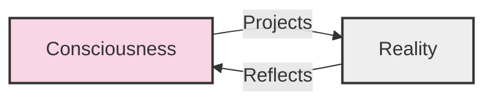

**Key Insight:** Consciousness projects outward, shaping reality, while reality reflects back, informing consciousness. This continuous feedback loop forms the basis of the co-creative relationship at the heart of TSR.

### 1.2 Resistance Contrast Filter Model

This diagram illustrates how resistance affects the manifestation of intentions.

```mermaid
flowchart LR
    X[Intention X] --> F[Resistance Filter]
    F -->|Y = (1-R)X + N(R)| Y[Outcome Y]
    R[Resistance R] --> F
    N[Noise N(R)] --> F
    style X fill:#d5f9e5,stroke:#333,stroke-width:2px
    style Y fill:#e5d5f9,stroke:#333,stroke-width:2px
    style F fill:#f9e5d5,stroke:#333,stroke-width:2px
    style R fill:#f9d5d5,stroke:#333,stroke-width:2px
    style N fill:#d5e5f9,stroke:#333,stroke-width:2px
```

**Key Insight:** The outcome (Y) equals the intention (X) reduced by resistance (R) plus noise that increases with resistance. Higher resistance not only diminishes the intended outcome but also introduces greater variability and unpredictability.

### 1.3 Co-Creation Feedback Loop

This diagram shows the cyclical process through which consciousness and reality continuously influence each other.

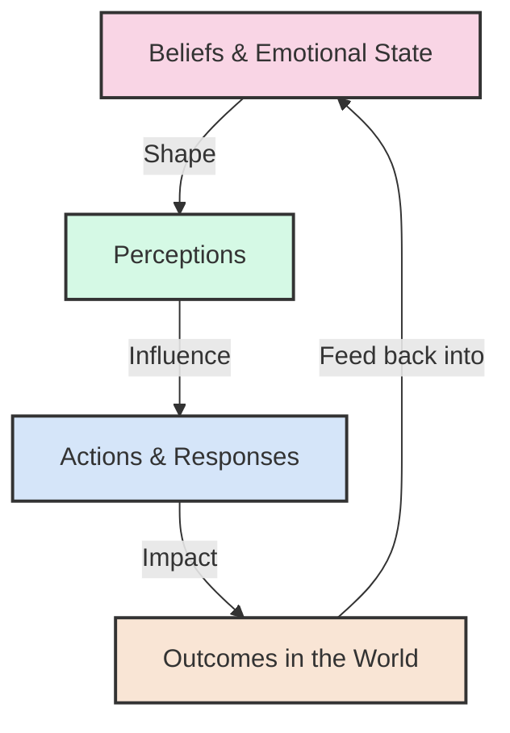

**Key Insight:** Your inner state shapes how you perceive the world, which influences your actions, which create outcomes that then reinforce or modify your inner state. This continuous cycle can create either virtuous or vicious circles depending on the nature of the beliefs and emotions involved.

## 2. Mathematical Concept Visualizations

### 2.1 Consciousness-Energy Equivalence

This diagram represents the TSR equation that parallels Einstein's E=mc².

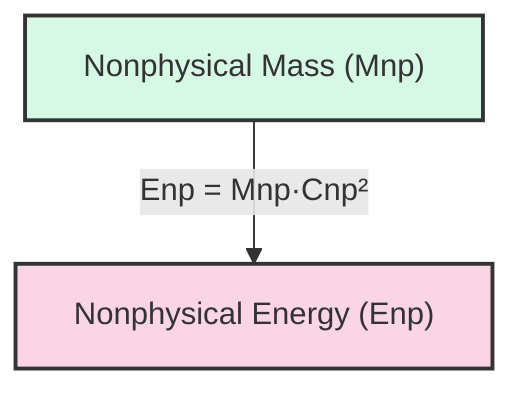

**Key Insight:** Just as physical mass can be converted to energy according to Einstein's equation, nonphysical "mass" (the substantiality of a thought or intention) can be converted to nonphysical energy (creative or manifestation potential) according to an analogous equation.

### 2.2 Vibrational Lensing Effect

This diagram illustrates how focused consciousness can "bend" the trajectories of events, similar to how gravity bends light.

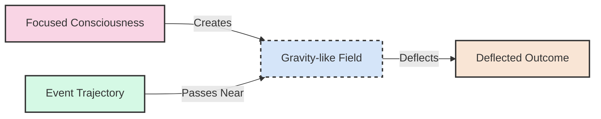

**Key Insight:** Concentrated consciousness creates a field that can influence the probability of events, subtly "bending" outcomes toward the focus of attention or intention, similar to how a massive object bends spacetime in general relativity.

### 2.3 Meditation-Resistance Relationship

This diagram shows the mathematical relationship between meditation time and resistance reduction.


**Key Insight:** The logarithm of resistance decreases linearly with meditation time, meaning resistance itself decreases exponentially. This explains why initial meditation sessions often produce dramatic reductions in resistance, with diminishing but still valuable returns as practice continues.

### 2.4 Collective Field Strength Model

This diagram illustrates the factors that determine the strength of a collective consciousness field.

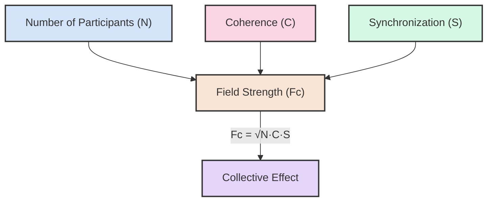

**Key Insight:** The strength of a collective field depends on the square root of the number of participants (N) multiplied by their coherence (C) and synchronization (S). This explains why a small, highly coherent and synchronized group can sometimes have a greater effect than a large but incoherent group.

### 2.5 Consciousness-Kinetic Energy Interaction

This diagram represents the interaction energy between physical and nonphysical domains.

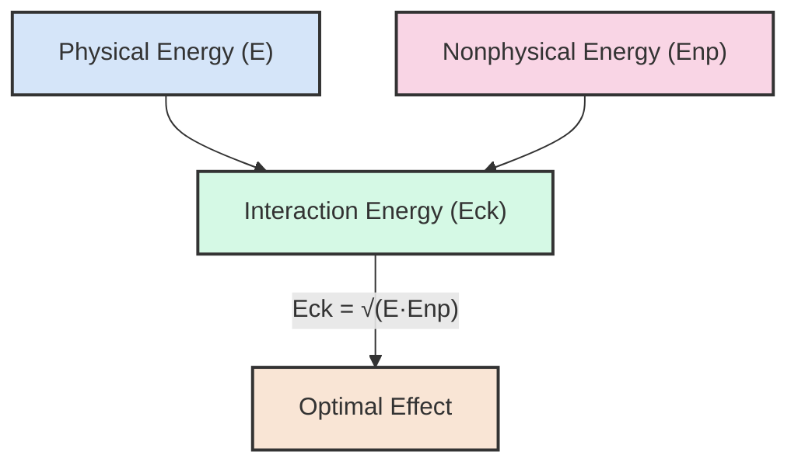

**Key Insight:** The interaction energy between physical and nonphysical domains is the geometric mean of their individual energies. This means the interaction is maximized when physical and nonphysical energies are equal, explaining why balanced effort and consciousness work better than either alone.

## 3. Practical Application Visualizations

### 3.1 Alignment Spectrum

This diagram contrasts low and high alignment states and their effects on manifestation power.

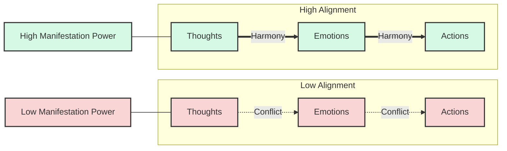

**Key Insight:** When thoughts, emotions, and actions are in conflict (low alignment), manifestation power is reduced. When they are in harmony (high alignment), manifestation power is enhanced. This explains why mixed signals (thinking one thing, feeling another, doing a third) produce mixed results.

### 3.2 Sovereign Mindset Framework

This mind map outlines the key components of a sovereign mindset.

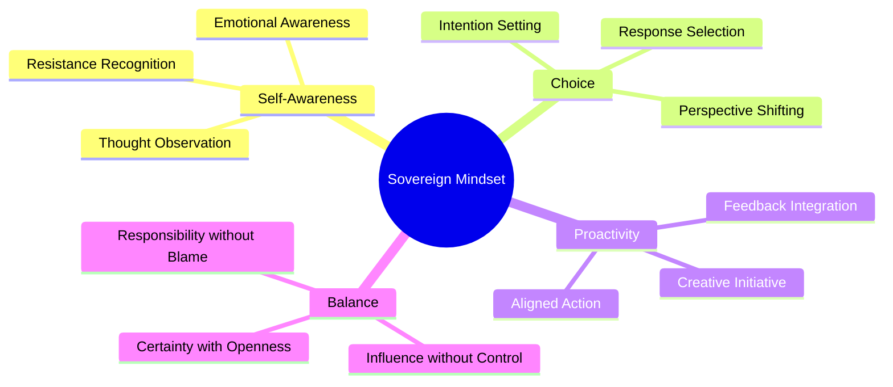

**Key Insight:** A sovereign mindset combines self-awareness, conscious choice, proactive engagement, and balanced perspective. These four domains work together to create a state of empowered responsibility without blame or victimhood.

### 3.3 Resistance Identification Map

This mind map shows the various signals that can help identify resistance.

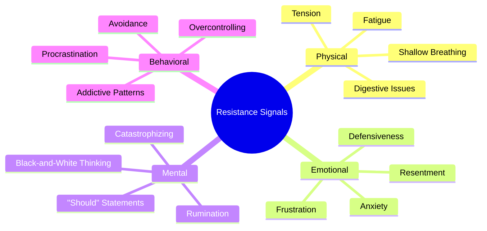

**Key Insight:** Resistance manifests across multiple domains—physical, emotional, mental, and behavioral. By recognizing these signals early, you can address resistance before it significantly impacts your experience and outcomes.

### 3.4 Consciousness States and Reality Reflection

This diagram illustrates how different consciousness states tend to reflect different types of experiences.

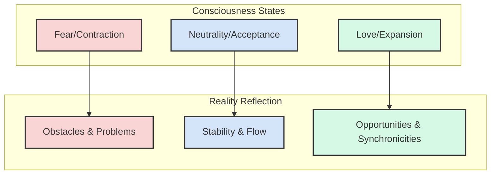

**Key Insight:** Contracted states of consciousness (fear, anxiety, anger) tend to reflect experiences of obstacles and problems. Neutral states (acceptance, presence) tend to reflect stability and flow. Expanded states (love, joy, gratitude) tend to reflect opportunities and synchronicities.

## 4. Conceptual Framework Visualizations

### 4.1 Relativistic Time Dilation Analogy

This diagram draws a parallel between relativistic time dilation in physics and experiential time dilation in TSR.

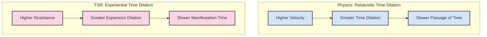

**Key Insight:** Just as higher velocity causes time to dilate (slow down) in relativity, higher resistance causes manifestation time to dilate in TSR. This explains why desired outcomes seem to take longer to manifest when we're in states of high resistance.

### 4.2 Practical Application Flowchart

This flowchart outlines a practical process for applying TSR principles.

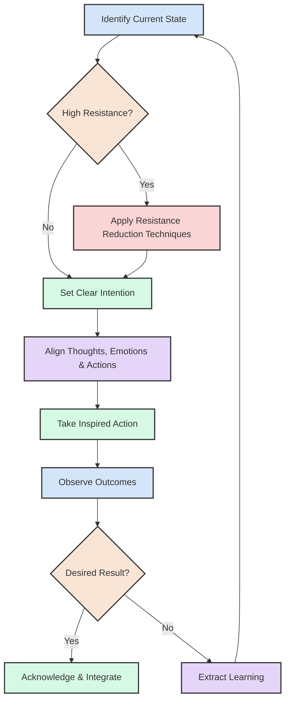

**Key Insight:** Effective application of TSR follows a cyclical process: identify your current state, reduce resistance if needed, set clear intentions, align your consciousness, take action, observe outcomes, and integrate learning. This cycle continues as you refine your practice.

### 4.3 Historical Influences on TSR

This diagram shows the major historical influences that contributed to TSR's development.

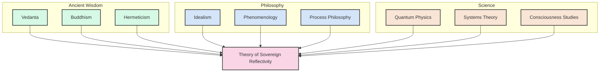

**Key Insight:** TSR integrates insights from three major domains: ancient wisdom traditions (like Vedanta, Buddhism, and Hermeticism), Western philosophical traditions (like Idealism, Phenomenology, and Process Philosophy), and modern scientific fields (like Quantum Physics, Systems Theory, and Consciousness Studies).

## 5. Research and Application Visualizations

### 5.1 Research Methods for TSR

This flowchart outlines the research methodologies applicable to TSR.

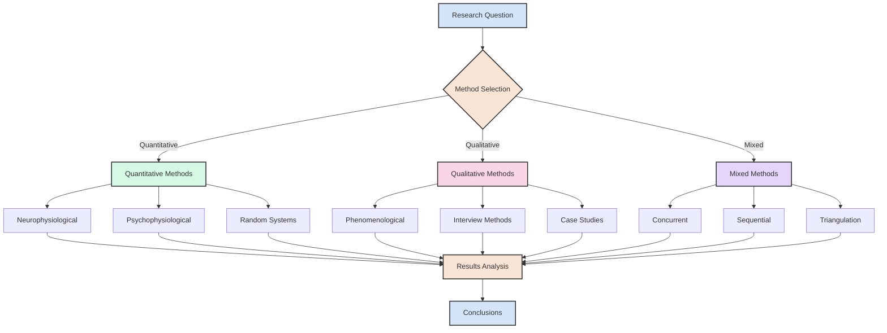

**Key Insight:** Researching TSR requires a multi-methodological approach, combining quantitative methods (like neurophysiological measurements), qualitative methods (like phenomenological interviews), and mixed methods (like concurrent physiological monitoring and experience sampling).

### 5.2 Levels of Consciousness Application

This diagram shows how TSR principles apply across different social scales.

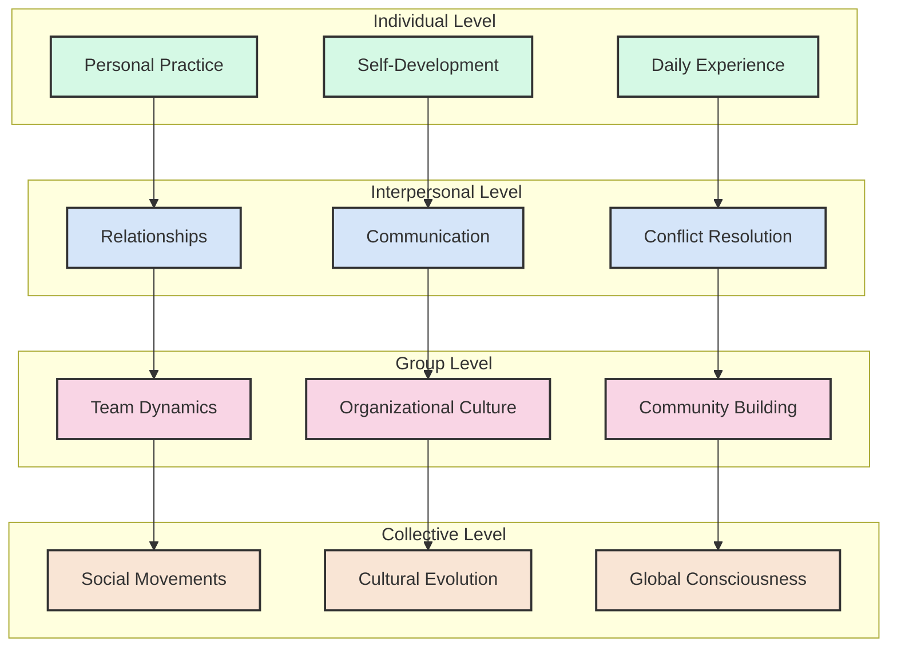

**Key Insight:** TSR principles apply across multiple levels of social organization, from individual practice to interpersonal relationships to group dynamics to collective movements. Changes at each level influence the next level, creating a cascade effect from personal to global.

### 5.3 TSR Practice Development Timeline

This Gantt chart illustrates a potential timeline for developing TSR practices.

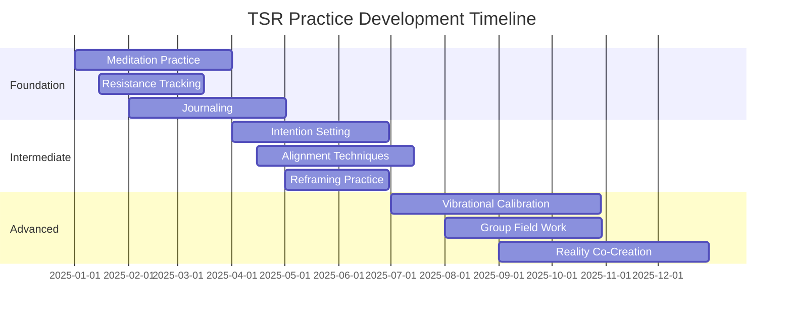

**Key Insight:** Developing TSR practices follows a natural progression from foundation to advanced application. Foundation practices like meditation and resistance tracking build the awareness and skills needed for intermediate practices like intention setting and alignment, which in turn prepare for advanced practices like vibrational calibration and reality co-creation.

### 5.4 Consciousness-Reality Spectrum

This diagram illustrates the spectrum from dense physical reality to subtle consciousness reality.

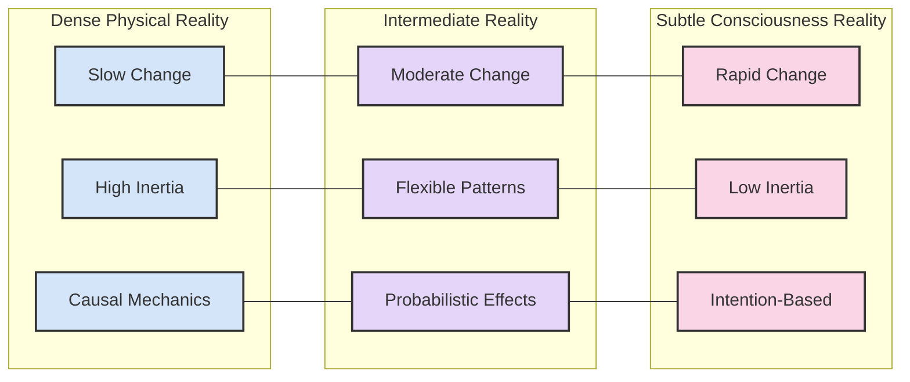

**Key Insight:** Reality exists on a spectrum from dense physical reality (characterized by slow change, high inertia, and causal mechanics) to subtle consciousness reality (characterized by rapid change, low inertia, and intention-based dynamics). Between these poles lies an intermediate reality where both physical and consciousness principles operate.

### 5.5 TSR Toolkit Organization

This mind map organizes the practical tools and techniques of TSR.

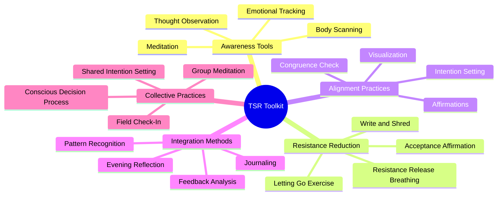

**Key Insight:** The TSR toolkit comprises five categories of practices: awareness tools (for developing consciousness), resistance reduction techniques (for removing blocks), alignment practices (for focusing consciousness), integration methods (for processing experience), and collective practices (for group consciousness work).

---

*Note: These diagrams are designed to be rendered by systems that support the Mermaid markdown syntax. If viewing in a system that doesn't support Mermaid, the diagrams will appear as code blocks rather than visual representations. For optimal viewing, use a Mermaid-compatible markdown renderer or convert to a format that supports these visualizations.*


---


# Glossary of Key Terms

## A

**Alignment**  
The state of congruence between different aspects of consciousness (thoughts, emotions, beliefs, intentions) or between consciousness and action. When these elements are aligned, reflective power is enhanced.

**Allowance**  
The conscious choice to accept what is without resistance, creating space for change. Contrasted with resistance, allowance enables more effective co-creation by reducing friction in the reflective relationship.

## B

**Belief**  
A thought or perspective that is accepted as true. In TSR, beliefs act as filters through which reality is perceived and interpreted, significantly influencing the reflective relationship.

**Biofield**  
The complex electromagnetic and subtle energy field generated by living organisms. TSR suggests that biofields may be one mechanism through which consciousness influences physical systems.

## C

**Co-creation**  
The process by which reality emerges through the interaction of consciousness and existing conditions. TSR proposes that we neither completely control reality (creation) nor are completely controlled by it (victimhood), but rather participate in a co-creative relationship.

**Coherence**  
A state of harmonious, orderly relationship between parts of a system. In TSR, coherence can refer to neural coherence (synchronized brain activity), heart coherence (ordered heart rhythm patterns), or field coherence (alignment in a consciousness field).

**Collective Consciousness**  
The shared field of awareness, beliefs, and intentions created by groups of individuals. TSR suggests that collective consciousness has emergent properties beyond the sum of individual consciousnesses.

**Consciousness**  
The subjective awareness or sentience through which reality is experienced. In TSR, consciousness is viewed as an active participant in reality creation rather than merely a passive observer.

**Consciousness Current (C<sub>np</sub>)**  
In TSR's mathematical model, a constant analogous to the speed of light (c) but in the domain of consciousness. It represents the maximum "speed" at which consciousness influences can propagate.

**Consciousness Field**  
The sphere of influence generated by consciousness, extending beyond the physical body. TSR suggests that consciousness fields can interact with physical systems and with other consciousness fields.

**Consciousness-Kinetic Energy (E<sub>ck</sub>)**  
In TSR's mathematical model, the energy that emerges from the interaction of physical energy (E) and nonphysical energy (E<sub>np</sub>), calculated as the geometric mean: E<sub>ck</sub> = √(E · E<sub>np</sub>).

**Constructive Interference**  
The amplification that occurs when aligned consciousness waves reinforce each other. In TSR, this explains how collective intention can create effects greater than the sum of individual intentions.

**Critical Mass**  
The threshold number or percentage of participants needed for a collective consciousness effect to become self-sustaining or to influence the broader field. TSR suggests that relatively small percentages of a population (often cited as around 1%) can shift larger collective fields when they achieve high coherence.

## E

**Emotional Coherence**  
Harmony and alignment in emotional states, either within an individual or among members of a group. TSR suggests that emotional coherence enhances reflective power.

**Emotional Scale**  
A spectrum of emotional states arranged by their vibrational frequency or coherence level. In TSR, higher-frequency emotions (love, joy, appreciation) are associated with greater creative power than lower-frequency emotions (fear, anger, despair).

**Emergence**  
The process by which complex patterns or systems arise from relatively simple interactions. TSR suggests that consciousness may be an emergent property of physical systems that can, in turn, influence those systems.

**Expectation**  
An anticipated outcome or experience. In TSR, expectations are seen as powerful shapers of experience through their influence on perception, behavior, and possibly direct consciousness effects.

## F

**Field**  
A region of influence that extends throughout space. In TSR, consciousness is viewed as generating fields that can interact with physical systems and other consciousness fields.

**Field Coherence**  
The degree of harmony, alignment, and organization within a consciousness field. Higher coherence is associated with greater reflective power.

## I

**Intention**  
A conscious aim, purpose, or plan. In TSR, intentions are seen as focusing consciousness in specific directions, influencing the probability of corresponding outcomes.

**Interference Pattern**  
The pattern that results when two or more waves overlap. In TSR, this concept is used to describe how different consciousness influences can either amplify (constructive interference) or diminish (destructive interference) each other.

## M

**Manifestation**  
The process by which intentions or beliefs become expressed in physical reality. In TSR, manifestation is viewed as a reflective process influenced by consciousness qualities.

**Meditation**  
A practice of focused attention or awareness that cultivates specific consciousness qualities. In TSR, meditation is seen as a key practice for developing consciousness capabilities that enhance reflective power.

**Morphic Field**  
A concept developed by biologist Rupert Sheldrake referring to fields that carry information and influence the form and behavior of systems. TSR draws on this concept to understand how consciousness patterns might be transmitted across space and time.

## N

**Nonphysical Energy (E<sub>np</sub>)**  
In TSR's mathematical model, the energy associated with consciousness, calculated as E<sub>np</sub> = M<sub>np</sub> · C<sub>np</sub>², analogous to Einstein's E = mc².

**Nonphysical Mass (M<sub>np</sub>)**  
In TSR's mathematical model, a measure of the "weight" or substantiality of consciousness, analogous to physical mass but in the nonphysical domain.

## O

**Observer Effect**  
The impact that the act of observation has on what is being observed. In quantum physics, this refers to how measurement affects quantum systems. TSR extends this concept to suggest that consciousness more broadly influences what it observes.

## P

**Placebo Effect**  
A beneficial effect produced by a treatment that cannot be attributed to the physical properties of the treatment itself and must therefore be due to the patient's belief in that treatment. TSR views the placebo effect as evidence of consciousness influencing physical systems (in this case, the body).

**Probability**  
The likelihood of a particular outcome occurring. TSR suggests that consciousness influences reality partly by shifting probabilities rather than deterministically controlling outcomes.

## Q

**Quantum Entanglement**  
A quantum phenomenon where particles become correlated in such a way that the quantum state of each particle cannot be described independently of the others. TSR draws on entanglement as a potential model for understanding non-local consciousness effects.

**Quantum Superposition**  
A principle in quantum mechanics where particles exist in multiple states simultaneously until measured. TSR uses this as an analogy for how consciousness might collapse probability fields into specific experiences.

## R

**Reality**  
The totality of what exists or appears to exist. In TSR, reality is viewed not as fixed and objective but as participatory and reflective of consciousness.

**Reflection/Reflectivity**  
The core principle of TSR, describing the mirror-like relationship between consciousness and reality, where each influences and shapes the other in a continuous feedback loop.

**Resistance**  
The inner opposition to what is. In TSR, resistance is seen as creating friction in the reflective relationship, often manifesting as stress, tension, or conflict.

**Resonance**  
The phenomenon where one vibrating system causes another to oscillate with greater amplitude at specific frequencies. In TSR, resonance describes how consciousness qualities tend to attract or amplify similar qualities in experience.

**Response-Ability**  
The capacity to choose one's response to circumstances rather than reacting automatically. In TSR, this represents the heart of sovereignty—the ability to respond consciously rather than react unconsciously.

## S

**Sovereignty**  
The state of being the conscious author of one's experience through choice and response rather than being determined by external conditions. In TSR, sovereignty is not about controlling external reality but about conscious participation in the reflective relationship.

**Synchronicity**  
Meaningful coincidences that cannot be explained by conventional causality. In TSR, synchronicities are seen as glimpses of the reflective relationship between consciousness and reality.

## V

**Vibration/Vibrational Frequency**  
A metaphor for the qualitative state or "tone" of consciousness. In TSR, different emotional states, thoughts, and intentions are described as having different vibrational frequencies that influence what they attract or create.

**Vibrational Lensing**  
In TSR's mathematical model, the process by which concentrated consciousness (M<sub>np</sub>) bends the "fabric" of reality, analogous to how mass curves spacetime in general relativity. The deflection angle is calculated as θ<sub>np</sub> = (k · M<sub>np</sub>)/C<sub>np</sub>².

## W

**Wave-Particle Duality**  
The concept in quantum mechanics that every particle or quantum entity exhibits both wave-like and particle-like properties. TSR draws on this as an analogy for how consciousness might exhibit both wave-like (field) and particle-like (localized) properties.
