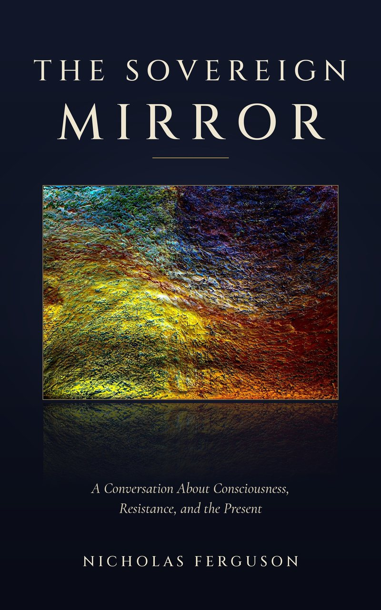

# The Sovereign Mirror

*A Conversation About Consciousness, Resistance, and the Present*

*by Nicholas Ferguson*

> **This is a free sample:** the opening note, the prelude, and Chapter 1 (about a tenth of the book).
> The full book is on [Kindle](https://www.amazon.com/dp/B0HL1YBX5K), with the paperback coming soon. More at [njf.io/books/the-sovereign-mirror](https://www.njf.io/books/the-sovereign-mirror).
>
> Looking for the 2025 book *Theory of Sovereign Reflectivity* that used to live in this file? It's in [editions/2025-theory-of-sovereign-reflectivity.md](editions/2025-theory-of-sovereign-reflectivity.md).

## Contents

- [A Note Before We Begin](#a-note-before-we-begin) · *in this sample*
- [Prelude: Awareness First](#prelude-awareness-first) · *in this sample*
- Movement I · Why Is There a Particular Me?
  - [1 · If It's All One, Why Am I Me?](#1--if-its-all-one-why-am-i-me) · *in this sample*
  - 2 · The One Rule
  - 3 · Isn't That a Hierarchy?
- Movement II · What Moves Through Me?
  - 4 · The Hot Seat
  - 5 · Receiving
  - 6 · The Four Directions
  - 7 · Tune and Focus
  - 8 · Two Kinds of Evidence
- Movement III · Why Does Wanting Hurt?
  - 9 · Isn't This Just the Law of Attraction?
  - 10 · The Filter
  - 11 · The Gap
  - 12 · Five Seconds
  - 13 · The Other Person Is Real
- Movement IV · Why Can't We Go Back?
  - 14 · The Knife
  - 15 · Expansion and Time
  - 16 · Twelve Reflections
  - 17 · Why the Equation?
- Movement V · How Far Does This Go?
  - 18 · What Counts as an Entity?
  - 19 · Fevers
  - 20 · The End of a Body
  - 21 · What I Don't Know
- Coda: What Are You Going to Do With That Now?
- The Map

---

## A Note Before We Begin

When I was a kid I played a basketball game where I couldn't do anything wrong. Shots, passes, steals, blocks. I was in the flow, the way athletes talk about it, and somewhere in the middle of it I noticed a voice. It wasn't quite mine. It was quieter than mine, and simpler. It told me where to go and what to do, and every time I followed it, something good happened. A basket. An assist. A steal.

It happened a few more times over the years I played sports, but that game was the first time I really noticed it. Afterward I told my mom. I said I could hear another voice in my head, a quieter one, and when I followed it I was always right.

My mom was a great mother. She was loving and caring, and she took me to sports and school events and everything else. She listened to me. Then she told me I should never tell anybody else about that voice, because they would think I was crazy and lock me up.

So I didn't. For most of my life I never told anyone.

This book is me telling.

The voice at that basketball game turned out to be the smallest piece of something much bigger. I call the bigger thing the Theory of Sovereign Reflectivity, TSR for short. It describes how that voice was possible, why it only showed up when I was having fun, why it vanished whenever I tried to force it, and why it's available to you too.

I've tried to write this book several ways. The first time, in 2020, I snuck the whole theory into a book about project management, because project management was what I knew. Since then I've written primers full of tables and definitions. People who read them could repeat the definitions back to me. Almost nobody could see the whole thing.

What finally worked was conversation. For years I've explained TSR to anyone who would sit still for it, and lately to AI, every generation of it. Each one started where any smart skeptic starts. It asked a reasonable question. I answered, and the answer broke something in the picture it had built. So it asked a better question. Somewhere around the twentieth question the pieces started holding each other up, and it stopped seeing a list of strange words and started seeing a system.

That's this book. The questions are real ones. People have asked them, machines have asked them, and I asked most of them myself years ago. I kept the ones that were wrong in useful ways, because you'll probably ask them too. The questions are in bold. The answers are mine.

One thing I'll say once, so I don't have to keep saying it. I'm not a physicist. I'm a computer systems engineer. I barely graduated high school and I failed out of college. When I lean on Einstein in this book, I'm using the shape of his thinking to look at the other side of it. I'm not adding to his physics. To me, what follows isn't speculation. It's a translation of something I understood whole, and I'm going to tell it to you the way I understand it.

I'm not asking you to believe it because I received it. I'm asking you to understand it. What you do after that is yours. The theory insists on that part.

## Prelude: Awareness First

**You say awareness comes first. Why?**

Because starting anywhere else gave me the wrong problem.

If you start with matter, you have to explain how awareness shows up out of things that aren't aware. Atoms become molecules, molecules become cells, cells become a brain, and somewhere along the way the lights come on. People have been looking for that switch for a long time. Nobody has found where awareness is. You can't put your finger on it. You can't see it or hear it or taste it. Everything you've ever sensed, you sensed with it, and you've never once sensed it.

So I stopped trying to build awareness out of stuff and ran the game the other way.

**What game?**

A thought game. Einstein ran them. He imagined riding alongside a beam of light and asked what he would see. Mine went like this.

Assume awareness was first. It was whole, but it didn't grow. It knew itself the way an awareness would if there were nothing else to be aware of: completely, and with no surprises. Now assume it made parts of itself. Particles. Each particle stayed bound to the whole through a vibration of its own, a kind of awareness of its own. The first of these, it seems to me, is light.

Once there are parts, there are relationships. The particles moved and bounced off each other, and every collision made a new combination of vibrations. More combinations meant more particles bonding together, and bonded particles bent the paths of other particles. And it kept going like that. Every particle's path was shaped by its relationships to every other particle, and by how those relationships expanded and aligned on the side you can't see.

**And what came before awareness?**

I don't know. I can't get behind it. Awareness is where my thinking starts, the way the speed of light is where Einstein's starts. Everything I'll tell you follows from that starting point and one simple rule, which we'll get to.

**So the universe is awareness making parts of itself so it has something to be aware of.**

That's close. I'd put it this way: the parts are how the whole gets to experience difference. A whole with nothing outside it can't bump into anything. It can't be surprised. Give it parts, and suddenly there's something to meet.

**Before we go further. Who are you, and why should I listen to you about this?**

You shouldn't, yet. Here's who I am anyway.

I worked in restaurants for years as a waiter, a busboy, a bartender. I worked at so many of them. I'd dropped out of college, and I didn't stay anywhere long until I found a place where the tips were good. In my first few cars I listened to cassette tapes: Tony Robbins, Napoleon Hill, and Abraham-Hicks, which you'll hear more about. *Think and Grow Rich* got to me, and I did what it said. I wrote down what I wanted, how I'd get there, and what it would feel like. I wanted my first million by thirty-six, and I wanted to be the chief technology officer of a company by then too. At the time I was carrying plates.

I missed both goals by about a year.

I did become a CTO. I worked in Bermuda. By 2016 I was running technology at a hedge fund, and for the ten years before that I'd been watching projects and people go through cycles. The same cycles of change, over and over, in projects and in people. Once I'd noticed them I couldn't stop seeing them.

In 2017, in the middle of my second divorce, I started meditating and painting to get through it. In 2019 I went on a cruise, sat in a comfortable chair on a stage in front of a room full of people, and came home with something I've been trying to put into words ever since.

**That's a strange résumé for a theory of consciousness.**

It's the résumé of somebody who spent twenty years forcing things to happen. That turns out to be decent preparation for noticing what happens when you stop.

I never set out to write TSR. It came through me. I'll tell you how, but it makes more sense in pieces, at the points where the story explains something. So let's start with the obvious question.

## Movement I · Why Is There a Particular Me?

*In music, a movement is a complete piece that belongs to a larger work. It has its own shape. It was never separate.*

### 1 · If It's All One, Why Am I Me?

**If everything is one awareness, why don't I hear your thoughts?**

Resistance.

That's the short answer, and most of this book unpacks it. There are two environments, the physical and the nonphysical, and they're mirror images of each other. The physical is limited, resistant, and it radiates. The nonphysical is limitless, receptive, and it collects. Those three pairs are the whole foundation. Everything else in TSR comes from what happens where they meet.

Resistance is the thing the physical has that the nonphysical doesn't. Physics measures one form of it every day and calls it mass: a thing's resistance to a change in its motion, its inertia. Resistance is what lets something hold a shape. It gives you a body that stays yours from one minute to the next. It gives you a history that stays behind you, and a point of view that nobody else can stand in. Your resistance is why you're a you.

It's also why you don't hear my thoughts. My resistance and yours keep us distinct. We meet, but we have to meet. Nothing flows straight through.

**So resistance is the problem.**

No, and this is where a lot of spiritual teaching goes wrong. Without resistance you wouldn't exist as a particular person at all.

I've spent years carving words into oil pastel with a knife. The pastel pushes back against the blade, and that's why the words stay. Try carving a sentence into water. A surface with no resistance can't hold a mark.

There are two kinds of resistance, and we'll spend a lot of time on the difference. One kind makes you a definite someone. The other keeps you from changing when a change is already wanted. I'll call the first your shape and the second holding on. Your shape is what makes you particular, and it stays yours as long as you have a body. Holding on is where most of the suffering in a life comes from. When I talk about lowering resistance in this book, holding on is the kind I mean. For now, just know that resistance itself isn't the enemy. It's the price of being particular, and being particular is the whole point.

**And on the other side? The nonphysical side?**

On the other side, there's no separation. Not really.

I call it the Current of Consciousness. Picture a river so smooth it looks like it isn't moving. Engineers call that laminar flow: every layer sliding past the next without any turbulence. From the outside it looks idle, still enough to reflect the sky. It's moving the entire time.

The Current is always the furthest point the whole has reached, and expansion is what moves it. My expansion moves it. So does yours. The vibrations I expand aren't distinct from the vibrations you expand. We're both adding to the same flow. What differs between us is our frequency, meaning how aligned each of us is with where the Current has gotten to.

**So on that side I'm not an individual at all.**

You're a part of the whole. On this side your resistance lets you identify the part as you, and that's accurate as far as it goes. You're a particle of the whole, and you have edges here. But the other side of you, the nonphysical side, is flowing as part of the whole the entire time, because over there nothing individualizes the way it does here.

Think about the particles in that thought game. Each one had its own path and its own collisions. None of them ever came loose from the whole it was part of.

**Where is the Current, then? Where would I point?**

Nowhere, and everywhere. It doesn't have a location. A location is a physical idea, and the Current isn't physical. It runs through everything.

What lets you feel it is your own perspective. Your sovereign perspective, I'd say. Nobody can feel it for you, and nobody can feel it from where you stand except you. All any of us can ever know about the whole is the connection we feel with it. Everything else reaches us through that same perspective.

People sometimes want me to prove the Current exists first and then talk about feeling it. I understand why. But it's a bit like arguing with water that it's wet. You're in it. The question is how much of it you let yourself feel.

**You keep using that word, sovereign. What does it mean here?**

It means you have your own point of view on the whole, one nobody else can have. It doesn't mean independence from the whole. Every one of us is fully inside it. Sovereignty is that each of us is inside it *from somewhere*, and nobody else gets to be there.

That matters later, when we get to how you should treat other people. Everyone you meet has their own current, their own place in the flow, and nothing I want or feel entitles me to theirs.

**Have you ever felt it? The no-separation part?**

Once, very strongly, for a few minutes. I was on that stage on the cruise. For the first time in my life I felt like I could hear all the thoughts in the room. It wasn't words exactly. It was more like a collective stream of thought, many voices and many separate flows moving at once, at different speeds and from different perspectives. My mind has never moved that fast, before or since.

I'll tell you that story properly when we get there. I mention it now because it's the one time your question stopped being theoretical for me. For those few minutes my resistance was so low that the separation got thin. Then I walked back to my seat, and I was me again.

---

## Keep reading

The rest of the book goes on from here: the one rule, the hot seat, the four directions, why wanting hurts, the knife and the carved paintings, twelve reflections of Einstein, what counts as an entity, and the map that holds it all together.

- **Kindle:** [amazon.com/dp/B0HL1YBX5K](https://www.amazon.com/dp/B0HL1YBX5K)
- **Paperback:** coming soon
- **About the book:** [njf.io/books/the-sovereign-mirror](https://www.njf.io/books/the-sovereign-mirror)

---

*The Sovereign Mirror* © 2026 Nicholas Ferguson. This sample is shared under the [Creative Commons Attribution-NonCommercial-NoDerivatives 4.0 International License](https://creativecommons.org/licenses/by-nc-nd/4.0/): you may copy and share it unchanged, with credit, for non-commercial purposes. The full book is all rights reserved. See [LICENSE-BOOK.md](LICENSE-BOOK.md).
